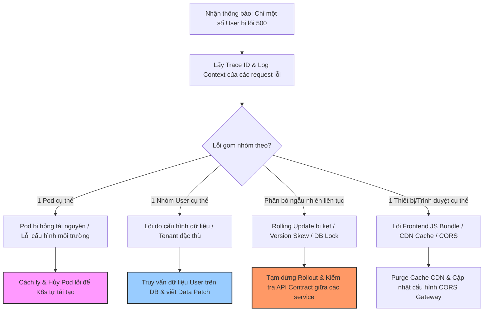

# Sau deploy, chỉ một số user bị lỗi 500. Bạn điều tra thế nào?

## ⚡ Tóm tắt ngắn (30s)
* **Bản chất**: Lỗi cục bộ chỉ ảnh hưởng đến một nhóm nhỏ người dùng (Partial/Intermittent Outage) là loại lỗi khó điều tra nhất. Nguyên nhân thường rơi vào 3 nhóm: **Dữ liệu người dùng cụ thể (Data Shape Edge Cases)**, **Phân rã phiên bản chạy song song (Version Skew / Mixed Pods)**, hoặc **Trạng thái cấu hình của Tenant/Region khác biệt**.
* **Các thảm họa thực chiến được giải quyết**:
    1. **Lỗi âm thầm ăn mòn dữ liệu (Silent Corruption)**: Lỗi chỉ xảy ra với một vài khách hàng VIP do hình thái dữ liệu đặc thù của họ chưa được migrate tương thích, gây mất doanh thu nghiêm trọng mà không phát hiện được qua kiểm thử cơ bản.
    2. **Cạm bẫy Pod cũ Pod mới song hành (Deployment Bleeding)**: Khi rolling update chưa hoàn thành hoặc bị kẹt nửa chừng, user bị route ngẫu nhiên vào pod cũ và pod mới, tạo ra hành vi bất định (lúc lỗi lúc không).
    3. **Lỗi do cấu hình CDN / Gateway cũ**: Một số khu vực địa lý sử dụng trình duyệt cũ bị lỗi CORS hoặc lỗi parser Javascript do CDN cache file cũ (JS bundle mismatch).
* **Quyết định Senior**: Thu thập ngay **Trace ID** hoặc **User ID** bị lỗi. Phân tách dòng log theo các chiều dữ liệu (Slicing & Dicing) để xác định điểm chung duy nhất giữa những user bị lỗi: Họ có cùng chạy trên một Kubernetes Pod cụ thể không? Có chung một khu vực địa lý/CDN không? Có chung một loại quyền/Tenant ID đặc biệt nào không? Có sử dụng thiết bị/trình duyệt cụ thể nào không?

---

## 🔍 Chi tiết bản chất thực chiến

Khi đối mặt với sự cố "chỉ một số user bị lỗi", kỹ sư Senior sẽ sử dụng phương pháp loại trừ khoa học dựa trên việc phân nhóm dữ liệu (Dimensional Analysis):

### Bước 1: Thu thập mẫu lỗi điển hình và Trace ID
* Sử dụng hệ thống log tập trung (Kibana/Loki) lọc các mã lỗi 500 phát sinh sau thời điểm deploy.
* Lấy ra 5-10 **Trace ID** khác nhau của các user bị ảnh hưởng để phân tích chi tiết. Ghi nhận `User ID`, `Tenant ID` và các thông tin Context đi kèm request.

### Bước 2: Phân tích 4 khía cạnh để cô lập nguyên nhân (Dimensional Slicing)

#### 1. Khía cạnh Hạ tầng (Infrastructure/Routing)
* **Câu hỏi**: Có phải lỗi chỉ xảy ra trên một Pod/Container cụ thể do Pod đó bị kẹt kết nối, thiếu RAM, hoặc bị lỗi nạp cấu hình (JVM env)?
* **Cách check**: Gom log theo `pod_name` hoặc `server_ip`. Nếu 100% lỗi 500 chỉ xuất hiện trên `pod-a-xyz`, ta lập tức hủy (kill) pod đó để Kubernetes tự tạo pod mới sạch sẽ.

#### 2. Khía cạnh Dữ liệu người dùng (Data Shape & Migration)
* **Câu hỏi**: Có phải cấu trúc dữ liệu cũ của một số user chưa tương thích với code mới?
* **Cách check**: Lấy danh sách các User ID bị lỗi, truy vấn DB để xem dữ liệu của họ có gì đặc biệt (ví dụ: trường tên có ký tự đặc biệt gây lỗi UTF-8, số điện thoại trống do trước đây không bắt buộc, hoặc cột dữ liệu chưa được cập nhật giá trị mặc định sau migration).

#### 3. Khía cạnh Phiên bản chạy song song (Version Skew)
* **Câu hỏi**: Trong quá trình Canary hoặc Rolling Update, code mới gọi sang dịch vụ downstream vẫn đang chạy code cũ chưa kịp cập nhật, gây lỗi phá vỡ API Contract?
* **Cách check**: Kiểm tra các `Span` gọi chéo service. Tìm xem lỗi có xuất hiện khi Pod mới gọi sang Pod cũ của downstream service không.

#### 4. Khía cạnh Môi trường Client / CDN Cache
* **Câu hỏi**: Có phải do CDN vẫn cache phiên bản HTML cũ gọi sang API mới gây lệch tham số, hoặc do lỗi Javascript trên một số trình duyệt cũ?
* **Cách check**: Kiểm tra Header `User-Agent` (trình duyệt gì, OS gì) và lỗi CORS trên hệ thống log Gateway.

---

## 🎨 Sơ đồ trực quan (Luồng cô lập lỗi cục bộ)



---

## 💻 Code thực chiến / Cấu hình thực tế: BAD vs GOOD

### ❌ BAD: Không xử lý Version Skew khi thay đổi API Contract
Khi microservice `order-service` cập nhật API mới bắt buộc truyền `shipping_method_id` (trước đây là tùy chọn), nếu deploy pod mới mà không đảm bảo tương thích ngược, các client đang dùng API cũ (hoặc pod cũ của Gateway) gọi sang sẽ bị ném lỗi 500 ngay lập tức.

```java
@RestController
@RequestMapping("/api/orders")
public class OrderControllerBad {

    @PostMapping
    public ResponseEntity<OrderResponse> createOrder(@RequestBody OrderRequestBad request) {
        // ❌ Code mới giả định lúc nào cũng có shippingMethodId và gọi trực tiếp method
        // Nếu client cũ (hoặc Pod Gateway cũ) chưa cập nhật, request.getShippingMethodId() sẽ là null
        // và ném ra NullPointerException -> Trả về lỗi 500 ngẫu nhiên cho một số user.
        UUID shippingId = request.getShippingMethodId().trim().isEmpty() ? null : UUID.fromString(request.getShippingMethodId());
        
        return ResponseEntity.ok(new OrderResponse(shippingId));
    }
}
```

---

### ✅ GOOD: Thiết kế API tương thích ngược và ghi log Context đầy đủ
Luôn hỗ trợ các tham số cũ, xử lý null an toàn (Defensive Coding) và đính kèm đầy đủ `tenant_id`, `client_version`, `user_id` vào MDC logging để phục vụ truy dấu vết.

```java
@RestController
@RequestMapping("/api/orders")
public class OrderControllerGood {
    private static final Logger logger = LoggerFactory.getLogger(OrderControllerGood.class);

    @PostMapping
    public ResponseEntity<OrderResponse> createOrder(
            @RequestHeader(value = "X-Client-Version", defaultValue = "unknown") String clientVersion,
            @RequestBody OrderRequestGood request) {
            
        // ✅ Ghi log kèm theo thông tin chi tiết của Client để dễ phân nhóm lỗi
        logger.info("Processing order request. Client version: {}, User ID: {}, Tenant ID: {}", 
            clientVersion, request.getUserId(), request.getTenantId());

        // ✅ Xử lý an toàn tương thích ngược nếu client truyền thiếu tham số mới
        String rawShippingId = request.getShippingMethodId();
        UUID shippingId = null;
        
        if (rawShippingId != null && !rawShippingId.trim().isEmpty()) {
            try {
                shippingId = UUID.fromString(rawShippingId);
            } catch (IllegalArgumentException e) {
                logger.warn("Invalid shippingMethodId format received: {}", rawShippingId);
                // Trả về lỗi 400 rõ ràng thay vì để ném lỗi 500 NullPointer
                throw new ResponseStatusException(HttpStatus.BAD_REQUEST, "Invalid shippingMethodId");
            }
        } else {
            // ✅ Fallback sử dụng giá trị mặc định cho các Client phiên bản cũ
            shippingId = getDefaultShippingMethod(request.getTenantId());
            logger.info("Using default shipping method for older client: {}", shippingId);
        }

        return ResponseEntity.ok(new OrderResponse(shippingId));
    }

    private UUID getDefaultShippingMethod(String tenantId) {
        return UUID.fromString("00000000-0000-0000-0000-000000000000");
    }
}
```

---

## 📊 Bảng so sánh các công cụ điều tra lỗi cục bộ

| Tiêu chí | Công cụ APM Timeline Tracing | Phân tích Log qua SQL/KQL (Elastic/Loki) | JVM Flight Recorder & Profiler | Thống kê Lỗi từ Client (Sentry) |
| :--- | :--- | :--- | :--- | :--- |
| **Mục tiêu chính** | Tìm xem luồng xử lý bị lỗi ở bước nào, service nào. | Thống kê số lượng, lọc tìm điểm chung giữa các mẫu lỗi. | Phân tích sâu bộ nhớ, luồng, hiệu năng của 1 pod cụ thể. | Bắt lỗi Javascript chạy trên browser của user bị ảnh hưởng. |
| **Use case tốt nhất** | Lỗi do microservice gọi nhau bị timeout/nghẽn. | Lỗi do cấu hình dữ liệu của User hoặc phân nhóm hạ tầng. | Lỗi do 1 Pod bị lag, rò rỉ RAM, CPU cao đột biến. | Lỗi do CDN cache file cũ, lỗi tương thích trình duyệt. |
| **Độ khó sử dụng** | Dễ (Xem biểu đồ thác nước trực quan) | Trung bình (Cần viết câu lệnh query chính xác) | Khó (Cần có kiến thức sâu về hệ điều hành & JVM) | Dễ (Xem dashboard báo lỗi client-side tự động) |

---

## ⚠️ Common Gotchas & Questions follow-up

### 1. Cạm bẫy "Lỗi dính bộ nhớ đệm Gateway" (Sticky Sessions & Cache Mismatch)
* **Vấn đề**: Người dùng A gặp lỗi liên tục, nhưng khi kỹ sư dùng tài khoản test của mình đăng nhập để reproduce thì hệ thống hoạt động hoàn toàn trơn tru.
* **Nguyên nhân**: Hệ thống Load Balancer sử dụng cơ chế **Sticky Sessions (Session Affinity)**, khóa cứng kết nối của người dùng A vào một Pod cụ thể đang bị lỗi bộ nhớ đệm (Cache Corruption) hoặc bị cạn kiệt connection pool. Trong khi đó, tài khoản của kỹ sư được định tuyến sang một Pod khác đang hoạt động tốt.
* **Giải pháp**: Phải kiểm tra log định tuyến của Gateway (như Nginx/Kong), tắt tạm thời cơ chế Sticky Sessions hoặc chủ động restart Pod nghi ngờ để kiểm chứng giả thuyết.

### 2. Câu hỏi đào sâu từ interviewer
* **Q: Làm thế nào bạn phát hiện ra lỗi chỉ xuất hiện ở một phiên bản trình duyệt Safari phiên bản 15 trên iOS 15, khi hệ thống logging backend hoàn toàn không ghi nhận bất kỳ dòng log 5xx nào?**
  * *Trả lời*: Đây là kịch bản "Lỗi câm lặng phía Client" (Silent Client-side Error). Vì Backend hoàn toàn không nhận được request (hoặc request bị hủy ngay trên trình duyệt), chúng tôi sẽ xử lý như sau:
    1. Sử dụng công cụ **Client-side Error Monitoring (như Sentry hoặc LogRocket)** để tìm kiếm các lỗi uncaught exception của Javascript trên môi trường chạy của khách hàng.
    2. Kiểm tra log của **Web Application Firewall (WAF)** hoặc **CDN (Cloudflare)** để xem các request của Safari 15 có bị chặn ở tầng ngoài cùng do vi phạm quy tắc an ninh (như cấu hình CORS nghiêm ngặt mới cập nhật) hay không.
    3. Thiết lập giả lập bằng cách sử dụng các dịch vụ Cloud Testing (như BrowserStack) để chạy thử nghiệm trực tiếp trên đúng cấu hình thiết bị Safari 15/iOS 15 đó, mở Tab Console/Network trên trình duyệt ảo để bắt lỗi kết nối trực quan.
