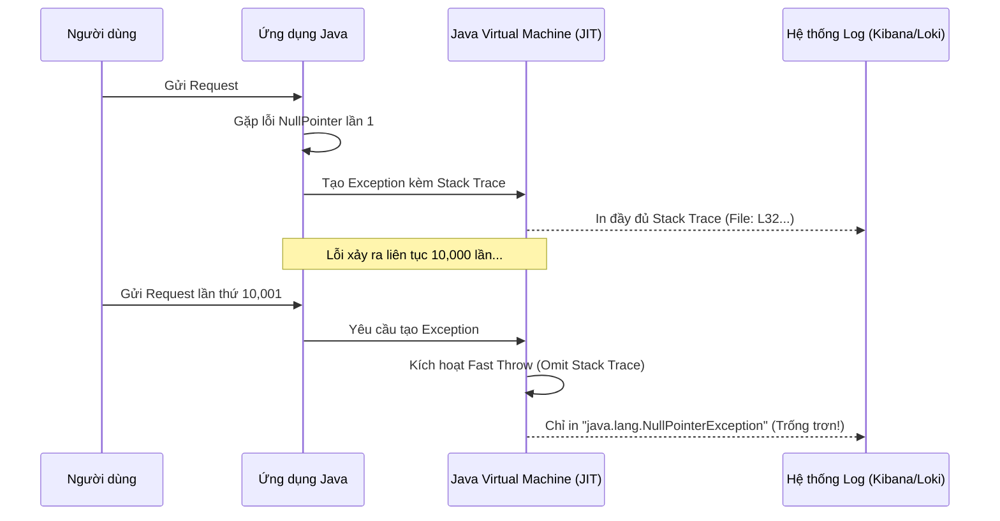

# API trả về lỗi 500 nhưng log không có stack trace. Bạn làm gì?

## ⚡ Tóm tắt ngắn (30s)
* **Bản chất**: Lỗi 500 xuất hiện không kèm stack trace trong môi trường chạy Java (JVM) thường do tính năng tối ưu hóa của JIT Compiler: **Omit Stack Trace In Fast Throw** (`-XX:+OmitStackTraceInFastThrow`). Khi một ngoại lệ cơ bản (như NullPointerException, ArrayIndexOutOfBoundsException) bị ném liên tục ở cùng một vị trí code, JVM sẽ tự động lược bỏ stack trace để tăng tốc hiệu năng. Ngoài ra, nguyên nhân có thể do code sử dụng cơ chế bắt lỗi nghèo nàn (swallow exception hoặc chỉ log `e.getMessage()`).
* **Các thảm họa thực chiến được giải quyết**:
    1. **Mù thông tin kéo dài (Extended Blindness)**: Hệ thống lỗi 500 liên tục trên production, nhưng log chỉ ghi vỏn vẹn dòng chữ `java.lang.NullPointerException` mà không chỉ ra file nào, dòng bao nhiêu. Đội ngũ kỹ sư bất lực trong việc tìm vị trí lỗi.
    2. **Khắc phục sai vị trí (Wrong Targeting)**: Phỏng đoán và sửa code bừa bãi ở các vùng NullPointer khác, gây tốn thời gian và rủi ro sinh thêm lỗi mới.
* **Quyết định Senior**:
    1. Lục tìm lại các dòng log cũ hơn (từ vài giờ đến vài ngày trước đó) để tìm lần đầu tiên lỗi này xuất hiện – đó là lúc JVM vẫn ghi đầy đủ stack trace trước khi kích hoạt tối ưu hóa.
    2. Sử dụng công cụ **APM Profiler (như Dynatrace, Datadog)** hoặc kết nối **JConsole/VisualVM** để chụp ảnh thread (Thread Dump) nhằm bắt ngoại lệ tại thời điểm nó được ném ra.
    3. Trong cấu hình JVM trên Production, cấu hình tắt tính năng tối ưu này bằng cờ: `-XX:-OmitStackTraceInFastThrow` để luôn đảm bảo có log chi tiết phục vụ vận hành an toàn.

---

## 🔍 Chi tiết bản chất thực chiến

Hiện tượng lỗi 500 trống rỗng không có stack trace trong hệ thống Java Back-end thường bắt nguồn từ hai lý do cốt lõi:

### 1. Cơ chế tối ưu hóa ngầm của JVM: Fast Throw Optimization
Để tiết kiệm CPU và bộ nhớ khi tạo các đối tượng ngoại lệ (quá trình tạo stack trace tốn nhiều tài nguyên do phải duyệt ngược Call Stack), JVM có cấu hình mặc định là `-XX:+OmitStackTraceInFastThrow`.
* **Cơ chế hoạt động**: Khi một ngoại lệ được ném ra liên tục vài chục ngàn lần tại cùng một dòng code, JIT compiler sẽ nhận dạng điểm nóng này. Nó sẽ biên dịch mã máy tối ưu hóa để ném ra một đối tượng Exception tĩnh đã được cấp phát sẵn, **không chứa stack trace**.
* **Hậu quả**: Log của bạn sẽ chỉ in ra:
  `2026-05-23 08:00:00 [ERROR] java.lang.NullPointerException: null` (Không có bất kỳ dòng dẫn hướng nào).

### 2. Thiết kế Code nghèo nàn (Swallowed Exception / Bad Logging)
Đội ngũ phát triển viết code bắt ngoại lệ nhưng chỉ in ra thông điệp thô (`getMessage()`) thay vì toàn bộ stack trace, hoặc sử dụng thư viện logging cấu hình sai.

---

## 🎨 Sơ đồ trực quan (Cơ chế Fast Throw của JVM)



---

## 💻 Code thực chiến / Cấu hình thực tế: BAD vs GOOD

### ❌ BAD: Bắt lỗi hời hợt hoặc bị nuốt mất Stack Trace
Đoạn code dưới đây chỉ ghi nhận thông điệp lỗi dạng chuỗi, bỏ qua đối tượng ngoại lệ thực tế, làm mất hoàn toàn dấu vết điều tra khi lỗi xảy ra.

```java
@RestController
@RequestMapping("/api/payments")
public class PaymentControllerBad {
    private static final Logger logger = LoggerFactory.getLogger(PaymentControllerBad.class);

    @PostMapping
    public ResponseEntity<String> processPayment(@RequestBody PaymentRequest request) {
        try {
            executePayment(request);
            return ResponseEntity.ok("Success");
        } catch (Exception e) {
            // ❌ LỖI NGHIÊM TRỌNG: Chỉ log e.getMessage(), nếu e là NullPointerException, 
            // message trả về sẽ là chuỗi rỗng "null". Log hoàn toàn vô giá trị.
            logger.error("Failed to process payment: " + e.getMessage());
            
            // ❌ LỖI TIẾP THEO: Log sai tham số (sử dụng {} nhưng truyền e.toString() thay vì truyền e làm đối số cuối)
            logger.error("Error occurred: {}", e.toString()); 
            
            return ResponseEntity.status(500).body("Internal Server Error");
        }
    }

    private void executePayment(PaymentRequest request) {
        // Giả định ném lỗi NullPointer ngầm
        String cardType = request.getCardInfo().getCardType().toUpperCase(); 
    }
}
```

---

### ✅ GOOD: Cấu hình JVM tối ưu và Logging chuẩn xác để luôn giữ Stack Trace
Đảm bảo log in ra đầy đủ chi tiết lỗi bằng cách truyền đối tượng ngoại lệ vào tham số cuối cùng, đồng thời tắt cơ chế Fast Throw trong cấu hình hạ tầng.

* **Cấu hình tham số khởi chạy JVM (Dockerfile hoặc Helm Chart)**:
```bash
# ✅ Tắt tính năng lược bỏ stack trace để luôn luôn in ra stack trace đầy đủ trên production
java -XX:-OmitStackTraceInFastThrow -jar app.jar
```

* **Mã nguồn Java xử lý Logging chuyên nghiệp**:
```java
@RestController
@RequestMapping("/api/payments")
public class PaymentControllerGood {
    private static final Logger logger = LoggerFactory.getLogger(PaymentControllerGood.class);

    @PostMapping
    public ResponseEntity<String> processPayment(@RequestBody PaymentRequest request) {
        try {
            executePayment(request);
            return ResponseEntity.ok("Success");
        } catch (Exception e) {
            // ✅ ĐÚNG: Truyền đối tượng Exception 'e' làm tham số CUỐI CÙNG (không cộng chuỗi)
            // Thư viện Logback/Log4j2 sẽ tự động nhận diện và in ra toàn bộ Stack Trace.
            logger.error("Failed to process payment for transaction reference: {}", request.getTransactionRef(), e);
            
            return ResponseEntity.status(HttpStatus.INTERNAL_SERVER_ERROR)
                .body("Payment processing failed. Please contact support with Ref: " + request.getTransactionRef());
        }
    }

    private void executePayment(PaymentRequest request) {
        if (request.getCardInfo() == null) {
            // Chủ động ném ngoại lệ rõ ràng thay vì để JVM ném NullPointerException ngầm
            throw new IllegalArgumentException("Card information cannot be null");
        }
        String cardType = request.getCardInfo().getCardType().toUpperCase();
    }
}
```

---

## 📊 Bảng so sánh các phương án xử lý log không có Stack Trace

| Tiêu chí | Tra cứu Log lịch sử (Historical Search) | Tắt tối ưu hóa JVM (`-XX:-OmitStackTraceInFastThrow`) | Chụp Thread Dump lúc Runtime | Sử dụng APM Agent (Datadog/Jaeger) |
| :--- | :--- | :--- | :--- | :--- |
| **Bản chất hành động** | Lọc tìm log cũ từ thời điểm hệ thống bắt đầu chạy để tìm dòng stack trace đầu tiên. | Thay đổi cờ cấu hình JVM khi khởi chạy ứng dụng. | Gửi tín hiệu CLI trực tiếp lên server (`jstack` / `kill -3`). | Sử dụng Agent quan trắc tự động theo dõi ngoại lệ. |
| **Độ phức tạp** | Rất thấp (Chỉ cần truy vấn công cụ log) | Trung bình (Cần restart pod để áp dụng cấu hình mới) | Khó (Cần quyền SSH vào server/K8s pod) | Thấp (Nếu APM đã được cài đặt từ trước) |
| **Ưu điểm** | Nhanh chóng, không cần thay đổi hay restart hệ thống. | Triệt để, đảm bảo tất cả các lỗi tương lai luôn luôn có stack trace. | Xem được toàn bộ trạng thái sống của các Thread khác. | Giao diện trực quan, tự động thống kê tần suất lỗi. |
| **Nhược điểm** | Có thể log cũ đã bị xoá hoặc trôi quá xa ngoài tầm lưu giữ. | Tốn thêm một chút tài nguyên CPU/Memory khi in log lỗi liên tục. | Chỉ hiển thị trạng thái tại mili-giây chụp, có thể miss lỗi. | Có chi phí bản quyền sử dụng đắt đỏ. |

---

## ⚠️ Common Gotchas & Questions follow-up

### 1. Cạm bẫy "Tràn ổ đĩa do ghi Stack Trace liên tục" (Disk Space Exhaustion)
* **Vấn đề**: Khi bạn tắt tính năng Fast Throw bằng cờ `-XX:-OmitStackTraceInFastThrow`, nếu hệ thống gặp lỗi vòng lặp vô hạn ném ra hàng triệu ngoại lệ mỗi phút, kích thước file log cục bộ trên đĩa cứng sẽ tăng vọt lên hàng chục Gigabytes trong thời gian ngắn, gây tràn ổ đĩa (Disk Full) và làm sập máy chủ.
* **Giải pháp**: Cần cấu hình giới hạn dung lượng log (Log Rotation) chặt chẽ trong `logback.xml` hoặc cấu hình **Rate Limiting** cho log ở mức ứng dụng (ví dụ sử dụng `DuplicateFilter` trong Logback để loại bỏ các dòng log giống hệt nhau liên tiếp).

### 2. Câu hỏi đào sâu từ interviewer
* **Q: Nếu bạn không thể restart ứng dụng để thêm cờ JVM trên production ngay lập tức, làm thế nào bạn tìm ra dòng code gây NullPointerException không có stack trace này chỉ bằng quyền truy cập Read-only vào Kibana?**
  * *Trả lời*: Đây là thử thách đòi hỏi tư duy phân tích thám tử. Tôi sẽ thực hiện các bước:
    1. Tôi sẽ thay đổi điều kiện lọc log trên Kibana: Mở rộng thời gian về quá khứ (ví dụ: 12 giờ trước hoặc lúc mới deploy bản mới) và tìm kiếm dòng chữ `NullPointerException`.
    2. Vì JVM cần thời gian khởi động (warm-up) và ném lỗi liên tục trước khi tắt stack trace, chắc chắn những dòng log lỗi NullPointerException xuất hiện trong vài phút đầu tiên sau deploy sẽ chứa đầy đủ stack trace nguyên bản.
    3. Tìm kiếm dòng log đầu tiên chứa đúng thông điệp lỗi đó, xác định chính xác số dòng code (`class` và `line number`) để tiến hành vá lỗi.
