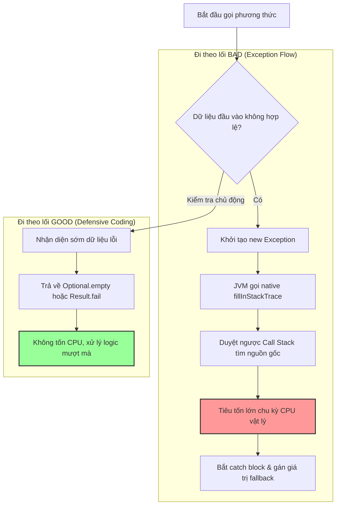

# Một exception xảy ra rất nhiều nhưng không ảnh hưởng user. Có cần xử lý không?

## ⚡ Tóm tắt ngắn (30s)
* **Bản chất**: **BẮT BUỘC PHẢI XỬ LÝ**. Dù bề ngoài người dùng không nhận thấy lỗi (do hệ thống đã có cơ chế fallback hoặc lỗi xảy ra ở luồng chạy ngầm), việc một Exception xảy ra với tần suất cao (High-frequency Exception) là một "quả bom hẹn giờ" đối với hiệu năng, chi phí vận hành và tính an toàn của hệ thống.
* **Các thảm họa thực chiến được giải quyết**:
    1. **Sụt giảm hiệu năng nghiêm trọng (CPU Starvation)**: Tạo đối tượng Exception trong Java là một thao tác cực kỳ đắt đỏ về mặt CPU (do JVM phải quét ngược dòng Call Stack). Việc ném ngoại lệ liên tục có thể làm giảm throughput hệ thống tới 10 lần.
    2. **Hóa đơn log tăng vọt & Gây nhiễu thông tin (Alert Fatigue)**: Hàng triệu dòng log vô nghĩa nuốt chửng dung lượng lưu trữ, làm tăng chi phí Datadog/ELK lên gấp nhiều lần và khiến các kỹ sư bỏ qua những cảnh báo lỗi thực sự quan trọng.
    3. **Che giấu lỗi hệ thống sâu sắc (Hidden System Degradation)**: Một lỗi lặp đi lặp lại ở luồng ngầm có thể âm thầm làm cạn kiệt tài nguyên (Connection Leak, Thread Leak), chờ cơ hội bùng phát làm sập toàn bộ hệ thống vào giờ cao điểm.
* **Quyết định Senior**: Phân tích tần suất và chi phí CPU của Exception qua APM/Profiler. Thay thế việc sử dụng Exception cho các luồng điều hướng logic thông thường (Control Flow) bằng thiết kế kiểm tra an toàn chủ động (Pre-check) hoặc sử dụng các mẫu thiết kế trả về trạng thái (như `Optional`, `Result Pattern`). Thiết lập mức độ cảnh báo log phù hợp để không làm ô nhiễm hệ thống giám sát.

---

## 🔍 Chi tiết bản chất thực chiến

Việc xem nhẹ các Exception chạy ngầm "không ảnh hưởng user" là sai lầm phổ biến của các kỹ sư Junior. Dưới góc nhìn Senior, một Exception tần suất cao cần được xử lý triệt để vì những lý do cốt lõi sau:

### 1. Chi phí hiệu năng khổng lồ (JVM Overhead)
Trong Java, chi phí tạo ra một Exception không nằm ở việc cấp phát bộ nhớ cho đối tượng, mà nằm ở phương thức native `Throwable.fillInStackTrace()`.
* **Cơ chế**: Để tạo stack trace, JVM phải tạm dừng một phần và duyệt qua toàn bộ các khung ngăn xếp (Stack Frames) của luồng hiện tại để ghi lại lịch sử gọi phương thức.
* **Hậu quả**: Nếu Call Stack sâu (như trong các ứng dụng Spring Boot điển hình với hàng chục filter), việc ném 1,000 Exception/giây có thể chiếm tới 30-50% tổng công suất CPU của ứng dụng.

### 2. Sử dụng Exception sai mục đích (Anti-pattern: Exception for Control Flow)
Rất nhiều lập trình viên sử dụng Exception để kiểm soát luồng logic nghiệp vụ. Ví dụ: Cố gắng parse một chuỗi sang số, nếu lỗi thì bắt `NumberFormatException` để dùng giá trị mặc định. Đây là một mã độc hiệu năng (Performance Anti-pattern).

### 3. Vấn đề vận hành và Chi phí Cloud (Observability Costs)
* **Log Ingestion Cost**: Các nhà cung cấp Cloud/SaaS (như Datadog, Splunk) tính phí dựa trên dung lượng log nạp vào. Hàng triệu dòng log ngoại lệ vô nghĩa sẽ làm tăng hóa đơn công ty lên hàng ngàn USD.
* **Nhiễu tín hiệu (Signal-to-Noise Ratio)**: Khi hệ thống ngập tràn log lỗi "không ảnh hưởng", đội ngũ SRE sẽ mất đi sự nhạy bén. Khi một lỗi nghiêm trọng thực sự xảy ra, nó sẽ bị chôn vùi trong đống log nhiễu đó.

---

## 🎨 Sơ đồ trực quan (Chi phí xử lý Exception trong JVM)



---

## 💻 Code thực chiến / Cấu hình thực tế: BAD vs GOOD

### ❌ BAD: Dùng Exception để điều khiển luồng logic thông thường (Control Flow)
Đoạn code dưới đây tìm kiếm cấu hình User, nếu không có thì ném ra Exception rồi bắt lại để trả về giá trị mặc định. Dưới traffic lớn, hệ thống sẽ sụt giảm throughput nghiêm trọng.

```java
@Service
public class UserServiceBad {
    @Autowired
    private UserRepository userRepository;

    public UserTheme getUserTheme(String userId) {
        try {
            // ❌ Tìm user, nếu không thấy sẽ ném ra EntityNotFoundException
            User user = userRepository.findById(userId)
                .orElseThrow(() -> new EntityNotFoundException("User not found: " + userId));
                
            return user.getTheme();
        } catch (EntityNotFoundException e) {
            // ❌ Bắt ngoại lệ để làm fallback trả về giao diện mặc định (LIGHT)
            // Việc tạo Exception chỉ để lấy giá trị mặc định làm lãng phí rất nhiều CPU
            return UserTheme.LIGHT;
        }
    }
}
```

---

### ✅ GOOD: Sử dụng thiết kế phòng vệ (Defensive Programming) và Optional
Tránh ném Exception cho các trường hợp nghiệp vụ thông thường dự đoán trước được. Thay vào đó, sử dụng `Optional` hoặc kiểm tra điều kiện chủ động.

```java
@Service
public class UserServiceGood {
    private static final Logger logger = LoggerFactory.getLogger(UserServiceGood.class);
    
    @Autowired
    private UserRepository userRepository;

    public UserTheme getUserTheme(String userId) {
        // ✅ Tìm kiếm an toàn trả về Optional
        Optional<User> userOpt = userRepository.findById(userId);
        
        if (userOpt.isPresent()) {
            return userOpt.get().getTheme();
        }
        
        // ✅ Trả về giá trị mặc định trực tiếp mà không cần ném và bắt Exception
        // Không phát sinh chi phí duyệt Call Stack của JVM, tốc độ xử lý nhanh hơn 100 lần.
        if (logger.isDebugEnabled()) {
            logger.debug("User {} not found, returning default theme LIGHT", userId);
        }
        
        return UserTheme.LIGHT;
    }
}
```

---

## 📊 Bảng so sánh hiệu năng: Exception vs Code phòng vệ

| Tiêu chí so sánh | Sử dụng Exception (Exceptional Flow) | Code phòng vệ (Defensive / Optional) |
| :--- | :--- | :--- |
| **Chi phí CPU** | Rất cao (Tăng tuyến tính theo độ sâu của Call Stack) | Cực kỳ thấp (Tương đương một câu lệnh rẽ nhánh `if-else`) |
| **Kích thước Log sinh ra** | Lớn (Chứa hàng chục dòng Stack Trace chi tiết) | Nhỏ hoặc không có (Chỉ ghi log debug ngắn gọn) |
| **Tốc độ thực thi (Throughput)**| Chậm (Khoảng 20,000 - 50,000 ops/giây) | Cực nhanh (Khoảng 5,000,000+ ops/giây) |
| **Mục đích thiết kế đúng** | Chỉ dùng cho các sự kiện bất ngờ ngoài tầm kiểm soát (Mất kết nối DB, Hết ổ đĩa). | Dùng cho các luồng nghiệp vụ thông thường (Dữ liệu trống, Không tìm thấy bản ghi). |

---

## ⚠️ Common Gotchas & Questions follow-up

### 1. Cạm bẫy "Exception câm lặng tàn phá tài nguyên" (Resource Leak)
* **Vấn đề**: Một lỗi kết nối mạng xảy ra ở một Thread chạy ngầm (Background Worker) mỗi 5 giây. Lỗi được bắt (`catch`) và bỏ qua để tránh sập app. 
* **Hậu quả**: Mặc dù người dùng không thấy lỗi, nhưng mỗi lần Exception xảy ra, kết nối HTTP Client cũ không được đóng đúng cách trong khối `finally`. Hệ thống âm thầm rò rỉ socket/connection. Sau 3 ngày chạy liên tục, server hết sạch cổng kết nối (Socket Exhaustion) và đột ngột sập hoàn toàn.
* **Giải pháp**: Phải đảm bảo tất cả các khối `catch` bỏ qua lỗi (nếu thực sự an toàn) đều phải thực hiện giải phóng tài nguyên triệt để trong khối `finally` hoặc sử dụng cú pháp `try-with-resources`.

### 2. Câu hỏi đào sâu từ interviewer
* **Q: Nếu bạn bắt buộc phải ném một Exception trong thiết kế framework nội bộ vì lý do kiến trúc, nhưng bạn muốn tối ưu hóa tối đa hiệu năng để nó không tốn CPU quét Call Stack, bạn sẽ làm cách nào?**
  * *Trả lời*: Đây là một kỹ thuật tối ưu hóa nâng cao trong Java. Để tạo ra một "Exception siêu nhẹ" (Lightweight Exception), tôi sẽ ghi đè (override) phương thức `fillInStackTrace()` của class Exception đó để nó không làm gì cả:
    ```java
    public class LightweightException extends RuntimeException {
        public LightweightException(String message) {
            super(message);
        }

        // ✅ Ghi đè để JVM bỏ qua việc duyệt Call Stack, tăng tốc độ xử lý ngang với if-else
        @Override
        public synchronized Throwable fillInStackTrace() {
            return this; 
        }
    }
    ```
    Kỹ thuật này được áp dụng rộng rãi trong các thư viện hiệu năng cao như Netty hoặc Spring WebFlux, nơi tốc độ phản hồi được ưu tiên hàng đầu.
