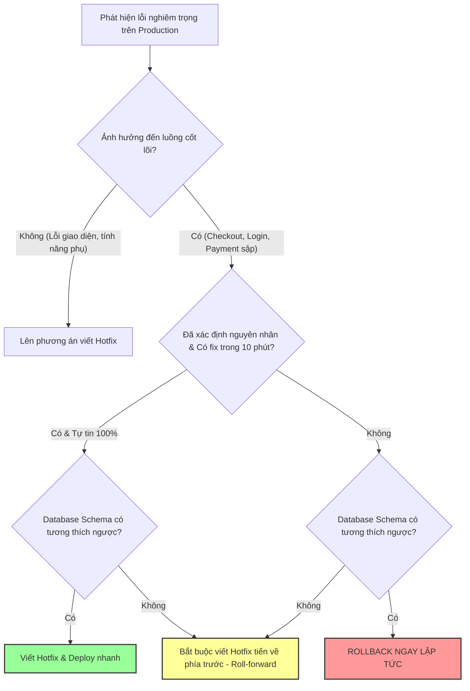

# Khi nào nên rollback, khi nào nên hotfix?

## ⚡ Tóm tắt ngắn (30s)
* **Bản chất**: Đây là bài toán **Quản trị Rủi ro vận hành (Operational Risk Management)**. Quyết định lựa chọn giữa Quay lui phiên bản (Rollback) hay Sửa lỗi trực tiếp (Hotfix) được xác định bằng 3 tham số chính: **Mức độ ảnh hưởng (Blast Radius)**, **Thời gian xác định nguyên nhân gốc (Time to Root Cause)**, và **Tính tương thích ngược của Cơ sở dữ liệu (Database Backward Compatibility)**.
* **Các thảm họa thực chiến được giải quyết**:
    1. **Sập hệ thống kéo dài do cố chấp Hotfix (Debugger's Ego)**: Kỹ sư cố chấp ngồi viết code vá lỗi dưới áp lực thời gian, nỗ lực deploy 3 bản hotfix liên tiếp nhưng đều thất bại, kéo dài thời gian ngừng hoạt động (MTTR) lên hàng giờ.
    2. **Mất mát dữ liệu do Rollback mù quáng (Data Loss Disaster)**: Thực hiện rollback code ứng dụng trong khi cơ sở dữ liệu đã chạy migration phá vỡ tương thích ngược (Non-backward compatible schema change), làm hỏng dữ liệu mới ghi nhận.
* **Quyết định Senior**: Áp dụng quy tắc SRE: **Ưu tiên Rollback mặc định (Rollback by Default)** cho mọi lỗi nghiêm trọng ảnh hưởng đến luồng cốt lõi (Checkout, Login, Payment) nếu không thể khắc phục trong vòng 10 phút. Chỉ chọn **Hotfix** khi nguyên nhân lỗi cực kỳ rõ ràng, dễ sửa (lỗi typo, cấu hình sai), hoặc khi việc rollback database là bất khả thi do nguy cơ mất mát dữ liệu cao.

---

## 🔍 Chi tiết bản chất thực chiến

Đội ngũ kỹ sư Senior vận hành hệ thống dựa trên một Khung ra quyết định (Decision Matrix) rõ ràng chứ không dựa vào cảm tính:

### 1. Khi nào BẮT BUỘC ROLLBACK (Khôi phục trạng thái cũ)?
* **Lỗi ảnh hưởng luồng cốt lõi (Core Business Flow Broken)**: User không thể thanh toán, không thể đăng nhập, hoặc gặp lỗi 5xx trên diện rộng (> 5% traffic).
* **Nguyên nhân chưa rõ ràng (High Ambiguity)**: Lỗi xảy ra nhưng log mập mờ, hệ thống phức tạp, đội ngũ cần hơn 10 phút để khoanh vùng và tìm nguyên nhân.
* **Quy trình rollback nhanh và an toàn**: CI/CD hỗ trợ rollback chỉ bằng một nút bấm (Blue-Green hoặc Kubernetes deployment rollback) trong vòng dưới 5 phút.
* **DB Schema tương thích ngược**: Database vừa thay đổi nhưng cấu trúc vẫn hỗ trợ tốt phiên bản code cũ (Backward-compatible).

### 2. Khi nào nên HOTFIX (Vá lỗi trực tiếp)?
* **Nguyên nhân rõ như ban ngày (100% Certainty)**: Lỗi do sai một biến môi trường, một ký tự typo trong URL cấu hình, hoặc lỗi logic cực đơn giản có thể sửa bằng 1 dòng code.
* **Mức độ ảnh hưởng thấp (Low Severity)**: Lỗi hiển thị giao diện, lỗi chính tả, hoặc lỗi chỉ ảnh hưởng đến một tính năng phụ cực ít người dùng sử dụng.
* **Không thể Rollback Database (Data Migration Lock-in)**: Đây là rào cản lớn nhất. Bản deploy mới đi kèm với một migration database phức tạp (ví dụ: chia tách bảng, xóa cột cũ). Việc rollback code cũ sẽ khiến ứng dụng không thể đọc được cấu trúc database mới, và rollback database schema có nguy cơ làm mất dữ liệu giao dịch phát sinh trong 15 phút qua. Lúc này, bắt buộc phải viết hotfix tiến về phía trước (Roll-forward Hotfix).

---

## 🎨 Sơ đồ trực quan (Khung quyết định: Rollback vs Hotfix)



---

## 💻 Code thực chiến / Cấu hình thực tế: BAD vs GOOD

### ❌ BAD: Tự ý thay đổi trực tiếp Hotfix lên môi trường Production (Ad-hoc Hotfixing)
Thực hiện sửa code trực tiếp trên server, copy file `.class` đè lên, hoặc chạy các lệnh sửa dữ liệu thô trực tiếp trên Database mà bỏ qua quy trình CI/CD. Việc này cực kỳ nguy hiểm, dễ làm sập hệ thống nặng hơn và mất dấu vết quản lý mã nguồn (Git mismatch).

```bash
# ❌ HÀNH VI TỒI: SSH trực tiếp vào Production Pod và sửa file cấu hình bằng tay
ssh admin@prod-server-1
cd /app/config
vi application.properties # ❌ Sửa bừa tham số trực tiếp trên server vật lý
# Không thông qua Git, khi Pod bị K8s tự động khởi động lại, cấu hình này sẽ biến mất và lỗi quay lại!
```

---

### ✅ GOOD: Quy trình vá lỗi tự động qua CI/CD và Feature Flag
Sử dụng Feature Flag để tắt tính năng lỗi ngay lập tức mà không cần deploy, hoặc thực hiện hotfix chuẩn chỉ qua nhánh `hotfix/` trên Git, kích hoạt pipeline chạy tự động.

* **Sử dụng Feature Flag để cô lập lỗi tức thời (Cấu hình LaunchDarkly/Config Server)**:
```json
{
  "flags": {
    "enable-new-payment-gateway": {
      "value": false, 
      "description": "✅ Bật false để tắt ngay cổng thanh toán mới bị lỗi, hệ thống tự động fallback về cổng cũ không cần redeploy code!"
    }
  }
}
```

* **Mã nguồn ứng dụng tích hợp Feature Flag an toàn**:
```java
@Service
public class PaymentService {
    @Autowired
    private FeatureFlagService featureFlags;
    @Autowired
    private StripePaymentProvider stripeProvider;
    @Autowired
    private LegacyPaymentProvider legacyProvider;

    public PaymentResponse process(PaymentRequest request) {
        // ✅ Kiểm tra Feature Flag động từ bộ nhớ đệm (In-memory Cache)
        if (featureFlags.isEnabled("enable-new-payment-gateway")) {
            try {
                return stripeProvider.charge(request);
            } catch (Exception e) {
                // Fallback chủ động nếu lỗi phát sinh
                return legacyProvider.charge(request);
            }
        } else {
            // ✅ Nếu tắt Flag, đi luồng an toàn cũ đã chạy ổn định 2 năm qua
            return legacyProvider.charge(request);
        }
    }
}
```

---

## 📊 Bảng so sánh chiến lược Rollback vs Hotfix

| Tiêu chí | Chiến lược Quay lui (Rollback) | Chiến lược Vá lỗi (Hotfix / Roll-forward) |
| :--- | :--- | :--- |
| **Mục tiêu tối thượng** | **Tốc độ ổn định hệ thống** (Giảm tối đa thời gian downtime). | **Tính toàn vẹn của dữ liệu** và tính năng mới. |
| **Thời gian triển khai** | Cực nhanh (3 - 5 phút nếu dùng K8s/Canary). | Chậm (15 - 60 phút do cần compile, chạy unit test và deploy). |
| **Độ rủi ro** | Thấp (Quay lại phiên bản code đã chạy tốt trước đó). | Cao (Bản vá vội có thể phát sinh lỗi mới chưa kiểm thử kỹ). |
| **Ảnh hưởng dữ liệu** | Có rủi ro nếu database schema đã thay đổi nặng. | An toàn hơn cho dữ liệu vì tiến về phía trước theo DB mới. |
| **Khả năng tự động hóa**| Rất cao (Có thể cấu hình tự động rollback khi error rate > 5%). | Thấp (Luôn luôn cần kỹ sư ngồi viết code sửa thủ công). |

---

## ⚠️ Common Gotchas & Questions follow-up

### 1. Cạm bẫy "Rollback âm thầm phá hủy Database" (Silent Schema Mismatch)
* **Vấn đề**: Kỹ sư rollback phiên bản ứng dụng từ v2 về v1. Code v1 không hề biết đến sự tồn tại của cột mới `discount_amount` vừa được thêm ở DB trong phiên bản v2.
* **Hậu quả**: Khi code v1 ghi nhận order mới, nó bỏ trống trường `discount_amount`. Các ứng dụng thống kê doanh thu chạy ngầm giả định trường này luôn có giá trị (`NOT NULL`) sẽ bị sập hàng loạt khi thực hiện tính toán vào cuối ngày, gây ra lỗi dây chuyền khó phát hiện ngay từ đầu.
* **Giải pháp**: Áp dụng quy tắc thiết kế database **Hai bước (Two-Phase Database Migration)**: Bước 1: Chỉ thêm cột mới cho phép nhận giá trị Null/Mặc định. Bước 2: Deploy code sử dụng cột mới. Khi rollback code, DB vẫn hoàn toàn tương thích.

### 2. Câu hỏi đào sâu từ interviewer
* **Q: Nếu một sự cố xảy ra làm sập tính năng đặt vé máy bay lúc 2h sáng, và quy trình CI/CD của công ty bạn để deploy một bản Hotfix mất tới 45 phút, bạn sẽ làm cách nào để giảm thiểu ảnh hưởng trong vòng 5 phút đầu tiên?**
  * *Trả lời*: Đây là bài toán tối ưu hóa MTTR trong bối cảnh hạ tầng hạn chế. Để giải quyết, tôi sẽ triển khai các giải pháp ứng phó khẩn cấp sau:
    1. Nếu hệ thống có cấu hình **Feature Flag** cho tính năng đặt vé, tôi sẽ tắt nó ngay lập tức. Người dùng sẽ nhận được thông báo "Tính năng đang bảo trì" thân thiện thay vì gặp lỗi 5xx hệ thống sập.
    2. Nếu không có Feature Flag, tôi sẽ cấu hình tại tầng **API Gateway (Nginx/Cloudflare/Kong)** để thực hiện **URL Rewriting / Redirect** toàn bộ các request đặt vé sang một trang tĩnh thông báo bảo trì hoặc chặn request ngay tại biên (Edge) để giảm tải hoàn toàn cho backend.
    3. Việc chặn lỗi tại Gateway chỉ mất 1 phút để reload cấu hình, giúp ngăn chặn lỗi lan rộng sang các dịch vụ khác (như tra cứu chuyến bay, xem thông tin tài khoản) và bảo vệ an toàn cho hạ tầng trong lúc chờ đội ngũ viết và deploy bản hotfix qua CI/CD.
