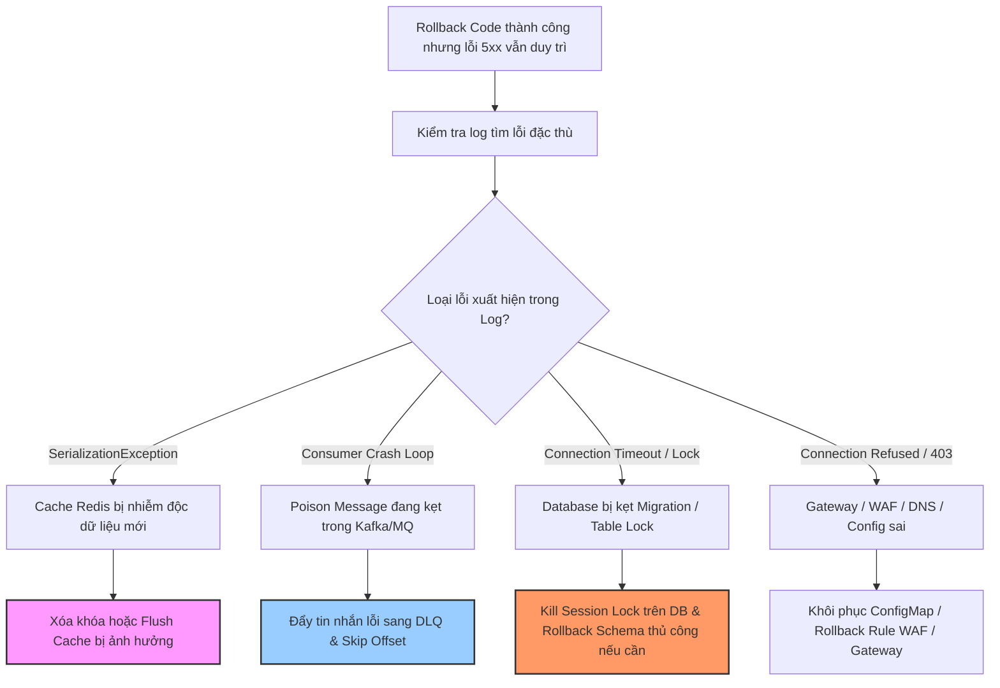

# Nếu rollback không giải quyết được lỗi, bạn kiểm tra gì tiếp?

## ⚡ Tóm tắt ngắn (30s)
* **Bản chất**: Khi việc rollback mã nguồn ứng dụng (App Code Rollback) không giải quyết được sự cố, điều này chứng tỏ **Nguyên nhân gốc rễ (Root Cause) không nằm ở code ứng dụng**, hoặc **Trạng thái hệ thống đã bị thay đổi vĩnh viễn** mà việc rollback code không thể tự động khôi phục. Các khu vực nghi ngờ cao nhất bao gồm: **Trạng thái Cơ sở dữ liệu (Database State)**, **Bộ nhớ đệm (Cache Pollution)**, **Hàng đợi thông điệp (Message Queue Poisoning)**, và **Cấu hình hạ tầng/Mạng (Gateway/Config/Secrets)**.
* **Các thảm họa thực chiến được giải quyết**:
    1. **Sập hệ thống kéo dài do bỏ quên Cache nhiễm độc (Cache Serialization Trap)**: Bản code mới ghi vào Redis một cấu trúc dữ liệu mới. Khi rollback về code cũ, code cũ không thể giải mã (deserialize) được dữ liệu mới này, dẫn đến crash liên tục dù code chạy cực kỳ ổn định trước đó.
    2. **Kẹt luồng xử lý do Poison Message**: Hàng đợi Kafka chứa các thông điệp có cấu trúc mới do code mới phát ra. Code cũ khởi động lại, nhận các thông điệp này và sập ngay lập tức (Crash Loop), tạo ra ảo ảnh lỗi vẫn nằm ở code cũ.
* **Quyết định Senior**: Ngay lập tức kiểm tra lỗi deserialize trong log để thực hiện **Purge/Clear Cache** bị ô nhiễm. Kiểm tra các câu lệnh SQL đang chạy để tìm **Table Lock** hoặc **Migration kẹt** trong database. Xác định xem có **Poison Message** trong queue để cô lập sang Dead Letter Queue (DLQ). Kiểm tra tương quan trạng thái của các dịch vụ liên kết bên ngoài (DNS, WAF, Gateway, Third-party) xem có sự cố sập trùng hợp vào thời điểm deploy hay không.

---

## 🔍 Chi tiết bản chất thực chiến

Nếu rollback code ứng dụng thất bại trong việc hồi phục hệ thống, một kỹ sư Senior sẽ bình tĩnh thực hiện quy trình chẩn đoán cô lập theo các khu vực trạng thái (Stateful Components) sau:

### 1. Trạng thái Bộ nhớ đệm (Cache Pollution / Serialization Mismatch)
* **Vấn đề**: Phiên bản code mới sử dụng cấu trúc Class hoặc thư viện JSON/Serialization khác để lưu dữ liệu vào Redis/Memcached. Khi rollback về phiên bản code cũ, code cũ đọc dữ liệu từ cache và ném ra các lỗi nghiêm trọng: `ClassCastException`, `SerializationException`, hoặc `InvalidClassException`.
* **Cách xử lý**: Kiểm tra log để tìm các lỗi liên quan đến Redis/Cache. Thực hiện xóa khóa (Delete key) cụ thể bị ảnh hưởng hoặc xóa toàn bộ namespace cache (Flush cache) của dịch vụ để đưa hệ thống về trạng thái sạch.

### 2. Hàng đợi thông điệp bị nhiễm độc (Message Queue Poisoning)
* **Vấn đề**: Bản deploy mới đã kịp gửi một số lượng tin nhắn (messages) có định dạng mới vào Kafka/RabbitMQ. Sau khi rollback, các consumer chạy code cũ tiêu thụ các tin nhắn này và bị crash liên tục. Consumer offset không được commit, khiến consumer đọc đi đọc lại tin nhắn lỗi đó (Poison Message Loop).
* **Cách xử lý**: Kiểm tra xem consumer group có bị lag và kẹt ở một offset cụ thể không. Thực hiện bỏ qua tin nhắn lỗi (Skip offset) hoặc di chuyển tin nhắn lỗi sang **Dead Letter Queue (DLQ)** để consumer tiếp tục xử lý các tin nhắn khác.

### 3. Trạng thái Cơ sở dữ liệu (Database Locks & Schema Migrations)
* **Vấn đề**: 
  1. Câu lệnh migration của bản deploy mới đã thực hiện thay đổi schema (như xóa cột, đổi kiểu dữ liệu) mà rollback code không hề rollback DB schema.
  2. Một tiến trình migration chạy ngầm bị kẹt hoặc gây khóa bảng (Table Lock/Deadlock), làm nghẽn tất cả kết nối từ ứng dụng cũ.
* **Cách xử lý**: Truy vấn danh sách tiến trình database (`show processlist` hoặc `pg_stat_activity`), tìm các câu lệnh có trạng thái `Locked` hoặc chạy quá lâu và thực hiện `KILL` chúng.

### 4. Cấu hình Hạ tầng & Môi trường biến (Environment / Secrets Mismatch)
* **Vấn đề**: Khi rollback code qua CI/CD, có thể các cấu hình môi trường (Kubernetes ConfigMap, Environment Variables) hoặc Secrets (Vault/Consul) đã bị thay đổi ở bản mới nhưng không được rollback song hành cùng mã nguồn.
* **Cách xử lý**: So sánh diff cấu hình YAML hiện tại của Pod với phiên bản ổn định trước đó.

---

## 🎨 Sơ đồ trực quan (Các thành phần Stateful gây nghẽn sau Rollback)



---

## 💻 Code thực chiến / Cấu hình thực tế: BAD vs GOOD

### ❌ BAD: Không khai báo `serialVersionUID`, dễ gây sập hệ thống khi thay đổi code
Nếu không khai báo ID phiên bản tuần tự hóa cố định, mỗi khi bạn thêm/bớt 1 trường trong Class Java, JVM sẽ tự động tính toán lại ID này. Khi rollback code, JVM phát hiện ID lệch và ném lỗi sập hệ thống ngay khi đọc cache Redis.

```java
// ❌ THIẾT KẾ TỒI: Class lưu cache không khai báo serialVersionUID
public class UserProfile implements Serializable {
    private String userId;
    private String name;
    // Khi deploy bản mới, thêm trường này:
    // private String bio;
    // JVM sẽ thay đổi serialVersionUID tự động. Khi rollback về code cũ (không có trường 'bio'), 
    // code cũ đọc Redis sẽ bị ném lỗi java.io.InvalidClassException và crash app!
}
```

---

### ✅ GOOD: Luôn khai báo `serialVersionUID` và xử lý Deserialize an toàn
Đảm bảo tính tương thích ngược của cấu trúc dữ liệu tuần tự hóa và sử dụng bộ thư viện parse JSON/Jackson an toàn bỏ qua thuộc tính lạ.

* **Mã nguồn Class an toàn tuần tự hóa**:
```java
public class UserProfile implements Serializable {
    // ✅ ĐÚNG: Khai báo serialVersionUID cố định để JVM luôn cho phép deserialize 
    // ngay cả khi cấu trúc Class giữa bản cũ và bản mới có sự lệch nhẹ
    private static final long serialVersionUID = 1L;

    private String userId;
    private String name;
    
    // Nếu bản mới thêm trường này, bản cũ vẫn đọc được dữ liệu cũ mà không bị lỗi crash
    private String bio;
}
```

* **Cấu hình ObjectMapper (Jackson) an toàn**:
```java
@Configuration
public class JacksonConfig {
    @Bean
    public ObjectMapper objectMapper() {
        return new ObjectMapper()
            // ✅ ĐÚNG: Bỏ qua các thuộc tính lạ có trong JSON (do bản mới lưu) 
            // mà Class của bản cũ không có, tránh ném ngoại lệ UnrecognizedPropertyException
            .configure(DeserializationFeature.FAIL_ON_UNKNOWN_PROPERTIES, false)
            .registerModule(new JavaTimeModule());
    }
}
```

---

## 📊 Bảng so sánh các nguyên nhân gây lỗi sau Rollback

| Thành phần nghi ngờ | Triệu chứng điển hình | Công cụ kiểm tra nhanh | Hành động khắc phục |
| :--- | :--- | :--- | :--- |
| **Cache (Redis)** | Lỗi `InvalidClassException` hoặc dữ liệu rác hiển thị trên UI. | CLI: `redis-cli KEYS ...` | Flush Cache hoặc Delete Keys bị lỗi. |
| **Message Queue** | Consumer lag tăng thẳng đứng, CPU 100% ở 1 luồng. | Dashboard Kafka/RabbitMQ Manager. | Di chuyển Message lỗi sang DLQ (Dead Letter Queue). |
| **Database** | Lỗi Connection Timeout, truy vấn treo vô hạn. | Lệnh SQL: `SHOW PROCESSLIST` / pg_stat. | Kill lock session kẹt, khôi phục DB index bị mất. |
| **Cấu hình Gateway** | Lỗi 502/504 Bad Gateway, TLS handshake error. | `curl -Iv https://api.domain.com` | Rollback Ingress YAML / Cấu hình Cloudflare. |

---

## ⚠️ Common Gotchas & Questions follow-up

### 1. Cạm bẫy "Lỗi sập do mất Index cơ sở dữ liệu"
* **Vấn đề**: Trong phiên bản mới, bạn tạo một Index mới để hỗ trợ một câu lệnh truy vấn có tần suất gọi rất cao. Do sự cố khác, bạn tiến hành rollback code về phiên bản cũ. Nhưng quy trình rollback của bạn vô tình rollback luôn cả database schema và **xóa mất Index** này.
* **Hậu quả**: Code cũ chạy lại, thực hiện câu truy vấn đó nhưng không còn Index bổ trợ, dẫn đến tình trạng quét toàn bảng (Full Table Scan), làm database CPU vọt lên 100% và sập hệ thống ngay lập tức.
* **Giải pháp**: Tuyệt đối không tự động xóa Index khi rollback database trừ khi thực sự bắt buộc. Việc giữ lại một Index dư thừa an toàn hơn nhiều so với việc thiếu Index.

### 2. Câu hỏi đào sâu từ interviewer
* **Q: Nếu sau khi rollback code, bạn phát hiện ra WAF (Web Application Firewall) của Cloudflare đang chặn hàng loạt request hợp lệ của khách hàng vì nhận nhầm signature của bản deploy cũ là một cuộc tấn công SQL Injection. Bạn sẽ xử lý thế nào khi không có quyền cấu hình Cloudflare?**
  * *Trả lời*: Đây là sự cố chặn nhầm ở tầng biên mạng (Edge Security False Positive). Trong tình huống khẩn cấp này:
    1. Tôi sẽ liên hệ ngay với đội ngũ **Hạ tầng / SecOps** trực chiến sự cố (qua kênh Incident Bridge) yêu cầu họ chuyển cấu hình Rule WAF đó từ trạng thái `Block` sang trạng thái `Log/Monitor only` tạm thời.
    2. Nếu việc liên hệ tốn thời gian, tôi sẽ hướng dẫn đội phát triển cấu hình thay đổi nhẹ định dạng Payload của API (ví dụ: thay vì gửi dữ liệu dạng thô dễ bị hiểu nhầm là SQL, ta mã hóa Base64 tạm thời hoặc chuyển sang định dạng JSON chuẩn hóa hơn) để bypass qua bộ lọc kiểm tra tĩnh của WAF.
    3. Thiết lập cơ chế ghi nhật ký chi tiết tại Gateway để đo đếm số lượng request bị WAF chặn (dựa trên header phản hồi từ Cloudflare như `CF-RAY` và HTTP 403) phục vụ đối soát phục hồi.
