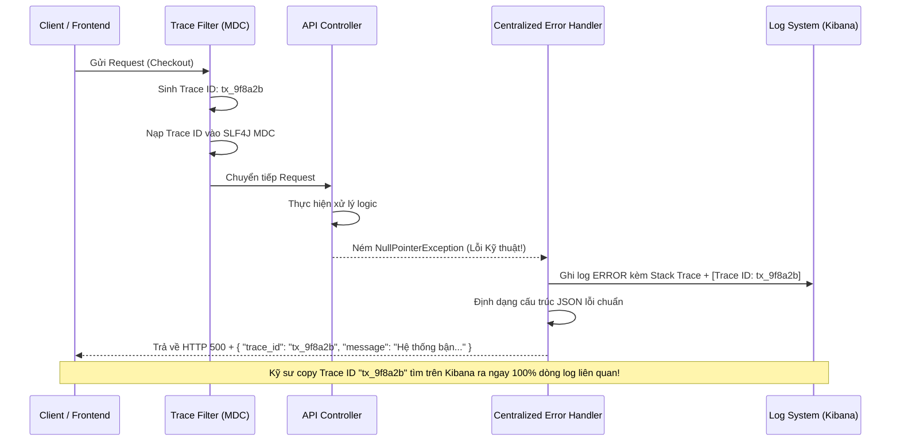

# Làm sao thiết kế error handling để dễ debug production?

## ⚡ Tóm tắt ngắn (30s)
* **Bản chất**: Thiết kế xử lý lỗi hiệu quả cho môi trường Production cần đạt được sự cân bằng hoàn hảo giữa **Trải nghiệm người dùng (UX)**, **An ninh hệ thống (Security)** và **Khả năng quan trắc (Observability)**. Quy tắc cốt lõi là **Xử lý tập trung (Centralized Exception Handling)**, cấu trúc **Phản hồi lỗi chuẩn hóa (Standardized Error Response)** và tích hợp **Trace ID / Correlation ID** xuyên suốt Call Stack.
* **Các thảm họa thực chiến được giải quyết**:
    1. **Rò rỉ dữ liệu nhạy cảm (Security Leak)**: Hệ thống ném lỗi 500 trực tiếp ra màn hình người dùng, phơi bày toàn bộ câu lệnh SQL, tên bảng, cấu trúc database và stack trace, tạo cơ hội cho tin tặc khai thác lỗ hổng.
    2. **Mất dấu vết lỗi giữa rừng log (Missing Needle in Haystack)**: User báo lỗi nhưng log ghi nhận hàng triệu dòng rời rạc, không có cách nào đối khớp lỗi trên màn hình của khách hàng với dòng log cụ thể trên server.
    3. **Tràn ngập cảnh báo giả (Alert Fatigue)**: Các lỗi do người dùng nhập sai dữ liệu (4xx) bị ghi nhận ở mức độ `ERROR` kèm stack trace đầy đủ, kích hoạt cảnh báo vô nghĩa làm phiền đội ngũ trực sự cố.
* **Quyết định Senior**: Triển khai bộ xử lý lỗi tập trung `@ControllerAdvice` kết hợp định dạng phản hồi JSON chuẩn hóa. Tự động đính kèm **Trace ID** qua bộ lọc (Filter) vào MDC (Mapped Diagnostic Context) và trả Trace ID này về cho Client trong mọi phản hồi lỗi. Phân biệt rõ ràng **Ngoại lệ nghiệp vụ (Business Exception)** - log mức `WARN/INFO` không in stack trace, và **Ngoại lệ kỹ thuật (Technical Exception)** - log mức `ERROR` kèm đầy đủ stack trace để kích hoạt hệ thống cảnh báo tự động.

---

## 🔍 Chi tiết bản chất thực chiến

Thiết kế hệ thống xử lý lỗi cấp độ Senior bao gồm 4 trụ cột kiến trúc sau:

### 1. Cấu trúc Phản hồi lỗi chuẩn hóa (Standardized Response Structure)
Mọi API khi gặp lỗi bắt buộc phải trả về một cấu trúc JSON đồng nhất, giúp Frontend dễ dàng xử lý giao diện và kỹ sư vận hành dễ dàng đối soát:
* `timestamp`: Thời điểm xảy ra lỗi (dạng ISO 8601).
* `status`: Mã trạng thái HTTP (HTTP Status Code).
* `error_code`: Mã lỗi nghiệp vụ cụ thể (Business Error Code, ví dụ: `USER_SUSPENDED`, `INSUFFICIENT_BALANCE`). Không dùng mã HTTP để đại diện cho logic nghiệp vụ.
* `message`: Câu thông báo thân thiện với người dùng (không chứa chi tiết kỹ thuật).
* `trace_id`: Mã định danh Trace ID duy nhất của request để đối soát log.
* `errors`: Danh sách lỗi chi tiết (chủ yếu dùng cho lỗi validate dữ liệu đầu vào).

### 2. Tách biệt rạch ròi: Lỗi Kỹ thuật vs Lỗi Nghiệp vụ
* **Lỗi Nghiệp vụ (Business Exception - 4xx)**:
  * Ví dụ: Hết hàng trong kho (`OutOfStockException`), Sai mật khẩu.
  * Hành động: Ghi log ở mức `WARN` hoặc `INFO`, **không ghi stack trace** để tiết kiệm CPU và tránh làm rác log. Trả về mã HTTP 4xx.
* **Lỗi Kỹ thuật/Hệ thống (Technical Exception - 5xx)**:
  * Ví dụ: Mất kết nối Database, NullPointerException.
  * Hành động: Ghi log ở mức `ERROR` kèm **đầy đủ stack trace** để kích hoạt hệ thống cảnh báo tự động (Alerting). Trả về mã HTTP 500.

### 3. Đồng bộ hóa Trace ID qua SLF4J MDC (Mapped Diagnostic Context)
MDC cho phép lưu trữ thông tin Context (như Trace ID, User ID) cục bộ trong luồng. Mọi dòng log xuất ra bởi luồng đó sẽ tự động được đính kèm Trace ID này, giúp ghép nối toàn bộ hành trình xử lý của request dễ dàng.

---

## 🎨 Sơ đồ trực quan (Luồng xử lý lỗi tập trung và Observability)



---

## 💻 Code thực chiến / Cấu hình thực tế: BAD vs GOOD

### ❌ BAD: Viết try-catch manh mún ở từng Controller và rò rỉ Stack Trace
Việc viết try-catch thủ công ở mọi nơi gây lặp code, đồng thời việc in trực tiếp stack trace ra màn hình Client tạo ra lỗ hổng bảo mật nghiêm trọng.

```java
@RestController
@RequestMapping("/api/accounts")
public class AccountControllerBad {

    @GetMapping("/{id}")
    public ResponseEntity<Object> getAccount(@PathVariable String id) {
        try {
            Account account = findAccountInDb(id);
            return ResponseEntity.ok(account);
        } catch (Exception e) {
            // ❌ LỖI BẢO MẬT: Trả về trực tiếp stack trace thô ra Client
            // Hacker có thể nhìn thấy tên thư viện, phiên bản và cấu trúc database để tấn công
            return ResponseEntity.status(500).body(e.toString());
        }
    }
}
```

---

### ✅ GOOD: Thiết kế xử lý lỗi tập trung, cấu trúc chuẩn hóa và Trace ID
Tách biệt xử lý lỗi ra khỏi logic nghiệp vụ bằng bộ điều phối tập trung và tích hợp Trace ID tự động vào log.

* **Cấu trúc JSON phản hồi lỗi chuẩn (ErrorResponse.java)**:
```java
@Data
@JsonInclude(JsonInclude.Include.NON_NULL)
public class ErrorResponse {
    private String timestamp;
    private int status;
    private String errorCode;
    private String message;
    private String traceId;
    private List<ValidationError> errors; // Dùng cho lỗi validate đầu vào
}
```

* **Bộ xử lý ngoại lệ tập trung (GlobalExceptionHandler.java)**:
```java
@ControllerAdvice
public class GlobalExceptionHandler {
    private static final Logger logger = LoggerFactory.getLogger(GlobalExceptionHandler.class);

    // ✅ 1. Xử lý Lỗi Nghiệp Vụ (Business Exception) -> Trả về HTTP 400
    @ExceptionHandler(BusinessException.class)
    public ResponseEntity<ErrorResponse> handleBusinessException(BusinessException ex) {
        // Ghi log WARN, không in stack trace để tiết kiệm tài nguyên hệ thống
        logger.warn("Business warning: {} [Code: {}]", ex.getMessage(), ex.getErrorCode());

        ErrorResponse response = new ErrorResponse();
        response.setTimestamp(Instant.now().toString());
        response.setStatus(HttpStatus.BAD_REQUEST.value());
        response.setErrorCode(ex.getErrorCode());
        response.setMessage(ex.getMessage());
        response.setTraceId(MDC.get("traceId")); // ✅ Lấy Trace ID tự động từ MDC

        return ResponseEntity.status(HttpStatus.BAD_REQUEST).body(response);
    }

    // ✅ 2. Xử lý Lỗi Kỹ Thuật / Lỗi Không Xác Định (Technical Exception) -> Trả về HTTP 500
    @ExceptionHandler(Exception.class)
    public ResponseEntity<ErrorResponse> handleUnexpectedException(Exception ex) {
        // Ghi log ERROR kèm đầy đủ stack trace để kích hoạt hệ thống Alert sự cố
        logger.error("Unexpected system failure: {}", ex.getMessage(), ex);

        ErrorResponse response = new ErrorResponse();
        response.setTimestamp(Instant.now().toString());
        response.setStatus(HttpStatus.INTERNAL_SERVER_ERROR.value());
        response.setErrorCode("INTERNAL_SERVER_ERROR");
        response.setMessage("Đã xảy ra sự cố hệ thống. Vui lòng liên hệ hỗ trợ kỹ thuật.");
        response.setTraceId(MDC.get("traceId"));

        return ResponseEntity.status(HttpStatus.INTERNAL_SERVER_ERROR).body(response);
    }
}
```

* **Bộ lọc chèn Trace ID vào MDC (TraceIdFilter.java)**:
```java
@Component
public class TraceIdFilter implements Filter {
    @Override
    public void doFilter(ServletRequest req, ServletResponse res, FilterChain chain) 
            throws IOException, ServletException {
        
        HttpServletRequest request = (HttpServletRequest) req;
        // Kiểm tra xem request phía trước (như Gateway) đã đính kèm Trace ID chưa
        String traceId = request.getHeader("X-Trace-Id");
        if (traceId == null || traceId.isEmpty()) {
            traceId = UUID.randomUUID().toString().replace("-", "");
        }

        // ✅ Nạp Trace ID vào SLF4J MDC để tự động in ra mọi dòng log của thread hiện hành
        MDC.put("traceId", traceId);

        try {
            chain.doFilter(req, res);
        } finally {
            // ✅ BẮT BUỘC PHẢI DỌN DẸP MDC sau khi request hoàn tất để tránh rò rỉ bộ nhớ ThreadLocal
            MDC.clear();
        }
    }
}
```

---

## 📊 Bảng so sánh các phương án thiết kế Error Response

| Tiêu chí | Trả về chuỗi thô (Raw Stack Trace) | Trả về mã lỗi HTTP đơn thuần | Trả về JSON chuẩn hóa + Trace ID (Good Practice) |
| :--- | :--- | :--- | :--- |
| **Trải nghiệm Frontend** | Rất tệ (Khó parse dữ liệu để hiển thị giao diện phù hợp). | Tạm ổn (Chỉ hiển thị được thông điệp lỗi chung chung). | Tuyệt vời (Có mã lỗi `error_code` riêng để rẽ nhánh xử lý động). |
| **Tính an ninh bảo mật**| Rất nguy hiểm (Lộ toàn bộ cấu trúc mã nguồn và thư viện). | An toàn (Không lộ thông tin). | Rất an toàn (Mã hóa toàn bộ chi tiết kỹ thuật đằng sau Trace ID). |
| **Tốc độ khoanh vùng lỗi**| Nhanh nếu nhìn trực tiếp màn hình dev. | Cực chậm (Phải mò mẫm log không có điểm tựa đối soát). | Cực nhanh (Chỉ cần lấy Trace ID đối chiếu thẳng lên Kibana). |

---

## ⚠️ Common Gotchas & Questions follow-up

### 1. Cạm bẫy "Rò rỉ bộ nhớ ThreadLocal do không giải phóng MDC"
* **Vấn đề**: Khi sử dụng MDC (lưu trữ dữ liệu trong `ThreadLocal`), nếu bạn nạp Trace ID vào luồng xử lý nhưng **quên xóa** (`MDC.clear()`) ở khối `finally`.
* **Hậu quả**: Khi thread đó hoàn thành request và quay trở lại Thread Pool, nó sẽ được tái sử dụng cho một request tiếp theo của một người dùng hoàn toàn khác. Request mới này sẽ in ra dòng log chứa Trace ID của request cũ trước đó, gây nhiễu loạn nghiêm trọng dữ liệu truy vết log và gây rò rỉ bộ nhớ (Memory Leak) âm thầm.
* **Giải pháp**: Luôn bọc khối thực thi của Filter chứa MDC trong cấu trúc `try-finally` và gọi `MDC.clear()` trong khối `finally`.

### 2. Câu hỏi đào sâu từ interviewer
* **Q: Làm thế nào bạn thiết kế hệ thống Error Handling để hỗ trợ Đa ngôn ngữ (Internationalization - i18n) cho trường `message` trả về Client, trong khi mã nguồn Backend không được cứng code (hardcode) các chuỗi dịch thuật tiếng Việt/tiếng Anh?**
  * *Trả lời*: Đây là tính năng nâng cao bắt buộc của các hệ thống Global. Tôi sẽ triển khai bằng cách:
    1. Sử dụng component `MessageSource` của Spring Boot để quản lý các file cấu hình dịch thuật (`messages_vi.properties`, `messages_en.properties`) lưu trữ tập trung.
    2. Trong cấu trúc xử lý lỗi `@ControllerAdvice`, tôi sẽ kiểm tra Header `Accept-Language` truyền lên từ Client hoặc sử dụng `LocaleContextHolder` để xác định ngôn ngữ người dùng yêu cầu.
    3. Thay vì trả về chuỗi thông báo cứng, tôi sẽ lấy mã lỗi `error_code` làm Key và gọi `messageSource.getMessage(errorCode, params, locale)` để lấy ra câu thông báo đã được dịch thuật chính xác theo ngôn ngữ của khách hàng.
