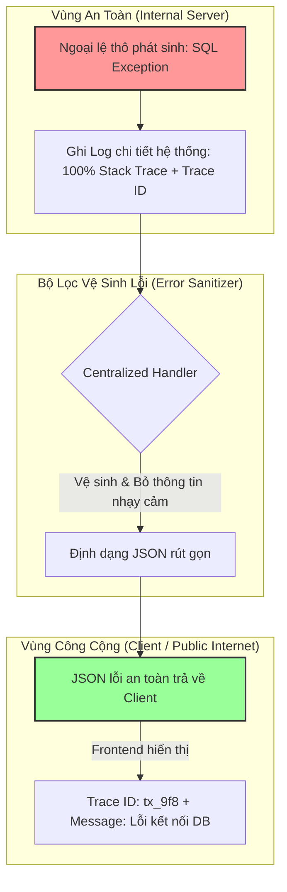

# Có nên expose error detail ra client không?

## ⚡ Tóm tắt ngắn (30s)
* **Bản chất**: **RẤT KHÔNG NÊN đối với Chi tiết Kỹ thuật**, nhưng **BẮT BUỘC đối với Chi tiết Nghiệp vụ và Validation**. Việc tiết lộ stack trace thô, thông tin database hoặc cấu trúc hệ thống ra Client vi phạm nghiêm trọng tiêu chuẩn an ninh **Rò rỉ Thông tin (Information Disclosure)** trong OWASP Top 10.
* **Các thảm họa thực chiến được giải quyết**:
    1. **Tạo sơ đồ tấn công miễn phí cho Tin tặc (Security Exploitation)**: Tin tặc cố tình gửi các tham số dị thường để kích hoạt lỗi 500. Từ stack trace trả về, họ xác định được phiên bản thư viện lỗi thời, tên bảng database, và cấu trúc thư mục máy chủ để thiết lập các cuộc tấn công SQL Injection hoặc Remote Code Execution (RCE).
    2. **Khách hàng hoang mang (Terrible UX)**: Người dùng phổ thông nhìn thấy hàng trăm dòng chữ tiếng Anh kỹ thuật kỳ dị trên màn hình thay vì một thông báo thân thiện, dẫn đến trải nghiệm khách hàng tồi tệ và đánh giá thiếu chuyên nghiệp.
* **Quyết định Senior**: Thiết kế cơ chế **Lọc và Vệ sinh lỗi (Error Sanitization)** tại lớp Gateway hoặc Global Exception Handler. Bất kỳ lỗi hệ thống (5xx) nào cũng chỉ được phép trả ra Client một thông báo chung: *"Hệ thống bận..."* kèm mã **Trace ID** và mã lỗi nghiệp vụ không nhạy cảm. Lưu trữ 100% stack trace chi tiết kèm đúng Trace ID đó tại log nội bộ của Server để phục vụ debug an toàn.

---

## 🔍 Chi tiết bản chất thực chiến

Để xử lý bài toán này ở cấp độ kiến trúc chuyên nghiệp, chúng ta áp dụng mô hình phân tách ranh giới an toàn thông tin:

### 1. Những thông tin TUYỆT ĐỐI KHÔNG được phép Expose ra Client
* **Stack Traces**: Tiết lộ tên Class, phương thức, thư viện bên thứ ba đang sử dụng và phiên bản của chúng (ví dụ: `com.mysql.cj.jdbc.exceptions.MySQLTimeoutException`).
* **SQL Queries**: Các lỗi cú pháp database hiển thị thô câu lệnh `SELECT ... FROM table_user WHERE...` lộ cấu trúc Schema.
* **Đường dẫn thư mục nội bộ (Internal Server Paths)**: Tiết lộ hệ điều hành và cấu trúc thư mục lưu file (ví dụ: `C:\Users\Administrator\...` hoặc `/usr/share/app/...`).
* **Chi tiết IP/Hạ tầng**: Thông tin về mạng nội bộ, tên host của Pod, hoặc địa chỉ IP của Database server.

### 2. Những thông tin CẦN THIẾT phải Expose ra Client
* **Mã lỗi nghiệp vụ (Business Error Codes)**: Định dạng chuỗi tĩnh để Frontend lập trình rẽ nhánh logic hiển thị giao diện (ví dụ: `INSUFFICIENT_FUNDS`, `ITEM_OUT_OF_STOCK`).
* **Thông báo lỗi thân thiện (User-Friendly Messages)**: Câu thông báo dễ hiểu, hướng dẫn hành động (ví dụ: *"Số dư tài khoản không đủ để thực hiện giao dịch này"*).
* **Lỗi xác thực dữ liệu đầu vào (Validation Errors)**: Chi tiết trường nào nhập sai điều kiện để Frontend tô đỏ ô nhập liệu đó (ví dụ: `email`: *"Email không đúng định dạng"*).
* **Mã truy vết Trace ID**: Điểm neo duy nhất để người dùng gửi cho bộ phận chăm sóc khách hàng và kỹ sư đối soát log.

---

## 🎨 Sơ đồ trực quan (Ranh giới Vệ sinh lỗi: Server vs Client)



---

## 💻 Code thực chiến / Cấu hình thực tế: BAD vs GOOD

### ❌ BAD: Trả ra Client thông tin thô của ngoại lệ hệ thống
Cấu hình Spring Boot mặc định hoặc code bắt lỗi cẩu thả sẽ in toàn bộ stack trace ném trực tiếp ra response body.

```java
@Service
public class TransferServiceBad {
    @Autowired
    private AccountRepository accountRepository;

    public void transferMoney(String fromId, String toId, BigDecimal amount) {
        // ❌ Nếu kết nối DB bị timeout, JPA/Hibernate sẽ ném ra SQLGrammarException/QueryTimeoutException
        // chứa toàn bộ tên bảng và câu lệnh SQL. Cấu hình tồi sẽ đẩy lỗi này thẳng ra Client!
        Account from = accountRepository.findById(fromId)
            .orElseThrow(() -> new RuntimeException("DB Connection Timeout or User " + fromId + " not found"));
            
        // Xử lý chuyển tiền...
    }
}
```

---

### ✅ GOOD: Triển khai Error Sanitizer tại Global Exception Handler
Đảm bảo tất cả các lỗi không mong muốn đều được che giấu kỹ thuật cẩn thận và chuyển dịch sang thông điệp chung an toàn.

```java
@ControllerAdvice
public class GlobalExceptionHandler {
    private static final Logger logger = LoggerFactory.getLogger(GlobalExceptionHandler.class);

    // ✅ 1. CHỈ EXPOSE lỗi Validate (đầu vào của người dùng) vì an toàn và có ích cho UX
    @ExceptionHandler(MethodArgumentNotValidException.class)
    public ResponseEntity<ErrorResponse> handleValidationError(MethodArgumentNotValidException ex) {
        List<ValidationError> validationErrors = ex.getBindingResult().getFieldErrors().stream()
            .map(error -> new ValidationError(error.getField(), error.getDefaultMessage()))
            .collect(Collectors.toList());

        ErrorResponse response = new ErrorResponse();
        response.setTimestamp(Instant.now().toString());
        response.setStatus(HttpStatus.BAD_REQUEST.value());
        response.setErrorCode("VALIDATION_FAILED");
        response.setMessage("Dữ liệu đầu vào không hợp lệ.");
        response.setErrors(validationErrors); // ✅ An toàn khi trả chi tiết trường lỗi
        response.setTraceId(MDC.get("traceId"));

        return ResponseEntity.status(HttpStatus.BAD_REQUEST).body(response);
    }

    // ✅ 2. ẨN HOÀN TOÀN chi tiết kỹ thuật của lỗi hệ thống (như SQL, NullPointer)
    @ExceptionHandler(SQLException.class)
    public ResponseEntity<ErrorResponse> handleDatabaseError(SQLException ex) {
        // ✅ Ghi log cực kỳ chi tiết ở phía SERVER để kỹ sư debug
        logger.error("CRITICAL DATABASE ERROR! Query state: {}, Error Code: {}", 
            ex.getSQLState(), ex.getErrorCode(), ex);

        // ❌ KHÔNG trả câu lệnh SQL hay exception ra ngoài.
        // ✅ CHỈ trả về thông điệp chung chung và Trace ID cho khách hàng
        ErrorResponse response = new ErrorResponse();
        response.setTimestamp(Instant.now().toString());
        response.setStatus(HttpStatus.INTERNAL_SERVER_ERROR.value());
        response.setErrorCode("SYSTEM_UNAVAILABLE");
        response.setMessage("Dịch vụ giao dịch tạm thời không khả dụng. Vui lòng thử lại sau.");
        response.setTraceId(MDC.get("traceId")); // Trace ID giúp tra cứu log DB ở trên

        return ResponseEntity.status(HttpStatus.INTERNAL_SERVER_ERROR).body(response);
    }
}
```

---

## 📊 Bảng so sánh ranh giới dữ liệu lỗi (Expose vs Mask)

| Loại thông tin lỗi | Nên Expose ra Client? | Mức độ nhạy cảm an ninh | Mục đích sử dụng |
| :--- | :--- | :--- | :--- |
| **Mã lỗi validation (vd: `email_format`)** | **CÓ** (Bắt buộc) | Không nhạy cảm | Hỗ trợ Frontend vẽ UI tô đỏ báo lỗi nhập liệu. |
| **Trace ID (Correlation ID)** | **CÓ** (Khuyến nghị) | Rất thấp | Giúp khách hàng gửi mã cho bộ phận CSKH để tra log. |
| **Mã lỗi nghiệp vụ (vd: `PAYMENT_DENIED`)** | **CÓ** (Khuyến nghị) | Thấp | Giúp app Frontend rẽ nhánh hiển thị màn hình riêng. |
| **Tên cơ sở dữ liệu & Cú pháp SQL** | **KHÔNG** | Cực kỳ nguy hiểm | Tạo sơ đồ cấu trúc dữ liệu cho tin tặc khai thác. |
| **Class Name & Line Number của code** | **KHÔNG** | Nguy hiểm | Tiết lộ lỗ hổng phiên bản thư viện lỗi thời (CVE). |

---

## ⚠️ Common Gotchas & Questions follow-up

### 1. Cạm bẫy "Lộ dữ liệu nhạy cảm do Spring Boot Default WhiteLabel Error Page"
* **Vấn đề**: Khi ứng dụng sập và bạn không cấu hình trang báo lỗi mặc định, Spring Boot sẽ hiển thị trang **WhiteLabel Error Page** thô sơ chứa toàn bộ thông điệp Exception gốc và Stack Trace thô ngay trên trình duyệt của người dùng.
* **Hậu quả**: Vi phạm nguyên tắc bảo mật và làm mất hình ảnh thương hiệu sản phẩm chuyên nghiệp.
* **Giải pháp**: Phải vô hiệu hóa hoàn toàn trang lỗi mặc định của Spring Boot bằng cách cấu hình tắt thuộc tính error attributes trong file cấu hình, hoặc bọc trang lỗi tùy chỉnh tại Gateway.
  ```yaml
  server:
    error:
      include-message: never      # ✅ Không bao giờ đưa message lỗi thô vào response mặc định
      include-binding-errors: never
      include-stacktrace: never   # ✅ Tắt hoàn toàn stack trace mặc định
  ```

### 2. Câu hỏi đào sâu từ interviewer
* **Q: Làm thế nào bạn thiết kế một cơ chế ghi log thông minh để che giấu (masking) các thông tin nhạy cảm của khách hàng (như Mật khẩu, Số thẻ tín dụng, Số căn cước công dân) khi in đối tượng request bị lỗi ra log hệ thống backend?**
  * *Trả lời*: Đây là tiêu chuẩn bắt buộc về bảo mật thông tin (Compliance/PCI-DSS/GDPR). Để thực hiện che giấu tự động:
    1. Tôi sẽ tạo các **Annotation tùy chỉnh** (ví dụ `@Masked`) để đánh dấu trên các thuộc tính nhạy cảm của Class DTO.
    2. Viết một bộ chuyển đổi định dạng **Custom Jackson Serializer** hoặc cấu hình **Logback Pattern Layout** tùy chỉnh.
    3. Khi thư viện thực hiện in đối tượng ra chuỗi JSON/Log, bộ lọc sẽ tự động phát hiện thuộc tính được đánh dấu và chuyển đổi giá trị thô thành chuỗi đã che giấu dạng `*****` trước khi ghi xuống đĩa cứng, đảm bảo log an toàn 100%.
