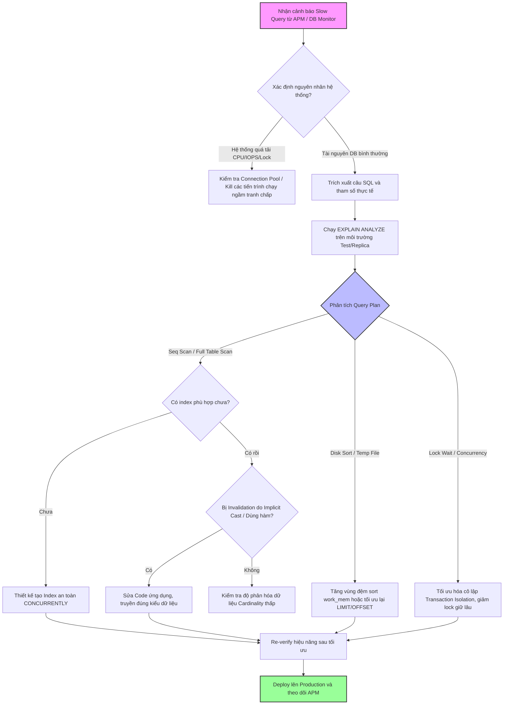

# Production báo slow query, bạn debug thế nào?

## ⚡ Tóm tắt ngắn (30s)
* **Bản chất**: Debug slow query trên production không đơn thuần là "thêm index". Đó là quy trình **Quan trắc (Observability) → Cô lập (Isolation) → Phân tích (Explain Plan) → Tối ưu (Optimization)**. Một Senior Engineer sẽ bắt đầu từ APM/Distributed Tracing để xác định phạm vi ảnh hưởng, dùng `EXPLAIN ANALYZE` để tìm nút thắt cổ chai của công cụ truy vấn (Query Planner), và lựa chọn giải pháp tối ưu nhất dựa trên chi phí tài nguyên (CPU/IO).
* **Các thảm họa thực chiến được giải quyết**:
    1. **Sập hệ thống khi tự ý tạo index trực tiếp trên bảng lớn (Table Lock)**: Kỹ sư Junior phát hiện bảng `orders` (50 triệu dòng) thiếu index cho cột `created_at`, liền chạy lệnh `CREATE INDEX` trực tiếp. Kết quả là database khóa toàn bộ bảng (exclusive lock), toàn bộ API viết đơn hàng bị treo (HTTP 504), gây ra sự cố downtime nghiêm trọng.
    2. **Lỗi ngầm Invalidation do ép kiểu ẩn (Implicit Type Casting)**: Cột `phone` được định nghĩa kiểu `VARCHAR` nhưng ứng dụng truyền vào tham số kiểu `BIGINT`. Query Planner bỏ qua index đã có trên cột `phone`, thực hiện quét toàn bộ bảng (Full Table Scan) để ép kiểu dữ liệu từng dòng, làm CPU database vọt lên 100%.
* **Quyết định Senior**: Tuân thủ quy trình debug 4 bước an toàn:
    1. **Bảo vệ hệ thống**: Không chạy thử nghiệm query trực tiếp trên production nếu chưa giới hạn số lượng record trả về (`LIMIT`).
    2. **Đọc hiểu Query Plan**: Sử dụng `EXPLAIN (ANALYZE, BUFFERS)` trong PostgreSQL để kiểm tra xem query bị nghẽn ở bước CPU (do hash join, sort) hay I/O (do seq scan, index block đọc từ disk).
    3. **Tối ưu hóa an toàn**: Tạo index ở chế độ chạy ngầm (`CONCURRENTLY` đối với Postgres hoặc `ONLINE` đối với MySQL) để tránh lock bảng ghi, hoặc cấu hình lại query để tránh phá hỏng index (tránh implicit cast, tránh hàm trong mệnh đề `WHERE`).

---

## 🔍 Chi tiết bản chất thực chiến

Khi có cảnh báo slow query phát sinh từ production, quy trình phân tích và xử lý chuyên nghiệp được tiến hành qua các bước sau:

### 1. Thu thập dữ liệu và Xác định ngữ cảnh (Observability)
* **Từ phía ứng dụng**: Sử dụng các công cụ APM (Datadog, Dynatrace, New Relic) hoặc Distributed Tracing (Jaeger, Zipkin) để tìm chính xác endpoint nào kích hoạt câu query, tham số truyền vào là gì, và tần suất gọi (throughput).
* **Từ phía database**: Xem Slow Query Log của hệ thống (trong Postgres là `log_min_duration_statement`, MySQL là `slow_query_log`). Sử dụng các thống kê hiệu năng tích hợp sẵn như `pg_stat_statements` (Postgres) hoặc `performance_schema` (MySQL) để tìm các câu query tích lũy thời gian chạy lâu nhất (Total Time = Call Count * Avg Duration).

### 2. Cô lập và Kiểm tra môi trường (Isolation)
* Slow query có thể do bản thân câu SQL tồi, hoặc do hệ thống DB đang bị quá tải tài nguyên (CPU 100%, RAM cạn kiệt, I/O bão hòa do IOPS limit). 
* Nếu do tài nguyên hệ thống, cần giải quyết gốc rễ vấn đề tài nguyên trước (ví dụ: kill các tiến trình backup, migration đang chạy ngầm tranh chấp I/O).

### 3. Phân tích kế hoạch truy vấn (Explain Plan)
* Lấy câu SQL kèm tham số thực tế chạy trên môi trường Staging (có lượng dữ liệu tương đương Production) hoặc bản sao Read Replica để phân tích bằng cú pháp:
  * **Postgres**: `EXPLAIN (ANALYZE, BUFFERS, VERBOSE) SELECT ...`
  * **MySQL**: `EXPLAIN ANALYZE SELECT ...`
* **Các chỉ số quan trọng cần phân tích**:
  * **Scan Type**: `Seq Scan` (Quét tuần tự toàn bảng - Tệ) vs `Index Scan` / `Index Only Scan` (Quét qua index - Tốt).
  * **Rows Output**: Số lượng dòng mà công cụ tối ưu hóa ước tính (`rows` trong explain) so với số lượng dòng thực tế xử lý (`loops`). Lệch quá nhiều nghĩa là Database Statistics đang bị lỗi thời, cần chạy `ANALYZE table`.
  * **Buffers**: Số lượng block dữ liệu phải đọc từ bộ nhớ cache `shared hit` vs đọc trực tiếp từ disk `read`. Nếu `read` quá cao nghĩa là RAM đang không đủ chứa working set hoặc thiếu index thích hợp.
  * **Sort / Hash**: Trình tối ưu hóa phải thực hiện sắp xếp dữ liệu trên ổ đĩa (External merge disk) thay vì trên RAM do kích thước vùng đệm sắp xếp (`work_mem` trong Postgres) quá nhỏ.

---

## 🎨 Sơ đồ trực quan (Quy trình debug slow query chuẩn Senior)



---

## 💻 Code thực chiến / Cấu hình thực tế: BAD vs GOOD

### ❌ BAD: Viết truy vấn gây sập hiệu năng và tạo Index thiếu an toàn
Dưới đây là một câu query tìm đơn hàng của người dùng theo số điện thoại được viết sai kiểu dữ liệu truyền vào và chạy trực tiếp lệnh tạo index khóa bảng.

* **Code SQL & Index tồi**:
```sql
-- 1. Bảng thiết kế cột phone kiểu VARCHAR (chuỗi)
-- Nhưng trong Java/NodeJS, lập trình viên truyền tham số kiểu số: phone = 987654321
-- Dẫn đến DB phải chạy ép kiểu ẩn (Implicit Cast) cho mọi dòng trong bảng
SELECT * FROM orders WHERE phone = 987654321 AND status = 'COMPLETED';

-- 2. Thấy query chậm, chạy ngay lệnh tạo index trực tiếp trên Production
-- ❌ THẢM HỌA: Lệnh này khóa cứng bảng orders (Exclusive Lock), chặn toàn bộ thao tác INSERT/UPDATE
CREATE INDEX idx_orders_phone ON orders(phone);
```

---

### ✅ GOOD: Cấu hình phân tích kỹ lưỡng và tối ưu hóa an toàn
Thực hiện ép đúng kiểu dữ liệu trong truy vấn, phân tích kế hoạch chạy thông qua `EXPLAIN` và triển khai tạo chỉ mục ngầm không khóa bảng.

* **Phân tích với EXPLAIN (Postgres)**:
```sql
-- Chạy thử nghiệm để kiểm tra nguyên nhân
EXPLAIN (ANALYZE, BUFFERS) 
SELECT * FROM orders WHERE phone = '0987654321' AND status = 'COMPLETED';

-- KẾT QUẢ GIẢ ĐỊNH TRƯỚC TỐI ƯU:
-- -> Seq Scan on orders (cost=0.00..89432.12 rows=1 width=128) (actual time=1432.231..2120.443 rows=1 loops=1)
--      Filter: ((phone)::text = '0987654321'::text AND status = 'COMPLETED')
--      Buffers: shared read=84321 -- Đọc trực tiếp từ Disk do không dùng được index!
```

* **Khắc phục code và tạo Index chuẩn Senior**:
```sql
-- 1. Truyền đúng kiểu dữ liệu chuỗi từ code ứng dụng để kích hoạt Index
SELECT * FROM orders WHERE phone = '0987654321' AND status = 'COMPLETED';

-- 2. Tạo composite index (chỉ mục tổ hợp) bao gồm cả trường lọc trạng thái
-- Dùng cờ CONCURRENTLY để tạo ngầm dưới background, hoàn toàn KHÔNG lock bảng ghi
CREATE INDEX CONCURRENTLY idx_orders_phone_status ON orders(phone, status);

-- 3. Phân tích lại để kiểm chứng
EXPLAIN (ANALYZE, BUFFERS) 
SELECT * FROM orders WHERE phone = '0987654321' AND status = 'COMPLETED';

-- KẾT QUẢ SAU TỐI ƯU:
-- -> Index Scan using idx_orders_phone_status on orders (cost=0.43..8.45 rows=1 width=128) (actual time=0.045..0.048 rows=1 loops=1)
--      Index Cond: ((phone = '0987654321'::text) AND (status = 'COMPLETED'::text))
--      Buffers: shared hit=4 -- Chỉ đọc đúng 4 block từ bộ nhớ RAM (shared buffers), cực kỳ nhanh!
```

---

## 📊 Bảng so sánh các phương pháp xử lý slow query

| Tiêu chí | Tạo Index phù hợp | Viết lại câu Query (Rewrite SQL) | Caching dữ liệu (Redis) | Chia nhỏ lô (Batching/Pagination) |
| :--- | :--- | :--- | :--- | :--- |
| **Bản chất** | Giảm độ phức tạp tìm kiếm từ $O(N)$ về $O(\log N)$. | Tối ưu hóa cách thức Query Planner quét dữ liệu. | Tránh gọi trực tiếp vào database đối với dữ liệu ít thay đổi. | Giảm số lượng dòng cần xử lý trong một phiên làm việc. |
| **Ưu điểm** | Dễ triển khai, hiệu quả vượt trội ngay lập tức. | Không tốn thêm dung lượng lưu trữ index, tối ưu tận gốc. | Tốc độ cực nhanh (microsecond), giảm tải hoàn toàn cho DB. | Tránh cạn kiệt bộ nhớ ứng dụng và DB buffer pool. |
| **Nhược điểm** | Làm chậm thao tác ghi (INSERT/UPDATE/DELETE), tốn RAM/Disk. | Yêu cầu hiểu sâu về cơ chế hoạt động của Database Engine. | Có nguy cơ stale data (dữ liệu cũ/sai lệch), tốn tài nguyên hạ tầng. | Tốn số lượng kết nối mạng (Network Round-trips) nhiều hơn. |
| **Use Case phù hợp** | Các cột thường xuyên xuất hiện ở mệnh đề `WHERE`, `JOIN`, `ORDER BY`. | Query phức tạp chứa nhiều Subquery, OR, Like, phép toán biến đổi. | Các bảng cấu hình, danh mục sản phẩm, bảng tin có lượng đọc cực lớn. | Xuất báo cáo, đồng bộ dữ liệu, xóa lịch sử định kỳ. |

---

## ⚠️ Common Gotchas & Questions follow-up

### 1. Cạm bẫy "Index vô dụng" (Index Invalidation) do sử dụng hàm
* **Vấn đề**: Kỹ sư tạo index cho cột `created_at` nhưng viết câu lệnh tìm kiếm đơn hàng trong ngày bằng hàm: `SELECT * FROM orders WHERE DATE(created_at) = '2026-05-23'`.
* **Hậu quả**: Database không thể sử dụng index trên cột `created_at` vì giá trị so sánh đã bị thay đổi qua hàm `DATE()`. Hệ thống bắt buộc phải thực hiện quét toàn bộ bảng (Full Table Scan).
* **Giải pháp**: Thiết kế lại mệnh đề so sánh theo dải giá trị (range query) để bảo toàn index:
  `SELECT * FROM orders WHERE created_at >= '2026-05-23 00:00:00' AND created_at < '2026-05-24 00:00:00'`.

### 2. Câu hỏi đào sâu từ interviewer

* **Q1: Làm thế nào bạn tạo index an toàn trên một bảng chứa 500 triệu dòng trên production đang có tải ghi rất cao mà không làm nghẽn hệ thống?**
  * *Trả lời*: 
    1. Đầu tiên, tôi tuyệt đối không chạy lệnh `CREATE INDEX` mặc định vì lệnh này sẽ chiếm Exclusive Lock (khóa độc quyền) trên bảng, làm sập hệ thống ghi.
    2. Với **PostgreSQL**, tôi sẽ dùng tùy chọn `CREATE INDEX CONCURRENTLY`. Lệnh này sẽ quét bảng qua hai lượt (two-pass scan) để xây dựng index mà chỉ chiếm Share Update Exclusive Lock - hoàn toàn không chặn các lệnh ghi `INSERT`, `UPDATE`, `DELETE`.
    3. Với **MySQL (InnoDB)**, tôi sử dụng cơ chế Online DDL có sẵn bằng cách khai báo: `ALTER TABLE orders ADD INDEX (created_at), ALGORITHM=INPLACE, LOCK=NONE`.
    4. Ngoài ra, tôi sẽ thực hiện việc này vào khung giờ thấp điểm (3h sáng) và chia nhỏ tải, đồng thời tăng dung lượng vùng đệm làm việc cho DB (`maintenance_work_mem` trong Postgres) để tiến trình tạo index diễn ra nhanh hơn và không ghi đè dồn dập vào ổ đĩa.

* **Q2: Nếu câu query của bạn bị chậm do thực hiện sắp xếp (`ORDER BY created_at DESC LIMIT 10`), dù đã có index trên `created_at`, bạn sẽ phân tích và giải quyết thế nào?**
  * *Trả lời*: 
    1. Khi chạy `EXPLAIN (ANALYZE, BUFFERS)`, tôi sẽ kiểm tra xem Planner có sử dụng index để duyệt dữ liệu hay nó thực hiện một thao tác sắp xếp đắt đỏ trên disk (`Sort Method: external merge Disk`).
    2. Nếu có Disk Sort, nguyên nhân thường do vùng đệm sắp xếp của phiên làm việc (`work_mem` trong Postgres) quá nhỏ so với lượng dữ liệu cần sắp xếp. Tôi sẽ tối ưu bằng cách tăng tạm thời `work_mem` cho session đó.
    3. Tuy nhiên, giải pháp triệt để hơn là tối ưu lại Index. Nếu câu truy vấn có lọc điều kiện khác, ví dụ: `WHERE user_id = 123 ORDER BY created_at DESC LIMIT 10`, một index đơn lẻ trên `created_at` sẽ không hiệu quả. Tôi sẽ tạo một **Composite Index (chỉ mục tổ hợp)** có thứ tự cột chính xác là `(user_id, created_at DESC)` để database lọc người dùng trước, sau đó lấy ngay dữ liệu đã được sắp xếp sẵn trong cây index mà không cần thực hiện thêm bất kỳ bước sort vật lý nào nữa.
