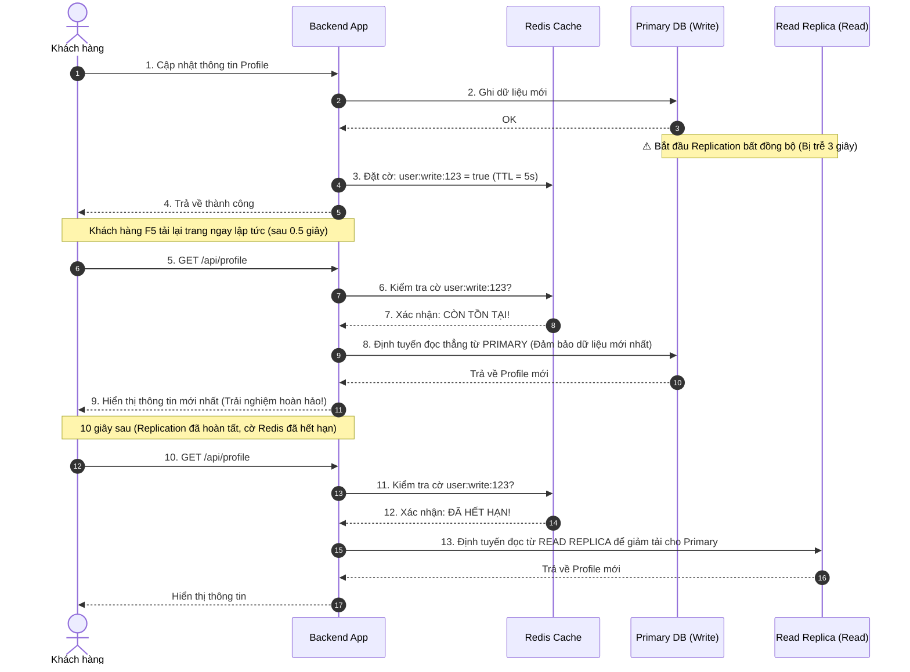

# Read replica bị lag gây user thấy dữ liệu cũ. Bạn xử lý thế nào?

## ⚡ Tóm tắt ngắn (30s)
* **Bản chất**: Đây là bài toán đánh đổi giữa **Tính nhất quán (Consistency)** và **Tính sẵn sàng (Availability)** trong hệ phân tán (Định lý CAP). Cơ chế nhân bản (Replication) giữa cơ sở dữ liệu chính (Primary) và bản sao chỉ đọc (Read Replica) mặc định là bất đồng bộ (Asynchronous) để tối ưu tốc độ ghi. Trễ nhân bản (Replication Lag) là không thể tránh khỏi. Khi người dùng thực hiện ghi và lập tức F5 để đọc, nếu yêu cầu đọc chuyển tới replica đang bị lag, họ sẽ thấy dữ liệu cũ (Stale Data).
* **Các thảm họa thực chiến được giải quyết**:
    1. **Trải nghiệm khách hàng cực tồi khi thanh toán**: Khách hàng vừa bấm "Đặt hàng" thành công, hệ thống chuyển hướng sang trang "Lịch sử đơn hàng". Do replica bị lag 2 giây, danh sách đơn hàng trống trơn. Khách hàng hoang mang tưởng lỗi nên bấm đặt lại lần hai, dẫn đến trùng lặp đơn hàng và khiếu nại.
    2. **Lỗi logic nghiệp vụ nghiêm trọng (Double Spending)**: Người dùng thực hiện rút tiền, số dư ở Primary đã trừ. Nhưng API kiểm tra số dư tiếp theo lại đọc từ Replica đang bị lag chưa cập nhật số dư cũ, cho phép người dùng tiếp tục thực hiện giao dịch rút tiền lần hai vượt quá hạn mức.
* **Quyết định Senior**: Triển khai giải pháp phân tầng thông minh:
    1. **Nguyên tắc "Nhất quán sau khi Ghi" (Read-Your-Own-Writes / Read-After-Write Consistency)**: Khi người dùng thực hiện ghi, ứng dụng đặt một cờ tạm thời trong Session/Redis (ví dụ: giữ trong 5 giây). Trong 5 giây này, mọi request đọc của **chính user đó** bắt buộc phải chuyển hướng thẳng tới **Primary DB**. Các user khác vẫn đọc từ Read Replica bình thường.
    2. **Định tuyến theo luồng nhạy cảm (Critical Path Routing)**: Các luồng nghiệp vụ liên quan đến tài chính, số dư, thanh toán tuyệt đối không đọc từ Replica, bắt buộc đọc 100% từ Primary.
    3. **Giám sát tự động (Lag-aware Routing)**: Cài đặt hệ thống tự động ngắt định tuyến đọc (Circuit Breaker) tới các Replica có độ trễ lag vượt quá ngưỡng cho phép (ví dụ: > 3 giây).

---

## 🔍 Chi tiết bản chất thực chiến: Các giải pháp kiến trúc chống trễ nhân bản

Để giải quyết triệt để vấn đề trải nghiệm người dùng mà vẫn tận dụng được sức mạnh giảm tải của Read Replica, chúng ta áp dụng các kỹ thuật sau:

### 1. Cơ chế Read-Your-Own-Writes sử dụng Cờ hiệu (Session Guard)
* Khi user thực hiện thao tác ghi thành công (ví dụ: `UPDATE`, `INSERT`), backend trả về phản hồi kèm theo một header hoặc ghi nhận vào Redis một key: `user:write_lock:<user_id> = true` với thời gian hết hạn (TTL) là 5 giây (độ dài an toàn lớn hơn tối đa replication lag thực tế).
* Khi nhận các request đọc tiếp theo, Interceptor của ứng dụng kiểm tra sự tồn tại của key này:
  * Nếu **Có**: Định tuyến kết nối tới **Primary Database**.
  * Nếu **Không**: Định tuyến kết nối tới **Read Replica**.

### 2. Sử dụng Cache làm Bộ đệm ghi (Transactional Cache Buffer)
* Khi ghi thành công dữ liệu mới vào Primary DB, ứng dụng đồng thời cập nhật ngay lập tức bản ghi mới đó vào bộ nhớ đệm Redis (với TTL ngắn).
* Tầng đọc dữ liệu luôn ưu tiên kiểm tra Redis trước. Vì Redis cập nhật gần như tức thời, người dùng sẽ nhìn thấy dữ liệu mới ngay lập tức trên giao diện, trong khi ở dưới nền, DB Replica có thể đang đồng bộ chậm mà không gây ảnh hưởng.

### 3. Tách biệt Data Source động ở tầng ứng dụng (Dynamic Routing Data Source)
* Cấu hình trong ứng dụng Spring Boot sử dụng `AbstractRoutingDataSource` kết hợp với `AOP (Aspect Oriented Programming)` để tự động quyết định chuyển đổi connection dựa trên Annotation hoặc trạng thái Transaction (ví dụ: `@Transactional(readOnly = true)` đi vào Replica, `@Transactional` thông thường đi vào Primary).

---

## 🎨 Sơ đồ trực quan (Cơ chế bảo vệ Read-Your-Own-Writes bằng Redis)



---

## 💻 Code thực chiến / Cấu hình thực tế: BAD vs GOOD

### ❌ BAD: Định tuyến đọc ghi mù quáng dẫn đến hiển thị sai lệch dữ liệu
Lập trình viên cấu hình định tuyến đọc/ghi tự động tuyệt đối dựa trên cờ `@Transactional(readOnly = true)` mà không có cơ chế bảo vệ sau khi ghi, làm người dùng thấy dữ liệu cũ ngay sau khi thao tác.

* **Code Service tồi**:
```java
@Service
public class ProfileService {
    @Autowired
    private UserRepository userRepository;

    // Ghi dữ liệu -> Đi vào Primary DB
    @Transactional
    public void updateBio(Long userId, String bio) {
        User user = userRepository.findById(userId).orElseThrow();
        user.setBio(bio);
        userRepository.save(user);
    }

    // ❌ THẢM HỌA: Đọc dữ liệu -> Luôn đi vào Read Replica
    // Nếu khách hàng cập nhật Bio và chuyển trang ngay, họ sẽ thấy Bio cũ vì replica bị lag!
    @Transactional(readOnly = true)
    public UserDto getProfile(Long userId) {
        User user = userRepository.findById(userId).orElseThrow();
        return new UserDto(user.getUsername(), user.getBio());
    }
}
```

---

### ✅ GOOD: Triển khai Dynamic Routing có cơ chế bảo vệ Read-Your-Own-Writes
Sử dụng một ThreadLocal hoặc cờ kiểm tra trong Interceptor để ép luồng đọc đi vào Primary DB nếu vừa có thao tác ghi phát sinh trong phiên làm việc.

* **1. Định nghĩa Context giữ trạng thái Data Source (Routing Context)**:
```java
public class DbRouteContext {
    private static final ThreadLocal<Boolean> forcePrimary = ThreadLocal.withInitial(() -> false);

    public static void setForcePrimary(boolean val) {
        forcePrimary.set(val);
    }

    public static boolean isForcePrimary() {
        return forcePrimary.get();
    }

    public static void clear() {
        forcePrimary.remove();
    }
}
```

* **2. Thiết lập Dynamic Routing DataSource quyết định kết nối**:
```java
public class DynamicRoutingDataSource extends AbstractRoutingDataSource {
    @Override
    protected Object determineCurrentLookupKey() {
        // ✅ Nếu có cờ ép buộc hoặc đang trong Transaction ghi -> Đi vào PRIMARY
        if (DbRouteContext.isForcePrimary() || !TransactionSynchronizationManager.isCurrentTransactionReadOnly()) {
            return "PRIMARY";
        }
        // Mặc định đi vào REPLICA chỉ đọc
        return "REPLICA";
    }
}
```

* **3. Interceptor kiểm tra cờ ghi của người dùng từ Redis (Read-Your-Own-Writes Interceptor)**:
```java
@Component
public class ReadYourOwnWritesInterceptor implements HandlerInterceptor {
    @Autowired
    private StringRedisTemplate redisTemplate;

    @Override
    public boolean preHandle(HttpServletRequest request, HttpServletResponse response, Object handler) {
        String userId = request.getHeader("X-User-Id");
        
        if (userId != null) {
            String redisKey = "user:write_lock:" + userId;
            // ✅ Nếu phát hiện user vừa ghi dữ liệu trong vòng 5 giây trước đó
            if (Boolean.TRUE.equals(redisTemplate.hasKey(redisKey))) {
                // Ép buộc luồng xử lý của Request này phải đọc từ Primary DB
                DbRouteContext.setForcePrimary(true);
            }
        }
        return true;
    }

    @Override
    public void afterCompletion(HttpServletRequest request, HttpServletResponse response, Object handler, Exception ex) {
        // Giải phóng ThreadLocal để tránh rò rỉ dữ liệu giữa các thread trong thread pool
        DbRouteContext.clear();
    }
}
```

---

## 📊 Bảng so sánh các giải pháp xử lý trễ nhân bản

| Tiêu chí | Read-Your-Own-Writes (Session Guard) | Đọc trực tiếp từ Primary (Tất cả) | Đồng bộ bán đồng bộ (Semi-Sync) | Caching cập nhật trực tiếp |
| :--- | :--- | :--- | :--- | :--- |
| **Mức độ bảo vệ** | Rất cao (Đảm bảo nhất quán tuyệt đối cho chính người thực hiện). | Tuyệt đối 100%. | Cao (Chỉ trễ ở mức mạng cực nhỏ). | Trung bình - Cao (Đọc nhanh từ bộ nhớ đệm). |
| **Tải lên Primary DB** | Rất thấp (Chỉ chuyển hướng đọc trong vài giây đầu của đúng user đó). | **Cực cao** (Bỏ phí hoàn toàn sức mạnh giảm tải của Replica). | Thấp (Vẫn đọc từ replica). | Thấp (Giảm tải thêm cho cả Primary lẫn Replica). |
| **Độ trễ ghi (Write Latency)** | Không bị ảnh hưởng. | Không bị ảnh hưởng. | **Bị tăng đáng kể** (Primary phải đợi Replica phản hồi). | Tăng nhẹ (Thêm 1 lệnh ghi vào Redis). |
| **Chi phí hạ tầng** | Thấp (Chỉ cần dùng Redis hiện có). | Bằng 0. | Trung bình (Cần cấu hình nâng cao cụm DB cụ thể). | Thấp - Trung bình (Cần quản lý đồng bộ Cache và DB). |

---

## ⚠️ Common Gotchas & Questions follow-up

### 1. Cạm bẫy "Rò rỉ ThreadLocal gây loạn định tuyến"
* **Vấn đề**: Sử dụng ThreadLocal để lưu trữ cờ `forcePrimary` nhưng quên không giải phóng ở bước cuối cùng (`afterCompletion`).
* **Hậu quả**: Do Tomcat tái sử dụng Thread (Thread Pool), request tiếp theo của User B (không hề có thao tác ghi nào) vô tình được xử lý bởi Thread cũ vẫn còn cờ `forcePrimary = true`. Kết quả là User B cũng bị chuyển hướng đọc sang Primary DB, làm vô hiệu hóa khả năng load-balancing và gây quá tải Primary vô lý.
* **Giải pháp**: Luôn đặt lệnh clear ThreadLocal trong khối `finally` của bộ lọc hoặc trong phương thức `afterCompletion` của Interceptor.

### 2. Câu hỏi đào sâu từ interviewer

* **Q1: Làm thế nào bạn giám sát (Monitor) và cảnh báo tự động khi chỉ số trễ nhân bản (Replication Lag) vọt lên cao trên môi trường Production?**
  * *Trả lời*: Tôi triển khai giám sát tự động qua hệ thống **Prometheus & Grafana**:
    1. **Thu thập chỉ số (Metrics)**:
       * Với **PostgreSQL**: Sử dụng chỉ số `pg_replication_lag` (đo bằng giây) hoặc tính toán độ lệch byte ghi giữa Primary và Replica qua hàm `pg_wal_lsn_diff(pg_current_wal_lsn(), pg_last_wal_replay_lsn())`.
       * Với **MySQL**: Sử dụng chỉ số `Seconds_Behind_Master` từ lệnh `SHOW SLAVE STATUS`.
    2. **Cấu hình Alerting**:
       * Thiết lập cảnh báo cấp độ `Warning` (gửi tin nhắn Slack) nếu Replication Lag > 5 giây kéo dài liên tục trong 2 phút.
       * Thiết lập cảnh báo cấp độ `Critical` (gọi điện thoại PagerDuty) nếu Replication Lag > 30 giây vì đây là dấu hiệu của việc nghẽn ổ đĩa hoặc replica bị chết tiến trình sync.
    3. **Tự động cô lập (Auto Circuit Breaker)**: Cấu hình ứng dụng hoặc DB Proxy (như ProxySQL) tự động loại bỏ (evict) các instance replica đang bị lag vượt quá 10 giây ra khỏi danh sách định tuyến đọc để bảo vệ người dùng không đọc phải dữ liệu quá cũ.

* **Q2: Nếu hệ thống của bạn yêu cầu Nhất quán dữ liệu tuyệt đối (Strong Consistency) cho mọi giao dịch của tất cả người dùng, việc dùng Read Replica có còn khả thi không?**
  * *Trả lời*: 
    1. Nếu yêu cầu Nhất quán tuyệt đối ở mọi nơi, việc định tuyến đọc ngẫu nhiên sang Read Replica bất đồng bộ thông thường là **không khả thi và không an toàn**.
    2. Để giải quyết, tôi sẽ đề xuất các hướng kiến trúc thay thế:
       * **Sử dụng Semi-Synchronous Replication (Nhân bản bán đồng bộ)**: Đảm bảo dữ liệu đã được ghi xuống đĩa của ít nhất một Replica trước khi báo thành công cho Client. Tuy nhiên cách này làm tăng write latency.
       * **Kiến trúc DB đa vùng nhất quán (Distributed SQL)**: Sử dụng các hệ quản trị cơ sở dữ liệu hiện đại hỗ trợ thuật toán đồng thuận như Raft/Paxos (ví dụ: CockroachDB, Google Spanner, YugabyteDB). Các DB này hỗ trợ phân tán dữ liệu toàn cầu nhưng vẫn đảm bảo độ nhất quán mạnh mẽ (ACID tuyệt đối) ở mức công nghệ lưu trữ, giúp ứng dụng không cần lo lắng về việc định tuyến đọc ghi thủ công.
