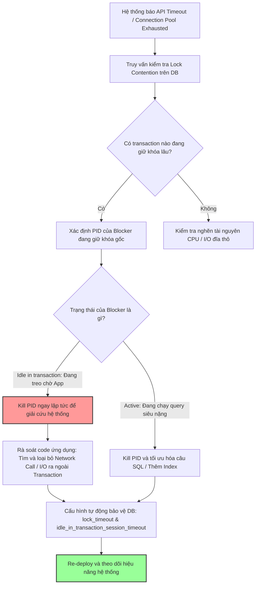

# Transaction giữ lock quá lâu, bạn debug thế nào?

## ⚡ Tóm tắt ngắn (30s)
* **Bản chất**: Lock (Khóa) là cơ chế bắt buộc để RDBMS đảm bảo tính toàn vẹn và cô lập dữ liệu (ACID). Lock chỉ được giải phóng khi transaction kết thúc (**COMMIT** hoặc **ROLLBACK**). Khi một transaction kéo dài bất thường, nó sẽ giữ chặt các khóa dữ liệu, chặn đứng (Block) các transaction khác, tạo ra hiện tượng nghẽn cổ chai dây chuyền (Lock Contention) và sập connection pool của ứng dụng.
* **Các thảm họa thực chiến được giải quyết**:
    1. **Thảm họa "Trạng thái chết lâm sàng" (Idle in Transaction)**: Một lập trình viên viết code Spring Boot mở transaction, đọc dữ liệu, sau đó gọi API bên ngoài. API bên ngoài phản hồi chậm (mất 30 giây). Trong 30 giây này, connection DB bị giữ và khóa trên các dòng dữ liệu bị chặn đứng. PostgreSQL đánh dấu trạng thái này là `idle in transaction` - một trong những nguyên nhân hàng đầu gây treo hệ thống âm thầm.
    2. **Khóa BA phá hoại vô ý**: Một BA hoặc dev dùng công cụ DBeaver kết nối vào Production, chạy lệnh `BEGIN; UPDATE products SET price = 100 WHERE id = 1;` để sửa dữ liệu, nhưng quên không chạy lệnh `COMMIT;` rồi đi ăn trưa. Toàn bộ API cập nhật giỏ hàng liên quan đến sản phẩm ID = 1 của khách hàng bị treo cứng.
* **Quyết định Senior**:
    1. **Chẩn đoán nóng**: Sử dụng các bảng hệ thống (`pg_locks`, `pg_stat_activity` trong Postgres; `innodb_trx` trong MySQL) để tìm ra chính xác PID của transaction đang giữ khóa gốc và câu lệnh đang bị chặn, lập tức `KILL` tiến trình giữ khóa gốc.
    2. **Thiết lập Lá chắn tự động**: Cấu hình thuộc tính `idle_in_transaction_session_timeout` của DB để tự động ngắt kết nối nếu một transaction nhàn rỗi quá thời gian quy định (ví dụ: > 10 giây).
    3. **Tối ưu hóa Code**: Chia nhỏ các transaction lớn, tuyệt đối không gọi I/O mạng hoặc tính toán nặng trong transaction.

---

## 🔍 Chi tiết bản chất thực chiến: Quy trình chẩn đoán và khắc phục Lock lâu

### 1. Phân biệt các trạng thái khóa nguy hiểm
* **Lock Wait**: Trạng thái một câu lệnh SQL đang phải dừng lại xếp hàng chờ một khóa dữ liệu đang bị chiếm giữ bởi một câu lệnh khác.
* **Idle in Transaction (PostgreSQL)**: Transaction đã được mở (đã chạy câu lệnh đầu tiên) nhưng hiện tại đang rảnh rỗi (idle), không chạy bất kỳ câu lệnh nào tiếp theo nhưng **vẫn giữ nguyên tất cả các khóa** đã chiếm đoạt trước đó. Nguyên nhân 100% do code ứng dụng đang bận thực hiện tác vụ ngoài DB (gọi API ngoài, tính toán CPU, hoặc bị treo).

### 2. Quy trình Debug chuẩn Senior

#### Bước 1: Xác định quan hệ chặn giữ (Blocker vs Waiter)
* Chúng ta cần tìm ra: Câu query nào đang bị chặn? Nó bị chặn bởi câu query nào? PID của tiến trình đang giữ khóa gốc là bao nhiêu?
* Chạy các câu lệnh truy vấn metadata hệ thống (xem chi tiết ở phần Code).

#### Bước 2: Giải cứu khẩn cấp (Hotfix)
* Sử dụng lệnh `KILL` tiến trình giữ khóa gốc (Holder/Blocker) để giải phóng ngay lập tức các tiến trình đang xếp hàng chờ (Waiters).

#### Bước 3: Cấu hình giới hạn thời gian tự động (Tuning DB)
* Thiết lập `lock_timeout` (thời gian tối đa một query được phép xếp hàng chờ lock, quá hạn sẽ tự hủy để tránh treo pool).
* Thiết lập `idle_in_transaction_session_timeout` (Postgres) để tự động dọn rác các transaction bị treo.

---

## 🎨 Sơ đồ trực quan (Luồng chẩn đoán và giải quyết nghẽn Lock)



---

## 💻 Code thực chiến / Cấu hình thực tế: BAD vs GOOD

### ❌ BAD: Thực hiện Update dữ liệu quy mô lớn trong một Transaction duy nhất
Lập trình viên viết câu lệnh cập nhật trạng thái của hàng triệu đơn hàng cũ trong một transaction, khiến toàn bộ các dòng này bị khóa chặt trong thời gian dài.

* **Code Java Spring Boot tồi**:
```java
@Service
public class OrderService {
    @Autowired
    private OrderRepository orderRepository;

    // ❌ THẢM HỌA: Câu query cập nhật 5 triệu dòng chạy mất 2 phút
    // Toàn bộ 5 triệu dòng này bị LOCK cứng trong suốt 2 phút, chặn mọi thao tác của khách hàng!
    @Transactional
    public void archiveOldOrders() {
        LocalDate cutOffDate = LocalDate.now().minusYears(2);
        orderRepository.archiveOrdersBefore(cutOffDate); 
    }
}
```

---

### ✅ GOOD: Chẩn đoán bằng SQL nâng cao và chia nhỏ Transaction theo lô (Batching)
Sử dụng các script SQL chuyên dụng để tìm và tiêu diệt tiến trình giữ khóa gốc, đồng thời tối ưu hóa code bằng cách chia nhỏ tác vụ ghi theo từng lô ngắn.

* **1. Script chẩn đoán khóa trong PostgreSQL**:
```sql
-- Tìm tất cả các mối quan hệ chặn khóa (Ai đang chặn Ai?)
SELECT
    blocked_locks.pid     AS blocked_pid,
    blocked_activity.usename  AS blocked_user,
    blocking_locks.pid    AS blocking_pid,
    blocking_activity.usename AS blocking_user,
    blocked_activity.query    AS blocked_statement,
    blocking_activity.query   AS current_statement_in_blocking_process,
    blocking_activity.state   AS blocking_process_state
FROM  pg_catalog.pg_locks         blocked_locks
JOIN pg_catalog.pg_stat_activity blocked_activity ON blocked_activity.pid = blocked_locks.pid
JOIN pg_catalog.pg_locks         blocking_locks 
    ON blocking_locks.locktype = blocked_locks.locktype
    AND blocking_locks.database IS NOT DISTINCT FROM blocked_locks.database
    AND blocking_locks.relation IS NOT DISTINCT FROM blocked_locks.relation
    AND blocking_locks.page IS NOT DISTINCT FROM blocked_locks.page
    AND blocking_locks.tuple IS NOT DISTINCT FROM blocked_locks.tuple
    AND blocking_locks.virtualxid IS NOT DISTINCT FROM blocked_locks.virtualxid
    AND blocking_locks.transactionid IS NOT DISTINCT FROM blocked_locks.transactionid
    AND blocking_locks.classid IS NOT DISTINCT FROM blocked_locks.classid
    AND blocking_locks.objid IS NOT DISTINCT FROM blocked_locks.objid
    AND blocking_locks.objsubid IS NOT DISTINCT FROM blocked_locks.objsubid
    AND blocking_locks.pid != blocked_locks.pid
JOIN pg_catalog.pg_stat_activity blocking_activity ON blocking_activity.pid = blocking_locks.pid
WHERE NOT blocked_locks.granted;

-- TIÊU DIỆT TIẾN TRÌNH GIỮ KHÓA GỐC (Blocking PID)
SELECT pg_terminate_backend(blocking_pid_vừa_tìm_được);
```

* **2. Cấu hình tự động bảo vệ an toàn cho PostgreSQL (postgresql.conf)**:
```ini
-- Giới hạn thời gian xếp hàng chờ lock tối đa 3 giây (tránh treo connection pool)
lock_timeout = 3000

-- Tự động kill các transaction ở trạng thái "idle in transaction" quá 10 giây
idle_in_transaction_session_timeout = 10000
```

* **3. Code Java Spring Boot tối ưu (Chia nhỏ transaction theo lô - Chunking)**:
```java
@Service
public class OrderService {
    @Autowired
    private OrderRepository orderRepository;

    // ✅ AN TOÀN: Không dùng @Transactional ở tầng này
    public void archiveOldOrders() {
        LocalDate cutOffDate = LocalDate.now().minusYears(2);
        int updatedRows;
        
        do {
            // ✅ Mỗi lô chỉ cập nhật 1,000 dòng trong 1 transaction siêu ngắn (chỉ mất vài ms)
            // Khóa được giải phóng ngay lập tức, không gây ảnh hưởng tới người dùng khác
            updatedRows = orderRepository.archiveOrdersBatch(cutOffDate, 1000);
            
            // Nghỉ 50ms giữa các lô để DB có thời gian xử lý các request khác
            try { Thread.sleep(50); } catch (InterruptedException e) { Thread.currentThread().interrupt(); }
            
        } while (updatedRows > 0); // Lặp lại cho đến khi hết dữ liệu cũ
    }
}
```

---

## 📊 Bảng so sánh các phương pháp xử lý khóa kéo dài

| Tiêu chí | Sử dụng Lock Timeout | Chia nhỏ Transaction (Chunking) | Kill Connection thủ công | Đặt timeout ở tầng Ứng dụng |
| :--- | :--- | :--- | :--- | :--- |
| **Mục đích** | Ngăn chặn các câu query xếp hàng chờ vô hạn. | Rút ngắn tối đa thời gian chiếm giữ khóa. | Cắt đuôi khẩn cấp để cứu hệ thống đang downtime. | Tự động hủy luồng xử lý bị treo ở phía App. |
| **Ưu điểm** | Tự động bảo vệ an toàn cho Connection Pool. | Giải pháp triệt để cho các tác vụ xử lý dữ liệu lớn. | Tác dụng tức thì, khôi phục dịch vụ trong vài giây. | Đảm bảo Web Server không bị cạn kiệt Thread. |
| **Nhược điểm** | Câu lệnh migration hoặc DDL lành mạnh có thể bị lỗi do timeout. | Viết code phức tạp hơn, cần kiểm soát vòng lặp. | Chỉ là giải pháp tình thế, lỗi sẽ lặp lại nếu không sửa code. | App hủy luồng nhưng DB có thể vẫn âm thầm chạy nốt transaction. |

---

## ⚠️ Common Gotchas & Questions follow-up

### 1. Cạm bẫy "Ứng dụng đóng kết nối nhưng DB vẫn mở Transaction"
* **Vấn đề**: Ở tầng ứng dụng Spring Boot, bạn cấu hình timeout cho HTTP Request hoặc transaction là 5 giây. Khi quá 5 giây, ứng dụng ném lỗi `TransactionTimedOutException` và đóng luồng xử lý.
* **Hậu quả**: Tuy nhiên, do cơ chế giao tiếp mạng, lệnh hủy giao dịch có thể không truyền tải kịp thời hoặc DB Engine không hỗ trợ ngắt câu lệnh đang chạy giữa chừng. Database vẫn tiếp tục âm thầm thực thi câu query nặng đó và **giữ nguyên khóa** cho đến khi chạy xong, trong khi phía ứng dụng tưởng rằng transaction đã kết thúc.
* **Giải pháp**: Phải cấu hình đồng bộ cả `statement_timeout` ở tầng DB đồng nhất với thời gian timeout của ứng dụng.

### 2. Câu hỏi đào sâu từ interviewer

* **Q1: Sự khác nhau giữa `statement_timeout` và `idle_in_transaction_session_timeout` trong PostgreSQL là gì? Có nên đặt giá trị của chúng bằng nhau không?**
  * *Trả lời*: Đây là hai tham số phòng ngự cực kỳ quan trọng ở các tầng khác nhau của Transaction:
    1. **`statement_timeout`**: Giới hạn thời gian thực thi của **một câu lệnh SQL đơn lẻ**. Ví dụ, nếu đặt là 10 giây, câu lệnh `SELECT` hoặc `UPDATE` nào chạy quá 10 giây sẽ bị DB tự động ngắt và rollback.
    2. **`idle_in_transaction_session_timeout`**: Giới hạn thời gian một connection được giữ mở ở trạng thái **nhàn rỗi (idle) nhưng nằm trong một transaction đang mở**. Lúc này không có câu lệnh nào đang chạy, nhưng các khóa của các câu lệnh trước đó vẫn được giữ.
    3. **Có đặt bằng nhau không?**: Không nên.
       * `statement_timeout` nên đặt lớn hơn thời gian chạy dự kiến của câu SQL dài nhất được chấp nhận (thường là 10-30 giây).
       * `idle_in_transaction_session_timeout` là để dọn rác các kết nối bị treo do lỗi logic code (ví dụ: app bận gọi API ngoài), nên đặt ngắn hơn (khoảng 5-10 giây) để giải phóng khóa dữ liệu nhanh nhất có thể, bảo vệ các tiến trình khác.

* **Q2: Làm thế nào bạn giám sát trạng thái `idle in transaction` tự động và cảnh báo bằng Grafana?**
  * *Trả lời*: Tôi sẽ thiết lập thu thập metric qua công cụ **Prometheus PostgreSQL Exporter** và cấu hình dashboard Grafana:
    1. **Viết câu query đếm trạng thái**: Exporter sẽ định kỳ chạy câu SQL để đếm số lượng kết nối đang ở trạng thái nguy hiểm này:
       ```sql
       SELECT count(*) FROM pg_stat_activity 
       WHERE state = 'idle in transaction' 
         AND state_change < now() - interval '5 seconds';
       ```
    2. **Thiết lập cảnh báo (Alerting)**: Nếu số lượng kết nối `idle in transaction` vượt quá 5 kết nối và kéo dài liên tục trong 1 phút, hệ thống sẽ tự động kích hoạt cảnh báo PagerDuty gửi tới kỹ sư On-call để vào kiểm tra và xử lý code bị leak transaction.
