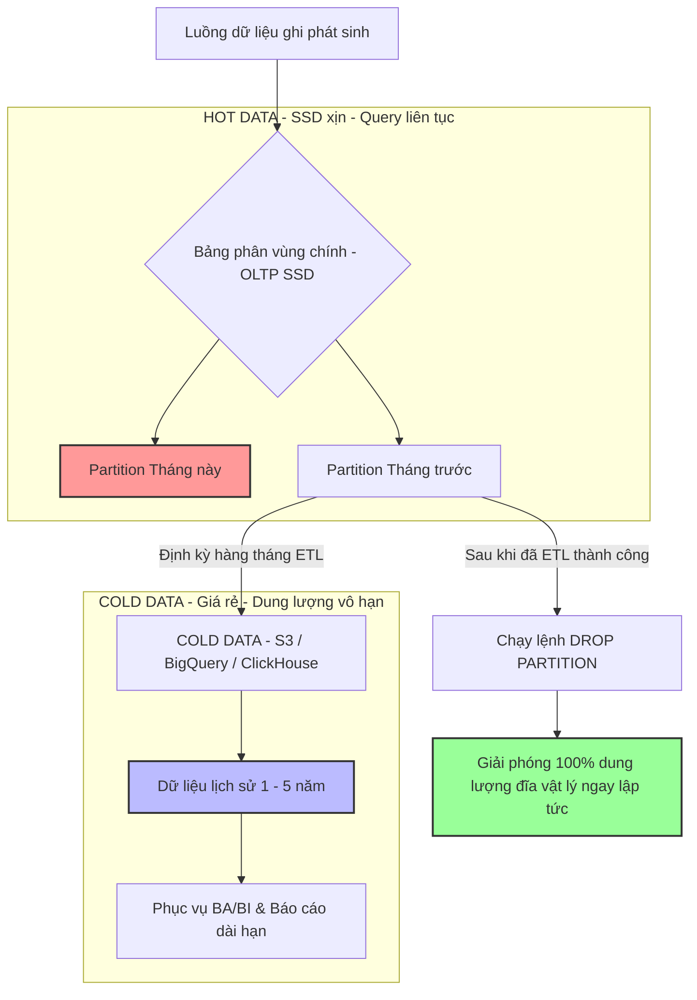

# Một bảng tăng dữ liệu quá nhanh, query ngày càng chậm. Bạn đề xuất gì?

## ⚡ Tóm tắt ngắn (30s)
* **Bản chất**: Đây là bài toán **Quản trị vòng đời dữ liệu (Data Lifecycle Management)** và **Tối ưu hóa kiến trúc lưu trữ quy mô lớn (Database Scaling)**. Khi một bảng (như `audit_logs`, `orders`, `transactions`) đạt ngưỡng hàng trăm triệu dòng, hiệu năng cây chỉ mục B-Tree giảm mạnh do chiều cao cây tăng và chỉ mục không còn nằm vừa trong bộ nhớ đệm (RAM Buffer Pool). DB buộc phải đọc từ đĩa (Disk I/O). Giải pháp của Senior Architect là triển khai chiến lược **Phân tầng dữ liệu (Data Tiering)** để giữ cho tập dữ liệu nóng (Hot Data) luôn tinh gọn.
* **Các thảm họa thực chiến được giải quyết**:
    1. **Thảm họa sập DB khi xóa dữ liệu cũ bằng lệnh DELETE**: Để dọn dẹp bảng `logs` khổng lồ, lập trình viên chạy lệnh: `DELETE FROM logs WHERE created_at < '2025-01-01'`. Lệnh này khóa toàn bộ bảng (Table Lock), ghi ngập tràn tệp tin nhật ký giao dịch (WAL/Redo Log) làm đầy đĩa cứng, khiến hệ thống tê liệt hoàn toàn trong nhiều giờ.
    2. **RAM bão hòa I/O đĩa liên tục (Buffer Pool Thrashing)**: Kích thước index của bảng vượt quá dung lượng RAM của DB Server. Mỗi truy vấn đọc dữ liệu ngẫu nhiên bắt buộc phải tải block dữ liệu từ SSD lên RAM và đẩy block cũ ra, khiến đĩa cứng hoạt động 100% công suất liên tục, Latency tăng hàng trăm lần.
* **Quyết định Senior**: Áp dụng chiến lược Phân tầng dữ liệu 3 cấp độ:
    1. **Dữ liệu Nóng (Hot Data - 3 tháng gần nhất)**: Lưu ở bảng phân vùng vật lý (**Database Partitioning** theo thời gian) đặt trên ổ cứng SSD tốc độ cao.
    2. **Dữ liệu Ấm (Warm Data - 1 năm gần nhất)**: Lưu trữ ở các bảng lịch sử đã nén hoặc DB chi phí thấp hơn phục vụ báo cáo.
    3. **Dữ liệu Lạnh (Cold Data - trên 1 năm)**: Trích xuất và đẩy hoàn toàn sang các kho lưu trữ dữ liệu giá rẻ (**Data Lake/Data Warehouse** như BigQuery, S3, ClickHouse) và thực hiện **DROP Partition** cũ trực tiếp trên DB chính (chỉ mất vài ms và giải phóng 100% dung lượng đĩa lập tức không để lại rác).

---

## 🔍 Chi tiết bản chất thực chiến: Chiến lược Phân tầng dữ liệu (Data Tiering)

Khi đối mặt với bảng siêu lớn, chúng ta giải quyết qua các trục kiến trúc sau:

### 1. Phân vùng bảng (Database Partitioning)
* Chia nhỏ bảng khổng lồ thành các bảng con vật lý (Partitions) dựa trên một khóa phân vùng (ví dụ: Phân vùng theo tháng dựa trên cột `created_at`).
* **Cơ chế Partition Pruning (Cắt tỉa phân vùng)**: Khi người dùng truy vấn đơn hàng trong tháng 5/2026, Query Planner thông minh chỉ quét duy nhất phân vùng của tháng 5/2026, bỏ qua hoàn toàn các tháng khác. Điều này giữ cho cây index cực kỳ nhỏ, nằm trọn trong RAM Buffer Pool, tốc độ truy vấn đạt mức tối đa.

### 2. Xóa dữ liệu cũ tức thời bằng cách DROP Partition
* Việc xóa hàng triệu dòng bằng lệnh `DELETE` là thảm họa vì DB phải ghi nhận từng dòng xóa vào transaction log để hỗ trợ rollback.
* Với Partitioning, việc dọn dẹp dữ liệu cũ đơn giản là chạy lệnh: `ALTER TABLE orders DROP PARTITION orders_y2024m01;`. Lệnh này xóa đứt tệp tin vật lý trên đĩa cứng, hoàn tất trong vài mili-giây, hoàn toàn không lock bảng chính và không ghi log giao dịch nặng.

### 3. Đồng bộ sang Data Lake cho dữ liệu Lạnh (Cold Data)
* Thiết lập đường ống dẫn dữ liệu bất đồng bộ (CDC - Change Data Capture hoặc định kỳ ETL) để chuyển dữ liệu cũ sang các hệ thống OLAP (BigQuery, Snowflake, ClickHouse) phục vụ các nhu cầu phân tích, báo cáo dài hạn của doanh nghiệp.

---

## 🎨 Sơ đồ trực quan (Kiến trúc phân tầng dữ liệu nóng/ấm/lạnh)



---

## 💻 Code thực chiến / Cấu hình thực tế: BAD vs GOOD

### ❌ BAD: Thực hiện xóa dữ liệu lịch sử bằng lệnh DELETE thô bạo
Lập trình viên dọn dẹp dữ liệu lịch sử của bảng log khổng lồ bằng lệnh `DELETE` thông thường, gây nghẽn I/O đĩa và lock bảng diện rộng.

* **Code SQL tồi**:
```sql
-- ❌ THẢM HỌA: Lệnh này khóa cứng bảng audit_logs, ghi ngập tràn file WAL/Redo log
-- Có thể làm đầy dung lượng đĩa cứng của DB và sập toàn bộ hệ thống
DELETE FROM audit_logs WHERE log_date < '2025-01-01';
```

---

### ✅ GOOD: Thiết lập bảng phân vùng Range Partitioning (PostgreSQL)
Thiết kế cấu trúc bảng phân vùng theo thời gian thực tế, cho phép quản lý vòng đời dữ liệu cực kỳ nhanh chóng và an toàn.

* **1. Tạo bảng cha có cấu hình phân vùng theo dải thời gian (Range Partitioning)**:
```sql
CREATE TABLE audit_logs (
    id BIGSERIAL,
    log_date DATE NOT NULL,
    action VARCHAR(100),
    details TEXT,
    PRIMARY KEY (id, log_date) -- Khóa chính bắt buộc phải bao gồm cột phân vùng
) PARTITION BY RANGE (log_date);
```

* **2. Tạo các bảng phân vùng con vật lý phục vụ lưu trữ**:
```sql
-- Phân vùng cho tháng 04 năm 2026
CREATE TABLE audit_logs_y2026m04 PARTITION OF audit_logs
    FOR VALUES FROM ('2026-04-01') TO ('2026-05-01');

-- Phân vùng cho tháng 05 năm 2026
CREATE TABLE audit_logs_y2026m05 PARTITION OF audit_logs
    FOR VALUES FROM ('2026-05-01') TO ('2026-06-01');
```

* **3. Kiểm tra cơ chế cắt tỉa phân vùng (Partition Pruning)**:
```sql
EXPLAIN (ANALYZE, BUFFERS)
SELECT * FROM audit_logs 
WHERE log_date >= '2026-05-10' AND log_date <= '2026-05-15';

-- KẾT QUẢ: Query Planner chỉ quét đúng bảng con 'audit_logs_y2026m05'
-- -> Seq Scan on audit_logs_y2026m05 (actual rows=452 loops=1)
--      Filter: ((log_date >= '2026-05-10'::date) AND (log_date <= '2026-05-15'::date))
--      (Hoàn toàn bỏ qua phân vùng tháng 4 và các tháng khác, tốc độ xử lý tối đa!)
```

* **4. Dọn dẹp dữ liệu cũ cực nhanh không để lại rác (Zero Downtime)**:
```sql
-- Giải phóng 100% dung lượng đĩa của tháng 04 ngay lập tức
ALTER TABLE audit_logs DETACH PARTITION audit_logs_y2026m04; -- Ngắt liên kết trước
DROP TABLE audit_logs_y2026m04; -- Xóa bảng vật lý (Chỉ mất vài mili-giây!)
```

---

## 📊 Bảng so sánh các phương án mở rộng DB quy mô lớn

| Tiêu chí | Phân vùng bảng (Partitioning) | Đồng bộ lưu trữ lịch sử (Archiving) | Phân mảnh ngang (Sharding) | Bảng tổng hợp (Summary Tables) |
| :--- | :--- | :--- | :--- | :--- |
| **Độ phức tạp triển khai** | Trung bình (Tự động hóa quản lý tạo/xóa phân vùng). | Thấp - Trung bình (Cần viết tool sync dữ liệu). | **Cực cao** (Cần thay đổi kiến trúc code ứng dụng lớn). | Thấp (Dùng Materialized View hoặc Cron job). |
| **Mục đích chính** | Tăng tốc truy vấn theo dải lọc, quản lý vòng đời dữ liệu. | Tách dữ liệu lạnh ra khỏi hệ thống giao dịch chính để giảm tải. | Phân tán tải ghi đè lên nhiều máy chủ vật lý khác nhau. | Tăng tốc độ truy vấn báo cáo, tổng hợp dữ liệu thời gian thực. |
| **Ảnh hưởng tới App** | Không (DB tự phân tuyến dưới đĩa). | Ít (Khi cần đọc dữ liệu cũ phải gọi API sang Data Lake). | Rất cao (Code ứng dụng phải tự quyết định định tuyến Shard Key). | Thấp (Chỉ cần thay đổi nguồn đọc báo cáo sang bảng tổng hợp). |
| **Chi phí hạ tầng** | Thấp (Chỉ chạy trên 1 instance DB hiện tại). | Thấp (Sử dụng các kho lưu trữ giá rẻ như S3). | **Rất cao** (Tốn thêm nhiều instance máy chủ DB mới). | Thấp. |

---

## ⚠️ Common Gotchas & Questions follow-up

### 1. Cạm bẫy "Lọc thiếu khóa phân vùng" (Partition Scan)
* **Vấn đề**: Bạn phân vùng bảng `orders` theo thời gian `created_at`. Nhưng trong code ứng dụng, bạn viết câu query tìm kiếm theo ID người dùng: `SELECT * FROM orders WHERE user_id = 99`.
* **Hậu quả**: Vì câu query không chứa cột phân vùng `created_at` trong điều kiện lọc `WHERE`, DB không thể áp dụng cơ chế Cắt tỉa phân vùng (Partition Pruning). Nó bắt buộc phải quét qua **TẤT CẢ các phân vùng con** hiện có để tìm kiếm, làm tốc độ truy vấn chậm hơn gấp nhiều lần so với một bảng thường không phân vùng.
* **Giải pháp**: 
  1. Chỉ phân vùng theo cột thường xuyên xuất hiện ở điều kiện lọc của mọi câu query.
  2. Sử dụng giải pháp kết hợp: Tạo Composite Index hoặc sử dụng bảng phụ liên kết.

### 2. Câu hỏi đào sâu từ interviewer

* **Q1: Làm thế nào bạn thực hiện di chuyển (Migrate) một bảng dữ liệu khổng lồ (vài trăm triệu dòng) đang chạy trực tiếp trên Production sang cấu trúc Bảng phân vùng (Partitioned Table) mới mà hoàn toàn không có downtime?**
  * *Trả lời*: Đây là một quy trình migration cực kỳ tinh tế, tôi áp dụng giải pháp **Ghi song song tạm thời (Dynamic Dual Migration)**:
    1. **Tạo cấu trúc bảng mới**: Tạo bảng cha phân vùng `orders_partitioned` cùng các phân vùng con tương ứng.
    2. **Đồng bộ hóa dữ liệu thời gian thực (Realtime Sync)**:
       * Tôi sử dụng cơ chế **Logical Replication** của database hoặc viết Database Triggers trên bảng cũ để nhân bản ngay lập tức mọi thay đổi dữ liệu mới (`INSERT/UPDATE/DELETE`) sang bảng phân vùng mới.
    3. **Đồng bộ hóa dữ liệu cũ (Backfill History)**: Chạy một background job sao chép dữ liệu lịch sử từ bảng cũ sang bảng mới theo từng khối dữ liệu nhỏ (ví dụ: 10,000 dòng mỗi đợt) để tránh làm nghẽn đĩa.
    4. **Kiểm tra đối khớp dữ liệu (Reconciliation)**: Chạy công cụ kiểm tra số lượng dòng và mã băm (checksum) giữa hai bên để đảm bảo dữ liệu khớp 100%.
    5. **Tráo đổi bảng (Atomic Swap)**: Trong khung giờ thấp điểm, thực hiện tráo đổi tên hai bảng trong một transaction duy nhất chỉ mất vài ms:
       ```sql
       BEGIN;
       ALTER TABLE orders RENAME TO orders_old;
       ALTER TABLE orders_partitioned RENAME TO orders;
       COMMIT;
       ```
    6. Xóa bảng cũ `orders_old` sau vài ngày chạy thử ổn định.

* **Q2: Tại sao việc thêm khóa chính tự tăng (`id`) đơn thuần làm Primary Key trên Bảng phân vùng trong PostgreSQL lại gặp lỗi và giải quyết thế nào?**
  * *Trả lời*: 
    1. **Nguyên nhân**: Trong cơ chế phân vùng của PostgreSQL, bất kỳ ràng buộc duy nhất (Unique Constraint) hay Khóa chính (Primary Key) nào trên bảng phân vùng đều **bắt buộc phải bao gồm cả cột phân vùng** (Partition Key). Lý do là vì Postgres tạo chỉ mục độc lập trên từng phân vùng con (Local Index), nó không thể quét các phân vùng khác để đảm bảo tính duy nhất nếu cột phân vùng không nằm trong khóa.
    2. **Giải pháp**: 
       * Định nghĩa lại khóa chính dạng tổ hợp bao gồm cả cột phân vùng: `PRIMARY KEY (id, log_date)`.
       * Nếu bắt buộc phải đảm bảo `id` là duy nhất trên toàn hệ thống, tôi sẽ sử dụng kiểu dữ liệu **UUIDv7** (được sắp xếp theo thời gian) hoặc tạo một cơ chế sinh ID tập trung (như Snowflake ID) ở tầng ứng dụng trước khi ghi vào DB.
