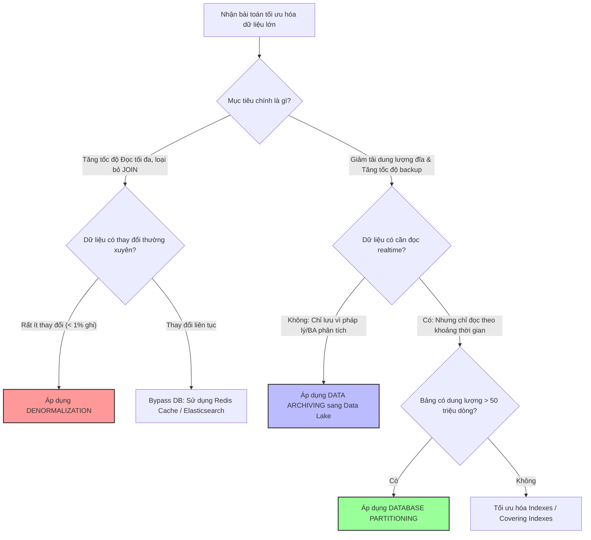

# Khi nào nên partition, archive hoặc denormalize dữ liệu?

## ⚡ Tóm tắt ngắn (30s)
* **Bản chất**: Đây là bài toán cốt lõi của **Thiết kế Mô hình Dữ liệu nâng cao (Advanced Data Modeling)** và **Tối ưu hóa Hệ thống phân tán**. Mỗi giải pháp giải quyết một khía cạnh riêng biệt của mô hình truy cập dữ liệu (Access Pattern): **Partitioning** tối ưu hiệu năng I/O cho bảng khổng lồ bằng cách chia nhỏ vật lý; **Archiving** bảo vệ tài nguyên DB giao dịch (OLTP) bằng cách đẩy dữ liệu lạnh sang kho lưu trữ rẻ; **Denormalization** hy sinh tính toàn vẹn và dung lượng để đổi lấy tốc độ đọc cực hạn, loại bỏ các phép JOIN đắt đỏ.
* **Các thảm họa thực chiến được giải quyết**:
    1. **Thảm họa treo hệ thống do JOIN quá nhiều bảng lớn**: Một API hiển thị Feed bình luận của sản phẩm yêu cầu JOIN 5 bảng: `comments`, `users`, `products`, `user_roles`, `user_badges`. Ở Staging chạy rất mượt, nhưng khi lên Production với hàng triệu user, API mất 3 giây phản hồi, gây treo nghẽn connection pool.
    2. **Thảm họa phình to dung lượng Backup (Database Bloat)**: Database chính chứa 2TB dữ liệu giao dịch trong 5 năm. Mỗi lần backup/restore hệ thống tốn nửa ngày, làm tăng chỉ số phục hồi sự cố RTO (Recovery Time Objective) lên mức nguy hiểm khi có thiên tai hạ tầng.
* **Quyết định Senior**: Áp dụng ma trận quyết định:
    * Dùng **Partition** khi bảng có dung lượng lớn (> 50 triệu dòng) và truy vấn thường xuyên có bộ lọc thời gian rõ rệt.
    * Dùng **Archive** khi dữ liệu ít khi được đọc (như lịch sử thanh toán 2 năm trước) nhưng bắt buộc phải lưu trữ vì lý do pháp lý.
    * Dùng **Denormalize** cho các trang hiển thị tần suất đọc siêu cao (High Read) nhưng dữ liệu gốc rất ít khi thay đổi (Low Write).

---

## 🔍 Chi tiết bản chất thực chiến: Ma trận ra quyết định Kiến trúc

Để xây dựng hệ thống có khả năng chịu tải cao, một Senior Architect cần hiểu sâu sắc ranh giới ứng dụng của từng phương pháp:

### 1. Database Partitioning (Phân vùng)
* **Bản chất**: Chia cắt bảng vật lý dưới đĩa cứng nhưng giữ nguyên giao diện logic ở mức SQL (Trong suốt đối với mã nguồn ứng dụng).
* **Khi nào dùng**:
  * Bảng tăng trưởng nhanh theo thời gian (Audit Logs, Transactions, Sensor Data).
  * Ứng dụng thường xuyên lọc dữ liệu theo thời gian (ví dụ: Chỉ lấy log của tuần này).
  * Cần xóa sạch dữ liệu cũ định kỳ một cách an toàn mà không nghẽn I/O.

### 2. Data Archiving (Lưu trữ lịch sử)
* **Bản chất**: Di chuyển hẳn dữ liệu cũ (lạnh) ra khỏi DB chính sang hạ tầng lưu trữ rẻ hơn (Data Lake, Cloud Storage như S3, BigQuery, ClickHouse).
* **Khi nào dùng**:
  * Dữ liệu hầu như không bao giờ được truy cập bởi người dùng cuối trong luồng nghiệp vụ realtime (ví dụ: Lịch sử đăng nhập từ 3 năm trước).
  * Mục tiêu duy nhất là lưu trữ phục vụ thanh tra (Compliance) hoặc phân tích Big Data.
  * Giúp giữ cho dung lượng DB chính luôn dưới 100-200GB để đảm bảo việc Backup & Restore (DR - Disaster Recovery) diễn ra nhanh chóng.

### 3. Denormalization (Phi chuẩn hóa)
* **Bản chất**: Chấp nhận trùng lặp dữ liệu (Redundancy) ở mức thiết kế bảng để loại bỏ các phép JOIN phức tạp, tối ưu hóa tốc độ đọc.
* **Khi nào dùng**:
  * Tần suất đọc dữ liệu cực lớn, tần suất cập nhật (ghi) cực thấp (ví dụ: Chi tiết sản phẩm, Bình luận công khai).
  * Các câu query đọc yêu cầu JOIN quá nhiều bảng lớn gây sụt giảm nghiêm trọng throughput của DB.
  * *Ví dụ*: Lưu `user_name` và `user_avatar` trực tiếp vào bảng `comments` tại thời điểm tạo comment. Khi lấy danh sách 100 comment, ứng dụng chỉ cần quét duy nhất bảng `comments` mà không cần JOIN với bảng `users`.

---

## 🎨 Sơ đồ trực quan (Ma trận quyết định Kiến trúc lưu trữ nâng cao)



---

## 💻 Code thực chiến / Cấu hình thực tế: BAD vs GOOD

### ❌ BAD: Thiết kế chuẩn hóa cứng nhắc (Normalization) gây JOIN nghẽn cổ chai
Trang chủ hiển thị danh sách 50 bài viết kèm theo tên và ảnh đại diện của tác giả. Thiết kế chuẩn hóa 100% bắt buộc phải JOIN hai bảng lớn chịu tải cao.

* **Thiết kế Schema và câu SQL tồi**:
```sql
-- Bảng posts chuẩn hóa 100% (Chỉ lưu user_id)
CREATE TABLE posts (
    id BIGSERIAL PRIMARY KEY,
    user_id BIGINT,
    title VARCHAR(255),
    content TEXT
);

-- Truy vấn lấy danh sách posts kèm thông tin user (Phải JOIN bảng users khổng lồ)
-- ❌ THẢM HỌA: Chịu tải 10,000 RPS, DB bão hòa CPU do liên tục thực hiện phép toán so khớp JOIN trên RAM
SELECT p.id, p.title, u.display_name, u.avatar_url 
FROM posts p 
JOIN users u ON p.web_user_id = u.id 
ORDER BY p.id DESC 
LIMIT 50;
```

---

### ✅ GOOD: Thiết kế Phi chuẩn hóa thông minh kết hợp đồng bộ bất đồng bộ
Lưu trực tiếp tên và ảnh đại diện tác giả vào bảng `posts` (Phi chuẩn hóa), đồng thời sử dụng cơ chế xử lý bất đồng bộ để cập nhật dữ liệu khi người dùng thay đổi thông tin.

* **Thiết kế Schema tối ưu**:
```sql
-- Bảng posts phi chuẩn hóa (Lưu trực tiếp display_name và avatar_url)
CREATE TABLE posts (
    id BIGSERIAL PRIMARY KEY,
    user_id BIGINT,
    title VARCHAR(255),
    content TEXT,
    -- Các trường phi chuẩn hóa (Denormalized Fields)
    author_name VARCHAR(100),
    author_avatar VARCHAR(255)
);

-- ✅ TRUY VẤN SIÊU TỐC: Chỉ quét 1 bảng duy nhất, không cần JOIN!
SELECT id, title, author_name, author_avatar 
FROM posts 
ORDER BY id DESC 
LIMIT 50;
```

* **Xử lý đồng bộ bất đồng bộ khi User đổi Tên / Ảnh (Event-Driven Update)**:
Khi User thay đổi ảnh đại diện, ta không cập nhật đồng bộ làm nghẽn API của User. Ta bắn một Event sang Kafka và cập nhật dần dưới background.

```java
@Component
public class UserEventHandler {
    @Autowired
    private PostRepository postRepository;

    // ✅ AN TOÀN: Xử lý bất đồng bộ nhận event từ Kafka
    // Chấp nhận Tính nhất quán sau cùng (Eventual Consistency)
    @KafkaListener(topics = "user-profile-changed")
    @Transactional
    public void handleUserProfileChanged(UserProfileChangedEvent event) {
        // Cập nhật dần tên và ảnh đại diện mới vào tất cả các bài viết của user đó theo lô
        // Lệnh cập nhật chạy dưới background, không ảnh hưởng tới API realtime của khách hàng
        postRepository.updateAuthorInfo(
            event.getUserId(), 
            event.getNewDisplayName(), 
            event.getNewAvatarUrl()
        );
    }
}
```

---

## 📊 Bảng so sánh 3 phương pháp tối ưu hóa kiến trúc dữ liệu

| Tiêu chí | Phân vùng bảng (Partitioning) | Lưu trữ lịch sử (Archiving) | Phi chuẩn hóa (Denormalization) |
| :--- | :--- | :--- | :--- |
| **Mục tiêu chính** | Tăng tốc truy vấn theo thời gian, quản lý vòng đời tệp tin đĩa. | Giảm dung lượng DB chính, tối ưu hóa tốc độ backup/restore. | Tăng tốc độ đọc tối đa bằng cách triệt tiêu phép JOIN SQL. |
| **Ảnh hưởng dữ liệu** | Dữ liệu vẫn đầy đủ và nhất quán hoàn toàn (Strong Consistency). | Dữ liệu cũ bị dời đi, không thể truy vấn tức thời bằng SQL chính. | Chấp nhận trùng lặp dữ liệu và **Nhất quán sau cùng (Eventual Consistency)**. |
| **Bảo trì / Vận hành** | Trung bình (Cần script tự động tạo partition mới hàng tháng). | Trung bình (Cần viết job ETL chạy định kỳ hàng tuần/tháng). | **Cao** (Phải viết code xử lý cập nhật dây chuyền khi data gốc thay đổi). |
| **Tác động ghi** | Giúp ghi nhanh hơn (Chỉ ghi vào partition nóng nhỏ). | Giúp ghi nhanh hơn (Bảng chính nhỏ, index gọn). | Làm chậm thao tác ghi ban đầu (Do phải ghi thêm nhiều trường phụ). |

---

## ⚠️ Common Gotchas & Questions follow-up

### 1. Cạm bẫy "Bão cập nhật phi chuẩn hóa" (Update Storm)
* **Vấn đề**: Bạn phi chuẩn hóa trường `product_price` vào bảng `order_items` để khi đọc chi tiết đơn hàng không cần JOIN với bảng `products`. 
* **Hậu quả**: Khi quản trị viên thay đổi giá của một sản phẩm bán chạy, hệ thống bắt buộc phải cập nhật hàng loạt (cascade update) hàng triệu bản ghi trong bảng `order_items` để đồng bộ giá mới, gây ra thảm họa khóa bảng và treo nghẽn DB.
* **Giải pháp**: 
  1. Chỉ phi chuẩn hóa các dữ liệu mang tính **lịch sử cố định** (như giá sản phẩm tại thời điểm mua - giá này không được phép thay đổi theo giá hiện tại của sản phẩm).
  2. Chỉ phi chuẩn hóa các thông tin cực kỳ ít khi thay đổi (như Tên đăng nhập, Giới tính).

### 2. Câu hỏi đào sâu từ interviewer

* **Q1: Làm thế nào bạn đảm bảo dữ liệu phi chuẩn hóa (Denormalized Data) không bị sai lệch vĩnh viễn với dữ liệu gốc nếu tiến trình cập nhật bất đồng bộ qua Kafka/MQ bị lỗi hoặc sập giữa chừng?**
  * *Trả lời*: Đây là rủi ro điển hình của kiến trúc Nhất quán sau cùng (Eventual Consistency). Để bảo vệ an toàn dữ liệu, tôi triển khai cơ chế **Hòa giải dữ liệu định kỳ (Data Reconciliation)**:
    1. **Thiết kế Audit Timestamp**: Trên mỗi bảng phi chuẩn hóa, tôi lưu trữ cột `updated_at` hoặc phiên bản dữ liệu (`version`).
    2. **Chạy Reconciliation Job (Out-of-band Sync)**: Thiết lập một scheduled job (ví dụ: chạy lúc 2h sáng hàng ngày). Job này sẽ quét ngẫu nhiên hoặc quét toàn bộ các bản ghi được cập nhật trong ngày để đối khớp chéo (checksum/diff) giữa bảng gốc (Source of Truth) và bảng phi chuẩn hóa.
    3. **Tự sửa sai (Self-healing)**: Nếu phát hiện bất kỳ sự sai lệch nào (do mất event hoặc consumer crash), job sẽ tự động kích hoạt lệnh sửa dữ liệu (reconcile) để đưa dữ liệu phi chuẩn hóa về trạng thái đúng đắn nhất, đảm bảo sai lệch nếu có chỉ tồn tại tối đa trong vòng 24 giờ.

* **Q2: Khi nào việc Phân vùng bảng (Partitioning) lại trở nên vô hại hoặc thậm chí kéo tụt hiệu năng của DB hơn cả bảng thường?**
  * *Trả lời*: Phân vùng bảng sẽ phản tác dụng trong các kịch bản sau:
    1. **Quét xuyên phân vùng (Cross-partition Queries)**: Khi các câu query thường xuyên lọc theo các cột khác không phải là khóa phân vùng (ví dụ: phân vùng theo ngày nhưng query lọc theo `status = 'ACTIVE'`). DB phải thực hiện quét song song tất cả các phân vùng con, làm tăng overhead xử lý của Query Planner lên gấp nhiều lần.
    2. **Dữ liệu phân vùng quá nhỏ (Over-partitioning)**: Chia nhỏ bảng quá mức (ví dụ: bảng có tổng cộng chỉ 100,000 dòng nhưng lại phân vùng theo từng ngày, tạo ra hàng trăm bảng con tí hon). Chi phí quản lý metadata của hàng trăm bảng con này trong RAM của DB lớn hơn nhiều so với việc quét một bảng thường duy nhất.
    3. **Thiếu index cục bộ (Local Indexes)**: Không thiết lập index thích hợp trên từng phân vùng con.
