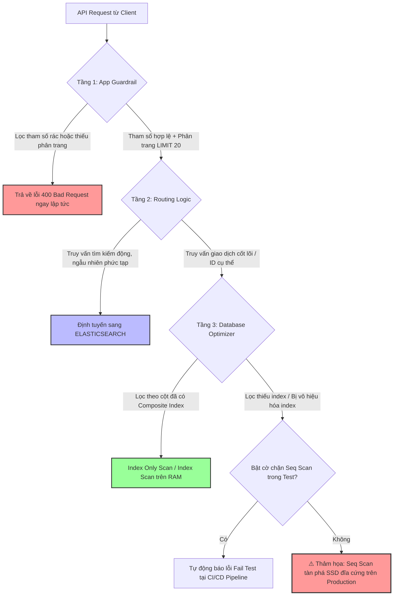

# Làm sao tránh full table scan trong API có traffic cao?

## ⚡ Tóm tắt ngắn (30s)
* **Bản chất**: Quét toàn bảng (Full Table Scan / Seq Scan) nghĩa là Database Engine bắt buộc phải nạp và đọc từng block dữ liệu của toàn bộ bảng từ ổ đĩa (Disk I/O) để tìm kết quả. Đối với API có lưu lượng truy cập cao (High-traffic API), chỉ cần 1-2 request kích hoạt Full Table Scan trên bảng lớn sẽ vắt kiệt hoàn toàn năng lực I/O của SSD và tài nguyên CPU của DB Server, kéo theo sự sập đổ dây chuyền của tất cả các API khác. Do đó, việc phòng chống Full Table Scan là **luật bắt buộc** ở cấp độ Senior.
* **Các thảm họa thực chiến được giải quyết**:
    1. **Thảm họa sập nguồn do tính năng tìm kiếm ngẫu nhiên (Dynamic Search)**: Hệ thống cung cấp bộ lọc tìm kiếm sản phẩm theo nhiều tiêu chí (tên, giá, màu sắc, thương hiệu). Do lập trình viên chỉ tạo index cho cột `name`, khi người dùng lọc theo `color` và `brand`, DB thực hiện quét toàn bộ bảng 20 triệu dòng, đẩy CPU DB lên 100% chỉ sau vài giây chịu tải thật.
    2. **Bẫy query không giới hạn (Unbounded Queries)**: API lấy danh sách bài viết `/api/v1/posts` không được thiết kế phân trang cứng. Khi lượng bài viết tăng lên 100,000, một request gọi API sẽ bắt DB quét toàn bộ bảng và trả về dung lượng JSON khổng lồ, làm nghẽn băng thông mạng và crash bộ nhớ của ứng dụng.
* **Quyết định Senior**: Thiết lập hệ thống phòng ngự đa tầng:
    1. **Tầng Ứng dụng (App Guardrail)**: Bắt buộc phân trang cứng (Hard-coded Pagination Limit, ví dụ: mặc định 20, tối đa 100 bản ghi). Tuyệt đối không cho phép API truy vấn không giới hạn.
    2. **Tầng SQL (Index Strategy)**: Xây dựng Composite Indexes khớp chính xác với bộ lọc tìm kiếm và sử dụng **Covering Index** để đạt hiệu năng `Index Only Scan` (chỉ đọc RAM, không đụng tới đĩa).
    3. **Bypass DB (Tách biệt kiến trúc)**: Đối với các tìm kiếm động, ngẫu nhiên phức tạp, sử dụng **Elasticsearch/OpenSearch** làm engine tìm kiếm chính, đồng bộ dữ liệu realtime từ DB qua cơ chế CDC (Change Data Capture) thay vì truy vấn trực tiếp vào RDBMS.

---

## 🔍 Chi tiết bản chất thực chiến: Hệ thống phòng ngự 3 tầng chống Full Table Scan

Để bảo vệ Database an toàn tuyệt đối trước lưu lượng truy cập lớn, Senior Engineer triển khai các chốt chặn sau:

### 1. Tầng chốt chặn Ứng dụng (Application Safeguards)
* **Bắt buộc phân trang có giới hạn (Hard Limit Pagination)**: Không bao giờ tin tưởng Client truyền lên size trang. Luôn gán cứng giới hạn tối đa trong code backend để bảo vệ DB.
* **Chặn tham số lọc rác (Parameter Validation)**: Kiểm tra các tham số đầu vào. Nếu người dùng tìm kiếm theo chuỗi quá ngắn (nhỏ hơn 3 ký tự) hoặc chuỗi chứa ký tự đại diện ở đầu (`%keyword`), API lập tức từ chối xử lý (trả về lỗi `400 Bad Request`) thay vì ném câu query tồi xuống DB để chạy Seq Scan.

### 2. Tầng tối ưu hóa SQL (Database Optimization)
* **Xây dựng Index bao phủ (Covering Index)**: Thiết kế index chứa đầy đủ các cột xuất hiện ở cả mệnh đề `WHERE`, `JOIN` và `SELECT` để DB đạt trạng thái tối ưu nhất: **Index Only Scan** (lấy ngay dữ liệu trên RAM của cây index mà không cần tốn chi phí Bookmark Lookup đọc đĩa vật lý).
* **Tránh bẫy Selectivity Threshold**: Nếu câu query khớp với hơn 10-20% tổng số dòng của bảng, Query Planner sẽ tự động chuyển từ Index Scan sang Seq Scan (vì quét tuần tự lúc này rẻ hơn). Do đó, code SQL phải luôn đi kèm điều kiện lọc có độ phân hóa cao hoặc giới hạn `LIMIT` nhỏ để ép DB dùng index.

### 3. Tầng Kiến trúc Bypass (Search Engine Offloading)
* RDBMS (MySQL/Postgres) được thiết kế cho các giao dịch ACID (OLTP), hoàn toàn không phù hợp cho việc tìm kiếm động đa tiêu chí ngẫu nhiên.
* Giải pháp chuẩn doanh nghiệp lớn: Đồng bộ dữ liệu qua công cụ CDC (như **Debezium/Kafka**) sang **Elasticsearch**. Mọi API tìm kiếm, lọc sản phẩm sẽ gọi trực tiếp vào Elasticsearch (tốc độ tìm kiếm cực nhanh, hỗ trợ đảo ngược chỉ mục Inverted Index), giải phóng 100% tải đọc tìm kiếm cho Database chính.

---

## 🎨 Sơ đồ trực quan (Kiến trúc phòng ngự đa tầng cho High-Traffic API)



---

## 💻 Code thực chiến / Cấu hình thực tế: BAD vs GOOD

### ❌ BAD: Viết API Controller mở toang cửa cho truy vấn không giới hạn
Lập trình viên cho phép client truyền tham số tùy ý, không giới hạn kích thước trang và viết câu truy vấn thiếu index bao phủ.

* **Code Java Spring Boot tồi**:
```java
@RestController
@RequestMapping("/api/v1/posts")
public class PostController {
    @Autowired
    private PostRepository postRepository;

    // ❌ THẢM HỌA: Nếu client gọi không truyền page/size hoặc truyền size = 1000000
    // DB sẽ thực hiện quét toàn bảng để trả về hàng triệu dòng, sập RAM của ứng dụng.
    @GetMapping("/search")
    public List<Post> searchPosts(@RequestParam(required = false) String keyword,
                                 @RequestParam(defaultValue = "1000") int size) {
        // SQL log: SELECT * FROM posts WHERE title LIKE '%keyword%' LIMIT 1000;
        // ❌ Leading wildcard '%...' vô hiệu hóa hoàn toàn index của cột title, gây Seq Scan!
        return postRepository.findByTitleContaining(keyword, PageRequest.of(0, size));
    }
}
```

---

### ✅ GOOD: Thiết lập bộ lọc tham số, phân trang cứng và phủ index tối ưu
Áp dụng lá chắn kiểm tra dữ liệu đầu vào, ép kích thước trang tối đa, sử dụng phương thức tìm kiếm tiền tố an toàn, và cấu hình chẩn đoán DB.

* **Code Java Spring Boot chuẩn Senior**:
```java
@RestController
@RequestMapping("/api/v1/posts")
public class PostController {
    @Autowired
    private PostService postService;

    @GetMapping("/search")
    public ResponseEntity<List<PostResponse>> searchPosts(
            @RequestParam String keyword,
            @RequestParam(defaultValue = "0") int page,
            @RequestParam(defaultValue = "20") int size) {
        
        // ✅ CHỐT CHẶN 1: Từ chối các từ khóa tìm kiếm quá ngắn gây quét rộng
        if (keyword == null || keyword.trim().length() < 3) {
            return ResponseEntity.badRequest().build();
        }

        // ✅ CHỐT CHẶN 2: Ép kích thước trang tối đa (Hard Limit) để bảo vệ DB
        int safeSize = Math.min(size, 100); 

        List<PostResponse> results = postService.searchByPrefix(keyword.trim(), page, safeSize);
        return ResponseEntity.ok(results);
    }
}
```

* **Code JPA Repository & Thiết kế Index bao phủ**:
```java
public interface PostRepository extends JpaRepository<Post, Long> {
    // ✅ Sử dụng tìm kiếm tiền tố (Prefix Search): keyword% 
    // Giúp RDBMS sử dụng được cây chỉ mục B-Tree (Index Range Scan)
    @Query("SELECT new com.example.dto.PostResponse(p.id, p.title, p.summary) " +
           "FROM Post p WHERE p.title LIKE :keyword% ORDER BY p.id DESC")
    List<PostResponse> findByTitlePrefix(@Param("keyword") String keyword, Pageable pageable);
}

-- ✅ Tạo Covering Index hỗ trợ tuyệt đối cho câu query trên
-- Mệnh đề INCLUDE chứa các trường hiển thị phụ để DB đạt trạng thái Index Only Scan
CREATE INDEX CONCURRENTLY idx_posts_title_covering 
ON posts(title, id DESC) 
INCLUDE(summary);
```

---

## 📊 Bảng so sánh các cấp độ bảo vệ chống Full Table Scan

| Cấp độ bảo vệ | Giải pháp triển khai | Khả năng phòng ngừa | Chi phí vận hành |
| :--- | :--- | :--- | :--- |
| **Tầng Ứng dụng** | Bắt buộc phân trang `LIMIT`, validate tham số đầu vào. | Ngăn chặn các câu query vô hạn, giảm tải truyền tải mạng. | Bằng 0. |
| **Tầng Database** | Tạo Composite/Covering Index, cấu hình statement timeout. | Ép buộc Query Planner sử dụng bộ nhớ đệm RAM thay vì đọc đĩa. | Thấp (Tốn thêm dung lượng lưu trữ file index). |
| **Tầng Kiến trúc** | CDC (Debezium) + Elasticsearch / OpenSearch. | **Tuyệt đối**. Loại bỏ hoàn toàn tải tìm kiếm phức tạp khỏi DB chính. | **Cao** (Cần duy trì cụm máy chủ Elasticsearch và hạ tầng sync). |

---

## ⚠️ Common Gotchas & Questions follow-up

### 1. Cạm bẫy "Cấu hình tắt Seq Scan giả tạo trong Postgres"
* **Vấn đề**: Kỹ sư phát hiện DB chạy Seq Scan, liền cấu hình tham số: `SET enable_seqscan = off;` và thấy DB bắt đầu dùng index. Kỹ sư hí hửng áp dụng cấu hình này lên Production.
* **Thực tế**: Tham số `enable_seqscan = off` không thực sự tắt hoàn toàn Seq Scan. Nó chỉ đơn giản là cộng thêm một lượng chi phí khổng lồ (penalty cost) vào kế hoạch quét Seq Scan để ép Planner ưu tiên chọn Index Scan. Nếu DB hoàn toàn không có index nào phù hợp, nó **vẫn bắt buộc phải chạy Seq Scan** nhưng với chi phí ước tính sai lệch hoàn toàn, làm hỏng toàn bộ logic tối ưu hóa của các query khác.
* **Giải pháp**: Chỉ dùng cấu hình này trên môi trường Test để kiểm thử xem DB có index phù hợp chưa. Nếu tắt seqscan mà DB báo lỗi hoặc chạy cực chậm, nghĩa là code đang bị thiếu index trầm trọng.

### 2. Câu hỏi đào sâu từ interviewer

* **Q1: Làm thế nào bạn cấu hình PostgreSQL tự động ghi nhận (Log) kế hoạch thực thi (Query Plan) chi tiết của tất cả các câu query chạy quá 2 giây trên Production để phục vụ việc săn lùng Full Table Scan?**
  * *Trả lời*: Tôi sử dụng module tích hợp sẵn cực kỳ mạnh mẽ của PostgreSQL là **`auto_explain`**:
    1. **Bật cấu hình trong `postgresql.conf`**:
       ```ini
       # Tải thư viện auto_explain khi khởi động DB
       shared_preload_libraries = 'auto_explain'
       
       # Cấu hình auto_explain tự động ghi nhận slow query
       auto_explain.log_min_duration = 2000 # Ghi nhận các query chạy quá 2000ms (2 giây)
       auto_explain.log_analyze = true      # In ra cả kế hoạch chạy thực tế (actual time)
       auto_explain.log_buffers = true      # In chi tiết số lượng block I/O đọc từ RAM/Disk
       auto_explain.log_nested_statements = true # Ghi nhận cả các câu lệnh chạy trong Function/Trigger
       ```
    2. **Hành động sau đó**: Khi có slow query phát sinh trên Production, hệ thống Log tập trung (như ELK hoặc Datadog Logs) sẽ tự động bắt được tệp tin Log chứa đầy đủ nội dung câu SQL kèm theo vết cấu trúc cây `EXPLAIN ANALYZE` tương ứng. Tôi chỉ cần filter theo từ khóa `Seq Scan` trong log để lập tức phát hiện ra chính xác câu query nào đang tàn phá hệ thống mà không cần phải chạy lại câu lệnh để debug thủ công.

* **Q2: Nếu một bảng thay đổi dữ liệu liên tục (High Write), và bạn bắt buộc phải hỗ trợ tính năng lọc dữ liệu theo hàng chục tiêu chí ngẫu nhiên của BA/Khách hàng, làm sao bạn thiết kế để tránh Full Table Scan mà không làm chậm tốc độ ghi của DB do tạo quá nhiều index?**
  * *Trả lời*: Việc tạo quá nhiều index trên một bảng có tải ghi cao (High Write) là một sai lầm vì mỗi lệnh `INSERT/UPDATE` sẽ bắt DB phải cập nhật đồng thời tất cả các cây chỉ mục, làm sụt giảm nghiêm trọng throughput ghi đĩa. Để giải quyết, tôi thiết kế kiến trúc **CQRS (Command Query Responsibility Segregation)**:
    1. **Tách biệt Đọc/Ghi**: Database chính (RDBMS) chỉ chịu trách nhiệm nhận tải ghi đè giao dịch (Write Path) với số lượng index tối thiểu (chỉ index khóa chính và khóa ngoại).
    2. **Đồng bộ hóa CDC bất đồng bộ (Realtime Data Sync)**: Triển khai công cụ **Debezium** đọc trực tiếp Transaction Log (Write-Ahead Log) của DB chính, đẩy các sự kiện thay đổi dữ liệu vào **Apache Kafka** dưới dạng các thông điệp bất đồng bộ.
    3. **Nạp dữ liệu vào Search Engine**: Một consumer sẽ tiêu thụ dữ liệu từ Kafka và nạp (index) vào cụm **Elasticsearch** (Read Path).
    4. **Định tuyến truy vấn**: Toàn bộ các API tìm kiếm, lọc động đa tiêu chí ngẫu nhiên của khách hàng sẽ được định tuyến 100% sang Elasticsearch. Cách này giúp triệt tiêu hoàn toàn nguy cơ Full Table Scan dưới DB chính, bảo vệ an toàn tuyệt đối cho luồng ghi giao dịch cốt lõi của doanh nghiệp.
