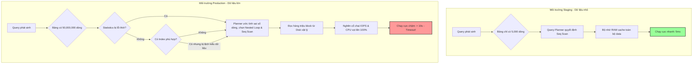

# Một query chạy nhanh ở staging nhưng chậm ở production. Vì sao?

## ⚡ Tóm tắt ngắn (30s)
* **Bản chất**: Sự khác biệt hiệu năng giữa Staging và Production là kết quả của **sự không đồng bộ về môi trường (Environment Asymmetry)**. Điều này bao gồm: Quy mô dữ liệu (Data Volume), Độ phân hóa dữ liệu (Data Cardinality), Độ cập nhật dữ liệu của bộ tối ưu hóa (Stale Optimizer Statistics), Tải đồng thời (Resource Contention), Trạng thái bộ nhớ đệm (Cache State: Cold vs Hot Cache), và các thông số phần cứng/cấu hình DB.
* **Các thảm họa thực chiến được giải quyết**:
    1. **Bẫy "Test Staging chạy vèo vèo, deploy Production sập luôn"**: Câu query `SELECT * FROM users WHERE status = 'ACTIVE' ORDER BY created_at LIMIT 10` chạy mất 5ms ở Staging vì bảng chỉ có 5,000 dòng. Khi lên Production với 100 triệu dòng (99% ở trạng thái `ACTIVE`), Query Planner quyết định thực hiện quét tuần tự toàn bảng (Seq Scan) thay vì dùng index, khiến toàn bộ DB bị treo I/O.
    2. **Thảm họa Statistics lỗi thời (Stale Stats)**: Sau một đợt nhập dữ liệu hàng loạt (bulk import), Database Statistics chưa kịp cập nhật tự động. Query Planner tin rằng bảng chỉ chứa 1,000 dòng nên chọn giải pháp kết hợp `Nested Loop` cực chậm để kết nối 2 bảng lớn thay vì chọn `Hash Join` phù hợp cho hàng triệu dòng.
* **Quyết định Senior**: Để phát hiện và khắc phục, Senior Engineer áp dụng quy trình kiểm tra:
    1. So sánh chi tiết Query Plan của Staging và Production bằng cách kiểm tra số lượng block I/O đọc thực tế (`shared hit` vs `shared read`).
    2. Đồng bộ hóa Database Statistics bằng lệnh `ANALYZE` (Postgres) hoặc `ANALYZE TABLE` (MySQL).
    3. Thực hiện che dấu dữ liệu (Data Masking) để tạo ra môi trường Staging có quy mô và cấu trúc dữ liệu tương tự Production về mặt phân hóa (Cardinality) phục vụ việc kiểm thử chính xác trước khi deploy.

---

## 🔍 Chi tiết bản chất thực chiến

Sự chênh lệch hiệu năng giữa hai môi trường thường xuất phát từ 5 nhóm nguyên nhân cốt lõi sau:

### 1. Quy mô dữ liệu và Độ phân hóa (Data Volume & Cardinality)
* **Quy mô dữ liệu (Volume)**: Thuật toán truy vấn có độ phức tạp lớn hơn $O(1)$ hoặc $O(\log N)$ (ví dụ: $O(N)$ - Full Table Scan, $O(N \log N)$ - Disk Sort, $O(N^2)$ - Nested Loop Join không index) sẽ bộc lộ điểm nghẽn nghiêm trọng khi dữ liệu tăng từ vài ngàn dòng (Staging) lên hàng triệu dòng (Production).
* **Độ phân hóa dữ liệu (Cardinality/Distribution)**: 
  * Nếu cột `gender` có độ phân hóa thấp (chỉ có 2 giá trị `MALE`/`FEMALE`), database sẽ bỏ qua index và quét toàn bảng vì quét tuần tự nhanh hơn.
  * Nếu dữ liệu ở Staging được phân bố đều nhưng ở Production bị lệch nghiêm trọng (ví dụ: 99% dữ liệu thuộc về một `tenant_id` lớn), Query Planner sẽ chọn phương án quét khác nhau tùy thuộc vào tham số lọc của khách hàng cụ thể.

### 2. Số liệu thống kê của Optimizer bị lỗi thời (Stale Statistics)
* Các hệ quản trị cơ sở dữ liệu quan hệ (RDBMS) hoạt động dựa trên bộ tối ưu hóa chi phí (Cost-Based Optimizer - CBO). CBO quyết định cách chạy query dựa trên thông tin lưu trữ trong các bảng hệ thống (ví dụ: tần suất giá trị, số lượng dòng ước tính).
* Nếu ứng dụng vừa cập nhật dữ liệu lớn và DB chưa tự động chạy tiến trình dọn dẹp (`Auto-vacuum` / `Analyze`), thông tin thống kê bị cũ. DB sẽ chọn sai kế hoạch truy vấn (Query Plan).

### 3. Trạng thái bộ nhớ đệm (Hot Cache vs Cold Cache)
* Ở Staging, nhà phát triển thường chạy thử một câu query nhiều lần. Kết quả là toàn bộ các block dữ liệu cần thiết đã được đưa lên RAM (shared buffers/hot cache), tốc độ truy vấn chỉ mất vài mili-giây.
* Ở Production, do lượng dữ liệu quá lớn ghi đè liên tục, dữ liệu của khách hàng đó có thể không nằm trên RAM (cold cache). DB phải thực hiện đọc vật lý từ ổ đĩa (Physical I/O Read), khiến tốc độ chạy giảm đi hàng trăm lần.

### 4. Tranh chấp tài nguyên do tải đồng thời (Resource Contention)
* Ở Staging chỉ có 1-2 lập trình viên test hệ thống tại một thời điểm, tài nguyên CPU, RAM, IOPS gần như trống 100%.
* Ở Production, hệ thống đang chịu hàng ngàn truy vấn cùng lúc. Câu query của bạn phải xếp hàng chờ cấp phát kết nối (Connection Pool waiting), chờ lock ghi dữ liệu (Lock contention) hoặc bị nghẽn do băng thông ổ đĩa (IOPS limit) bị chia sẻ.

### 5. Cấu hình thông số DB khác biệt
* instance DB Staging thường có cấu hình phần cứng nhỏ hơn và các thông số tối ưu bị bỏ qua. 
* Ví dụ: Vùng nhớ sắp xếp `work_mem` ở Staging quá nhỏ làm query phải ghi file tạm ra đĩa, hoặc thông số ước tính chi phí đọc ngẫu nhiên `random_page_cost` đặt quá cao làm DB từ chối dùng index scan.

---

## 🎨 Sơ đồ trực quan (So sánh kế hoạch truy vấn Staging vs Production)



---

## 💻 Code thực chiến / Cấu hình thực tế: BAD vs GOOD

### ❌ BAD: Statistics bị cũ làm DB chọn sai kế hoạch Nested Loop Join cực chậm
Kịch bản: Bảng `orders` vừa nhận thêm 10 triệu dòng dữ liệu. DB chưa cập nhật statistics. Lập trình viên truy vấn kết hợp (Join) với bảng `users` mà không kiểm tra độ cập nhật thống kê.

* **Truy vấn phân tích (Postgres)**:
```sql
-- Chạy truy vấn Join trên Production lúc hệ thống đang chậm
EXPLAIN (ANALYZE, BUFFERS)
SELECT u.name, o.order_no 
FROM users u 
JOIN orders o ON u.id = o.user_id 
WHERE o.status = 'PENDING';

-- KẾT QUẢ GIẢ ĐỊNH TRÊN PRODUCTION BỊ LỖI STATS:
-- -> Nested Loop (cost=0.00..54213.00 rows=10 width=45) (actual time=0.054..8432.120 rows=2500000 loops=1)
--      ❌ SAI LẦM: DB tưởng chỉ có 10 dòng 'PENDING' nên chọn Nested Loop (rất tệ cho bảng lớn)
--      Thực tế trên production có tới 2.5 triệu dòng orders ở trạng thái 'PENDING'.
--      -> Seq Scan on orders o (actual rows=2500000)
--      -> Index Scan on users u (loops=2500000) -- Chạy vòng lặp index 2.5 triệu lần!
--      Buffers: shared read=923420 -- Đọc ổ đĩa khủng khiếp!
```

---

### ✅ GOOD: Cập nhật dữ liệu thống kê để kích hoạt Hash Join tối ưu
Bằng cách phân tích và chủ động cập nhật số liệu thống kê cho Database Optimizer, Planner sẽ tự động chuyển sang giải pháp Hash Join hiệu quả hơn nhiều lần cho tập dữ liệu lớn.

* **Cập nhật lại số liệu thống kê cho bảng**:
```sql
-- Chạy lệnh thu thập lại thông tin phân phối dữ liệu cho bảng
ANALYZE orders;
ANALYZE users;

-- Chạy lại câu lệnh phân tích kế hoạch
EXPLAIN (ANALYZE, BUFFERS)
SELECT u.name, o.order_no 
FROM users u 
JOIN orders o ON u.id = o.user_id 
WHERE o.status = 'PENDING';

-- KẾT QUẢ ĐÃ ĐƯỢC TỐI ƯU:
-- -> Hash Join (cost=45120.00..120540.00 rows=2500000 width=45) (actual time=123.40..542.12 rows=2500000 loops=1)
--      ✅ CẢI TIẾN: DB biết có 2.5 triệu dòng nên dùng Hash Join (quét bảng orders 1 lần, nạp vào RAM hash table, sau đó so khớp với users).
--      -> Seq Scan on orders o (actual rows=2500000)
--      -> Hash (rows=100000)
--          -> Seq Scan on users u
--      Buffers: shared hit=42150 read=1200 -- 95% dữ liệu được đọc trực tiếp từ RAM cache!
```

---

## 📊 Bảng so sánh các biến số giữa Staging và Production

| Tiêu chí | Môi trường Staging | Môi trường Production | Giải pháp thu hẹp khoảng cách |
| :--- | :--- | :--- | :--- |
| **Quy mô dữ liệu** | Nhỏ (Thường < 1% dữ liệu thật). | Khổng lồ (Đầy đủ lịch sử nhiều năm). | Áp dụng kỹ thuật sinh dữ liệu ảo quy mô lớn (Data Synthesis). |
| **Tần suất cập nhật Stats** | Thấp (Ít biến động dữ liệu ghi). | Cực cao (Liên tục ghi đè, ghi mới). | Cấu hình tần suất tự động analyze nhạy bén hơn trên production. |
| **Bộ nhớ đệm (Cache)** | Thường xuyên Hot (Do lập trình viên chạy lặp lại). | Phân tán/Cold (Truy vấn của hàng ngàn khách hàng khác nhau). | Thiết kế bài test tải thực tế với các tham số truy vấn ngẫu nhiên. |
| **Tranh chấp tài nguyên** | Bằng 0 (Chỉ có 1-2 người kiểm thử). | Rất cao (Hàng ngàn kết nối đồng thời). | Chạy Load Test (Kiểm thử hiệu năng) trước khi golive. |
| **Cấu hình DB Tuning** | Mặc định (Default settings). | Tối ưu hóa sâu (`work_mem`, `shared_buffers`). | Đồng bộ các thông số cấu hình mềm liên quan tới logic của Query Planner. |

---

## ⚠️ Common Gotchas & Questions follow-up

### 1. Cạm bẫy "Bỏ quên môi trường Staging câm lặng" (Stale Staging Stats)
* **Vấn đề**: Lập trình viên import dữ liệu rác vào Staging để test tính năng mới, sau đó xóa đi bằng lệnh `DELETE FROM orders`. Tuy nhiên, database không tự động giải phóng dung lượng đĩa và statistics vẫn giữ nguyên trạng thái cũ.
* **Hậu quả**: Khi test query, DB Staging vẫn tin là có hàng triệu dòng dữ liệu nên chọn giải pháp chạy phức tạp (ví dụ: Hash Join), làm sai lệch hoàn toàn hiệu năng đo đếm so với thực tế chỉ có vài dòng.
* **Giải pháp**: Phải định kỳ dọn dẹp vật lý và tái tạo cấu trúc Staging bằng các lệnh dọn dẹp triệt để:
  `VACUUM FULL; ANALYZE;` (Postgres) hoặc `OPTIMIZE TABLE orders;` (MySQL).

### 2. Câu hỏi đào sâu từ interviewer

* **Q1: Làm thế nào bạn xây dựng được môi trường Staging có hiệu năng truy vấn gần nhất với Production mà không vi phạm chính sách bảo mật dữ liệu người dùng (PII/GDPR)?**
  * *Trả lời*: Đây là một thách thức lớn về an toàn thông tin. Để giải quyết, tôi triển khai quy trình **Data Masking & Synthetic Data Generation (Che giấu và Tạo dữ liệu giả lập)**:
    1. **Trích xuất cấu trúc dữ liệu**: Xuất schema và cấu hình index từ Production.
    2. **Che giấu dữ liệu nhạy cảm (Data Masking)**: Đối với các cột nhạy cảm như `phone`, `email`, `credit_card`, `name`, tôi sử dụng các script chạy ngầm để băm (hash), thay thế bằng ký tự ngẫu nhiên hoặc sử dụng thư viện sinh dữ liệu giả (Faker) nhưng **bảo toàn nguyên vẹn độ dài, định dạng kiểu dữ liệu**.
    3. **Bảo toàn phân phối dữ liệu (Distribution & Cardinality)**: Đây là điểm mấu chốt. Script ẩn danh phải đảm bảo tỷ lệ phân bố các giá trị (ví dụ: Tỷ lệ đơn hàng `COMPLETED` vs `CANCELLED`, hoặc tỷ lệ user phân bổ theo khu vực) giống hệt Production để giữ nguyên hành vi của Query Planner.
    4. **Scale dữ liệu**: Dùng các công cụ sinh dữ liệu tự động hoặc lấy 10-20% dữ liệu đã được ẩn danh từ production rồi nhân bản lên theo thuật toán để đạt quy mô tương đương.

* **Q2: Nếu phát hiện câu query chạy chậm trên Production do chọn sai Index đắt đỏ (Index A thay vì Index B tốt hơn), bạn xử lý nóng thế nào ngay lúc đó để khôi phục dịch vụ?**
  * *Trả lời*: 
    1. **Giải pháp xử lý nóng tức thời (Hotfix)**:
       * Với **MySQL**, tôi sẽ sử dụng cú pháp **Index Hints** trực tiếp trong code truy vấn để ép database dùng đúng index: `SELECT * FROM orders FORCE INDEX (idx_orders_user_id) WHERE ...`.
       * Với **PostgreSQL**, mặc định không hỗ trợ Force Index trong SQL thuần để tránh can thiệp thô bạo vào bộ chọn tối ưu. Tuy nhiên, tôi có thể cài đặt và sử dụng extension `pg_hint_plan` nếu hệ thống đã bật sẵn, hoặc sử dụng thủ thuật viết lại câu query (Query Rewrite) để vô hiệu hóa index sai (ví dụ: cộng thêm số 0 hoặc nối chuỗi rỗng vào cột đang bị dùng sai index để DB bắt buộc phải chuyển sang index khác).
    2. **Giải pháp gốc rễ (Long-term)**: Chạy ngay lệnh cập nhật thống kê `ANALYZE` cho bảng đó để Query Planner tự động sửa sai. Nếu index sai kia hoàn toàn vô dụng và luôn gây cản trở, tôi sẽ lên kế hoạch xóa bỏ nó khỏi schema.
