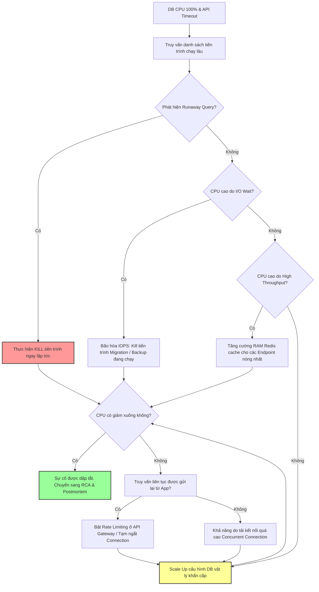

# Database CPU tăng 100%, service bắt đầu timeout. Bạn xử lý gì trước?

## ⚡ Tóm tắt ngắn (30s)
* **Bản chất**: Đây là tình huống **Ứng phó sự cố khẩn cấp (Incident Response)**. Mục tiêu cao nhất và duy nhất lúc này là **"Stop the Bleeding" (Cầm máu - Khôi phục tính sẵn sàng của hệ thống)** chứ không phải ngồi phân tích tìm nguyên nhân gốc rễ (Root Cause Analysis). Một Senior SRE/Engineer sẽ hành động theo quy trình quân đội: Định vị tác nhân gây nghẽn → Cách ly & Tiêu diệt câu truy vấn hủy diệt (Runaway Query) → Giảm tải tạm thời cho DB → Khôi phục dịch vụ → Điều tra Postmortem sau.
* **Các thảm họa thực chiến được giải quyết**:
    1. **Thảm họa nghẽn cổ chai dây chuyền (Cascading Failure)**: DB phản hồi chậm làm các kết nối từ App Server bị giữ lại lâu. Cả hệ thống cạn kiệt Connection Pool. Người dùng không thấy phản hồi liền bấm F5 liên tục tạo ra cơn bão Retry (Retry Storm), khiến DB vốn đã nghẽn lại càng tê liệt hoàn toàn, tự động kích hoạt liveness probe tự sát của các Pod Kubernetes.
    2. **Query báo cáo "hủy diệt" chạy ngầm**: Một nhân viên vận hành hoặc lập trình viên âm thầm chạy một lệnh xuất báo cáo (Export Excel) không phân trang, không dùng index trên bảng 100 triệu dòng ngay giữa giờ cao điểm.
* **Quyết định Senior**:
    1. **5 phút đầu tiên**: Đăng nhập ngay vào DB kiểm tra danh sách tiến trình (`SHOW PROCESSLIST` trên MySQL hoặc `pg_stat_activity` trên Postgres). Định vị ngay các câu query chạy trên 5 giây và tiêu thụ nhiều CPU nhất, lập tức ra lệnh **KILL** không ngần ngại để giải phóng tài nguyên.
    2. **Bảo vệ phòng tuyến**: Bật cờ ngắt kết nối (Rate Limit) ở tầng Gateway, ngắt tạm thời các tác vụ chạy nền (Cron jobs, Kafka consumers, Batch sync) để dành 100% CPU DB phục vụ các luồng Core API (như Thanh toán, Đặt hàng).
    3. **Phòng ngừa lâu dài**: Bắt buộc cấu hình thời gian chạy tối đa của câu lệnh (`statement_timeout` trong Postgres, `max_execution_time` trong MySQL) và tách biệt hoàn toàn luồng đọc báo cáo sang Read Replica.

---

## 🔍 Chi tiết bản chất thực chiến: Quy trình ứng phó sự cố theo mốc thời gian

Khi DB CPU chạm ngưỡng 100% và hệ thống bắt đầu báo lỗi timeout, người chịu trách nhiệm trực sự cố (On-call) cần tuân thủ nghiêm ngặt các bước sau:

### Bước 1: Khảo sát nhanh (0 - 2 phút)
* Kiểm tra nhanh biểu đồ giám sát hạ tầng (Grafana / CloudWatch) để xác định:
  * CPU cao là do **Đọc ổ đĩa nhiều (I/O Wait / Read IOPS)** hay do **Tính toán thuần túy (User CPU / CPU System)**.
  * Lượng connection gọi vào DB có tăng vọt đột biến so với bình thường không.

### Bước 2: Nhận diện và Tiêu diệt câu query gây nghẽn (2 - 5 phút)
* Truy vấn trực tiếp vào bảng quản lý trạng thái hệ thống của DB để tìm các câu lệnh có thời gian chạy lâu vượt mức cho phép.
* Sử dụng lệnh `KILL` hoặc hàm chấm dứt luồng của DB để giải cứu tài nguyên CPU ngay lập tức.

### Bước 3: Giảm tải chủ động từ phía ứng dụng (5 - 15 phút)
* Nếu việc kill query không hiệu quả (do ứng dụng liên tục gửi lại câu query lỗi đó), cần can thiệp từ tầng ứng dụng:
  * **Tắt các Consumer**: Tạm dừng (Pause) các Kafka / RabbitMQ Worker đang đẩy tải xử lý dữ liệu nặng vào DB.
  * **Chặn luồng phụ**: Tắt tạm thời các tính năng tìm kiếm phức tạp, thống kê thời gian thực trên giao diện người dùng (Frontend).
  * **Scale Up DB nóng**: Nếu DB chạy trên môi trường Cloud (AWS RDS, Google Cloud SQL), thực hiện tăng cấu hình CPU/RAM (Vertical Scaling) tức thời (nếu cho phép nâng cấp không downtime).

### Bước 4: Khôi phục và Theo dõi (15 - 30 phút)
* Sau khi CPU hạ xuống mức an toàn (< 50%), mở lại từ từ các luồng tải phụ.
* Giám sát chặt chẽ tỷ lệ lỗi (Error Rate) và thời gian phản hồi (Latency) trên các Dashboard APM.

---

## 🎨 Sơ đồ trực quan (Cây quyết định xử lý sự cố DB CPU 100%)



---

## 💻 Code thực chiến / Cấu hình thực tế: BAD vs GOOD

### ❌ BAD: Lệnh chẩn đoán thủ công mơ hồ và không cấu hình giới hạn an toàn
Lập trình viên loay hoay dùng các công cụ giám sát đồ họa chậm chạp hoặc không cài đặt thuộc tính tự bảo vệ cho DB, khiến câu query lỗi chạy vô hạn.

* **Cấu hình DB tồi (PostgreSQL / MySQL mặc định)**:
```sql
-- Cấu hình mặc định không giới hạn thời gian chạy của câu SQL. 
-- Một câu query lỗi do BA viết có thể chạy hàng giờ, vắt kiệt CPU.
show statement_timeout; -- Kết quả: 0 (Vô hạn)
```

---

### ✅ GOOD: Kịch bản chẩn đoán, Tiêu diệt khẩn cấp và Cấu hình tự vệ chủ động
Senior Engineer sử dụng các tập lệnh SQL tối ưu hóa cao để định vị chính xác và tiêu diệt nhanh chóng, đồng thời cấu hình lá chắn thời gian chạy cho DB.

* **1. Cấu hình thời gian chạy tối đa của câu SQL để tự động ngắt (Lá chắn bảo vệ)**:
```sql
-- Cấu hình trong postgresql.conf (Giới hạn mọi query chạy tối đa 30 giây)
statement_timeout = 30000 -- (30 giây)

-- Hoặc cấu hình trong MySQL (my.cnf)
max_execution_time = 30000 -- (30 giây)
```

* **2. Script chẩn đoán và tiêu diệt trên PostgreSQL**:
```sql
-- Tìm top 5 câu query ACTIVE chạy lâu nhất (loại trừ các tiến trình hệ thống)
SELECT 
    pid, 
    age(clock_timestamp(), query_start) AS duration, 
    usename, 
    client_addr,
    query 
FROM pg_stat_activity 
WHERE state = 'active' 
  AND query NOT LIKE '%pg_stat_activity%'
ORDER BY duration DESC 
LIMIT 5;

-- KILL AN TOÀN (Yêu cầu câu query tự dừng và rollback)
SELECT pg_cancel_backend(12345); -- Thay 12345 bằng PID tìm được

-- KILL CỨNG (Ngắt kết nối mạng của tiến trình ngay lập tức nếu cancel không phản hồi)
SELECT pg_terminate_backend(12345);
```

* **3. Script chẩn đoán và tiêu diệt trên MySQL**:
```sql
-- Xem danh sách các tiến trình đang thực thi chạy lâu hơn 5 giây
SELECT ID, USER, HOST, DB, COMMAND, TIME, STATE, INFO 
FROM information_schema.processlist 
WHERE command != 'Sleep' 
  AND time > 5 
ORDER BY time DESC;

-- TIÊU DIỆT TIẾN TRÌNH GÂY HẠI
KILL 98765; -- Thay 98765 bằng ID tìm được
```

---

## 📊 Bảng so sánh các phương án khôi phục DB CPU 100%

| Tiêu chí | Kill Runaway Query | Bật Rate Limiting / Gateway Drop | scale Up cấu hình DB (Nóng) | Pause Background Workers |
| :--- | :--- | :--- | :--- | :--- |
| **Tốc độ khôi phục** | Cực nhanh (Gần như lập tức sau vài giây). | Nhanh (1-2 phút để cấu hình cấu trúc gateway). | Trung bình (Tốn 5-15 phút để nâng cấp instance). | Nhanh (1-3 phút để scale down Pods/Workers). |
| **Mức độ ảnh hưởng** | Cực thấp (Chỉ ảnh hưởng đúng user chạy câu lệnh lỗi đó). | Cao (Chập chờn hoặc từ chối một số user lành mạnh). | Thấp (Có thể chập chờn kết nối nhẹ lúc đổi instance). | Trung bình (Trễ hạn xử lý dữ liệu nền, queue bị dồn ứ). |
| **Độ phức tạp** | Rất đơn giản (Chỉ cần quyền admin và chạy lệnh SQL). | Trung bình (Cần can thiệp cấu hình Nginx/Kong/Gateway). | Cao (Cần quyền Cloud Admin, tốn chi phí tài chính). | Đơn giản (Chỉ cần scale down Pod replica hoặc stop service). |
| **Hiệu quả lâu dài** | Tạm thời (Lỗi có thể lặp lại nếu code app gọi liên tục). | Tạm thời (Chỉ là giải pháp tình thế giảm tải). | Bền vững (Tăng sức chịu đựng thực tế của DB). | Tạm thời (Chỉ giảm tải phụ để ưu tiên luồng chính). |

---

## ⚠️ Common Gotchas & Questions follow-up

### 1. Cạm bẫy "Hồi sinh câu query tử thần" (Auto-retry Storm)
* **Vấn đề**: Bạn vừa chạy lệnh kill một câu query chạy tồi đang ngốn 100% CPU. Nhưng code ứng dụng backend lại được thiết kế với cơ chế tự động thử lại vô hạn hoặc chu kỳ rất ngắn. 
* **Hậu quả**: Ngay sau khi bạn kill 1 giây, ứng dụng lập tức khởi tạo kết nối mới và gửi lại đúng câu query lỗi đó lên DB. CPU lập tức vọt lên 100% trở lại, khiến việc kill query trở thành một trò chơi "đập chuột" vô tận.
* **Giải pháp**: Phải phối hợp chặt chẽ với team Application để deploy hotfix tắt tính năng gọi API đó, hoặc khóa tạm thời API Route đó ở tầng API Gateway trước khi thực hiện kill query trên DB.

### 2. Câu hỏi đào sâu từ interviewer

* **Q1: Bạn thiết kế kiến trúc phân tách luồng dữ liệu như thế nào để ngăn chặn tuyệt đối việc các câu query báo cáo của nội bộ phá hỏng Database của khách hàng realtime?**
  * *Trả lời*: 
    1. **Tách biệt hoàn toàn vật lý (Read/Write Splitting)**:
       * Database chính (Primary DB) chỉ dành riêng cho các thao tác ghi dữ liệu (`INSERT/UPDATE/DELETE`) và các API đọc realtime có độ trễ cực thấp từ khách hàng.
       * Thiết lập hệ thống **Read Replica (Cơ sở dữ liệu bản sao chỉ đọc)** thông qua cơ chế replication bất đồng bộ. Mọi hoạt động của phòng ban nội bộ (BA, BI, Kế toán), các công cụ phân tích (Metabase, Tableau) và các API xuất báo cáo nặng bắt buộc phải kết nối tới Read Replica.
    2. **Đồng bộ hóa Data Warehouse/Data Lake**: Đối với các báo cáo phân tích sâu xuyên suốt nhiều năm, dữ liệu sẽ được ETL (trích xuất - chuyển đổi - nạp) hàng ngày vào các cơ sở dữ liệu chuyên dụng cho phân tích (OLAP) như BigQuery, Snowflake hoặc ClickHouse thay vì truy vấn trực tiếp vào OLTP database.

* **Q2: Nếu CPU vọt lên 100% do nghẽn cổ chai Khóa dữ liệu (Lock Contention) - các query siêu nhanh (< 1ms) nhưng hàng trăm luồng cùng tranh chấp cập nhật một dòng dữ liệu duy nhất, bạn debug và giải quyết ra sao?**
  * *Trả lời*: 
    1. **Nhận diện**: Chạy câu lệnh kiểm tra lock: `SELECT * FROM pg_locks;` (Postgres) hoặc `SHOW ENGINE INNODB STATUS;` (MySQL) để tìm các trạng thái `Lock Wait` hoặc `trx_active_transactions`.
    2. **Giải pháp ngắn hạn**: Xác định PID của transaction đang giữ khóa gốc (Holder) và thực hiện kill tiến trình đó để giải phóng các luồng đang xếp hàng chờ (Waiters).
    3. **Giải pháp kiến trúc dài hạn**:
       * Sử dụng cơ chế **Optimistic Locking (Khóa lạc quan)** thay vì Pessimistic Locking (Khóa bi quan) để tránh giữ lock lâu trong transaction.
       * Rút ngắn tối đa thời gian thực thi của Transaction: Không bao giờ thực hiện gọi API bên thứ ba (external HTTP call) trong phạm vi của một database transaction đang mở.
       * Gom cụm bản ghi (Batching updates) hoặc sử dụng hàng đợi thông điệp (Queue) để xử lý tuần tự hóa các yêu cầu cập nhật bản ghi nóng, tránh tạo ra xung đột lock đồng thời trực tiếp trên DB.
