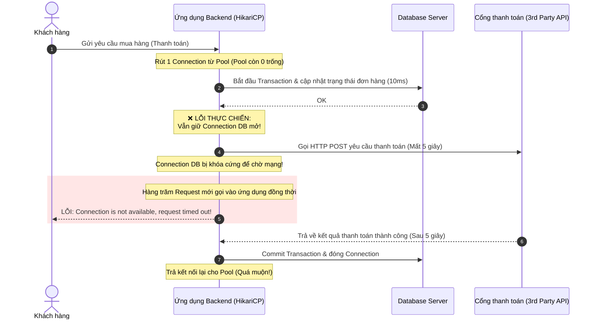

# Connection pool bị exhausted. Nguyên nhân có thể là gì?

## ⚡ Tóm tắt ngắn (30s)
* **Bản chất**: Connection Pool Exhaustion (Cạn kiệt hồ chứa kết nối) xảy ra khi tất cả các kết nối đến Database trong hồ chứa (ví dụ: HikariCP) đều bị chiếm giữ bởi các tiến trình hiện tại, khiến các request mới phải xếp hàng đợi cho đến khi gặp lỗi `ConnectionTimeoutException`. Nguyên nhân sâu xa thường không phải do pool quá nhỏ, mà do ứng dụng **giữ kết nối quá lâu** hoặc **bị rò rỉ kết nối (Connection Leak)**.
* **Các thảm họa thực chiến được giải quyết**:
    1. **Thảm họa treo hệ thống do gọi API ngoài trong Transaction**: Lập trình viên viết hàm thanh toán được đánh dấu `@Transactional`. Trong hàm này, sau khi trừ tiền trong DB, code gọi sang API của cổng thanh toán bên thứ ba (mất 5-10 giây). Kết quả là toàn bộ các kết nối DB bị giữ cứng vô ích để chờ phản hồi mạng, làm sập toàn bộ hệ thống chỉ sau vài phút chạy thật.
    2. **Rò rỉ kết nối âm thầm do không đóng tài nguyên**: Sử dụng JDBC thuần hoặc gọi trực tiếp Connection từ DataSource nhưng quên không đóng kết nối trong khối `finally` khi có ngoại lệ (Exception) xảy ra, làm cạn kiệt pool dần dần sau mỗi lần có lỗi.
* **Quyết định Senior**:
    1. **Bật chẩn đoán tự động**: Cấu hình thuộc tính `leak-detection-threshold` của HikariCP giúp phát hiện và in ra Stack Trace chính xác dòng code nào đang chiếm giữ kết nối quá thời gian quy định mà không trả lại.
    2. **Tách biệt nghiệp vụ**: Tuyệt đối không thực hiện bất kỳ thao tác I/O nào không liên quan đến DB (gửi email, gọi API HTTP, tính toán nặng) trong phạm vi một Transaction đang hoạt động.
    3. **Tuning thông số an toàn**: Đặt `connection-timeout` ngắn (ví dụ: 2-3 giây) thay vì để mặc định 30 giây để giải phóng luồng ứng dụng sớm, tránh lỗi nghẽn cổ chai dây chuyền lên Tomcat.

---

## 🔍 Chi tiết bản chất thực chiến

Connection Pool là xương sống quản lý hiệu năng kết nối của ứng dụng. Khi xảy ra sự cố cạn kiệt, nguyên nhân được chia thành 5 nhóm cốt lõi sau:

### 1. Giữ kết nối để chờ I/O mạng (External I/O Block inside Transaction)
* Đây là lỗi kinh điển nhất của kỹ sư Junior. Khi một phương thức được khai báo `@Transactional` (Spring Boot), một kết nối từ pool sẽ được rút ra và giữ chặt cho đến khi phương thức đó kết thúc hoàn toàn.
* Nếu trong phương thức này chứa các tác vụ gọi mạng (External HTTP Call, Gửi Email, Đọc File lớn), kết nối DB sẽ bị khóa cứng để "chờ đợi" mạng. Chỉ cần một vài request đồng thời gặp độ trễ mạng, toàn bộ kết nối trong pool sẽ bị vắt kiệt.

### 2. Slow Queries làm nghẽn luồng xử lý
* Khi database bị quá tải CPU hoặc thiếu index, các câu query vốn chỉ mất 5ms nay tăng lên thành 5 giây.
* Do thời gian truy vấn kéo dài, tốc độ giải phóng kết nối trả lại pool chậm hơn hàng trăm lần so với tốc độ rút kết nối ra phục vụ request mới. Pool lập tức rơi vào trạng thái cạn kiệt.

### 3. Rò rỉ kết nối (Connection Leak)
* Xảy ra khi lập trình viên tự quản lý kết nối bằng tay (ví dụ: gọi `dataSource.getConnection()`) mà không sử dụng cơ chế tự động giải phóng (`try-with-resources` hoặc đóng trong `finally`).
* Khi có lỗi runtime xảy ra trước dòng code đóng kết nối, connection đó bị bỏ rơi và không bao giờ được trả lại pool.

### 4. Tác động của Open Session in View (OSIV) trong Spring Boot
* Mặc định, Spring Boot bật tính năng `spring.jpa.open-session-in-view = true`.
* Tính năng này giữ kết nối cơ sở dữ liệu mở suốt quá trình render dữ liệu ở tầng View (ngay cả sau khi đã ra khỏi tầng Service). Nếu quá trình render template HTML hoặc chuyển đổi JSON cho API phản hồi chậm, kết nối DB sẽ bị chiếm giữ lâu hơn cần thiết.

### 5. Cấu hình sai lệch kích thước Pool (Mismatched Sizing)
* Kích thước luồng đồng thời của ứng dụng (ví dụ: `server.tomcat.max-threads = 200`) quá lớn so với kích thước pool kết nối (ví dụ: `spring.datasource.hikari.maximum-pool-size = 10`).
* Khi có lượng truy vấn đồng thời lớn, các luồng xếp hàng chờ đợi connection trong pool vượt quá thời gian `connection-timeout` (mặc định 30 giây) sẽ gây ra lỗi hàng loạt.

---

## 🎨 Sơ đồ trực quan (Luồng nghẽn cổ chai gây Connection Pool Exhaustion)



---

## 💻 Code thực chiến / Cấu hình thực tế: BAD vs GOOD

### ❌ BAD: Mở Transaction rộng chứa cả tác vụ gọi mạng bên ngoài
Lập trình viên sử dụng `@Transactional` bao trùm toàn bộ tiến trình, bao gồm cả tác vụ gửi yêu cầu thanh toán qua mạng HTTP.

* **Code Java Spring Boot tồi**:
```java
@Service
public class OrderService {
    @Autowired
    private OrderRepository orderRepository;
    @Autowired
    private PaymentClient paymentClient; // Client gọi REST API ngoài

    // ❌ THẢM HỌA: Connection DB bị rút ra và giữ chặt trong suốt thời gian gọi API ngoài
    @Transactional
    public void processOrder(Long orderId, PaymentRequest request) {
        Order order = orderRepository.findById(orderId)
            .orElseThrow(() -> new ResourceNotFoundException("Order not found"));
        
        order.setStatus(OrderStatus.PROCESSING);
        orderRepository.save(order); // Query chạy mất 5ms
        
        // ❌ NGUY HIỂM: Tác vụ gọi API bên ngoài mất 5000ms. 
        // Kết nối DB bị khóa cứng để chờ phản hồi mạng.
        PaymentResponse response = paymentClient.callThirdPartyPayment(request); 
        
        if (response.isSuccess()) {
            order.setStatus(OrderStatus.COMPLETED);
            orderRepository.save(order);
        }
    }
}
```

---

### ✅ GOOD: Tách biệt Transaction ra khỏi các tác vụ I/O mạng
Tái cấu trúc code bằng cách tách riêng phần thao tác với DB thành các transaction nhỏ, thực hiện tác vụ gọi API mạng ở ngoài phạm vi Transaction để nhả kết nối DB ngay lập tức.

* **Code Java Spring Boot chuẩn Senior**:
```java
@Service
public class OrderService {
    @Autowired
    private OrderManager orderManager; // Chứa các hàm @Transactional nhỏ
    @Autowired
    private PaymentClient paymentClient;

    // ✅ TỐI ƯU: Phương thức này KHÔNG chứa @Transactional, giải phóng DB connection ngay lập tức
    public void processOrder(Long orderId, PaymentRequest request) {
        // 1. Cập nhật trạng thái đơn hàng trong 1 transaction cực ngắn
        orderManager.updateOrderStatus(orderId, OrderStatus.PROCESSING); 
        // -> Kết nối DB được trả lại cho pool ngay sau khi hàm này chạy xong!

        // 2. Gọi API bên thứ ba ngoài transaction (DB Connection hoàn toàn rảnh rỗi)
        PaymentResponse response = paymentClient.callThirdPartyPayment(request);

        // 3. Cập nhật kết quả cuối cùng trong 1 transaction ngắn khác
        if (response.isSuccess()) {
            orderManager.updateOrderStatus(orderId, OrderStatus.COMPLETED);
        } else {
            orderManager.updateOrderStatus(orderId, OrderStatus.FAILED);
        }
    }
}

@Component
class OrderManager {
    @Autowired
    private OrderRepository orderRepository;

    // Transaction chỉ bao bọc đúng thao tác ghi DB
    @Transactional
    public void updateOrderStatus(Long orderId, OrderStatus status) {
        Order order = orderRepository.findById(orderId).orElseThrow();
        order.setStatus(status);
        orderRepository.save(order);
    }
}
```

* **Cấu hình HikariCP bảo vệ an toàn (application.yml)**:
```yaml
spring:
  datasource:
    hikari:
      maximum-pool-size: 30 # Giới hạn số lượng kết nối tối đa
      connection-timeout: 2000 # Chờ tối đa 2 giây để lấy kết nối từ pool, quá hạn báo lỗi ngay
      idle-timeout: 600000 # Giải phóng các kết nối rảnh rỗi sau 10 phút
      max-lifetime: 1800000 # Đóng kết nối cũ sau 30 phút để tránh stale connection
      
      # ✅ CẤU HÌNH QUAN TRỌNG: Phát hiện rò rỉ kết nối tự động
      # Nếu code giữ connection quá 2 giây không trả lại, Hikari sẽ in stack trace chỉ rõ lỗi
      leak-detection-threshold: 2000 
  
  # ✅ TẮT tính năng Open Session In View để giải phóng connection sớm
  jpa:
    open-session-in-view: false
```

---

## 📊 Bảng so sánh các phương án tối ưu Connection Pool

| Tiêu chí | Tách Transaction (Code Rewrite) | Bật Leak Detection (HikariCP) | Tăng tối đa Pool Size | Tắt Open Session in View (OSIV) |
| :--- | :--- | :--- | :--- | :--- |
| **Độ khó thực hiện** | Trung bình (Cần tái cấu trúc code nghiệp vụ). | Rất dễ (Chỉ cần thêm 1 dòng cấu hình). | Rất dễ (Chỉ thay đổi con số). | Dễ (Thay đổi cấu hình yml, cần check kịch bản LazyInit). |
| **Mức độ hiệu quả** | Cao nhất (Giải quyết triệt để vấn đề giữ lock kết nối mạng). | Cao (Giúp lập trình viên định vị nhanh chóng lỗi rò rỉ). | Thấp (Chỉ kéo dài thời gian sập, không giải quyết gốc rễ). | Cao (Giảm đáng kể thời gian chiếm dụng connection). |
| **Rủi ro đi kèm** | Cần kiểm tra kỹ logic rollback nếu có lỗi xảy ra. | Không có rủi ro (Chỉ sinh thêm log chẩn đoán). | **Cực cao**: Gây quá tải CPU/RAM cho DB do có quá nhiều luồng ghi đĩa. | Có thể gặp lỗi `LazyInitializationException` nếu code viết ẩu. |

---

## ⚠️ Common Gotchas & Questions follow-up

### 1. Cạm bẫy "Càng tăng pool size càng sập nhanh"
* **Sai lầm**: Khi gặp lỗi `Connection is not available`, kỹ sư thường có xu hướng tăng `maximum-pool-size` từ 30 lên 300 với suy nghĩ "càng nhiều kết nối càng tốt".
* **Thực tế**: Mỗi kết nối tạo ra tương đương với một tiến trình/luồng chạy trực tiếp trên Database. Nếu phần cứng DB chỉ có 8 Core CPU, việc duy trì 300 kết nối đồng thời sẽ gây ra hiện tượng **tranh chấp ngữ cảnh (Context Switching)** khủng khiếp. DB sẽ dành toàn bộ thời gian CPU chỉ để quản lý luồng thay vì xử lý dữ liệu, làm giảm throughput và sập toàn bộ hệ thống nhanh hơn.
* **Giải pháp**: Giữ pool size ở mức tối ưu và tập trung tối ưu hóa thời gian chạy của query.

### 2. Câu hỏi đào sâu từ interviewer

* **Q1: Làm sao bạn tính toán được kích thước tối ưu (Optimal Pool Size) cho ứng dụng của mình?**
  * *Trả lời*: 
    1. Tôi dựa trên công thức thực nghiệm chuẩn được khuyến nghị bởi đội ngũ phát triển PostgreSQL và HikariCP:
       $$\text{Pool Size} = (\text{Core CPU của DB} \times 2) + \text{Số lượng ổ đĩa vật lý (Effective Spindle Count)}$$
    2. Ví dụ, nếu DB server có 8 Cores CPU và 1 ổ đĩa SSD cứng, kích thước pool tối ưu ban đầu sẽ là: $(8 \times 2) + 1 = 17$. Chúng ta có thể làm tròn lên khoảng 20-30 kết nối.
    3. Lý do là vì ngay cả khi luồng ứng dụng bị chặn (blocking) chờ đọc dữ liệu từ ổ đĩa (I/O block), CPU vẫn có thể phục vụ luồng khác. Công thức này giúp tối ưu hóa tối đa hiệu suất xử lý song song của CPU mà không bị lãng phí tài nguyên do Context Switching.
    4. Để có con số chính xác nhất, tôi sẽ tiến hành chạy thử nghiệm Load Test trên môi trường Staging với các kích thước pool khác nhau (10, 20, 50, 100) và đo lường **Throughput (TPS)** và **Latency** để tìm ra điểm cân bằng tối ưu.

* **Q2: Trong kiến trúc Microservices với 50 instance ứng dụng cùng kết nối vào 1 Database, nếu mỗi instance cấu hình max-pool-size = 30, tổng số kết nối sẽ đạt 1500, vượt quá khả năng chịu đựng của DB. Bạn giải quyết bài toán này thế nào?**
  * *Trả lời*: Đây là bài toán điển hình ở quy mô lớn. Tôi sẽ triển khai các giải pháp phối hợp:
    1. **Tối ưu pool size ở client**: Hạ thấp pool size của mỗi instance xuống mức tối thiểu (ví dụ: chỉ để 5-10 kết nối/instance). Thực tế, một instance web không chạy quá nhiều query đồng thời cùng một mili-giây.
    2. **Sử dụng Database Proxy (Connection Pooler trung gian)**:
       * Với **PostgreSQL**, tôi sẽ triển khai **PgBouncer** ở tầng giữa ứng dụng và DB. PgBouncer hỗ trợ cơ chế `Transaction Pooling` - tức là nó chỉ gán kết nối thực sự đến DB trong khoảng thời gian một transaction chạy, sau khi transaction kết thúc, kết nối được thu hồi để phục vụ instance khác ngay lập tức, giúp hỗ trợ hàng chục ngàn kết nối client chỉ với khoảng 100 kết nối thực tới DB.
       * Với **MySQL**, tôi sẽ sử dụng **ProxySQL** để làm nhiệm vụ tương tự, kết hợp phân luồng đọc/ghi chủ động.
