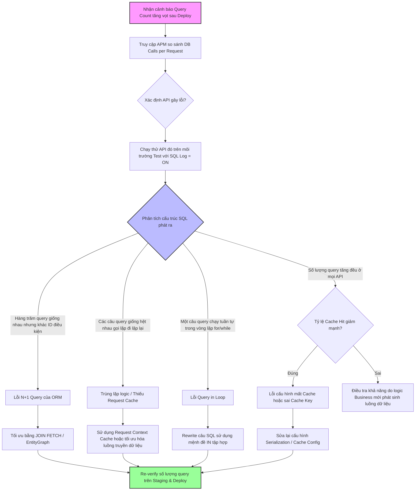

# Một release mới gây tăng số lượng query lên rất nhiều. Bạn tìm nguyên nhân thế nào?

## ⚡ Tóm tắt ngắn (30s)
* **Bản chất**: Hiện tượng bùng nổ số lượng query (Query Count Spike) sau khi deploy phiên bản mới là lỗi logic nghiêm trọng ở tầng ứng dụng (App-level), thường liên quan đến cách thức giao tiếp giữa mã nguồn và DB thông qua các bộ chuyển đổi đối tượng ORM (như Hibernate, Entity Framework). Nhiệm vụ của một Senior Engineer là nhanh chóng so sánh độ lệch hiệu năng trước-sau (Diffing metrics) thông qua APM, định vị cơ chế sinh query tự động và vá lỗi logic tận gốc.
* **Các thảm họa thực chiến được giải quyết**:
    1. **Thảm họa N+1 lãng quên làm sập DB**: Trong bản release mới, tính năng hiển thị danh sách 100 sản phẩm được bổ sung thêm thông tin tên nhà phân phối. Do quan hệ được thiết lập ở chế độ Lazy Loading, ứng dụng thực hiện 1 query lấy 100 sản phẩm, sau đó chạy vòng lặp lôi ra 100 query phụ để lấy thông tin 100 nhà phân phối (Tổng cộng 101 câu query cho 1 request). DB bão hòa connection và sập ngay lập tức khi chịu tải thật.
    2. **Bẫy vô hiệu hóa Cache âm thầm**: Cập nhật thư viện hoặc refactor code làm thay đổi chữ ký khóa (Cache Key Signature), khiến ứng dụng bypass hoàn toàn bộ nhớ đệm Redis và ném 100% traffic trực tiếp xuống DB.
* **Quyết định Senior**:
    1. **Cô lập nhanh**: Sử dụng APM (Datadog, New Relic) phân tích biểu đồ Trace để xem số lượng truy vấn trung bình trên mỗi HTTP Request (Queries per Request) tăng từ bao nhiêu lên bao nhiêu.
    2. **Phát hiện N+1 & Trùng lặp**: Bật tính năng đo đếm thống kê của Hibernate (`generate_statistics`) trên môi trường staging để đếm chính xác số lượng SQL thực thi.
    3. **Tối ưu hóa**: Sửa lỗi N+1 bằng cơ chế `JOIN FETCH` hoặc `@EntityGraph`. Tận dụng giải pháp Batch Fetching (`default_batch_fetch_size`) làm lưới bảo hiểm bảo vệ DB khỏi các lỗi N+1 vô tình phát sinh trong tương lai.

---

## 🔍 Chi tiết bản chất thực chiến: Quy trình chẩn đoán lỗi bùng nổ query

Khi nhận cảnh báo số lượng query vào DB tăng đột biến (ví dụ: gấp 5-10 lần bình thường) ngay sau đợt release, quy trình chẩn đoán được tiến hành như sau:

### 1. Phân tích độ lệch qua APM (Metrics Diffing)
* Đăng nhập vào dashboard APM, so sánh các chỉ số giữa phiên bản mới (New Release) và phiên bản cũ (Old Release):
  * **Database Call Count**: Số lượng cuộc gọi DB trên mỗi giây (throughput).
  * **Database Calls per Transaction**: Số lượng câu query thực thi trung bình trên mỗi luồng request (API).
* Định vị chính xác API nào đang có lượng query tăng vọt (ví dụ: `/api/v1/orders` bình thường chạy 3 query, nay vọt lên 150 query).

### 2. Tái hiện lỗi trên Staging và Phân tích Log
* Lấy câu lệnh HTTP Request của API bị lỗi chạy thử trên môi trường Staging (hoặc Local) và bật log SQL chi tiết:
  * Kiểm tra xem các câu query phát ra có bị lặp đi lặp lại một cấu trúc dạng: `SELECT ... FROM vendor WHERE id = ?` với các ID khác nhau không (Triệu chứng kinh điển của lỗi N+1).
  * Kiểm tra xem các câu query giống hệt nhau có bị gọi lặp lại trong cùng một request không (Triệu chứng của việc thiếu Request-scoped Cache / Context Cache).

### 3. Nguyên nhân gốc rễ phổ biến và cách giải quyết

#### A. Lỗi N+1 Query do Lazy Loading của ORM
* **Nguyên nhân**: Khi thực hiện quan hệ `@ManyToOne` hoặc `@OneToMany` được định nghĩa mặc định là `FetchType.LAZY`. Khi code duyệt qua danh sách cha để gọi thuộc tính con, ORM sẽ tự động kích hoạt truy vấn lấy con cho từng dòng cha.
* **Giải pháp**: Sử dụng `JOIN FETCH` trong câu truy vấn JPQL/HQL hoặc định nghĩa `@EntityGraph` để nạp dữ liệu con ngay trong 1 câu SQL duy nhất.

#### B. Viết query trong vòng lặp (Query in Loop)
* **Nguyên nhân**: Viết code nghiệp vụ duyệt qua một danh sách dữ liệu đầu vào và gọi DB để kiểm tra/cập nhật từng phần tử.
  ```java
  for (String username : usernameList) {
      userRepository.findByUsername(username); // ❌ 100 usernames = 100 queries!
  }
  ```
* **Giải pháp**: Gom nhóm dữ liệu đầu vào và sử dụng truy vấn tập hợp với từ khóa `IN`:
  ```java
  userRepository.findByUsernameIn(usernameList); // ✅ 1 câu SQL duy nhất!
  ```

#### C. Lỗi cấu hình làm mất Cache (Cache Eviction / Mismatch)
* **Nguyên nhân**: Refactor code cấu hình Cache hoặc cập nhật đối tượng DTO làm phương thức `@Cacheable` không nhận diện được key, hoặc đối tượng lưu trữ không thể tuần tự hóa (Serialization failure), dẫn đến ứng dụng âm thầm bỏ qua cache và truy cập DB trực tiếp.
* **Giải pháp**: Kiểm tra chỉ số Cache Hit/Miss Ratio trên Redis.

---

## 🎨 Sơ đồ trực quan (Luồng chẩn đoán và khắc phục bùng nổ query)



---

## 💻 Code thực chiến / Cấu hình thực tế: BAD vs GOOD

### ❌ BAD: Lỗi N+1 kinh điển làm bùng nổ 101 câu query cho 1 request
Lập trình viên lấy danh sách đơn hàng và lặp qua để lấy thông tin khách hàng sở hữu đơn hàng đó bằng cơ chế Lazy Loading mặc định.

* **Code Entity & Service tồi**:
```java
@Entity
public class Order {
    @Id
    @GeneratedValue
    private Long id;
    
    // Mặc định @ManyToOne là EAGER nhưng lập trình viên chuyển sang LAZY để tối ưu
    // Nhưng lại viết code nghiệp vụ lặp qua đối tượng này
    @ManyToOne(fetch = FetchType.LAZY)
    @JoinColumn(name = "user_id")
    private User user;
}

@Service
public class OrderService {
    @Autowired
    private OrderRepository orderRepository;

    @Transactional(readOnly = true)
    public List<OrderResponse> getRecentOrders() {
        // ❌ Câu query 1: Lấy 100 đơn hàng đầu tiên
        List<Order> orders = orderRepository.findTop100ByOrderByIdDesc();
        
        List<OrderResponse> responses = new ArrayList<>();
        for (Order order : orders) {
            // ❌ THẢM HỌA: Với mỗi vòng lặp, Hibernate âm thầm phát ra 1 câu query 
            // để lấy tên của User: SELECT ... FROM users WHERE id = ?
            // Tổng số query phát ra: 1 + 100 = 101 câu SQL!
            String userName = order.getUser().getName(); 
            responses.add(new OrderResponse(order.getId(), userName));
        }
        return responses;
    }
}
```

---

### ✅ GOOD: Sử dụng Join Fetch và Kích hoạt thống kê để phát hiện sớm
Sử dụng giải pháp truy vấn `JOIN FETCH` để nạp toàn bộ thông tin User chỉ trong 1 câu SQL duy nhất, đồng thời cấu hình bộ đếm giám sát.

* **Code tối ưu chuẩn Senior**:
```java
public interface OrderRepository extends JpaRepository<Order, Long> {
    // ✅ GIẢI PHÁP 1: Sử dụng JOIN FETCH trong JPQL truy vấn duy nhất 1 lần
    @Query("SELECT o FROM Order o JOIN FETCH o.user ORDER BY o.id DESC")
    List<Order> findTop100WithUser();

    // ✅ GIẢI PHÁP 2: Sử dụng EntityGraph của Spring Data JPA
    @EntityGraph(attributePaths = {"user"})
    List<Order> findTop100ByOrderByIdDesc();
}

@Service
public class OrderService {
    @Autowired
    private OrderRepository orderRepository;

    @Transactional(readOnly = true)
    public List<OrderResponse> getRecentOrders() {
        // ✅ Chỉ phát ra duy nhất 1 câu lệnh SQL JOIN
        List<Order> orders = orderRepository.findTop100WithUser(); 
        
        return orders.stream()
            .map(o -> new OrderResponse(o.getId(), o.getUser().getName()))
            .collect(Collectors.toList());
    }
}
```

* **Cấu hình chẩn đoán và Lưới bảo hiểm (application.properties)**:
```properties
# 1. Bật thống kê hiệu năng của Hibernate trên Staging để phát hiện N+1
spring.jpa.properties.hibernate.generate_statistics=true
# Log kết quả đầu ra dạng: "HH000117: HSQL Session Metrics: 1 JDBC statements executed..."

# 2. BẬT LƯỚI BẢO HIỂM: Batch Fetching
# Nếu có lỡ quên viết Join Fetch ở chỗ khác, Hibernate sẽ gom nhóm 50 dòng cha 
# để truy vấn con bằng cú pháp IN (...) thay vì chạy từng dòng đơn lẻ.
# Giảm thiểu lỗi N+1 từ 101 query xuống còn 3 query!
spring.jpa.properties.hibernate.default_batch_fetch_size=50
```

---

## 📊 Bảng so sánh các nguyên nhân gây bùng nổ query

| Tiêu chí | Lỗi N+1 Query (ORM) | Truy vấn trong vòng lặp | Mất Cache ứng dụng | Trùng lặp query trong 1 Request |
| :--- | :--- | :--- | :--- | :--- |
| **Dấu hiệu nhận biết** | Các query giống nhau, khác ID tham số, xen kẽ nhau. | Các query SELECT chạy tuần tự trong cấu trúc lặp. | Số lượng query tăng đều, CPU database tăng ổn định. | Các query giống hệt nhau (cùng ID) gọi liên tiếp trong 1 log request. |
| **Cách phát hiện** | Hibernate statistics, APM trace graph. | Review code tĩnh (Static Analysis), logs. | Chỉ số Cache Hit Ratio của Redis giảm về 0%. | Sử dụng `datasource-proxy` để kiểm tra độ trùng lặp. |
| **Giải pháp triệt để** | Sử dụng `JOIN FETCH` hoặc `@EntityGraph`. | Viết lại câu SQL sử dụng mệnh đề `IN` tập hợp. | Vá lỗi cấu hình Key/Serialization của thư viện Cache. | Sử dụng Request Context (như `@RequestScope` bean). |

---

## ⚠️ Common Gotchas & Questions follow-up

### 1. Cạm bẫy "Batch Fetching không phải là viên đạn bạc"
* **Vấn đề**: Khi phát hiện lỗi N+1, kỹ sư cấu hình `default_batch_fetch_size = 100` và coi đó là giải pháp giải quyết mọi lỗi N+1 trên toàn hệ thống.
* **Thực tế**: Batch Fetching chỉ là **lưới bảo hiểm giảm thiểu thiệt hại** (giảm số lượng query từ $N+1$ xuống còn $\frac{N}{\text{batch\_size}} + 1$). Nó vẫn phát ra nhiều hơn 1 câu SQL và vẫn thực hiện quét DB nhiều lần. Đối với các trang danh mục sản phẩm cốt lõi chịu tải lớn, bắt buộc phải dùng `JOIN FETCH` để tối ưu tuyệt đối về 1 câu truy vấn duy nhất.

### 2. Câu hỏi đào sâu từ interviewer

* **Q1: Làm thế nào bạn tự động hóa việc phát hiện và ngăn chặn triệt để lỗi N+1 lọt lên Production ngay trong chu trình CI/CD (Pipeline)?**
  * *Trả lời*: Tôi không muốn đợi đến khi code lên production mới phát hiện lỗi. Tôi triển khai tự động hóa kiểm soát số lượng truy vấn ngay tại tầng **Integration Test**:
    1. **Sử dụng thư viện kiểm thử chuyên dụng**: Tôi tích hợp thư viện **QuickPerf** (dành cho Java) vào các bài kiểm thử tích hợp (JUnit).
    2. **Định nghĩa ràng buộc số lượng câu lệnh**: Ở các hàm test API quan trọng, tôi khai báo annotation giới hạn số lượng SQL được phép chạy:
       ```java
       @Test
       @QuickPerfRequireSelect(max = 1) // Kiểm tra nếu phát ra nhiều hơn 1 query SELECT sẽ tự động FAIL bài test
       public void testGetRecentOrders() {
           orderService.getRecentOrders();
       }
       ```
    3. **Tích hợp CI/CD**: Khi lập trình viên tạo Pull Request, hệ thống CI (GitHub Actions/GitLab CI) sẽ chạy bộ test này. Nếu có bất kỳ lỗi N+1 nào vô tình được đưa vào làm tăng số lượng query vượt ngưỡng, bài test sẽ fail ngay lập tức, chặn không cho merge code lên nhánh chính.

* **Q2: Nếu hệ thống đã lọt lỗi bùng nổ query lên production, và bạn không thể rollback ngay lập tức vì bản release đó đi kèm với một đợt thay đổi lớn về cấu trúc database (không thể đảo ngược schema), bạn xử lý ứng biến thế nào?**
  * *Trả lời*: Trong kịch bản ngặt nghèo này, tôi sẽ triển khai các phòng tuyến ứng biến nóng:
    1. **Bật nóng Batch Fetching**: Tôi thực hiện cấu hình nóng thông số `hibernate.default_batch_fetch_size=100` qua cấu hình Config Server (hoặc restart dịch vụ với tham số Java System Property) mà không cần build lại code để lập tức giảm số lượng query xuống 50-100 lần.
    2. **Bật bộ đệm tạm thời (Query Cache/Database Cache)**: Nếu DB hỗ trợ (như Query Cache của MySQL hoặc ProxySQL), tôi sẽ cấu hình bật bộ đệm kết quả truy vấn ở tầng trung gian để trả về ngay kết quả cho các query trùng lặp mà không bắt DB phải thực thi lại.
    3. **Bật giới hạn Rate Limiting khẩn cấp**: Giới hạn tần suất gọi của API lỗi đó tại tầng Gateway để bảo vệ DB không bị sập hoàn toàn trong thời gian đội phát triển viết code sửa lỗi và thực hiện hotfix.
