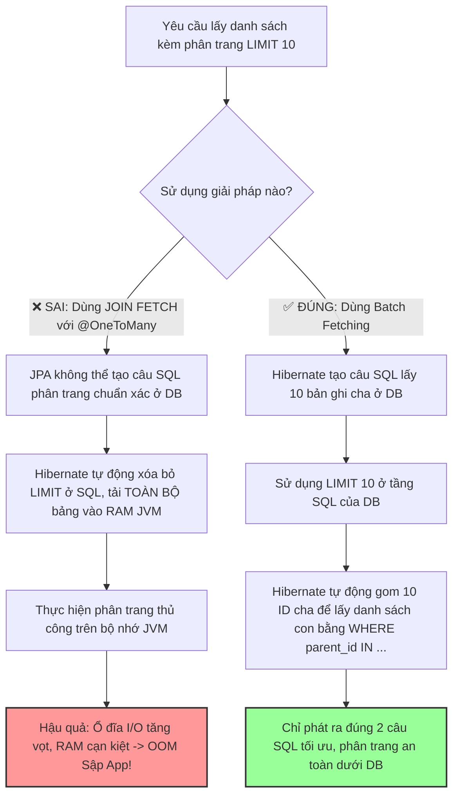

# N+1 query lọt lên production, bạn phát hiện và xử lý ra sao?

## ⚡ Tóm tắt ngắn (30s)
* **Bản chất**: Lỗi N+1 query xảy ra khi ứng dụng sử dụng các bộ chuyển đổi đối tượng ORM (như Hibernate, JPA) để nạp một danh sách gồm $N$ thực thể cha, sau đó với mỗi thực thể cha, nó lại âm thầm thực hiện thêm 1 câu truy vấn phụ để nạp thực thể con liên kết ở chế độ Lazy Loading. Kết quả là hệ thống phát ra tổng cộng $N+1$ câu query thay vì $1$ câu duy nhất.
* **Các thảm họa thực chiến được giải quyết**:
    1. **Thảm họa OOM memory do phân trang sai cách trên RAM**: Để sửa lỗi N+1, lập trình viên sử dụng `JOIN FETCH` kết hợp với phân trang Spring Data: `Pageable pageable = PageRequest.of(0, 10)`. Hibernate không thể thực hiện phân trang SQL ở mức DB do tích Đề-các của phép JOIN, nó tự động **tải toàn bộ hàng triệu dòng dữ liệu vào RAM JVM** để tự phân trang bằng Java. Hệ thống sập ngay lập tức vì lỗi OutOfMemoryError.
    2. **Lỗi sập hiệu năng dây chuyền (Database Connection Starvation)**: Khi trang danh sách người dùng được hiển thị, 100 request đồng thời kéo theo mỗi request chạy 101 câu query, đẩy tổng số query lên 10,100 câu chỉ trong 1 giây, vắt kiệt connection pool của DB.
* **Quyết định Senior**:
    1. **Phát hiện trên Production**: Sử dụng APM (Datadog/New Relic) để quét cấu trúc vết (Trace View). Nếu thấy mô hình răng cưa hoặc hàng loạt thanh SELECT giống hệt nhau xếp chồng tuần tự, đó chắc chắn là N+1.
    2. **Xử lý triệt để**: Sử dụng `JOIN FETCH` hoặc `@EntityGraph` cho các truy vấn không phân trang. Đối với các câu truy vấn cần phân trang, **tuyệt đối không dùng JOIN FETCH cho quan hệ một-nhiều (@OneToMany)**, thay vào đó hãy sử dụng giải pháp **Batch Fetching (`default_batch_fetch_size`)** để DB phân trang an toàn dưới SQL.
    3. **Tối ưu hóa RAM**: Sử dụng **DTO Projection** thay vì nạp toàn bộ thực thể JPA khi chỉ cần hiển thị dữ liệu chỉ đọc.

---

## 🔍 Chi tiết bản chất thực chiến

Lỗi N+1 là một "sát thủ thầm lặng" vì nó thường chạy rất nhanh ở môi trường phát triển (Local) với dữ liệu nhỏ, nhưng lại tàn phá hệ thống khi lên Production.

### 1. Cách phát hiện N+1 chuyên nghiệp ở các môi trường

#### A. Trên Production (Môi trường vận hành)
* **Phân tích Trace Breakdown**: Trong APM, khi bấm vào một request bị chậm, bạn sẽ nhìn thấy hàng trăm câu SQL giống nhau được thực thi tuần tự (Sequential execution). 
* **Database Query Logs**: Hệ thống giám sát DB cảnh báo tần suất gọi (throughput) của các câu query đơn giản tăng vọt bất thường theo cấp số nhân so với số lượng API request.

#### B. Trên Staging / UAT (Môi trường kiểm thử)
* Sử dụng cấu hình `generate_statistics` của Hibernate để ghi nhận số lượng JDBC statements thực thi trên mỗi session.
* Tích hợp công cụ chặn lỗi tự động như **QuickPerf** hoặc viết một Spring `HandlerInterceptor` kết hợp với `datasource-proxy` để kiểm tra: Nếu số lượng câu query SELECT vượt quá một ngưỡng an toàn (ví dụ: > 5) trên một HTTP request, hệ thống sẽ tự động ghi log cảnh báo mức SEVERE.

---

## 🎨 Sơ đồ trực quan (Giải quyết bẫy Phân trang kết hợp Join Fetch)



---

## 💻 Code thực chiến / Cấu hình thực tế: BAD vs GOOD

### ❌ BAD: Dùng `JOIN FETCH` sai cách với phân trang gây sập OOM ứng dụng
Lập trình viên cố gắng sửa lỗi N+1 của quan hệ Một-Nhiều (`@OneToMany`) bằng cách dùng `JOIN FETCH` kết hợp phân trang, dẫn đến việc Hibernate kéo toàn bộ bảng vào RAM để xử lý.

* **Code JPA Repository & Service tồi**:
```java
public interface AuthorRepository extends JpaRepository<Author, Long> {
    // ❌ SAI LẦM CHẾT NGƯỜI: Dùng JOIN FETCH cho quan hệ Collection (@OneToMany) kèm Phân trang Pageable
    // Hibernate sẽ log cảnh báo: "HH000104: firstResult/maxResults specified with collection fetch; applying in memory!"
    @Query("SELECT a FROM Author a LEFT JOIN FETCH a.books")
    Page<Author> findAllAuthorsWithBooks(Pageable pageable);
}

@Service
public class AuthorService {
    @Autowired
    private AuthorRepository authorRepository;

    public Page<AuthorResponse> getAuthorsPage(int page, int size) {
        // Nếu DB có 1 triệu dòng Author, Hibernate sẽ tải TOÀN BỘ 1 triệu dòng vào RAM JVM!
        Page<Author> authors = authorRepository.findAllAuthorsWithBooks(PageRequest.of(page, size));
        
        return authors.map(a -> new AuthorResponse(a.getName(), a.getBooks()));
    }
}
```

---

### ✅ GOOD: Sử dụng Batch Fetching kết hợp phân trang an toàn ở cấp độ Database
Cấu hình Hibernate nạp dữ liệu liên kết theo lô (Batch) để vừa giải quyết lỗi N+1, vừa đảm bảo câu lệnh phân trang `LIMIT / OFFSET` được thực thi trực tiếp dưới SQL Database.

* **Cấu hình an toàn và code JPA tối ưu**:
```properties
# file: application.properties
# ✅ GIẢI PHÁP VÀNG: Gom nhóm nạp dữ liệu liên kết theo lô
# Khi ứng dụng gọi getBooks() trong vòng lặp phân trang, Hibernate sẽ gom 50 ID tác giả 
# và chạy duy nhất 1 câu truy vấn IN: SELECT * FROM books WHERE author_id IN (1, 2, ..., 50)
spring.jpa.properties.hibernate.default_batch_fetch_size=50
```

* **Code JPA Repository & Service chuẩn Senior**:
```java
public interface AuthorRepository extends JpaRepository<Author, Long> {
    // ✅ GIẢI PHÁP ĐÚNG: Không dùng JOIN FETCH ở đây để DB phân trang an toàn dưới SQL
    Page<Author> findAll(Pageable pageable);
}

@Service
public class AuthorService {
    @Autowired
    private AuthorRepository authorRepository;

    @Transactional(readOnly = true)
    public Page<AuthorResponse> getAuthorsPage(int page, int size) {
        // 1. DB chạy câu SQL phân trang tối ưu: SELECT ... FROM author LIMIT 10 OFFSET 0;
        Page<Author> authorPage = authorRepository.findAll(PageRequest.of(page, size));
        
        // 2. Khi duyệt qua map, nhờ có cấu hình default_batch_fetch_size = 50,
        // Hibernate chỉ phát sinh thêm đúng 1 câu query lấy sách cho cả 10 tác giả cùng lúc.
        // Tổng số query phát ra: 1 (phân trang cha) + 1 (lấy con theo lô) = 2 câu SQL!
        return authorPage.map(author -> new AuthorResponse(
            author.getName(), 
            author.getBooks().stream().map(Book::getTitle).collect(Collectors.toList())
        ));
    }
}
```

* **Giải pháp DTO Projection chỉ đọc để tối ưu tối đa RAM**:
```java
// ✅ Nếu chỉ cần hiển thị dữ liệu lên giao diện, sử dụng DTO Projection để DB thực hiện JOIN trực tiếp
// Tránh nạp thực thể JPA vào bộ nhớ của Hibernate
public interface AuthorRepository extends JpaRepository<Author, Long> {
    @Query("SELECT new com.example.dto.AuthorBookDto(a.name, b.title) " +
           "FROM Author a LEFT JOIN a.books b")
    List<AuthorBookDto> findAuthorBooksRaw();
}
```

---

## 📊 Bảng so sánh các phương pháp xử lý N+1 Query

| Tiêu chí | JOIN FETCH / EntityGraph | Batch Fetching (`default_batch_fetch_size`) | DTO Projection (Chỉ đọc) |
| :--- | :--- | :--- | :--- |
| **Số lượng query** | Tuyệt đối là **1 câu SQL**. | Giảm từ $N+1$ xuống còn $\frac{N}{\text{batch\_size}} + 1$. | Tuyệt đối là **1 câu SQL**. |
| **Khả năng Phân trang** | **Không an toàn** cho `@OneToMany` (Gây sụp OOM do phân trang trên RAM). | **Cực kỳ an toàn** (DB thực hiện phân trang dưới đĩa). | **An toàn** (Có thể phân trang trực tiếp dưới DB). |
| **Chi phí bộ nhớ RAM** | Cao (Do nạp toàn bộ thực thể Managed Entity vào Hibernate Context). | Trung bình (Nạp thực thể theo đợt). | **Cực thấp** (Chỉ chứa các trường thông tin cần thiết dưới dạng POJO). |
| **Xử lý nhiều Collection** | Gây lỗi `MultipleBagFetchException` nếu fetch > 1 collection. | Xử lý mượt mà nhiều collection cùng lúc mà không xung đột. | Hoạt động tốt nếu viết đúng câu SQL JOIN. |

---

## ⚠️ Common Gotchas & Questions follow-up

### 1. Cạm bẫy "MultipleBagFetchException" trong Hibernate
* **Vấn đề**: Khi một thực thể có 2 quan hệ Một-Nhiều dạng danh sách (ví dụ: `Author` vừa có `List<Book>`, vừa có `List<Article>`), nếu lập trình viên cố tình dùng `JOIN FETCH` cho cả hai quan hệ trong 1 câu query:
  `SELECT a FROM Author a LEFT JOIN FETCH a.books LEFT JOIN FETCH a.articles`
  Hibernate sẽ báo lỗi nghiêm trọng `org.hibernate.loader.MultipleBagFetchException: cannot simultaneously fetch multiple bags`.
* **Nguyên nhân**: Bản chất Hibernate không cho phép fetch nhiều danh sách dạng "Bag" (List không có thứ tự) cùng lúc vì nó sẽ tạo ra phép nhân chéo (Cartesian Product) khổng lồ ở tầng DB, gây sai lệch số liệu và quá tải RAM.
* **Giải pháp**: 
  1. Thay đổi kiểu dữ liệu từ `List` sang `Set` (Set tự động loại bỏ bản ghi trùng).
  2. Tuy nhiên, giải pháp chuẩn Senior là dùng **Batch Fetching** để giải quyết mượt mà cả hai collection mà không gây ra Cartesian Product.

### 2. Câu hỏi đào sâu từ interviewer

* **Q1: Làm thế nào bạn phát hiện được lỗi N+1 query trên môi trường Production nếu ứng dụng của bạn không sử dụng APM cao cấp có hỗ trợ Trace Graph?**
  * *Trả lời*: Nếu không có APM cao cấp, tôi sẽ triển khai chẩn đoán dựa trên **Slow Query Log** và **Database Performance Metrics**:
    1. **Mô hình truy vấn lặp lại liên tục (Query Signature Frequency)**: Tôi kiểm tra Slow Query Log hoặc bảng hệ thống `pg_stat_statements` (Postgres). Nếu thấy một câu query có tần suất gọi (Call Count) bằng đúng số lượng API request nhân với kích thước trang hiển thị (ví dụ: gọi 100,000 lần/giờ) trong khi các câu query khác chỉ gọi 1,000 lần/giờ, đó là dấu hiệu chỉ điểm.
    2. **Đo lường Network Latency & Overhead**: Lỗi N+1 tạo ra lượng lớn Network Round-trips (đi và về giữa App và DB). Nếu thấy băng thông mạng nội bộ tăng cao và thời gian phản hồi của API chậm nhưng CPU của DB và CPU của App đều rất thấp (hệ thống rảnh rỗi chờ đợi phản hồi mạng), đó là triệu chứng của việc ứng dụng đang bận rộn gửi hàng trăm query tuần tự.

* **Q2: Tại sao Lazy Loading là cấu hình mặc định được khuyến nghị cho mọi quan hệ trong JPA/Hibernate, nhưng thực tế hầu hết các lỗi sập nguồn hiệu năng production lại do chính Lazy Loading gây ra?**
  * *Trả lời*: Đây là một nghịch lý thú vị trong thiết kế ORM:
    1. **Lý do khuyến nghị**: Lazy Loading giúp bảo vệ bộ nhớ JVM. Khi chúng ta chỉ muốn lấy thông tin cơ bản của `Author`, hệ thống không cần phải tải thêm hàng ngàn cuốn `Book` liên kết của họ vào RAM. Nếu cấu hình mặc định là `EAGER`, hệ thống sẽ tự động quét và nạp toàn bộ cây thực thể liên kết (đồ thị đối tượng), gây sập bộ nhớ ngay lập tức.
    2. **Nguyên nhân gây lỗi**: Lazy Loading hoạt động dựa trên cơ chế **Dynamic Proxy** của Hibernate. Khi ra khỏi tầng `@Transactional` (Service Layer), Hibernate Session sẽ bị đóng. Nếu tầng View (Controller/Serializer) cố truy cập vào thuộc tính Lazy, nó sẽ phát sinh lỗi `LazyInitializationException`. Để tránh lỗi này, Spring Boot bật mặc định tính năng `Open Session in View` (OSIV) để giữ session mở ở tầng View. Khi serializer duyệt qua đối tượng để biến đổi thành JSON, nó vô tình kích hoạt hàng loạt query Lazy tự động ngay tại tầng View mà lập trình viên không hề hay biết, dẫn đến lỗi N+1 âm thầm cướp sạch connection pool.
    3. **Cách Senior khắc phục**: Luôn tắt OSIV (`open-session-in-view=false`) để bắt lỗi `LazyInitializationException` lộ ra ngay từ môi trường dev, ép lập trình viên phải chủ động thiết kế câu truy vấn nạp trước dữ liệu (`JOIN FETCH`/`DTO Projection`) một cách có ý thức.
