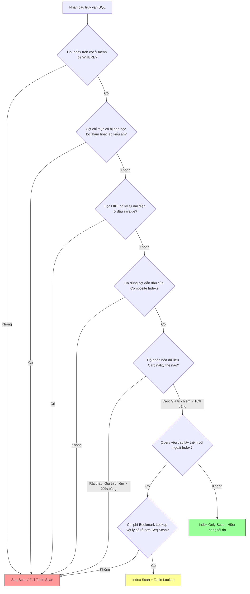

# Index được thêm vào nhưng query vẫn không nhanh hơn. Vì sao?

## ⚡ Tóm tắt ngắn (30s)
* **Bản chất**: Việc tạo Index chỉ là cung cấp một con đường tìm kiếm mới cho Database Engine. Quyết định có sử dụng con đường đó hay không thuộc về **Bộ tối ưu hóa truy vấn (Query Planner/Optimizer)** dựa trên tính toán chi phí (Cost-based). Nếu DB ước tính rằng việc quét toàn bộ bảng (Seq Scan) tốn ít I/O hoặc CPU hơn việc duyệt cây Index rồi nhảy về bảng chính để lấy dữ liệu (Bookmark Lookup), nó sẽ bỏ qua Index hoàn toàn.
* **Các thảm họa thực chiến được giải quyết**:
    1. **Sập hiệu năng do viết sai câu SQL (Index Invalidation)**: Bảng `members` có 10 triệu dòng, đã index cột `birthday`. Một lập trình viên viết câu lệnh lọc danh sách sinh nhật trong ngày: `WHERE EXTRACT(YEAR FROM birthday) = 1995`. Câu query chạy mất 15 giây, vắt kiệt I/O đĩa vì hàm `EXTRACT` đã vô hiệu hóa hoàn toàn index.
    2. **Bẫy Index tổ hợp bị bỏ qua do sai thứ tự cột (Composite Index Rule)**: Tạo index tổ hợp `(status, created_at)`. Câu query lọc theo `WHERE created_at >= '2026-05-23'` (không lọc `status`) đã bỏ qua index này và thực hiện quét toàn bộ bảng do vi phạm **Nguyên tắc tiền tố bên trái (Left-prefix Rule)**.
* **Quyết định Senior**:
    1. Luôn dùng `EXPLAIN ANALYZE` để kiểm tra xem DB có thực sự dùng index (`Index Scan`) hay bỏ qua (`Seq Scan`).
    2. Sửa code truy vấn: Tuyệt đối không bao bọc cột index bằng hàm hoặc thực hiện ép kiểu ẩn. Đưa hằng số/biến đổi sang vế đối diện của biểu thức.
    3. Thiết kế **Covering Index** (sử dụng mệnh đề `INCLUDE` trong Postgres) để loại bỏ hoàn toàn bước Bookmark Lookup vật lý từ ổ đĩa.

---

## 🔍 Chi tiết bản chất thực chiến: 6 nguyên nhân khiến Index vô dụng

### 1. Sử dụng hàm bao bọc cột chỉ mục (Function wrap)
* **Vấn đề**: DB lưu trữ giá trị thô trên cây chỉ mục B-Tree. Khi viết `WHERE UPPER(email) = 'ADMIN@GMAIL.COM'`, DB bắt buộc phải tính toán lại hàm `UPPER` trên từng dòng của bảng để so khớp, dẫn đến việc quét toàn bảng (Full Table Scan).
* **Giải pháp**: 
  * Cách tốt nhất: Chuẩn hóa dữ liệu về chữ thường trước khi lưu và query bằng giá trị thô: `WHERE email = 'admin@gmail.com'`.
  * Cách thay thế: Tạo **Function-based Index** (Chỉ mục dựa trên hàm).

### 2. Ép kiểu ẩn (Implicit Type Casting)
* **Vấn đề**: Cột `national_id` có kiểu `VARCHAR` và đã được index. Nhưng code ứng dụng truyền tham số dạng số: `WHERE national_id = 123456789`. DB sẽ tự động ép kiểu toàn bộ cột `national_id` sang kiểu số để so sánh, làm hỏng cấu trúc tìm kiếm của cây index B-Tree.
* **Giải pháp**: Truyền đúng kiểu dữ liệu chuỗi: `WHERE national_id = '123456789'`.

### 3. Tìm kiếm ký tự đại diện ở đầu chuỗi (Leading Wildcard)
* **Vấn đề**: Index B-Tree sắp xếp các ký tự từ trái qua phải. Phép toán `WHERE name LIKE 'Nguyen%'` sẽ dùng được index (Index Range Scan). Nhưng phép toán `WHERE name LIKE '%Nguyen'` hoặc `WHERE name LIKE '%Nguyen%'` sẽ bị bỏ qua index vì DB không biết chuỗi bắt đầu bằng ký tự nào để duyệt cây.
* **Giải pháp**: Sử dụng **GIN Index** kết hợp với extension `pg_trgm` (trigram) trong Postgres để hỗ trợ tìm kiếm chuỗi con.

### 4. Vi phạm quy tắc tiền tố bên trái của Composite Index
* **Vấn đề**: Có composite index trên `(department_id, employee_id)`. Nếu viết query chỉ lọc theo `WHERE employee_id = 99` (bỏ qua `department_id`), DB sẽ không dùng index này vì cột dẫn đầu `department_id` là điều kiện bắt buộc để định vị nhánh cây B-Tree.
* **Giải pháp**: Tạo thêm index đơn lẻ trên `employee_id` hoặc sắp xếp lại thứ tự cột trong composite index phù hợp với logic lọc của ứng dụng.

### 5. Độ phân hóa dữ liệu quá thấp (Low Cardinality)
* **Vấn đề**: Cột `status` chỉ có 2 trạng thái `ACTIVE` (chiếm 98% dữ liệu) và `INACTIVE` (chiếm 2% dữ liệu). Nếu lọc `WHERE status = 'ACTIVE'`, DB quyết định quét toàn bảng trực tiếp vì việc duyệt index tìm 9.8 triệu dòng, sau đó nhảy về bảng chính 9.8 triệu lần để đọc dữ liệu (Bookmark Lookup) tốn tài nguyên gấp nhiều lần quét tuần tự.
* **Giải pháp**: DB sẽ chỉ dùng index này khi lọc giá trị có độ phân hóa cao (`status = 'INACTIVE'`). Không cần cố ép DB dùng index cho giá trị phổ biến.

### 6. Chi phí Bookmark Lookup quá lớn (Overhead)
* **Vấn đề**: Index scan chỉ trả về địa chỉ vật lý của dòng dữ liệu (`TID` trong Postgres, `RID` trong SQL Server). Nếu câu lệnh `SELECT *` yêu cầu lấy thêm các cột không nằm trong index, DB phải thực hiện nhảy về đĩa đọc bảng chính (Bookmark Lookup). Nếu số dòng khớp điều kiện vượt quá 10-20% tổng số dòng của bảng, DB sẽ bỏ qua index scan.
* **Giải pháp**: Tạo **Covering Index** chứa tất cả các cột cần hiển thị để DB lấy được ngay dữ liệu từ cây index mà không cần đọc bảng chính (`Index Only Scan`).

---

## 🎨 Sơ đồ trực quan (Cây quyết định chọn phương pháp quét của Query Planner)



---

## 💻 Code thực chiến / Cấu hình thực tế: BAD vs GOOD

### ❌ BAD: Viết truy vấn vô hiệu hóa chỉ mục và thiết kế Index thiếu bao phủ
Lập trình viên viết câu query sử dụng hàm biến đổi trên cột ngày tháng và ép kiểu ẩn trên cột định danh, khiến DB bỏ qua index.

* **Code SQL tồi**:
```sql
-- 1. Cột created_at đã được INDEX
-- Nhưng viết hàm DATE() làm vô hiệu hóa index
SELECT order_no, total_amount 
FROM orders 
WHERE DATE(created_at) = '2026-05-23';

-- 2. Cột user_id (kiểu VARCHAR) đã được INDEX
-- Nhưng truyền tham số kiểu số gây ép kiểu ẩn (Implicit Cast)
SELECT * FROM users WHERE user_id = 9999;
```

---

### ✅ GOOD: Viết lại truy vấn tối ưu và thiết kế Covering Index
Đưa biểu thức so sánh về dạng thô (không dùng hàm trên cột), truyền đúng kiểu dữ liệu và tạo Covering Index có chứa mệnh đề `INCLUDE`.

* **Viết lại SQL chuẩn Senior**:
```sql
-- 1. Sử dụng lọc khoảng giá trị (Range Query) để bảo toàn index cột created_at
SELECT order_no, total_amount 
FROM orders 
WHERE created_at >= '2026-05-23 00:00:00' 
  AND created_at < '2026-05-24 00:00:00';

-- 2. Truyền đúng kiểu dữ liệu chuỗi để kích hoạt index cột user_id
SELECT * FROM users WHERE user_id = '9999';
```

* **Thiết kế Covering Index (PostgreSQL)**:
```sql
-- Nếu thường xuyên chạy query tìm đơn hàng của user và lấy số tiền đơn hàng:
-- SELECT order_no, total_amount FROM orders WHERE user_id = 'USER123';

-- Tạo Covering Index có mệnh đề INCLUDE
-- Cột user_id nằm ở nút cây tìm kiếm (Key)
-- Cột order_no, total_amount chỉ nằm ở lá cây (Payload), không tốn chi phí sắp xếp cây
CREATE INDEX CONCURRENTLY idx_orders_user_covering 
ON orders(user_id) 
INCLUDE(order_no, total_amount);

-- Phân tích câu query để kiểm chứng hiệu quả
EXPLAIN (ANALYZE, BUFFERS)
SELECT order_no, total_amount FROM orders WHERE user_id = 'USER123';

-- KẾT QUẢ:
-- -> Index Only Scan using idx_orders_user_covering on orders ... (actual time=0.012..0.014 rows=5 loops=1)
--      Buffers: shared hit=3 -- Cực nhanh, KHÔNG cần nhảy về bảng chính trên đĩa để đọc!
```

---

## 📊 Bảng so sánh các lỗi phá hủy Index và cách khắc phục

| Lỗi phá hủy Index | Triệu chứng trong Explain Plan | Giải pháp khắc phục tận gốc |
| :--- | :--- | :--- |
| **Dùng hàm trên cột** (`DATE(col) = '2026'`) | `Seq Scan` / `Full Table Scan` | Chuyển sang so sánh dải giá trị (`col >= ... AND col < ...`). |
| **Ép kiểu ẩn** (`varchar_col = 123`) | `Seq Scan` + Filter cast | Truyền đúng kiểu dữ liệu từ mã nguồn ứng dụng (`varchar_col = '123'`). |
| **Tìm chuỗi đại diện đầu** (`LIKE '%val'`) | `Seq Scan` | Dùng GIN Index với `pg_trgm` (Postgres) hoặc Full-Text Search. |
| **Sai tiền tố Index tổ hợp** | `Seq Scan` | Tạo index riêng lẻ hoặc sửa lại thứ tự cột index composite. |
| **Bookmark Lookup quá tải** | `Seq Scan` mặc dù có index scan chi phí cao | Tạo **Covering Index** sử dụng từ khóa `INCLUDE` (Postgres/SQL Server). |

---

## ⚠️ Common Gotchas & Questions follow-up

### 1. Cạm bẫy "Null values trong chỉ mục B-Tree"
* **Vấn đề**: Bạn muốn tìm các dòng có giá trị NULL bằng câu lệnh: `SELECT * FROM users WHERE referee_id IS NULL`. Bạn tạo index trên `referee_id` nhưng DB vẫn thực hiện quét toàn bảng.
* **Nguyên nhân**: 
  * Ở một số hệ quản trị cơ sở dữ liệu (như Oracle), các giá trị NULL **không được đưa vào chỉ mục B-Tree**. Vì vậy, index không chứa thông tin về NULL, DB buộc phải quét toàn bảng.
  * Ở PostgreSQL và MySQL (InnoDB), giá trị NULL *có* được đưa vào index B-Tree, nên câu lệnh `IS NULL` vẫn dùng được index.
* **Giải pháp**: Cần hiểu rõ cơ chế nội bộ của hệ quản trị cơ sở dữ liệu đang vận hành để thiết kế giá trị mặc định (như `0` hoặc `-1`) thay vì sử dụng NULL nếu cần tối ưu hóa cao trên Oracle.

### 2. Câu hỏi đào sâu từ interviewer

* **Q1: Làm thế nào bạn giải quyết bài toán tìm kiếm từ khóa bất kỳ (`LIKE '%keyword%'`) trên bảng chứa 20 triệu dòng bằng index mà không muốn thiết lập hệ thống Full-Text Search (như Elasticsearch) quá phức tạp?**
  * *Trả lời*: 
    1. Trong **PostgreSQL**, tôi sẽ giải quyết bằng cách sử dụng **GIN (Generalized Inverted Index)** kết hợp với extension **Trigram (`pg_trgm`)**.
    2. Cơ chế hoạt động: Trigram sẽ chia nhỏ chuỗi thành các nhóm 3 ký tự liên tiếp. Index GIN sẽ lập chỉ mục cho các trigram này.
    3. Cú pháp thực thi:
       ```sql
       -- 1. Bật extension trigram
       CREATE EXTENSION IF NOT EXISTS pg_trgm;
       -- 2. Tạo chỉ mục GIN hỗ trợ so khớp chuỗi
       CREATE INDEX CONCURRENTLY idx_users_name_trgm ON users USING gin (name gin_trgm_ops);
       ```
    4. Sau khi tạo index này, các câu lệnh truy vấn dạng `LIKE '%keyword%'` hoặc `ILIKE '%keyword%'` sẽ được Query Planner chuyển từ `Seq Scan` sang `Bitmap Index Scan` sử dụng cây chỉ mục GIN, giúp cải thiện tốc độ truy vấn từ hàng chục giây xuống còn vài chục mili-giây mà không cần dựng thêm hạ tầng tìm kiếm bên ngoài.

* **Q2: Hiện tượng "Index Bloat" (Phình to chỉ mục) là gì? Nó ảnh hưởng thế nào đến hiệu năng truy vấn và bạn xử lý ra sao trên Production?**
  * *Trả lời*: 
    1. **Bản chất**: Trong cơ chế kiểm soát đa phiên bản (MVCC) của PostgreSQL, khi một dòng bị cập nhật (`UPDATE`) hoặc xóa (`DELETE`), DB không xóa vật lý ngay lập tức mà chỉ đánh dấu là dòng cũ (dead tuple). Các con trỏ chỉ mục trỏ tới các dead tuple này vẫn tồn tại. Khi tiến trình dọn dẹp (`Autovacuum`) chạy, nó giải phóng không gian của dòng dữ liệu nhưng không tự động thu nhỏ kích thước vật lý của tệp tin index trên đĩa, tạo ra các khoảng trống rác. Hiện tượng này gọi là **Index Bloat**.
    2. **Hậu quả**: Kích thước index phình to gấp 3-5 lần thực tế, làm giảm tỷ lệ dữ liệu index được nạp vào bộ nhớ đệm (RAM cache). Mỗi lần quét index, DB phải đọc nhiều block đĩa hơn, làm suy giảm nghiêm trọng tốc độ truy vấn.
    3. **Cách xử lý trên Production an toàn**:
       * Tôi sử dụng công cụ hoặc script đo đếm tỷ lệ bloat (ví dụ: truy vấn bảng hệ thống `pgstattuple`).
       * Để thu gom và xây dựng lại index trên Production mà hoàn toàn không khóa bảng ghi (không downtime), tôi chạy lệnh tái tạo chỉ mục song song:
         `REINDEX INDEX CONCURRENTLY idx_orders_created_at;`
       * Lệnh này sẽ tạo một index mới chạy ngầm bên cạnh index cũ, sau khi xây dựng xong sẽ tự động tráo đổi con trỏ và xóa index cũ bị phình to.
