# Một migration database làm lock table và ảnh hưởng production. Bạn xử lý thế nào?

## ⚡ Tóm tắt ngắn (30s)
* **Bản chất**: Lệnh thay đổi cấu trúc bảng (DDL - Data Definition Language) như `ALTER TABLE` yêu cầu khóa độc quyền cao nhất (**Access Exclusive Lock** trong Postgres hoặc **Metadata Lock** trong MySQL). Khóa này chặn đứng toàn bộ các thao tác đọc/ghi (`SELECT`, `INSERT`, `UPDATE`, `DELETE`) từ người dùng. Sự cố xảy ra khi câu lệnh DDL phải xếp hàng chờ lock (Lock Queue), chặn tất cả các truy vấn lành mạnh phía sau, dẫn đến nghẽn connection pool và sập toàn bộ hệ thống.
* **Các thảm họa thực chiến được giải quyết**:
    1. **Thảm họa treo cứng Connection Pool do xếp hàng khóa (Lock Queue Block)**: Để thêm cột mới có ràng buộc `NOT NULL DEFAULT 'ACTIVE'`, lập trình viên chạy trực tiếp câu lệnh `ALTER TABLE`. Do bảng đang có 1 query SELECT lớn chạy mất 1 phút, lệnh DDL phải đứng xếp hàng chờ. Toàn bộ các API SELECT/INSERT đơn giản của khách hàng gọi đến sau đó đều bị chặn đứng sau lưng lệnh DDL trong hàng đợi lock, vắt kiệt Connection Pool của App chỉ trong 5 giây.
    2. **Khóa bảng vĩnh viễn trên bảng lớn (Table Rewrite)**: Chạy lệnh `ALTER TABLE ADD COLUMN` kèm giá trị mặc định trên phiên bản DB cũ (Postgres < 11 hoặc MySQL < 8.0) buộc database phải viết lại vật lý toàn bộ hàng trăm triệu dòng trên ổ đĩa, khóa cứng bảng trong nhiều giờ.
* **Quyết định Senior**:
    1. **Ứng phó khẩn cấp**: Xác định ngay mã tiến trình (PID) của câu lệnh DDL đang chờ hoặc đang lock bảng, lập tức **KILL** tiến trình đó để giải phóng hàng đợi, cứu hệ thống trước.
    2. **Thiết lập Lá chắn an toàn**: Luôn khai báo giới hạn thời gian chờ khóa (`SET lock_timeout = '2s'`) trước khi chạy bất kỳ câu lệnh DDL nào. Nếu quá 2 giây không lấy được lock, câu lệnh migration tự động hủy để bảo vệ API người dùng.
    3. **Quy trình Zero-Downtime Migration**: Chia nhỏ quá trình thay đổi cấu trúc thành các bước tuần tự (Thêm cột nullable → Deploy code tương thích → Chạy batch job ghi dữ liệu cũ ngầm → Thêm ràng buộc NOT NULL).

---

## 🔍 Chi tiết bản chất thực chiến: Cơ chế khóa DDL và Giải pháp

Hiểu rõ cách thức hoạt động của hàng đợi khóa (Lock Queue) là chìa khóa để thiết kế các đợt migration an toàn.

### 1. Cơ chế nghẽn cổ chai do Hàng đợi Khóa (Lock Queue Queueing)
* Database quản lý khóa theo thứ tự xếp hàng (FIFO - First In First Out).
* Khi câu lệnh DDL (`ALTER TABLE`) gửi đến, nó yêu cầu khóa độc quyền **Access Exclusive Lock**.
* Nếu lúc đó bảng đang có một câu query đọc dữ liệu lâu (chạy mất 30 giây), lệnh DDL sẽ xếp hàng chờ (Wait).
* Điểm nguy hiểm nằm ở đây: **Tất cả các truy vấn SELECT, INSERT gọi vào sau đó dù chỉ mất 1ms cũng phải xếp hàng sau câu lệnh DDL đang chờ kia**. Hệ thống lập tức bị tê liệt toàn bộ luồng đọc/ghi vào bảng đó.

---

## 🎨 Sơ đồ trực quan (Hàng đợi khóa chặn đứng toàn bộ truy vấn)

```mermaid
gantt
    title Hiện tượng nghẽn Lock Queue trên Production
    dateFormat  X
    axisFormat %s

    section Query Đọc Lâu
    1. SELECT nặng đang chạy (giữ Share Lock) :active, p1, 0, 15
    
    section Migration
    2. ALTER TABLE gửi đến (chờ Access Exclusive Lock) :crit, p2, 5, 20
    
    section API Khách Hàng
    3. SELECT API khách hàng gọi đến (Bị chặn sau ALTER TABLE) :milestone, p3, 6, 20
    4. INSERT API khách hàng gọi đến (Bị chặn sau ALTER TABLE) :milestone, p4, 8, 20
    5. Cạn kiệt Connection Pool của App Server :active, p5, 10, 20
```



---

## 💻 Code thực chiến / Cấu hình thực tế: BAD vs GOOD

### ❌ BAD: Lệnh migration thô bạo gây khóa bảng vĩnh viễn trên Production
Lập trình viên thực hiện thêm cột mới có giá trị mặc định và ràng buộc khóa ngoại trực tiếp trên bảng lớn đang chịu tải cao mà không cấu hình thời gian chờ lock.

* **File Migration tồi (SQL)**:
```sql
-- ❌ THẢM HỌA: Nếu bảng orders đang có query chạy, lệnh này sẽ đứng đợi và BLOCK toàn bộ hệ thống
-- Đồng thời, việc thêm Foreign Key bắt buộc DB phải quét (Scan) toàn bộ bảng để xác thực, gây lock bảng kéo dài.
ALTER TABLE orders ADD COLUMN status VARCHAR(20) NOT NULL DEFAULT 'PENDING';
ALTER TABLE orders ADD CONSTRAINT fk_orders_user FOREIGN KEY (user_id) REFERENCES users(id);
```

---

### ✅ GOOD: Kịch bản Migration Zero-Downtime chuẩn Senior (PostgreSQL)
Chia nhỏ các bước, cấu hình `lock_timeout` để bảo vệ hàng đợi, và sử dụng cơ chế tạo ràng buộc bất đồng bộ (`NOT VALID`).

* **Quy trình thực thi Migration an toàn từng bước**:

#### Bước 1: Thêm cột mới ở trạng thái cho phép NULL (Instant Catalog update, chỉ mất < 5ms)
Kèm theo cấu hình `lock_timeout` bảo vệ.

```sql
-- Thiết lập session-level timeout: Nếu không chiếm được lock trong 2 giây, TỰ HỦY LỆNH
SET lock_timeout = '2000';

-- Thêm cột Nullable (Không có DEFAULT ở tầng DB)
ALTER TABLE orders ADD COLUMN status VARCHAR(20);
```

#### Bước 2: Deploy code ứng dụng phiên bản mới
Code ứng dụng mới được thiết kế để tự động xử lý giá trị mặc định ở mức mã nguồn khi đọc dữ liệu cũ (nếu cột là NULL), và luôn ghi giá trị mặc định cho các dòng mới tạo.

#### Bước 3: Chạy Batch Job chạy ngầm đồng bộ dữ liệu cũ (Backfill Data)
Sử dụng script viết lại dữ liệu cũ theo từng lô nhỏ (Batch) để tránh khóa bảng và không làm đầy transaction log.

```sql
-- Cập nhật dần dữ liệu theo lô 1,000 dòng, nghỉ 100ms giữa các lô để DB thở
UPDATE orders 
SET status = 'PENDING' 
WHERE id IN (
    SELECT id FROM orders 
    WHERE status IS NULL 
    LIMIT 1000
);
-- (Lặp lại cho đến khi số lượng dòng NULL bằng 0)
```

#### Bước 4: Tạo ràng buộc Foreign Key ngầm dưới background (`NOT VALID`)
```sql
SET lock_timeout = '2000';

-- Thêm khóa ngoại nhưng KHÔNG bắt quét xác thực dữ liệu cũ ngay lập tức
ALTER TABLE orders 
ADD CONSTRAINT fk_orders_user 
FOREIGN KEY (user_id) REFERENCES users(id) NOT VALID;

-- Chạy lệnh xác thực dữ liệu cũ chạy ngầm dưới background (KHÔNG lock bảng)
ALTER TABLE orders VALIDATE CONSTRAINT fk_orders_user;
```

#### Bước 5: Thêm ràng buộc NOT NULL an toàn sau khi đã sạch dữ liệu NULL
```sql
SET lock_timeout = '2000';
ALTER TABLE orders ALTER COLUMN status SET NOT NULL;
```

---

## 📊 Bảng so sánh rủi ro các thao tác DDL Migration

| Thao tác DDL | Mức độ nguy hiểm | Cơ chế Lock | Giải pháp an toàn không downtime |
| :--- | :--- | :--- | :--- |
| **CREATE INDEX** | **Cao** | Share Lock (Chặn toàn bộ thao tác ghi). | Dùng cờ `CONCURRENTLY` (Postgres) hoặc `ONLINE` (MySQL). |
| **ADD COLUMN (Nullable)** | **Thấp** | Access Exclusive Lock (Chỉ giữ trong vài ms để cập nhật metadata). | Cấu hình `lock_timeout = '2s'` trước khi chạy. |
| **ADD COLUMN (NOT NULL DEFAULT)** | **Cực cao** (Với DB cũ) | Access Exclusive Lock (Khóa toàn bộ bảng để ghi lại dữ liệu). | Thêm nullable → Backfill theo lô → Thêm NOT NULL constraint. |
| **ADD FOREIGN KEY** | **Cao** | Access Exclusive Lock (Quét toàn bộ bảng để kiểm tra toàn vẹn). | Sử dụng cơ chế `NOT VALID` sau đó `VALIDATE CONSTRAINT` ngầm. |
| **RÚT NGẮN KIỂU DỮ LIỆU** (ví dụ: TEXT -> VARCHAR(50)) | **Cực cao** | Access Exclusive Lock (Quét và kiểm tra từng dòng, có thể lỗi). | Tạo cột mới → Ghi song song → Switch cột → Xóa cột cũ. |

---

## ⚠️ Common Gotchas & Questions follow-up

### 1. Cạm bẫy "Bỏ quên Lock Timeout khi chạy tool Migration tự động"
* **Vấn đề**: Dự án sử dụng các công cụ tự động hóa như Liquibase, Flyway để chạy migration lúc khởi động ứng dụng (Startup migration). 
* **Hậu quả**: Khi ứng dụng mới khởi động lên, tool tự động chạy câu lệnh `ALTER TABLE` trực tiếp. Nếu gặp lúc DB đang có tải cao, câu lệnh DDL này sẽ xếp hàng và khóa cứng toàn bộ API của các instance cũ đang chạy phục vụ khách hàng, gây ra sự cố downtime dây chuyền.
* **Giải pháp**: 
  1. Tuyệt đối tắt tính năng tự động chạy migration lúc khởi động ứng dụng trên môi trường Production (`spring.flyway.enabled=false`).
  2. Bắt buộc phải chạy migration bằng các script tách biệt thông qua CI/CD pipeline, và script luôn được nhúng câu lệnh `SET lock_timeout` ở đầu file SQL.

### 2. Câu hỏi đào sâu từ interviewer

* **Q1: Làm thế nào bạn phát hiện và ngăn chặn các câu lệnh migration nguy hiểm (như DROP COLUMN, RENAME TABLE, ALTER TYPE) lọt vào code trước khi nó được merge lên nhánh chính?**
  * *Trả lời*: Tôi triển khai quy trình kiểm duyệt schema tự động (Automated Schema Linting) trong CI/CD pipeline:
    1. **Sử dụng công cụ kiểm duyệt tĩnh (Linter for Database)**: Tôi tích hợp công cụ **Atlas CLI** hoặc **squash** vào GitLab CI / GitHub Actions.
    2. **Phân tích độ lệch tự động (Schema Diff Audit)**: Khi lập trình viên tạo một file migration mới (file `.sql`), pipeline sẽ chạy công cụ phân tích tĩnh file đó.
    3. **Chặn lệnh nguy hiểm**: Nếu phát hiện các câu lệnh DDL có rủi ro cao (như xóa cột `DROP COLUMN`, đổi tên bảng `RENAME TABLE`, hoặc thay đổi kiểu dữ liệu gây table rewrite), linter sẽ báo đỏ và tự động **FAIL pipeline**, yêu cầu kỹ sư DBA hoặc Technical Lead vào review thủ công và phê duyệt bằng quy trình đặc biệt (bất khả kháng).

* **Q2: Công cụ `pt-online-schema-change` (của Percona) hoặc `gh-ost` (của GitHub) hoạt động theo nguyên lý nào để thực hiện các migration thay đổi cấu trúc bảng khổng lồ (vài tỷ dòng) trên MySQL mà không gây lock bảng?**
  * *Trả lời*: Các công cụ này hoạt động theo nguyên lý **Bảng bóng (Ghost/Shadow Table)** cực kỳ thông minh:
    1. **Tạo bảng tạm (Shadow Table)**: Công cụ tạo một bảng mới có cấu trúc giống hệt bảng gốc nhưng đã được áp dụng câu lệnh migration mới (ví dụ: bảng `_orders_new`).
    2. **Sao chép dữ liệu cũ theo lô (Chunk Copy)**: Công cụ sao chép dữ liệu lịch sử từ bảng gốc sang bảng mới theo từng lô nhỏ (ví dụ: 1000 dòng mỗi đợt) dựa trên Primary Key để không gây quá tải I/O.
    3. **Đồng bộ hóa dữ liệu mới (Realtime Sync)**:
       * Với `pt-online-schema-change`: Sử dụng các database triggers (`AFTER INSERT`, `AFTER UPDATE`, `AFTER DELETE`) trên bảng gốc để tự động sao chép mọi thay đổi mới phát sinh sang bảng shadow theo thời gian thực.
       * Với `gh-ost`: Không dùng trigger (để tránh nghẽn lock trên table gốc), mà nó tự đóng vai trò là một replica kết nối vào MySQL và đọc trực tiếp từ **Binary Log (Binlog)** để phát hiện thay đổi trên bảng gốc rồi apply sang bảng shadow.
    4. **Tráo đổi bảng (Atomic Table Swap)**: Sau khi dữ liệu 2 bên đã khớp 100%, công cụ thực hiện một lệnh đổi tên bảng siêu nhanh chỉ mất vài mili-giây: `RENAME TABLE orders TO orders_old, _orders_new TO orders;` - Quy trình hoàn thành hoàn hảo mà không chặn bất kỳ request nào của người dùng.
