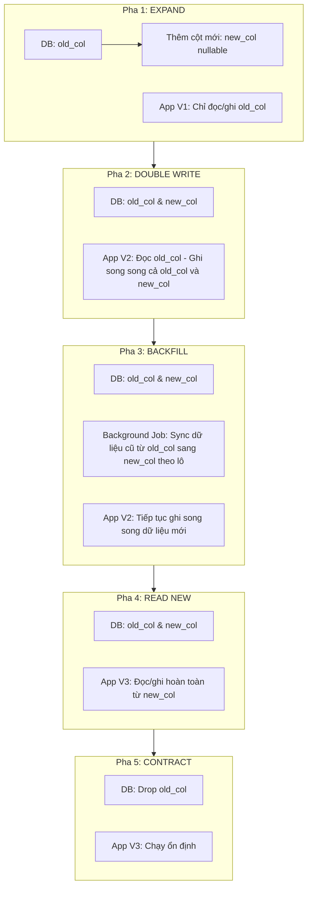

# Làm sao deploy schema change an toàn không downtime?

## ⚡ Tóm tắt ngắn (30s)
* **Bản chất**: Nguyên tắc tối thượng để deploy thay đổi cơ cấu cơ sở dữ liệu (Schema Change) mà không gây downtime là: **Mọi thay đổi database luôn phải tương thích ngược (Backward Compatible) với phiên bản ứng dụng hiện tại**. Để đạt được điều này, Senior Architect áp dụng quy luật **Mở rộng và Thu hẹp (Expand and Contract Pattern)** (hoặc Parallel Schema Design). Chúng ta không bao giờ thực hiện thay đổi phá vỡ (Breaking Change) trong một bước duy nhất, mà chia nhỏ thành các pha chuyển tiếp song song.
* **Các thảm họa thực chiến được giải quyết**:
    1. **Thảm họa sập hệ thống do lệch pha Deploy (Deploy Desynchronization)**: Đổi tên cột từ `phone` thành `phone_number`. Lập trình viên chạy lệnh migration đổi tên cột trên DB trước, sau đó mới deploy code app mới. Trong khoảng thời gian 2 phút chờ code app mới khởi động lên, 100% các instance app cũ đang chạy thực tế liên tục báo lỗi `500 Column phone not found`, làm gián đoạn dịch vụ nghiêm trọng.
    2. **Thảm họa mất dữ liệu khi Rollback**: Deploy code mới gặp lỗi và phải rollback về bản cũ. Tuy nhiên, DB đã bị biến đổi cấu trúc và dữ liệu mới phát sinh trong 5 phút chạy bản mới không tương thích với code bản cũ, dẫn đến việc không thể rollback hoặc làm mất dữ liệu khách hàng.
* **Quyết định Senior**: Triển khai quy trình **Expand and Contract** gồm 5 pha:
    1. **Expand (Mở rộng)**: Thêm cột mới nullable (giữ nguyên cột cũ).
    2. **Double Write (Ghi song song)**: Deploy code mới thực hiện ghi đồng thời vào cả hai cột cũ và mới.
    3. **Backfill (Đồng bộ lịch sử)**: Chạy background job đồng bộ dữ liệu cũ từ cột cũ sang cột mới theo lô nhỏ.
    4. **Read from New (Đổi luồng đọc)**: Chuyển ứng dụng sang đọc hoàn toàn từ cột mới.
    5. **Contract (Thu hẹp)**: Tiến hành xóa cột cũ khỏi DB sau khi đảm bảo hệ thống đã chạy ổn định và không còn nhu cầu rollback.

---

## 🔍 Chi tiết bản chất thực chiến: Mô hình Expand and Contract (Mở rộng và Thu hẹp)

Để minh họa chi tiết, chúng ta phân tích kịch bản phức tạp: **Đổi tên một cột từ `old_col` sang `new_col` trên bảng chứa hàng trăm triệu dòng dữ liệu** mà không gây dừng hệ thống.

---

## 🎨 Sơ đồ trực quan (5 Pha của quy trình Expand and Contract)



---

## 💻 Code thực chiến / Cấu hình thực tế: BAD vs GOOD

### ❌ BAD: Đổi tên cột thô bạo trong 1 bước gây dừng dịch vụ
Lập trình viên thực hiện đổi tên cột bằng lệnh `RENAME COLUMN` trực tiếp trên Production, tạo ra breaking change ngay lập tức với phiên bản app cũ đang chạy.

* **File Migration tồi (SQL)**:
```sql
-- ❌ THẢM HỌA: Lệnh này lập tức làm crash 100% các instance app phiên bản cũ đang chạy
-- vì chúng vẫn đang gọi câu SQL chứa cột old_name.
ALTER TABLE users RENAME COLUMN old_name TO new_name;
```

---

### ✅ GOOD: Triển khai mô hình tiến hóa Schema song song chuẩn Senior

#### Pha 1: Expand (Mở rộng DB)
Tạo cột mới cho phép NULL.

```sql
SET lock_timeout = '2000';
-- Thêm cột mới nullable
ALTER TABLE users ADD COLUMN new_name VARCHAR(100);
```

#### Pha 2: Ghi song song ở tầng Ứng dụng (Double Write)
Deploy phiên bản ứng dụng mới hỗ trợ ghi song song vào cả 2 cột.

* **Code Java Spring Boot (Double Write)**:
```java
@Service
public class UserService {
    @Autowired
    private UserRepository userRepository;

    @Transactional
    public void updateUserProfile(Long userId, String name) {
        User user = userRepository.findById(userId).orElseThrow();
        
        // ✅ GHI SONG SONG: Đảm bảo dữ liệu mới luôn có mặt ở cả 2 cột
        user.setOldName(name);
        user.setNewName(name); 
        
        userRepository.save(user);
    }

    public String getUserName(Long userId) {
        User user = userRepository.findById(userId).orElseThrow();
        // ✅ ĐỌC AN TOÀN: Vẫn ưu tiên đọc từ cột cũ để đề phòng phải rollback app
        return user.getOldName();
    }
}
```

#### Pha 3: Đồng bộ dữ liệu lịch sử chạy ngầm (Backfill)
Chạy script đồng bộ dữ liệu cũ từ cột `old_name` sang `new_name` cho các bản ghi được tạo ra trước khi có cơ chế ghi song song.

```sql
-- Chạy theo lô nhỏ 1,000 dòng để không gây lock table và quá tải I/O đĩa
UPDATE users 
SET new_name = old_name 
WHERE new_name IS NULL 
  AND old_name IS NOT NULL
  AND id IN (SELECT id FROM users WHERE new_name IS NULL LIMIT 1000);
-- (Lặp lại cho đến khi số dòng bị ảnh hưởng = 0)
```

#### Pha 4: Chuyển đổi luồng đọc hoàn toàn sang cột mới (Read New)
Deploy bản app mới chuyển sang đọc/ghi hoàn toàn trên cột mới.

* **Code Java Spring Boot (Read New)**:
```java
@Service
public class UserService {
    @Autowired
    private UserRepository userRepository;

    @Transactional
    public void updateUserProfile(Long userId, String name) {
        User user = userRepository.findById(userId).orElseThrow();
        // Chỉ ghi vào cột mới
        user.setNewName(name);
        userRepository.save(user);
    }

    public String getUserName(Long userId) {
        User user = userRepository.findById(userId).orElseThrow();
        // ✅ Chuyển sang đọc hoàn toàn từ cột mới
        return user.getNewName(); 
    }
}
```

#### Pha 5: Contract (Dọn dẹp DB)
Sau khi ứng dụng chạy ổn định ở Pha 4 khoảng 1-2 tuần và chắc chắn không có nhu cầu rollback, tiến hành xóa cột cũ.

```sql
SET lock_timeout = '2000';
-- Xóa cột cũ để tiết kiệm dung lượng đĩa
ALTER TABLE users DROP COLUMN old_name;
```

---

## 📊 Bảng so sánh 5 Pha của Expand and Contract

| Tiêu chí | Pha 1: Expand | Pha 2: Double Write | Pha 3: Backfill | Pha 4: Read New | Pha 5: Contract |
| :--- | :--- | :--- | :--- | :--- | :--- |
| **Trạng thái App** | Chạy bản **V1** | Deploy bản **V2** | Chạy bản **V2** | Deploy bản **V3** | Chạy bản **V3** |
| **Trạng thái DB** | Thêm cột mới nullable. | Có cả 2 cột. | Có cả 2 cột. | Có cả 2 cột. | Xóa bỏ cột cũ. |
| **Cơ chế Đọc** | Đọc cột cũ. | Đọc cột cũ. | Đọc cột cũ. | **Đọc cột mới**. | Đọc cột mới. |
| **Cơ chế Ghi** | Ghi cột cũ. | **Ghi cả hai cột**. | Ghi cả hai cột. | **Chỉ ghi cột mới**. | Chỉ ghi cột mới. |
| **Khả năng Rollback App** | Cực kỳ an toàn. | An toàn (Không mất data). | An toàn (Không mất data). | Khó khăn hơn (Cần kiểm tra kỹ). | Không thể rollback về V1/V2. |

---

## ⚠️ Common Gotchas & Questions follow-up

### 1. Cạm bẫy "Ràng buộc NOT NULL quá sớm"
* **Vấn đề**: Khi tạo cột mới ở Pha 1, lập trình viên khai báo ngay thuộc tính `NOT NULL` cho cột mới.
* **Hậu quả**: Tất cả các instance app cũ đang chạy (Pha 1 chưa deploy bản ghi song song) thực hiện ghi dữ liệu mới sẽ lập tức bị lỗi `500 Null value violates not-null constraint` vì app cũ hoàn toàn không biết đến sự tồn tại của cột mới để truyền dữ liệu vào.
* **Giải pháp**: Cột mới bắt buộc phải đặt ở trạng thái cho phép `NULL` ở các pha đầu. Ràng buộc `NOT NULL` chỉ được thêm vào ở bước cuối cùng sau khi dữ liệu lịch sử đã được điền đầy đủ và sạch sẽ.

### 2. Câu hỏi đào sâu từ interviewer

* **Q1: Làm thế nào bạn thực hiện việc thay đổi kiểu dữ liệu (Data Type Change) của cột Khóa chính tự tăng (Primary Key) từ kiểu `INT` sang `BIGINT` trên một bảng chứa 1 tỷ dòng dữ liệu đang hoạt động 24/7 mà không có downtime?**
  * *Trả lời*: Đây là một thử thách kinh điển khi hệ thống chạm ngưỡng giới hạn của kiểu số nguyên 32-bit (2.14 tỷ ID). Quy trình thực thi gồm các bước:
    1. **Tạo cột mới**: Tạo cột `id_new` kiểu `BIGINT` cho phép nhận giá trị null.
    2. **Thiết lập Database Trigger (MySQL/Postgres)**: Tạo một trigger trên bảng để khi có bất kỳ thao tác `INSERT` hay `UPDATE` nào xảy ra trên bảng, giá trị của cột `id` cũ tự động được nhân bản sang cột `id_new` theo thời gian thực.
    3. **Đồng bộ dữ liệu cũ (Backfill)**: Chạy một background job sao chép dữ liệu cũ từ `id` sang `id_new` theo từng block ID nhỏ (ví dụ: 10,000 dòng mỗi đợt) để tránh làm nghẽn đĩa.
    4. **Cập nhật Khóa ngoại (Foreign Keys)**: Đây là bước khó nhất. Các bảng con liên kết với bảng này cũng phải trải qua quy trình Expand & Contract tương tự để tạo cột khóa ngoại mới kiểu `BIGINT` và đồng bộ dữ liệu khóa ngoại.
    5. **Atomic Swap (Tráo đổi cột)**: Trong một downtime window siêu ngắn (vài ms) hoặc sử dụng lệnh đổi tên nguyên tử: Đổi tên cột `id` cũ thành `id_old`, đổi tên `id_new` thành `id`, thiết lập khóa chính cho cột mới, và bật cơ chế tự tăng (Sequence) tiếp tục từ ID hiện tại.
    6. **Xóa cột cũ**: Tiến hành xóa cột `id_old` ở pha Contract sau khi toàn bộ hệ thống chạy ổn định.

* **Q2: Việc xóa một cột lớn (`DROP COLUMN`) vật lý khỏi bảng chứa hàng tỷ dòng có làm nghẽn I/O đĩa và lock bảng lâu không? Bạn xử lý thế nào?**
  * *Trả lời*: 
    1. **Cơ chế hoạt động**: Trong hầu hết các RDBMS hiện đại (như PostgreSQL và MySQL InnoDB), lệnh `DROP COLUMN` thực chất chỉ là một thao tác **Metadata update** siêu nhanh. Database chỉ đánh dấu cột đó ở trạng thái "bị xóa" (dropped) trong bảng catalog hệ thống và lập tức bỏ qua cột này trong mọi câu lệnh SQL SELECT/INSERT sau đó. Lệnh này không thực hiện quét bảng để xóa dữ liệu vật lý ngay lập tức, do đó chỉ tốn vài mili-giây và không gây nghẽn I/O hay lock bảng lâu.
    2. **Giải phóng không gian vật lý**: Không gian lưu trữ vật lý của cột bị xóa sẽ được giải phóng dần dần khi các tiến trình dọn dẹp chạy ngầm (`Autovacuum` trong Postgres, hoặc khi các dòng dữ liệu được cập nhật tự nhiên).
    3. **Lưu ý an toàn**: Dù lệnh chạy rất nhanh, tôi vẫn khai báo `SET lock_timeout = '2s'` trước khi chạy để đề phòng trường hợp lệnh phải xếp hàng chờ khóa do bảng đang bị nghẽn bởi một truy vấn đọc lâu khác.
