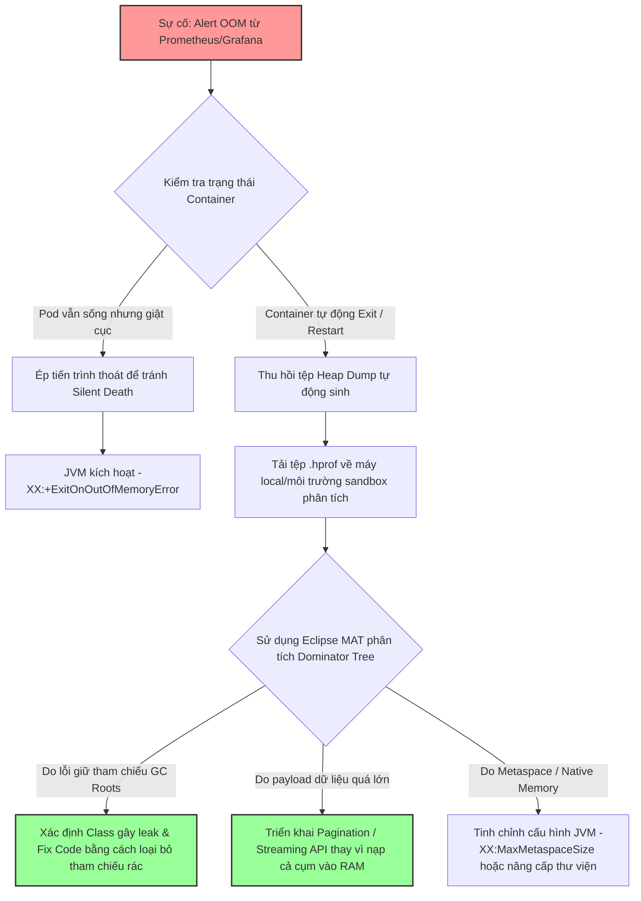

# Java service bị OutOfMemoryError, bạn xử lý thế nào?

## ⚡ Tóm tắt ngắn (30s)
* **Bản chất**: `OutOfMemoryError` (OOM) xảy ra khi máy ảo Java (JVM) không thể cấp phát thêm bộ nhớ cho đối tượng mới do Heap đã đầy, Metaspace vượt quá giới hạn, hoặc bộ nhớ ngoài (Off-heap) bị cạn kiệt, đồng thời bộ dọn rác (GC) đã chạy hết công suất mà không thể giải phóng thêm không gian. Đây là lỗi nghiêm trọng ở mức độ hạ tầng hệ thống.
* **Các thảm họa thực chiến được giải quyết**:
    1. **Thảm họa treo cứng hệ thống (Silent Death)**: Ứng dụng bị OOM nhưng không crash hoàn toàn, các luồng nền bị chết âm thầm, luồng phục vụ request phản hồi cực chậm (GC liên tục giật cục), làm nghẽn hàng đợi kết nối của Load Balancer khiến toàn bộ hệ thống bị sập đổ dây chuyền.
    2. **Thảm họa lặp lại vô hạn (OOM Loop)**: Pod trên Kubernetes bị OOMKilled, tự động restart nhưng lập tức đọc tiếp các payload khổng lồ từ cơ sở dữ liệu hoặc Kafka và tiếp tục bị OOMKilled liên tục (CrashLoopBackOff).
* **Quyết định Senior**: Thiết lập chiến lược phản ứng nhanh đa lớp:
    1. **Bảo vệ nóng (Kubernetes & JVM Auto-Exit)**: Cấu hình JVM tự động chấm dứt tiến trình khi gặp OOM (`-XX:+ExitOnOutOfMemoryError`) và ép Kubernetes tự động restart để giải phóng kết nối bị kẹt, kết hợp tự động chụp Heap Dump trước khi chết (`-XX:+HeapDumpOnOutOfMemoryError`).
    2. **Định vị & Phân tích (Offline Diagnostics)**: Sử dụng các công cụ phân tích Heap Dump chuyên sâu như Eclipse MAT để tìm GC Roots của các đối tượng rò rỉ.
    3. **Chốt chặn mã nguồn (Code-level Guardrails)**: Đặt giới hạn tối đa cho mọi tập dữ liệu đọc từ bên ngoài, kiểm soát luồng Streaming và hạn chế việc lưu giữ dữ liệu lớn trong RAM.

---

## 🔍 Chi tiết bản chất thực chiến: Quy trình xử lý OOM của Senior

Để xử lý OOM một cách chuyên nghiệp và triệt để, Senior Engineer thực hiện theo quy trình 3 giai đoạn: **Ổn định ngay lập tức (Stabilize)** -> **Thu thập bằng chứng (Evidence)** -> **Phân tích căn nguyên (Isolate & Fix)**.

### 1. Phân loại các dạng OOM phổ biến để khoanh vùng
* **`java.lang.OutOfMemoryError: Java heap space`**:
  * *Nguyên nhân*: Heap bị đầy. Thường do rò rỉ bộ nhớ (Memory Leak), hoặc do kích thước Heap (`-Xmx`) cấu hình quá nhỏ so với lượng dữ liệu tải thực tế (ví dụ: truy vấn 1 triệu dòng DB vào RAM).
* **`java.lang.OutOfMemoryError: GC Overhead limit exceeded`**:
  * *Nguyên nhân*: JVM dành hơn 98% tổng thời gian chạy để làm nhiệm vụ Garbage Collection nhưng giải phóng được ít hơn 2% bộ nhớ Heap. Đây là dấu hiệu cảnh báo Heap sắp cạn kiệt hoàn toàn và CPU đang bị vắt kiệt vì GC.
* **`java.lang.OutOfMemoryError: Metaspace`**:
  * *Nguyên nhân*: Vùng nhớ Metaspace (lưu thông tin Class, Method, Metadata) bị đầy. Thường gặp trong các ứng dụng sử dụng quá nhiều thư viện sinh class động (như CGLIB, Spring AOP proxy) hoặc deploy nóng ứng dụng (hot-reloading) nhiều lần trên cùng một JVM server mà ClassLoader không được thu hồi.
* **`java.lang.OutOfMemoryError: Out of sleep / Direct buffer memory`**:
  * *Nguyên nhân*: Bộ nhớ đệm trực tiếp (Off-heap / Direct Memory) bị cạn kiệt. Thường do sử dụng các thư viện I/O hiệu năng cao như Netty, gRPC, WebFlux mà quên giải phóng bộ nhớ ByteBuffer.

---

## 🎨 Sơ đồ trực quan (Quy trình xử lý sự cố OOM trên Production)



---

## 💻 Code thực chiến / Cấu hình thực tế: BAD vs GOOD

### ❌ BAD: Cấu hình JVM nghèo nàn, để ứng dụng "chết âm thầm"
Khi gặp OOM, ứng dụng bị treo luồng, không thể xử lý request nhưng Container K8s vẫn ở trạng thái `Running` (do Liveness Probe vẫn được phản hồi từ các luồng hệ thống khác).

* **Cấu hình khởi chạy JVM tồi**:
```bash
# ❌ Chỉ cấu hình heap size cơ bản, không có cơ chế tự thoát và không chụp heap dump khi lỗi
java -Xms1024m -Xmx1024m -jar application.jar
```

---

### ✅ GOOD: Cấu hình JVM chuyên nghiệp chống OOM trên Production
Cấu hình đảm bảo khi gặp lỗi nghiêm trọng, ứng dụng lập tức chụp lại trạng thái bộ nhớ để phân tích offline và chủ động thoát ngay lập tức để Kubernetes hồi sinh lại một instance sạch sẽ.

* **Cấu hình khởi chạy JVM chuẩn Senior**:
```bash
# ✅ Kích hoạt các tham số sống còn chống treo ứng dụng & lưu trữ heap dump tự động
java -Xms2g -Xmx2g \
  -XX:+HeapDumpOnOutOfMemoryError \
  -XX:HeapDumpPath=/var/log/dumps/java_oom.hprof \
  -XX:+ExitOnOutOfMemoryError \
  -XX:+UseG1GC \
  -XX:InitiatingHeapOccupancyPercent=45 \
  -jar application.jar
```
> [!IMPORTANT]
> Lưu ý: Đường dẫn thư mục `/var/log/dumps/` phải được mount ra một Storage Volume ngoài (ví dụ: Kubernetes EmptyDir hoặc Persistent Volume) để tránh việc tệp tin Heap Dump bị mất đi khi Container bị khởi động lại.

---

## 📊 Bảng so sánh các trạng thái OOM và hành động khắc phục

| Loại Lỗi OOM | Dấu hiệu nhận biết chính | Công cụ chẩn đoán tốt nhất | Hành động khắc phục trực tiếp |
| :--- | :--- | :--- | :--- |
| **Java heap space** | Heap đầy. Biểu đồ RAM tăng dốc đứng và nằm ngang ở mức đỉnh. | Eclipse MAT / Dominator Tree | Sửa lỗi rò rỉ tham chiếu; Ép phân trang API; Nâng cấp dung lượng `-Xmx`. |
| **GC Overhead** | CPU tăng lên 100%, log liên tục in ra các sự kiện Full GC kéo dài. | Prometheus JVM Metrics | Cải thiện hiệu năng xử lý rác; Hạn chế tạo đối tượng rác trong các vòng lặp lớn. |
| **Metaspace** | Bộ nhớ Metaspace tăng đều đặn, không bị suy giảm sau khi dọn rác. | jcmd classloader / VisualVM | Tinh chỉnh `-XX:MaxMetaspaceSize`; Khắc phục lỗi nạp class động liên tục; Khởi động lại Server. |
| **Direct buffer** | System RAM bị nuốt trọn nhưng Java Heap usage báo cáo rất thấp. | jcmd VM.native_memory | Kiểm tra rò rỉ vùng nhớ Off-heap (ByteBuf.release()); cấu hình `-XX:MaxDirectMemorySize`. |

---

## ⚠️ Common Gotchas & Questions follow-up

### 1. Cạm bẫy "Nâng Max Heap (`-Xmx`) mù quáng để sửa OOM"
* **Vấn đề**: Khi hệ thống báo lỗi OOM, phản xạ đầu tiên của nhiều kỹ sư là ngay lập tức nâng `-Xmx` từ 2GB lên 4GB, 8GB.
* **Thực tế**: Nếu ứng dụng thực sự bị **Memory Leak** (ví dụ: một Map static liên tục tích lũy dữ liệu mà không có cơ chế loại bỏ), việc nâng Heap chỉ giúp trì hoãn thời gian chết của ứng dụng lâu hơn một chút (ví dụ: từ 1 ngày lên 2 ngày mới sập) mà không giải quyết được gốc rễ vấn đề. Ngoài ra, Heap càng lớn thì thời gian tạm dừng hệ thống do GC (`Stop-the-world`) càng dài, làm tăng p99 latency đáng kể.
* **Giải pháp**: Chỉ nâng Heap khi xác định được tải ứng dụng tăng trưởng thật sự (lượng người dùng tăng đột biến và lượng dữ liệu hoạt động thực sự cần nằm trong RAM). Nếu do Memory Leak, bắt buộc phải phân tích Heap Dump để loại bỏ điểm rò rỉ.

### 2. Câu hỏi đào sâu từ interviewer

* **Q1: Khi ứng dụng bị OOM trên Kubernetes, nếu tệp tin Heap Dump được lưu trên ổ đĩa của Container thì làm thế nào để chúng ta lấy nó về máy cá nhân phân tích khi Container đó lập tức bị K8s xóa bỏ (Terminated) và thay thế bằng Pod mới?**
  * *Trả lời*: Đây là một thách thức lớn trên môi trường Production Cloud. Để giải quyết, tôi áp dụng các thiết kế kiến trúc lưu trữ sau:
    1. **Sử dụng EmptyDir Volume**: Gắn một vùng nhớ chung có vòng đời độc lập với container chính thông qua `emptyDir` hoặc gắn vào một thư mục tạm của Node vật lý (`hostPath`).
    2. **Sidecar Pattern (Giải pháp tối ưu)**: Tôi triển khai một Sidecar Container chạy chung Pod với ứng dụng chính. Sidecar này sẽ liên tục giám sát thư mục chứa dump. Khi phát hiện tệp tin `.hprof` được tạo ra, Sidecar sẽ thực hiện upload bất đồng bộ tệp tin này lên dịch vụ lưu trữ đám mây như **Amazon S3** hoặc **Google Cloud Storage**, kèm theo cảnh báo Slack/Discord chứa link tải trực tiếp cho các kỹ sư phát triển.
    3. **Sử dụng Kubernetes Lifecycle PreStop Hook**: Trước khi Container bị hủy hoàn toàn, hệ thống chạy một đoạn script tạm thời nén file dump và đẩy ra ngoài.

* **Q2: Làm sao để hạn chế rủi ro phân tích Heap Dump thất bại do tệp tin dump quá lớn (ví dụ: Heap của bạn là 32GB, RAM máy tính của bạn chỉ có 16GB nên không thể nạp tệp dump vào Eclipse MAT)?**
  * *Trả lời*: Đây là tình huống cực kỳ phổ biến trong thực tế. Để xử lý hiệu quả:
    1. **Sử dụng Server cấu hình cao (Jumpbox/Diagnostics Server)**: Chúng tôi chuẩn bị sẵn một máy chủ chuyên dụng trong mạng nội bộ có cấu hình RAM lớn (ví dụ: 64GB - 128GB RAM) cài đặt CLI của Eclipse MAT. Tôi sẽ tải file dump lên đó và chạy công cụ phân tích qua giao diện dòng lệnh để sinh ra báo cáo HTML tĩnh (`MemoryAnalyzer -run org.eclipse.mat.tests:query ...`). Tôi chỉ việc đọc file HTML báo cáo này để tìm ra nguyên nhân leak.
    2. **Sử dụng tính năng phân tích trực tiếp (In-memory sampling)**: Sử dụng các công cụ như `jmap -histo:live <pid>` trực tiếp trên server để xem nhanh danh sách các lớp đối tượng chiếm RAM hàng đầu (Histogram) mà không cần chụp toàn bộ 32GB Heap Dump.
