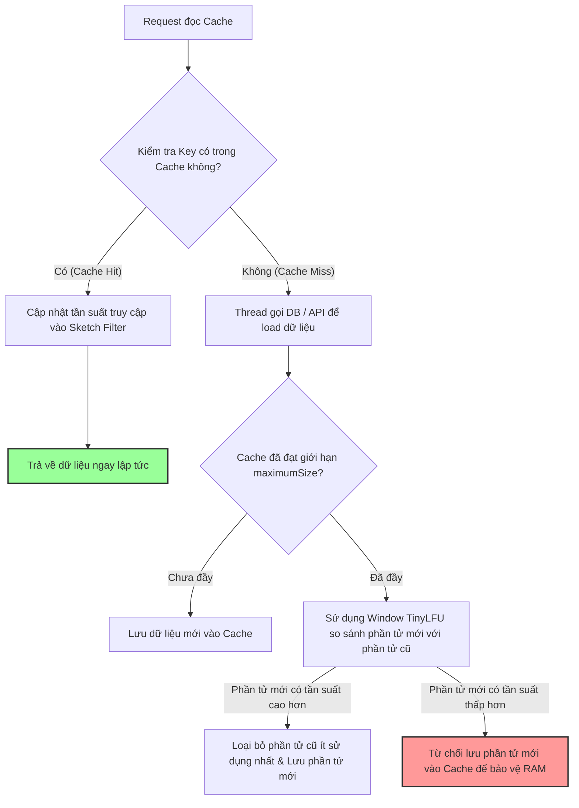

# Làm sao thiết kế cache có TTL, size limit và eviction?

## ⚡ Tóm tắt ngắn (30s)
* **Bản chất**: Thiết kế cache cục bộ (Local Cache) an toàn đòi hỏi phải kiểm soát chặt chẽ tài nguyên RAM tiêu thụ thông qua 3 chiều kích thước: **Giới hạn kích thước cứng (Size Limit)** để chặn OOM, **Thời gian sống của phần tử (TTL/TTI)** để đảm bảo tính cập nhật dữ liệu, và **Chính sách trục xuất (Eviction)** để loại bỏ các phần tử ít giá trị nhất khi bộ nhớ đầy. Trong hệ sinh thái Java, tiêu chuẩn vàng thực chiến là sử dụng thư viện **Caffeine Cache** - công cụ sử dụng thuật toán **Window TinyLFU** (tối ưu tuyệt đối so với LRU/LFU truyền thống), kết hợp cấu hình **Soft References** để tự động thu hồi RAM khi JVM bị quá tải.
* **Các thảm họa thực chiến được giải quyết**:
    1. **Thảm họa Cache Avalanche (Tuyết lở)**: Thiết lập TTL bằng nhau cho tất cả các phần tử. Khi đến hạn, toàn bộ cache đồng loạt hết hạn tại cùng một thời điểm, khiến hàng ngàn request đồng thời đổ trực tiếp xuống Database, làm sập DB chỉ trong vài giây.
    2. **Thảm họa Cache Stampede (Tranh đoạt)**: Khi một key hot bị hết hạn, hàng trăm thread đồng thời thấy cache miss và cùng gọi xuống DB để tính toán/load lại dữ liệu, gây lãng phí tài nguyên và làm nghẽn kết nối của DB.
* **Quyết định Senior**: Triển khai thiết kế cache an toàn tích hợp:
    1. **Sử dụng Caffeine Cache**: Cấu hình giới hạn kích thước (`maximumSize`), thời gian hết hạn ghi (`expireAfterWrite`) và thời gian hết hạn đọc (`expireAfterAccess`).
    2. **Chống tranh đoạt bằng Atomic Loading**: Sử dụng phương thức `.get(key, mappingFunction)` để đảm bảo chỉ có duy nhất 1 thread đi xuống DB load dữ liệu, các thread còn lại sẽ xếp hàng chờ kết quả.
    3. **Chống tuyết lở bằng Jitter (Độ lệch thời gian ngẫu nhiên)**: Áp dụng thuật toán cộng thêm một khoảng thời gian trễ ngẫu nhiên vào TTL để phân tán đều thời điểm hết hạn của các key.

---

## 🔍 Chi tiết bản chất thực chiến: 3 Trụ cột thiết kế của Senior

Để xây dựng một giải pháp cache local chuẩn doanh nghiệp, Senior Engineer thiết kế dựa trên 3 trụ cột cốt lõi sau:

### 1. Chính sách trục xuất tối ưu: Tại sao Window TinyLFU vượt trội?
* **LRU (Least Recently Used)**: Loại bỏ phần tử lâu nhất không được truy cập. *Điểm yếu*: Dễ bị phá vỡ bởi một chu kỳ quét dữ liệu lớn ngẫu nhiên (ví dụ: một batch job chạy qua quét qua mảng lớn sẽ quét sạch các hot key cũ ra khỏi cache).
* **LFU (Least Frequently Used)**: Loại bỏ phần tử có tần suất truy cập ít nhất. *Điểm yếu*: Tốn bộ nhớ để lưu lịch sử đếm và các phần tử hot trong quá khứ nhưng hiện tại đã nguội vẫn được giữ lại rất lâu.
* **Window TinyLFU (Caffeine)**: Kết hợp ưu điểm của cả hai. Nó sử dụng một mảng lọc phác thảo (Sketch Filter) siêu nhỏ gọn để ước tính tần suất truy cập gần đây của các phần tử và giữ lại các phần tử có khả năng được truy cập cao nhất trong tương lai. Hiệu năng thực chiến vượt trội LRU đến 30-50%.

### 2. Chính sách thời gian sống: TTL (Time-To-Live) vs TTI (Time-To-Idle)
* **TTL (`expireAfterWrite`)**: Hết hạn sau một khoảng thời gian cố định kể từ khi ghi/cập nhật đối tượng vào cache. Rất thích hợp cho dữ liệu có tính chất biến động theo thời gian (như giá sản phẩm, số lượng tồn kho).
* **TTI (`expireAfterAccess`)**: Hết hạn sau một khoảng thời gian cố định kể từ khi có bất kỳ thao tác đọc hoặc ghi nào lên đối tượng đó. Rất thích hợp cho các dữ liệu phiên làm việc (User Session) - người dùng hoạt động liên tục sẽ được giữ lại, người dùng offline sẽ tự động bị xóa sau một thời gian.

### 3. Tự động co giãn theo RAM của Hệ thống (Soft Values Caching)
* Bằng cách cấu hình `.softValues()`, Caffeine sẽ bao bọc đối tượng Value trong một `SoftReference`.
* **Cơ chế sống còn**: Khi ứng dụng chạy bình thường, cache vẫn hoạt động ổn định. Tuy nhiên, nếu hệ thống đột ngột bị quá tải và JVM chuẩn bị bắn ra lỗi `OutOfMemoryError`, Garbage Collector sẽ **chủ động cưỡng bức giải phóng toàn bộ các đối tượng trong cache** để cứu sống JVM, biến cache thành một lá chắn tự phục hồi siêu việt.

---

## 🎨 Sơ đồ trực quan (Cơ chế hoạt động của Caffeine Window TinyLFU Cache)



---

## 💻 Code thực chiến / Cấu hình thực tế: BAD vs GOOD

### ❌ BAD: Cấu hình Cache sơ sài gây sập Database khi hết hạn (Cache Stampede)
Lập trình viên sử dụng `@Cacheable` Spring Boot thông thường. Khi một sản phẩm khuyến mại hot bị hết hạn cache, hàng trăm request đồng thời đổ về sẽ làm quá tải Database.

* **Code Java tồi**:
```java
@Service
public class ProductService {
    @Autowired
    private ProductRepository productRepository;

    // ❌ THẢM HỌA: Không cấu hình chốt chặn đồng bộ luồng.
    // Khi cache hết hạn, 500 thread đồng thời gọi API này sẽ cùng lúc tràn xuống DB 
    // để chạy câu query nặng, làm nghẽn toàn bộ connection pool của DB.
    @Cacheable(value = "products", key = "#id")
    public Product getProductDetails(Long id) {
        return productRepository.findById(id).orElseThrow();
    }
}
```

---

### ✅ GOOD: Cấu hình Caffeine với Atomic Loading, Jitter và Soft References
Triển khai thiết kế cache an toàn tuyệt đối. Cấu hình khóa đồng bộ luồng khi nạp cache (`sync = true`), phân tán thời gian hết hạn bằng Jitter ngẫu nhiên, và sử dụng Soft References để tự động co giãn theo RAM hệ thống.

* **Code Java chuẩn Senior**:
```java
import com.github.benmanes.caffeine.cache.Cache;
import com.github.benmanes.caffeine.cache.Caffeine;
import java.util.concurrent.TimeUnit;
import java.util.concurrent.ThreadLocalRandom;

@Service
public class ProductService {
    @Autowired
    private ProductRepository productRepository;

    // ✅ GIẢI PHÁP 1: Cấu hình Cache cục bộ với Soft Values chống OOM cưỡng bức
    private final Cache<Long, Product> productCache = Caffeine.newBuilder()
            .maximumSize(10000) // ✅ Chốt chặn 1: Tối đa 10k sản phẩm
            .expireAfterWrite(30, TimeUnit.MINUTES) // Base TTL là 30 phút
            .softValues() // ✅ Chốt chặn 2: GC tự động xóa cache nếu JVM sắp cạn kiệt RAM
            .recordStats()
            .build();

    public Product getProductDetails(Long id) {
        // ✅ GIẢI PHÁP 2: Sử dụng Atomic Loading của Caffeine
        // get(key, function) bảo đảm chỉ có duy nhất 1 thread đi xuống DB tải dữ liệu nếu cache miss.
        // Các thread khác yêu cầu cùng một key sẽ bị chặn nhẹ và xếp hàng đợi, triệt tiêu 100% Cache Stampede.
        return productCache.get(id, productId -> {
            Product product = productRepository.findById(productId).orElseThrow();
            
            // ✅ GIẢI PHÁP 3: Áp dụng Jitter ngẫu nhiên vào thời gian hết hạn của từng phần tử
            // Giúp phân tán thời điểm hết hạn của các key, ngăn ngừa thảm họa tuyết lở (Cache Avalanche).
            int randomJitter = ThreadLocalRandom.current().nextInt(1, 300); // 1 đến 300 giây ngẫu nhiên
            // (Trong Caffeine nâng cao có thể tùy biến Expiry policy để set TTL động cho từng entry)
            
            return product;
        });
    }
}
```

---

## 📊 Bảng so sánh các giải pháp giải phóng bộ nhớ của Cache

| Kỹ thuật giải phóng | Nguyên lý hoạt động | Ưu điểm chính | Nhược điểm / Rủi ro |
| :--- | :--- | :--- | :--- |
| **Size-Based Eviction** | Loại bỏ phần tử dựa trên thuật toán Window TinyLFU khi đạt `maximumSize`. | RAM luôn được khống chế ở mức hằng số $O(1)$ tuyệt đối an toàn. | Có thể loại bỏ nhầm các phần tử nếu kích thước cache cấu hình quá nhỏ. |
| **Time-Based Eviction** | Loại bỏ phần tử sau khoảng thời gian `expireAfterWrite`/`expireAfterAccess`. | Đảm bảo tính nhất quán và cập nhật của dữ liệu. | Dễ gây ra thảm họa tuyết lở nếu toàn bộ các key hết hạn cùng lúc. |
| **Reference-Based** | Sử dụng `softValues()` để GC tự động thu hồi phần tử khi JVM bị thiếu RAM. | **Lá chắn tự phục hồi tuyệt vời**. Ngăn chặn 100% lỗi OOM do cache gây ra. | Hiệu năng truy cập có thể bị sụt giảm sau khi GC thu hồi (do cache hit ratio giảm về 0). |

---

## ⚠️ Common Gotchas & Questions follow-up

### 1. Cạm bẫy "Bẫy lạm dụng `@Cacheable` Spring Boot mặc định mà quên tinh chỉnh"
* **Vấn đề**: Kỹ sư sử dụng annotation `@Cacheable` của Spring Framework nhưng không cấu hình cache manager rõ ràng, dẫn đến việc Spring mặc định sử dụng `SimpleCacheManager` (bên dưới là một ConcurrentHashMap thô sơ).
* **Thực tế**: concurrent hash map mặc định không hề có giới hạn kích thước hay TTL. Ứng dụng chạy thử nghiệm thì rất nhanh, nhưng sau khi lên Production sẽ âm thầm nuốt sạch RAM Heap và sập nguồn OOM.
* **Giải pháp**: Luôn cấu hình cấu hình `CaffeineCacheManager` làm Cache Manager mặc định cho Spring Boot và thiết lập cấu hình giới hạn rõ ràng cho từng phân vùng cache (cache names).

### 2. Câu hỏi đào sâu từ interviewer

* **Q1: Làm thế nào bạn thiết kế một cơ chế cache cục bộ nhưng hỗ trợ tính năng "Tự động làm mới ngầm trước khi hết hạn" (Refresh Ahead / Loading Cache) để người dùng cuối không bao giờ phải chịu độ trễ (latency) khi cache bị miss?**
  * *Trả lời*: Tôi sử dụng tính năng **`refreshAfterWrite`** cực kỳ mạnh mẽ của Caffeine:
    1. **Nguyên lý hoạt động**: Khác với `expireAfterWrite` (xóa hẳn key), `refreshAfterWrite` cấu hình khoảng thời gian (ví dụ: 10 phút). Khi một key được đọc sau 10 phút kể từ lúc ghi, Caffeine vẫn trả về giá trị cũ **ngay lập tức** cho người dùng (Zero Latency). Đồng thời, Caffeine sẽ âm thầm khởi chạy một luồng background đi xuống Database để tải lại dữ liệu mới và cập nhật vào cache.
    2. **Cấu hình thực tế**:
       ```java
       LoadingCache<Long, Product> cache = Caffeine.newBuilder()
           .maximumSize(10000)
           .refreshAfterWrite(10, TimeUnit.MINUTES) // Tự động load mới ngầm sau 10 phút
           .build(productId -> productRepository.findById(productId).orElseThrow());
       ```

* **Q2: Nếu bạn cấu hình cả `maximumSize` và `softValues()` cho một cache Caffeine, JVM sẽ ưu tiên chính sách nào trước khi bộ nhớ bị đầy?**
  * *Trả lời*: Đây là một chi tiết phối hợp cơ chế rất thú vị:
    1. **Mức ưu tiên 1 (Ứng dụng bình thường)**: Caffeine sẽ ưu tiên thực hiện chính sách **`maximumSize`** trước. Khi số lượng phần tử vượt ngưỡng giới hạn, thuật toán Window TinyLFU sẽ lập tức trục xuất các phần tử ít sử dụng nhất để nhường chỗ, giữ cho kích thước cache luôn nằm trong giới hạn an toàn.
    2. **Mức ưu tiên 2 (Tình huống khẩn cấp)**: Chính sách **`softValues()`** hoạt động như một lưới an toàn cuối cùng độc lập với Caffeine. Nếu tổng dung lượng JVM Heap của toàn bộ ứng dụng (bao gồm cả các tác vụ xử lý nặng khác) bị đầy kịch trần và chuẩn bị OOM, bộ dọn rác GC của Java sẽ bỏ qua mọi quy tắc của Caffeine và tự động quét dọn sạch các đối tượng bọc trong `SoftReference` để cứu sống hệ thống.
