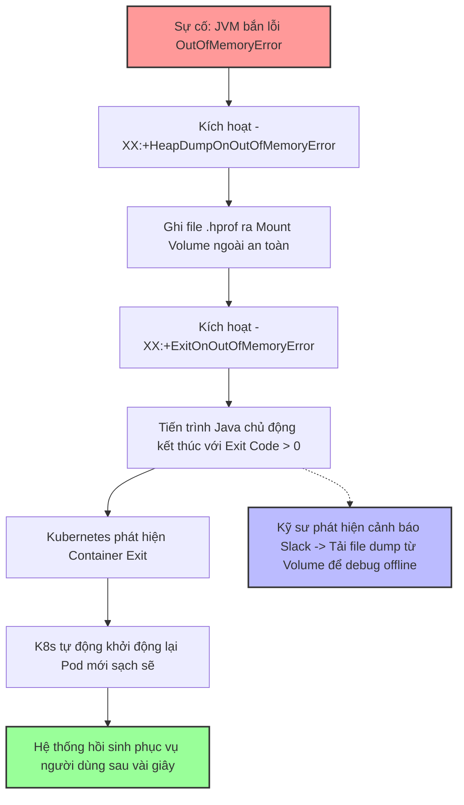

# OOM nên auto restart service không?

## ⚡ Tóm tắt ngắn (30s)
* **Bản chất**: Câu trả lời của Senior là **BẮT BUỘC PHẢI AUTO RESTART**, nhưng đi kèm với điều kiện **phải lưu trữ được bằng chứng chẩn đoán (Heap Dump)** trước khi khởi động lại. Khi gặp OOM, JVM rơi vào trạng thái không xác định (Undetermined State): Các luồng nghiệp vụ bị treo cứng, GC chạy liên tục làm CPU tăng 100%, nhưng tiến trình Java vật lý có thể không tự chết (Silent Death). Việc ép ứng dụng tự thoát lập tức để hạ tầng (Kubernetes/Systemd) hồi sinh lại một instance sạch sẽ là giải pháp duy nhất để bảo đảm tính sẵn sàng cao (High Availability), giảm thiểu tối đa thời gian gián đoạn dịch vụ của người dùng.
* **Các thảm họa thực chiến được giải quyết**:
    1. **Thảm họa treo cứng âm thầm (Silent Hang)**: Ứng dụng bị OOM, các API không thể phản hồi nhưng Pod vẫn ở trạng thái `Running` trên K8s. Load Balancer tiếp tục chuyển hướng traffic vào Pod chết này, gây lỗi 504 cho hàng ngàn người dùng suốt nhiều giờ cho đến khi kỹ sư phát hiện ra và restart bằng tay.
    2. **Thảm họa vòng lặp tự sát (CrashLoopBackOff)**: Pod bị OOMKilled, tự động restart nhưng lập tức consume lại đúng tệp tin lớn độc hại (Poison Message) từ Kafka/Message Queue cũ và tiếp tục bị OOM liên tục trong vòng lặp vô hạn.
* **Quyết định Senior**: Thiết lập chiến lược phản ứng nhanh kết hợp 3 lớp:
    1. **Ép JVM tự sát lập tức**: Sử dụng cấu hình `-XX:+ExitOnOutOfMemoryError` để JVM chủ động thoát ngay khi gặp OOM lần đầu tiên, không để ứng dụng rơi vào trạng thái hấp hối kẹt luồng.
    2. **Chụp ảnh hiện trường trước khi chết**: Luôn bật `-XX:+HeapDumpOnOutOfMemoryError` và ghi tệp dump vào một Storage Volume mount ngoài để bảo toàn chứng cứ phục vụ chẩn đoán offline.
    3. **Chống bẫy CrashLoop**: Thiết lập cơ chế Dead Letter Queue (DLQ) cho Message Broker và giới hạn số lần retry tối đa để cô lập các payload độc hại.

---

## 🔍 Chi tiết bản chất thực chiến: Tại sao không được để JVM "hấp hối"?

Senior Engineer phân tích sâu về lý do kỹ thuật tại sao phải ép tiến trình tự sát ngay khi gặp OOM:

### 1. Trạng thái không xác định (Undetermined State) của JVM
* Khi gặp OOM, JVM không chết ngay lập tức. Nó cố gắng giải phóng bất kỳ tài nguyên nào có thể để tiếp tục duy trì hoạt động.
* **Hậu quả**: Một số luồng chạy nền (Background Threads) quan trọng có thể bị chết ngầm, trong khi luồng Web Server (như Tomcat Thread) vẫn cố sống vật vờ. Ứng dụng rơi vào trạng thái "sống thực vật" (Zombie State): Vẫn phản hồi ping cơ bản hoặc HTTP Liveness Probe đơn giản, nhưng hoàn toàn thất bại khi xử lý các nghiệp vụ logic thực tế.

### 2. Sự tàn phá tài nguyên của GC Thrashing
* Như đã phân tích ở phần trước, JVM khi cạn Heap sẽ ép toàn bộ CPU chạy Full GC liên tục.
* Việc giữ lại một Pod hấp hối không chịu restart sẽ vắt kiệt năng lực xử lý CPU của toàn bộ máy chủ vật lý (Node), kéo theo hiệu năng của các Pod hàng xóm chạy chung trên Node đó bị suy giảm nghiêm trọng (Hiện tượng Noisy Neighbor).

### 3. Vấn đề "Mất vết bằng chứng" (Loss of Evidence)
* Nhiều kỹ sư ngại auto restart vì cho rằng khi Pod bị xóa và khởi động lại, toàn bộ dữ liệu log cục bộ và tệp tin Heap Dump sẽ bị xóa sạch theo vòng đời của Container.
* **Giải pháp**: Đây là vấn đề thuộc về thiết kế hạ tầng, không phải lý do để từ chối restart. Ta giải quyết bằng cách mount một Persistent Volume hoặc EmptyDir để bảo toàn file dump, kết hợp hệ thống log tập trung (ELK/Datadog) để lưu vết log.

---

## 🎨 Sơ đồ trực quan (Chiến lược xử lý OOM thông minh trên Kubernetes)



---

## 💻 Code thực chiến / Cấu hình thực tế: BAD vs GOOD

### ❌ BAD: Không cấu hình cờ tự sát, để ứng dụng sống thực vật
Ứng dụng bị OOM, kẹt luồng và CPU tăng 100% nhưng tiến trình Java vẫn chạy, container K8s vẫn báo `Running`.

* **Cấu hình khởi chạy JVM tồi**:
```bash
# ❌ Hoàn toàn phó mặc cho JVM tự sinh tự diệt, dẫn đến treo cứng ứng dụng mà không restart
java -Xms2g -Xmx2g -jar application.jar
```

---

### ✅ GOOD: Cấu hình JVM tự sát an toàn kết hợp ghi Heap Dump chuyên nghiệp
Senior Engineer thiết lập cấu hình JVM chủ động thoát ngay lập tức khi OOM, kết hợp chụp Heap Dump lưu vào Persistent Volume để phục vụ chẩn đoán offline.

* **Cấu hình khởi chạy JVM chuẩn Senior**:
```bash
# ✅ Ép JVM tự sát lập tức khi gặp OOM lần đầu để K8s hồi sinh Pod mới
# ✅ Chụp Heap Dump và ghi ra volume ngoài an toàn
java -Xms2g -Xmx2g \
  -XX:+HeapDumpOnOutOfMemoryError \
  -XX:HeapDumpPath=/var/log/dumps/java_oom.hprof \
  -XX:+ExitOnOutOfMemoryError \
  -jar application.jar
```

* **Cấu hình Liveness/Readiness Probe chuẩn trong Kubernetes (`deployment.yaml`)**:
Sử dụng endpoint kiểm tra sức khỏe có chứa kiểm tra trạng thái bộ nhớ Heap thực tế thông qua Spring Boot Actuator.
```yaml
spec:
  containers:
  - name: my-app
    image: my-app-image:latest
    livenessProbe:
      httpGet:
        path: /actuator/health/liveness
        port: 8080
      initialDelaySeconds: 30 # ✅ Cho phép JVM có đủ thời gian warm-up
      periodSeconds: 10
      timeoutSeconds: 3 # ✅ Timeout ngắn để phát hiện treo luồng nhanh chóng
      failureThreshold: 3
```

---

## 📊 Bảng so sánh các phương án phản ứng khi gặp OOM

| Tiêu chí so sánh | Để mặc JVM tự phục hồi | Restart thủ công bằng tay | Tự động Restart cứng (ExitOnOOM) |
| :--- | :--- | :--- | :--- |
| **Thời gian phục hồi hệ thống (Downtime)** | Vô hạn (Ứng dụng kẹt cứng vĩnh viễn). | Chậm (Phụ thuộc vào thời gian kỹ sư nhận cảnh báo và thao tác). | **Cực nhanh** (Chỉ mất vài giây để Kubernetes tạo Pod mới). |
| **Độ an toàn tài nguyên Node** | Tồi (GC liên tục ngốn 100% CPU của Node). | Trung bình. | **Cực tốt** (Tải rác bị triệt tiêu ngay lập tức khi tiến trình thoát). |
| **Bảo toàn bằng chứng lỗi** | Tốt. | Tốt (Nếu kỹ sư chủ động chụp dump trước khi restart). | **Tốt** (Nếu cấu hình lưu dump ra Persistent Volume ngoài). |

---

## ⚠️ Common Gotchas & Questions follow-up

### 1. Cạm bẫy "Bẫy tự sát dây chuyền do OOM lan truyền (Cascade OOM)"
* **Vấn đề**: Bạn cấu hình `-XX:+ExitOnOutOfMemoryError` cho 10 Node ứng dụng chạy sau Load Balancer. Khi có một request độc hại gây OOM, Node 1 sập và tự sát. Load Balancer nhận thấy Node 1 chết, liền tự động chuyển hướng (retry) request độc hại đó sang Node 2. Node 2 tiếp tục bị OOM và tự sát. Quá trình lan truyền này diễn ra liên tục làm sập toàn bộ cụm 10 Node chỉ trong vòng vài chục giây.
* **Thực tế**: Restart tự động là đúng, nhưng thiếu cơ chế **Chống lặp (Deduplication)** và **Ngắt mạch (Circuit Breaking)** đối với các request độc hại đầu vào.
* **Giải pháp**: Cấu hình API Gateway phát hiện và từ chối các request trùng lặp (ví dụ: so sánh request hash hoặc idempotency key), sử dụng Rate Limiting và Dead Letter Queue để cô lập lỗi.

### 2. Câu hỏi đào sâu từ interviewer

* **Q1: Trong Kubernetes, sự khác biệt giữa tín hiệu `SIGTERM` (Exit Code 143) và `SIGKILL` (Exit Code 137) khi tiến trình Java bị hủy là gì? Việc cấu hình `-XX:+ExitOnOutOfMemoryError` sẽ trả về Exit Code nào?**
  * *Trả lời*:
    1. **`SIGTERM` (Exit Code 143)**: Là tín hiệu yêu cầu dừng ứng dụng một cách êm ái (Graceful Shutdown). Khi nhận được tín hiệu này, JVM sẽ kích hoạt các Shutdown Hooks, hoàn tất các request đang xử lý dở dang, đóng các kết nối DB và tắt tiến trình một cách lịch sự.
    2. **`SIGKILL` (Exit Code 137)**: Là tín hiệu hủy diệt cưỡng bức từ Hệ điều hành (hoặc Docker/K8s). Hệ điều hành lập tức chấm dứt tiến trình Java ngay tại CPU mà không cho phép chạy bất kỳ dòng code dọn dẹp hay shutdown hook nào.
    3. **Khi dùng `ExitOnOutOfMemoryError`**: Tiến trình Java chủ động gọi hàm `System.exit(đại_diện_cho_lỗi)` từ bên trong code. Tiến trình kết thúc với một Exit Code khác 0 (thường là **Exit Code 3**). Điều này giúp Kubernetes dễ dàng nhận biết đây là sự cố chủ động từ bên trong ứng dụng để kích hoạt quy trình restart khẩn cấp, thay vì bị ép chết từ bên ngoài bởi OS.

* **Q2: Nếu tệp tin Heap Dump sinh ra khi OOM có dung lượng quá lớn (ví dụ: 16GB) và đĩa cứng của Container bị đầy trong quá trình ghi file dump, hậu quả là gì và làm thế nào bạn phòng ngừa rủi ro này?**
  * *Trả lời*:
    1. **Hậu quả**: Khi ổ đĩa bị đầy 100%, việc ghi file dump bị dừng lại giữa chừng (file corrupted). Ngoài ra, đĩa cứng đầy sẽ làm sập toàn bộ các tác vụ ghi log khác của container, khiến Pod rơi vào trạng thái cực kỳ hỗn loạn.
    2. **Phòng ngừa chuẩn Senior**:
       * **Sử dụng EmptyDir có giới hạn kích thước**: Trong file YAML cấu hình K8s, tôi mount một volume dạng `emptyDir` có thiết lập giới hạn cứng `sizeLimit` (ví dụ: `sizeLimit: 20Gi`) để bảo vệ đĩa chính của Node vật lý.
       * **Sử dụng cờ nén dump trực tiếp**: Từ Java 11 trở lên, tôi cấu hình cờ `-XX:+UseGCOverheadLimit` kết hợp nén file dump trực tiếp khi ghi để giảm dung lượng file xuống 5-10 lần:
         ```bash
         # JVM hiện đại hỗ trợ nén trực tiếp khi chụp dump
         jcmd <pid> GC.heap_dump /var/log/dumps/dump.hprof.gz
         ```
