# Cần log/metric gì để phát hiện memory leak sớm?

## ⚡ Tóm tắt ngắn (30s)
* **Bản chất**: Hệ thống cảnh báo sớm (Early Warning System) rò rỉ bộ nhớ dựa trên việc giám sát các **chỉ số vi sai dài hạn (Long-term Trend Metrics)** của JVM thay vì nhìn vào dung lượng RAM tổng thể tức thời. Chỉ số sống còn cần theo dõi sát sao là **Mức chiếm dụng bộ nhớ của Tenured Gen (Old Gen) ngay sau khi một chu kỳ Full GC kết thúc**. Nếu chỉ số này có xu hướng tăng tuyến tính liên tục qua nhiều ngày (độ dốc dương bền vững), 100% ứng dụng của bạn bị Memory Leak và cần được cảnh báo khẩn cấp trước khi OOM xảy ra.
* **Các thảm họa thực chiến được giải quyết**:
    1. **Thảm họa OOM bất ngờ lúc cao điểm (Peak Hour Crash)**: Hệ thống bị leak bộ nhớ cực chậm. Do thiếu cảnh báo sớm, ứng dụng âm thầm cạn kiệt RAM và sập nguồn đúng vào ngày Black Friday khi tải lượng tăng cao, gây tổn thất doanh thu lớn.
    2. **Thảm họa Alert Fatigue (Mệt mỏi vì cảnh báo rác)**: Thiết lập cảnh báo dựa trên RAM Container chung (ví dụ: RAM Container > 85% thì bắn alert). Do JVM luôn có xu hướng giữ lại bộ nhớ trống để tái sử dụng, cảnh báo này liên tục bắn tin nhắn rác về kênh Slack của team làm nhiễu thông tin, khiến các kỹ sư tắt cảnh báo và bỏ lỡ sự cố thật.
* **Quyết định Senior**: Thiết lập hệ thống giám sát 3 tầng kết hợp Prometheus + Grafana và GC Logs:
    1. **Theo dõi mức sàn Old Gen sau GC**: Cấu hình alert Prometheus sử dụng hàm đạo hàm (`predict_linear` hoặc `deriv`) để tính toán tốc độ tăng trưởng của Old Gen trong 24/48 giờ tiếp theo.
    2. **Giám sát Hiệu năng GC (GC Telemetry)**: Theo dõi tần suất chạy GC (`jvm_gc_pause_seconds_count`) và tổng thời gian đóng băng Stop-the-world (`jvm_gc_pause_seconds_sum`).
    3. **Kích hoạt Cảnh báo sớm thông minh**: Bắn cảnh báo nếu tỷ lệ thời gian chạy GC (GC CPU Overhead) vượt quá 5% tổng thời gian vận hành liên tục trong 15 phút.

---

## 🔍 Chi tiết bản chất thực chiến: 4 Nhóm Metrics vàng của Senior

Để thiết lập một hệ thống phòng ngự giám sát hoàn chỉnh cho JVM, Senior Engineer cấu hình thu thập và giám sát 4 nhóm chỉ số vàng sau:

### 1. Nhóm Metric quan trọng nhất: JVM Memory Pools
* **`jvm_memory_used_bytes` phân loại theo vùng nhớ (`area="heap"`, `id="G1 Old Gen"` hoặc `Tenured Gen`)**:
  * *Cách phân tích*: Biểu đồ Heap RAM thông thường sẽ đi lên đi xuống liên tục theo hình răng cưa do hoạt động Minor GC dọn dẹp vùng Eden. Ta phải cấu hình bộ lọc **chỉ lấy giá trị bộ nhớ tại điểm đáy ngay sau khi kết thúc chu kỳ Full GC**.
  * Nếu điểm sàn này tăng tịnh tiến (độ dốc đi lên liên tục qua các ngày), đó là bằng chứng thép của Memory Leak.
* **`jvm_memory_max_bytes`**: Để đối chiếu dung lượng thực tế đang dùng so với giới hạn cứng `-Xmx`.

### 2. Nhóm Metric về hoạt động của Garbage Collector (GC Performance)
* **`jvm_gc_pause_seconds_sum` (Tổng thời gian pause do GC)**: Giúp phát hiện thời gian ứng dụng bị đóng băng (Stop-the-world). Nếu con số này tăng vọt, p99 latency của hệ thống chắc chắn bị ảnh hưởng xấu.
* **`jvm_gc_pause_seconds_count` (Số lượng chu kỳ GC)**: Tần suất chạy GC. Tần suất Full GC tăng cao là dấu hiệu Heap sắp hết sạch không gian trống.
* **Tỷ lệ GC Overhead (GC CPU Load)**: Được tính bằng công thức:
  $$\text{GC CPU Overhead} = \frac{\text{Thời gian chạy GC}}{\text{Tổng thời gian vận hành}} \times 100\%$$
  Nếu tỷ lệ này vượt quá 5-10%, CPU của bạn đang bị lãng phí cực kỳ nghiêm trọng cho GC.

### 3. Nhóm Metric vùng nhớ ngoài Heap (Non-Heap & Off-Heap)
* **`jvm_memory_used_bytes{area="nonheap", id="Metaspace"}`**: Giám sát RAM vùng nạp class. Rất quan trọng để phát hiện lỗi rò rỉ ClassLoader (thường do hot-deploy).
* **`jvm_buffer_memory_used_bytes{id="direct"}` (Direct Memory Buffer)**: Giám sát vùng nhớ Off-heap nạp bởi Netty/Spring WebFlux. Phát hiện rò rỉ buffer cực sớm mà Heap dump thông thường không thể chỉ ra.

### 4. Nhóm Metric về luồng và Class (Threads & Classes)
* **`jvm_threads_states_threads` (Số lượng thread phân loại theo trạng thái RUNNABLE, WAITING, BLOCKED)**: Số lượng thread tăng liên tục theo thời gian (Thread leak) là nguyên nhân gây rò rỉ RAM gián tiếp (mỗi Thread tiêu tốn ~1MB RAM cho vùng Stack).
* **`jvm_classes_loaded_classes` và `jvm_classes_unloaded_classes_total`**: Phát hiện lỗi nạp class động không giới hạn.

---

## 🎨 Sơ đồ trực quan (Biểu đồ so sánh RAM ổn định vs Rò rỉ bộ nhớ)

```mermaid
gantt
    title Biểu đồ so sánh RAM giữa ứng dụng bình thường vs Rò rỉ (Memory Leak)
    dateFormat  X
    axisFormat %s
    
    section Bình thường (Răng cưa nằm ngang)
    Minor GC dọn Eden           :active, 0, 10
    Minor GC dọn Eden 2         :active, 10, 20
    Full GC dọn Old Gen về sàn  :done, 20, 21
    Minor GC dọn Eden 3         :active, 21, 30
    Mức sàn ổn định ở 20% RAM   :crit, 21, 40
    
    section Rò rỉ bộ nhớ (Độ dốc sàn tăng đều)
    Minor GC dọn Eden           :active, 0, 10
    Full GC kết thúc ở sàn 35%  :done, 10, 11
    Minor GC dọn Eden 2         :active, 11, 20
    Full GC kết thúc ở sàn 50%  :done, 20, 21
    Minor GC dọn Eden 3         :active, 21, 30
    Full GC kết thúc ở sàn 70%  :done, 30, 31
    OOM kề cận ở sàn 95% RAM    :crit, 31, 40
```


> [!NOTE]
> Nhìn vào đồ thị: Vết răng cưa của ứng dụng rò rỉ bộ nhớ có **các điểm sàn (mức tối thiểu sau GC) tăng đều đặn**. Đây là dấu hiệu cảnh báo sớm quan trọng nhất.

---

## 💻 Code thực chiến / Cấu hình thực tế: BAD vs GOOD

### ❌ BAD: Tạo câu truy vấn Alert thô sơ gây báo động rác (False Alerts)
Cài đặt cảnh báo dựa trên dung lượng RAM của JVM Heap vượt ngưỡng 85%. Do Java JVM có xu hướng lười trả bộ nhớ cho OS, Heap sử dụng thực tế luôn duy trì ở mức cao, khiến hệ thống liên tục bắn cảnh báo rác gây alert fatigue.

* **Cấu hình Alert Prometheus (PromQL) tồi**:
```yaml
# ❌ THẢM HỌA: RAM Heap > 85% là cảnh báo
# Alert này sẽ bắn liên tục hàng ngày ngay cả khi ứng dụng hoạt động hoàn toàn bình thường
groups:
  - name: jvm_alerts
    rules:
    - alert: JavaHeapHighUsage
      expr: (jvm_memory_used_bytes{area="heap"} / jvm_memory_max_bytes{area="heap"}) * 100 > 85
      for: 5m
      labels:
        severity: warning
      annotations:
        summary: "⚠️ Cảnh báo rác: Java Heap sử dụng vượt 85%"
```

---

### ✅ GOOD: Cấu hình Alert thông minh sử dụng hàm dự đoán độ dốc tuyến tính (Linear Prediction)
Senior Engineer cấu hình alert sử dụng hàm **`predict_linear`** của Prometheus. Hàm này thực hiện phân tích thống kê xu hướng tăng trưởng của vùng nhớ Old Gen trong vòng 24 giờ qua. Nếu thuật toán dự đoán vùng Old Gen sẽ bị tràn kịch trần (OOM) trong vòng 4 giờ tới, cảnh báo chất lượng cao sẽ lập tức được gửi đi.

* **Cấu hình Alert Prometheus (PromQL) chuẩn Senior**:
```yaml
groups:
  - name: jvm_smart_alerts
    rules:
    # ✅ CẢNH BÁO 1: Dự đoán tràn RAM Old Gen trong vòng 4 giờ tới dựa trên dữ liệu 24 giờ qua
    # Triệt tiêu 100% cảnh báo rác, chỉ bắn khi thực sự có xu hướng leak bộ nhớ bền vững.
    - alert: JVM_OldGen_MemoryLeak_Prediction
      expr: predict_linear(jvm_memory_used_bytes{area="heap", id=~".*Old Gen|.*Tenured Gen"}[24h], 14400) > jvm_memory_max_bytes{area="heap", id=~".*Old Gen|.*Tenured Gen"}
      for: 30m
      labels:
        severity: critical
        team: backend-senior
      annotations:
        summary: "🚨 Phát hiện Memory Leak: Dự đoán Old Gen sẽ tràn và OOM trong 4 giờ tới!"
        description: "Pod {{ $labels.instance }} có xu hướng rò rỉ Old Gen liên tục. Vui lòng lấy Heap Dump để phân tích."

    # ✅ CẢNH BÁO 2: GC CPU Overhead quá cao (> 10% tổng thời gian chạy trong 15 phút)
    # Phát hiện sớm hiện tượng GC Thrashing tàn phá CPU trước khi sập OOM
    - alert: JVM_GC_Overhead_Too_High
      expr: rate(jvm_gc_pause_seconds_sum[15m]) > 0.10
      for: 5m
      labels:
        severity: warning
      annotations:
        summary: "⚠️ Cảnh báo: JVM GC Pause chiếm hơn 10% CPU time!"
```

---

## 📊 Bảng tổng hợp các chỉ số cảnh báo sớm Memory Leak

| Tên Metric trong Prometheus | Mô tả chi tiết | Ngưỡng cấu hình Alert khuyên dùng | Ý nghĩa hành động |
| :--- | :--- | :--- | :--- |
| `predict_linear(jvm_memory_used_bytes{id=~".*Old.*"}[12h], 28800)` | Đạo hàm dự đoán RAM Old Gen sẽ bị tràn trong 8 giờ tiếp theo. | **Lớn hơn kích thước tối đa (`max_bytes`)**. | Có Memory Leak thật sự. Lập tức lên lịch bảo trì chụp Heap Dump. |
| `rate(jvm_gc_pause_seconds_sum[15m])` | Tỷ lệ thời gian dừng do Garbage Collection. | **> 0.05** (GC chiếm hơn 5% CPU). | GC đang bị quá tải tài nguyên. Cần xem xét tăng Heap hoặc tối ưu hóa tốc độ tạo đối tượng rác. |
| `jvm_threads_states_threads` | Số lượng Thread đang hoạt động trong JVM. | Tăng liên tục không có điểm dừng trong 2 giờ. | Rò rỉ Thread (Thread Leak). Check các khối mã nguồn khởi tạo ExecutorService thiếu `.shutdown()`. |
| `jvm_buffer_memory_used_bytes{id="direct"}` | Bộ đệm bộ nhớ ngoài Heap (Off-Heap). | Vượt quá 80% cấu hình MaxDirectMemorySize. | Rò rỉ bộ nhớ ngoài Heap (Direct Memory Leak). Rà soát lại việc đóng giải phóng Netty ByteBuf. |

---

## ⚠️ Common Gotchas & Questions follow-up

### 1. Cạm bẫy "Mù thông tin do thiếu cờ ghi nhận chi tiết thời gian GC"
* **Vấn đề**: Thu thập được metric GC tổng quát, nhưng khi đọc log ứng dụng thông thường chỉ thấy báo lỗi OOM chung chung, không có vết chi tiết về lịch sử dọn dẹp các phân vùng (Eden, Survivor, Old Gen).
* **Thực tế**: Thiếu cấu hình ghi GC log ra file vật lý. Khi container bị sập, các chỉ số realtime trên Prometheus cũng có thể bị mất vết dữ liệu của vài phút cuối cùng trước khi chết.
* **Giải pháp**: Bắt buộc cấu hình cờ `-Xlog:gc*` chi tiết và đẩy log này về hệ thống quản lý log tập trung (như ELK, Splunk hoặc Loki) thông qua các Agent thu gom log (như Fluentd, Promtail) để bảo toàn vết log sống còn.

### 2. Câu hỏi đào sâu từ interviewer

* **Q1: Tại sao việc theo dõi tần suất chạy Young GC (`jvm_gc_pause_seconds_count` cho vùng Young Gen) tăng cao đôi khi không phải là dấu hiệu của rò rỉ bộ nhớ (Memory Leak), nhưng nếu tần suất Full GC tăng cao thì chắc chắn hệ thống đang có vấn đề nghiêm trọng?**
  * *Trả lời*:
    1. **Tần suất Young GC cao**: Chỉ ra rằng ứng dụng của bạn có tốc độ sinh đối tượng tạm thời rất nhanh (ví dụ: thực hiện nhiều xử lý chuỗi String trong vòng lặp lớn). GC dễ dàng dọn sạch các đối tượng tạm thời này khỏi vùng nhớ Eden chỉ trong vài mili giây. Đây là hiện tượng **quá tải sinh rác tạm thời (High Allocation Rate)**, chỉ làm tốn một chút CPU chứ không gây rò rỉ RAM dài hạn.
    2. **Tần suất Full GC cao**: Chỉ ra rằng vùng nhớ Old Gen đã bị lấp đầy và không thể dọn dẹp. Mỗi lần Full GC chạy, nó bắt buộc phải đóng băng toàn bộ hệ thống (`Stop-the-world`) để quét toàn bộ Heap. Nếu Full GC kích hoạt liên tục (ví dụ: vài giây một lần), điều đó chứng minh bộ nhớ Heap đã cạn kiệt tuyệt đối và ứng dụng sắp sập.

* **Q2: Làm thế nào bạn tính toán được tốc độ rò rỉ bộ nhớ (Leak Rate) của ứng dụng theo đơn vị Megabytes/Hour chỉ dựa trên các chỉ số thu thập từ Prometheus?**
  * *Trả lời*:
    1. **Công thức tính toán**: Tôi sử dụng hàm **`deriv`** (Derivative) của Prometheus để tính toán đạo hàm (tốc độ thay đổi trên giây) của chỉ số bộ nhớ sử dụng của Old Gen ngay sau các chu kỳ GC lớn, sau đó nhân với 3600 giây để quy đổi ra Megabytes/Hour:
       ```promql
       # Tính toán tốc độ tăng trưởng của Old Gen trên mỗi giờ
       deriv(jvm_memory_used_bytes{area="heap", id=~".*Old Gen|.*Tenured Gen"}[24h]) * 3600 / 1048576
       ```
    2. **Hành động sau đó**: Nếu kết quả trả về là một số dương ổn định (ví dụ: `25.5` MB/Hour), tôi biết chính xác hệ thống đang bị rò rỉ trung bình 25.5MB mỗi giờ. Cách này giúp tôi dự báo chính xác sau bao nhiêu ngày nữa thì Heap của container sẽ bị tràn kịch trần để chủ động lên lịch xử lý bảo trì.
