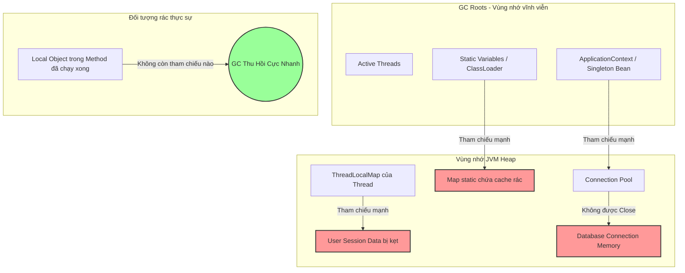

# Heap usage tăng dần theo thời gian và không giảm sau GC. Bạn nghi ngờ gì?

## ⚡ Tóm tắt ngắn (30s)
* **Bản chất**: Hiện tượng bộ nhớ Heap tăng dần đều (hình răng cưa hướng lên) và lượng RAM được giải phóng sau mỗi chu kỳ Full GC ngày càng ít đi gọi là **Memory Leak (Rò rỉ bộ nhớ)**. Bản chất của vấn đề là các đối tượng "rác" đã hết vai trò logic nghiệp vụ nhưng vẫn có các tham chiếu mạnh (**Strong References**) từ những đối tượng gốc (**GC Roots**) bền vững khiến Garbage Collector (GC) bị trói tay, không thể dọn dẹp chúng khỏi vùng nhớ Tenured (Old Gen).
* **Các thảm họa thực chiến được giải quyết**:
    1. **Thảm họa rò rỉ bộ nhớ âm thầm (Slow Death)**: Service chạy cực kỳ ổn định trong 2 ngày đầu, nhưng từ ngày thứ 3, CPU bắt đầu tăng dần, p99 latency tăng vọt do JVM liên tục kích hoạt Full GC (GC Thrashing) trước khi sập hoàn toàn bằng lỗi OutOfMemoryError vào ngày thứ 5.
    2. **Thảm họa lỗi từ thư viện bên thứ 3**: Sử dụng thư viện parse XML/JSON hoặc JWT mà không đóng các stream hoặc giữ static cache không giới hạn, dẫn đến rò rỉ bộ nhớ mà không hề phát hiện ra khi kiểm thử tải ngắn hạn (load test).
* **Quyết định Senior**: Khẩn cấp khoanh vùng các điểm nghi ngờ dựa trên cấu trúc liên kết GC Roots:
    1. **Bộ nhớ đệm rác (Unbounded Cache)**: Sử dụng các Map thông thường làm local cache mà không có chính sách hết hạn (TTL) và giới hạn kích thước (Max Size).
    2. **Bẫy ThreadLocal**: Không dọn dẹp các giá trị lưu giữ trong ThreadLocalMap sau khi luồng hoàn thành nhiệm vụ trong các ứng dụng sử dụng Thread Pool.
    3. **Rò rỉ tài nguyên hệ thống (Resource Leak)**: Không đóng các kết nối IO Stream, Database Connection, HTTP Client Connection, khiến JVM duy trì tham chiếu mạnh từ Thread đang sống.

---

## 🔍 Chi tiết bản chất thực chiến: Các điểm nghi ngờ hàng đầu của Senior

Khi phát hiện lượng Heap còn lại sau mỗi lần Full GC có xu hướng tăng đều đặn, Senior Engineer lập tức liệt kê và điều tra các thủ phạm chính sau:

### 1. Local Cache không giới hạn (Unbounded Local Cache)
* Đây là nguyên nhân phổ biến nhất chiếm hơn 60% các vụ rò rỉ bộ nhớ.
* *Cơ chế tồi*: Lập trình viên sử dụng `Map<String, Object> cache = new HashMap<>()` ở mức class hoặc dùng `@Component` (Singleton) để cache dữ liệu truy vấn từ DB. Theo thời gian, dữ liệu rác tích tụ trong Map tăng dần vô hạn. Vì Map này là một biến thành viên của Singleton Bean (được giữ bởi ApplicationContext - một GC Root chính), nên toàn bộ dữ liệu trong Map **không bao giờ được GC thu hồi**.

### 2. Sử dụng ThreadLocal cẩu thả trong Thread Pool
* *Cơ chế tồi*: `ThreadLocal` giúp lưu trữ dữ liệu độc lập cho từng Thread. Tuy nhiên, trong các máy chủ ứng dụng hiện đại (như Tomcat, Jetty), các Thread được tái sử dụng liên tục thông qua một **Thread Pool**.
* Khi một Request kết thúc, Thread không chết mà quay trở lại Pool. Nếu lập trình viên không gọi `.remove()` để giải phóng giá trị lưu trong ThreadLocal, dữ liệu đó sẽ bị giữ chặt bởi Thread vật lý cho đến khi ứng dụng tắt, gây rò rỉ RAM nghiêm trọng.

### 3. Biến static (Static Variables) giữ tham chiếu mạnh
* Các biến có từ khóa `static` thuộc về lớp (Class) và được lưu trữ trực tiếp trên vùng nhớ Metaspace/Classloader.
* Bản thân ClassLoader là một GC Root cực kỳ bền vững. Do đó, bất kỳ đối tượng nào được gán cho một biến `static` (đặc biệt là các Collection lớn như `static List<Event> history = new ArrayList<>()`) sẽ tồn tại vĩnh viễn suốt vòng đời ứng dụng, trừ khi được gán bằng `null` một cách tường minh.

### 4. Rò rỉ tài nguyên (Resource Leak) qua I/O & Connections
* Các kết nối Socket, Database Connection (ResultSet, PreparedStatement), HTTP Client Connection, File Input Stream nếu không được bao bọc trong khối `try-with-resources` hoặc đóng thủ công trong khối `finally` sẽ bị kẹt lại.
* DB Driver hoặc HĐH vẫn duy trì kết nối mở và giữ chặt các Buffer bộ nhớ tương ứng trong RAM để chờ dữ liệu, làm cạn kiệt cả RAM Heap lẫn tài nguyên hệ điều hành.

---

## 🎨 Sơ đồ trực quan (JVM GC Roots và Bẫy Memory Leak)



---

## 💻 Code thực chiến / Cấu hình thực tế: BAD vs GOOD

### ❌ BAD: Tự tạo Cache bằng HashMap và lạm dụng static gây leak RAM
Đoạn code lưu trữ lịch sử người dùng thông qua một cấu trúc Map static, không bao giờ xóa dữ liệu rác, dẫn đến sập nguồn nhanh chóng khi chịu tải lớn.

* **Code Java tồi**:
```java
@Service
public class UserService {
    // ❌ THẢM HỌA: Biến static Collection làm rò rỉ bộ nhớ vô tận. 
    // Các đối tượng UserSession không bao giờ được giải phóng vì GC Root (static) trói chặt.
    private static final Map<String, UserSession> sessionCache = new HashMap<>();

    public void processLogin(String userId, UserData data) {
        UserSession session = new UserSession(userId, data);
        sessionCache.put(userId, session); // ❌ Chỉ thêm vào mà không có cơ chế eviction/TTL
    }
}
```

---

### ✅ GOOD: Sử dụng Weak/Soft Cache hoặc Thư viện Cache chuyên dụng
Sử dụng thư viện quản lý cache chuyên nghiệp (Caffeine Cache) có giới hạn kích thước tối đa, chính sách dọn dẹp theo thời gian (TTL) và sử dụng thuật nghiệm tự động giải phóng thông minh.

* **Code Java chuẩn Senior**:
```java
import com.github.benmanes.caffeine.cache.Cache;
import com.github.benmanes.caffeine.cache.Caffeine;
import java.util.concurrent.TimeUnit;

@Service
public class UserService {
    
    // ✅ GIẢI PHÁP: Sử dụng Caffeine Cache cấu hình chặn giới hạn tối đa và TTL
    private final Cache<String, UserSession> sessionCache = Caffeine.newBuilder()
            .maximumSize(10_000) // ✅ Giới hạn tối đa 10k bản ghi để tránh cạn kiệt Heap
            .expireAfterWrite(30, TimeUnit.MINUTES) // ✅ Tự động giải phóng sau 30 phút idle
            .recordStats()
            .build();

    public void processLogin(String userId, UserData data) {
        UserSession session = new UserSession(userId, data);
        sessionCache.put(userId, session); // ✅ An toàn tuyệt đối, GC tự thu hồi các key hết hạn
    }
}
```

---

## 📊 Bảng so sánh các kỹ thuật tham chiếu bộ nhớ trong Java

| Loại tham chiếu | Khả năng bị GC thu hồi | Thích hợp cho | Rủi ro Memory Leak |
| :--- | :--- | :--- | :--- |
| **Strong Reference** | **Không bao giờ**, trừ khi biến tham chiếu trỏ về `null` hoặc ra ngoài scope của GC Root. | Code logic thông thường. | **Rất cao** (Chiếm 99% lỗi thực tế). |
| **Weak Reference** | **Ngay lập tức** trong chu kỳ GC tiếp theo nếu đối tượng không còn tham chiếu mạnh nào khác trỏ tới. | WeakHashMap, lưu metadata tạm thời. | Thấp. |
| **Soft Reference** | **Chỉ khi JVM cạn kiệt RAM** (sắp sửa bắn lỗi OOM). | Memory-sensitive Cache (Cache tối ưu RAM). | Rất thấp. |

---

## ⚠️ Common Gotchas & Questions follow-up

### 1. Cạm bẫy "Bình yên giả tạo từ jconsole / Grafana Dashboard"
* **Vấn đề**: Kỹ sư thấy biểu đồ RAM Heap lên xuống hình răng cưa đều đặn (Sau GC, RAM giảm sâu về mức cũ) nên kết luận ứng dụng không bị rò rỉ bộ nhớ.
* **Thực tế**: Bạn chỉ đang quan sát thấy hoạt động dọn rác ở vùng nhớ **Young Generation (Eden/Survivor)**. Memory Leak thường tích lũy rất chậm và nằm lì ở vùng nhớ **Old Generation**. Nếu chỉ theo dõi biểu đồ RAM tổng thể trong vài giờ, bạn sẽ không nhận thấy xu hướng tăng chậm của Old Gen.
* **Giải pháp**: Phải tách biệt giám sát bộ nhớ JVM theo từng vùng (Memory Pools), đặc biệt chú trọng theo dõi mức RAM tối thiểu của **Tenured Gen (Old Gen)** ngay sau mỗi chu kỳ Full GC kết thúc. Nếu mức sàn này tăng đều đặn qua các ngày, 100% ứng dụng của bạn đang bị leak.

### 2. Câu hỏi đào sâu từ interviewer

* **Q1: Nếu chúng ta sử dụng `WeakHashMap` làm cache cho ứng dụng, liệu nó có bảo vệ chúng ta an toàn 100% khỏi nguy cơ OutOfMemoryError không? Hãy giải thích cơ chế sâu bên dưới.**
  * *Trả lời*: Hoàn toàn **không an toàn 100%**. `WeakHashMap` là một bẫy lớn nếu lập trình viên không hiểu rõ cơ chế:
    1. **Chỉ Key mới là Weak**: Trong `WeakHashMap`, chỉ có **Key** được bao bọc trong lớp `WeakReference`, còn **Value** vẫn được giữ bởi các tham chiếu mạnh (`Strong Reference`) nằm trong đối tượng `Entry` của Map.
    2. **Bẫy giữ tham chiếu ngược**: Nếu đối tượng Value của Map có chứa một tham chiếu mạnh trỏ ngược lại đối tượng Key, thì Key đó sẽ **không bao giờ** bị coi là mồ côi. Do đó, GC không bao giờ thu hồi được Key, trói chết cả Key và Value trong bộ nhớ vĩnh viễn và vẫn gây OOM bình thường.
    3. **Cách phòng chống**: Tránh việc liên kết vòng giữa Key và Value, sử dụng các thư viện Cache chuẩn nghiệp nghiệp như Caffeine thay vì tự chế bằng `WeakHashMap`.

* **Q2: Làm thế nào bạn xác định được chính xác dòng code nào đang tạo ra đối tượng gây rò rỉ RAM chỉ bằng cách phân tích biểu đồ Dominator Tree trên công cụ Eclipse MAT?**
  * *Trả lời*: Quy trình tìm vết của tôi trên Eclipse MAT như sau:
    1. **Xem Dominator Tree**: Tìm các đối tượng chiếm giữ phần trăm bộ nhớ Heap tích lũy cao nhất (Retained Heap).
    2. **Phân tích GC Roots (Path to GC Roots)**: Click chuột phải vào lớp đối tượng nghi ngờ, chọn `Path To GC Roots` -> `exclude all phantom/weak/soft references` để lọc ra duy nhất chuỗi liên kết các tham chiếu mạnh (`Strong References`) nối từ đối tượng bị leak tới GC Root đang giữ nó.
    3. **Đọc chuỗi liên kết**: MAT sẽ in ra một cây phân cấp rõ ràng (ví dụ: `Thread` -> `ApplicationContext` -> `UserService` -> `sessionCache` -> `ConcurrentHashMap$Node[]`). Bằng cách đọc tên biến và class này, tôi định vị được chính xác biến `sessionCache` tại dòng code khai báo trong lớp `UserService` chính là thủ phạm gây leak.
