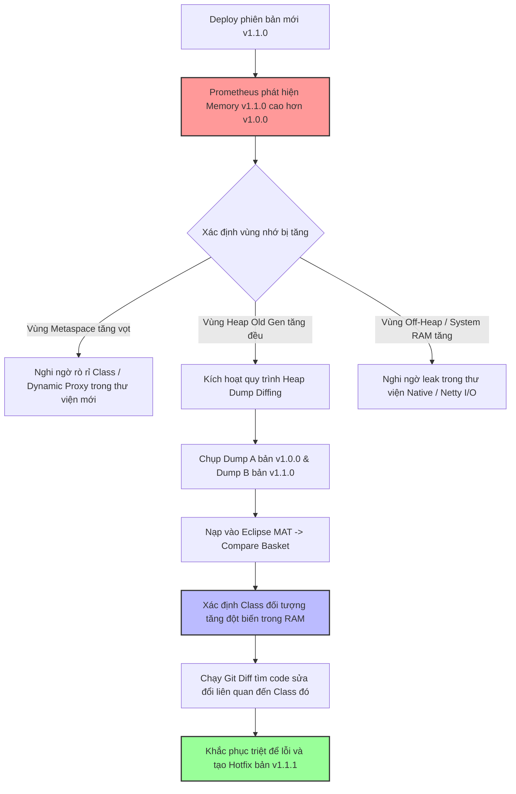

# Memory tăng sau một deploy mới, bạn điều tra ra sao?

## ⚡ Tóm tắt ngắn (30s)
* **Bản chất**: Sự gia tăng tiêu thụ bộ nhớ (Heap/Non-heap) ngay sau khi deploy phiên bản mới là tín hiệu cảnh báo có mã nguồn tồi hoặc cấu hình hệ thống không tối ưu vừa được đưa lên. Để điều tra hiệu quả, Senior Engineer thực hiện phương pháp **So sánh vi sai (Diffing Analysis)**: Đối chiếu các số liệu giám sát (APM Metrics), so sánh các tệp tin Heap Dump (Baseline vs Target) thu được từ môi trường Staging/Production, kết hợp sàng lọc lịch sử thay đổi mã nguồn (Git Commits).
* **Các thảm họa thực chiến được giải quyết**:
    1. **Thảm họa rò rỉ âm thầm từ thư viện mới**: Việc nâng cấp một thư viện HTTP Client hoặc JSON Parser mới chứa lỗi leak bộ nhớ khiến ứng dụng cạn kiệt tài nguyên sau vài giờ vận hành.
    2. **Thảm họa sập nguồn do tính năng Export dữ liệu**: Triển khai tính năng báo cáo mới mà quên phân trang hoặc streaming, làm nạp toàn bộ hàng trăm ngàn dòng từ database vào bộ nhớ trong quá trình chạy khiến RAM tăng đột biến và kích hoạt OOMKilled liên tục.
* **Quyết định Senior**: Triển khai quy trình chẩn đoán tốc độ cao theo 4 bước chuẩn chỉ:
    1. **Kiểm tra vi sai Metrics (APM Diff)**: So sánh tốc độ tăng trưởng của từng vùng nhớ (Eden, Survivor, Old Gen, Metaspace) giữa phiên bản cũ và phiên bản mới trên Grafana/Datadog.
    2. **Phân tích so sánh Heap (Heap Diffing)**: Thu thập hai tệp Heap Dump (một từ instance phiên bản cũ đang chạy ổn định và một từ instance phiên bản mới vừa deploy), sau đó nạp cả hai vào Eclipse MAT để so sánh số lượng đối tượng tăng đột biến.
    3. **Sàng lọc Git Diff (Code Review Focus)**: Khoanh vùng các dòng code mới liên quan đến các cấu trúc dữ liệu lưu giữ bộ nhớ lâu như Cache, ThreadLocal, Static, Async task và I/O resources.
    4. **Chốt chặn CI/CD (Canary Safeguard)**: Kiểm tra RAM tự động trên môi trường Canary với 5% traffic trước khi quyết định rollout 100% lên Production.

---

## 🔍 Chi tiết bản chất thực chiến: Quy trình 4 bước điều tra vi sai bộ nhớ

Khi nhận được cảnh báo về việc bộ nhớ sử dụng tăng bất thường sau phiên bản deploy mới, Senior triển khai quy trình điều tra khoa học sau:

### Bước 1: Phân tích vi sai Metrics trên hệ thống Giám sát (APM telemetry)
* **Xác định vùng nhớ bị tăng**:
  * **Nếu Old Gen tăng liên tục**: Chắc chắn có rò rỉ bộ nhớ (Memory Leak) trong logic nghiệp vụ mới (đối tượng bị giữ tham chiếu lâu dài).
  * **Nếu Eden/Survivor tăng dốc đứng**: Tải tạo đối tượng rác quá lớn (High Allocation Rate). Mặc dù GC dọn được, nhưng việc tạo đối tượng rác quá nhanh sẽ vắt kiệt CPU của hệ thống (GC Overhead).
  * **Nếu Metaspace tăng đột biến**: Liên quan đến việc nạp Class động (Spring AOP, CGLIB) hoặc rò rỉ ClassLoader (thường do hot-deploy hoặc sử dụng các công cụ sinh code tự động).
  * **Nếu Non-Heap/Direct Memory tăng**: Rò rỉ ngoài Java Heap (thư viện I/O Netty, gRPC, Zip, Gzip).

### Bước 2: Kỹ thuật so sánh Heap Dump (Heap Dump Diffing)
* Chụp hai tệp Heap Dump:
  * **Dump A (Baseline)**: Chụp từ một Pod chạy bản cũ ổn định (hoặc bản mới vừa khởi động).
  * **Dump B (Target)**: Chụp từ Pod chạy bản mới sau khi tải tăng cao hoặc chạy được vài giờ.
* Nạp cả hai tệp vào **Eclipse MAT**, sử dụng tính năng **Compare Basket**:
  * MAT sẽ tự động hiển thị bảng vi sai (Diff Table) chỉ rõ số lượng đối tượng (Instance Count) và kích thước (Retained Size) chênh lệch giữa hai thời điểm.
  * *Ví dụ thực tế*: Nếu lớp `com.example.dto.OrderDTO` tăng thêm 150,000 instance trong bản Dump B, ta lập tức khoanh vùng được chính xác cấu trúc dữ liệu nào đang giữ các DTO này.

### Bước 3: Sàng lọc lịch sử Commit (Git Diff Target)
* Chạy lệnh so sánh mã nguồn giữa thẻ phiên bản cũ (Tag v1.0.0) và phiên bản mới (Tag v1.1.0):
  ```bash
  git diff v1.0.0 v1.1.0 -- src/
  ```
* Tập trung cao độ vào các thay đổi liên quan đến:
  * Việc thêm mới hoặc chỉnh sửa các lớp `@Component`, `@Service` (Singleton) có chứa các Collection (List, Map, Set).
  * Các khối mã nguồn xử lý tệp tin (File I/O), Stream, xử lý ảnh, hoặc gọi các API bên ngoài mà thiếu khối `try-with-resources`.
  * Sự xuất hiện của các thư viện bên thứ ba mới trong tệp `pom.xml` hoặc `build.gradle`.

### Bước 4: Tinh chỉnh chốt chặn Canary Deployment
* Triển khai cơ chế tự động hủy deploy (Auto-rollback) trên môi trường Canary. Nếu Pod Canary (nhận 5% traffic) có tốc độ tăng trưởng vùng nhớ Old Gen vượt quá 20% so với baseline trong vòng 30 phút, hệ thống CI/CD sẽ tự động kích hoạt Rollback ngay lập tức mà không cần sự can thiệp thủ công của con người.

---

## 🎨 Sơ đồ trực quan (Quy trình chẩn đoán vi sai bộ nhớ sau Deploy)



---

## 💻 Code thực chiến / Cấu hình thực tế: BAD vs GOOD

### ❌ BAD: Viết code nghiệp vụ mới nạp quá nhiều dữ liệu vào bộ nhớ RAM
Nhân viên mới phát triển tính năng tải lên và xử lý tệp excel báo cáo. Code sử dụng thư viện POI thông thường nạp toàn bộ tệp tin lớn vào RAM, làm sụt giảm nghiêm trọng tài nguyên của hệ thống ngay sau khi deploy.

* **Code Java tồi**:
```java
@RestController
@RequestMapping("/api/v1/reports")
public class ReportController {
    
    @PostMapping("/upload")
    public ResponseEntity<Void> uploadReport(@RequestParam("file") MultipartFile file) throws Exception {
        // ❌ THẢM HỌA: Nạp toàn bộ file Excel hàng trăm MB vào RAM bằng POI User Model (XSSFWorkbook)
        // Mỗi cell excel trong RAM có thể chiếm gấp 10-20 lần kích thước vật lý của file XML gốc.
        Workbook workbook = new XSSFWorkbook(file.getInputStream()); 
        Sheet sheet = workbook.getSheetAt(0);
        
        for (Row row : sheet) {
            // Xử lý logic nghiệp vụ...
        }
        
        workbook.close(); // Vẫn dễ bị OOM nếu file quá lớn
        return ResponseEntity.ok().build();
    }
}
```

---

### ✅ GOOD: Sử dụng Streaming API để xử lý tệp tin lớn tối ưu RAM
Sử dụng công cụ xử lý tệp Excel dạng luồng (Streaming Reader - như EasyExcel hoặc Excel Streaming Reader) giúp giữ lượng RAM tiêu thụ ở mức hằng số cực kỳ thấp (O(1) Memory Complexity) dù file có lớn hàng triệu dòng.

* **Code Java chuẩn Senior**:
```java
import com.alibaba.excel.EasyExcel;
import com.alibaba.excel.read.listener.PageReadListener;

@RestController
@RequestMapping("/api/v1/reports")
public class ReportController {

    @PostMapping("/upload")
    public ResponseEntity<Void> uploadReport(@RequestParam("file") MultipartFile file) throws Exception {
        // ✅ GIẢI PHÁP: Sử dụng SAX/Streaming API (EasyExcel) đọc dữ liệu theo block
        // RAM tiêu thụ được khống chế ở mức cực thấp và ổn định bất kể kích thước tệp excel.
        EasyExcel.read(file.getInputStream(), ExcelDataDTO.class, new PageReadListener<ExcelDataDTO>(dataList -> {
            // Đọc và xử lý theo từng trang dữ liệu (ví dụ: 100 dòng một lần)
            for (ExcelDataDTO data : dataList) {
                // Xử lý logic nghiệp vụ an toàn
            }
        })).sheet().doRead();

        return ResponseEntity.ok().build();
    }
}
```

---

## 📊 Bảng so sánh phương pháp giám sát phát hiện Memory Leak sau deploy

| Tiêu chí so sánh | Prometheus + Grafana | APM Profiler (Datadog/Dynatrace) | Offline Heap Dump (Eclipse MAT) |
| :--- | :--- | :--- | :--- |
| **Độ trễ phát hiện** | Cực nhanh (Gần như thời gian thực - Realtime). | Nhanh (1-2 phút). | Chậm (Tốn thời gian chụp dump và phân tích offline). |
| **Độ sâu thông tin** | Thấp (Chỉ thấy dung lượng vùng nhớ tổng quát). | Trung bình (Thấy tần suất tạo đối tượng, phân cấp luồng). | **Cực sâu** (Thấy chính xác GC Roots, đối tượng gây leak và dòng code). |
| **Tác động hiệu năng** | Không đáng kể (<1% CPU). | Thấp (2-5% CPU overhead). | **Rất cao** (Đóng băng hoàn toàn JVM JVM trong lúc chụp Dump). |
| **Môi trường phù hợp** | Production 24/7. | Production / Staging. | Staging / Chỉ chạy trên 1 instance Production bị cô lập. |

---

## ⚠️ Common Gotchas & Questions follow-up

### 1. Cạm bẫy "Bị lừa bởi hiện tượng bộ nhớ đệm của hệ điều hành (Virtual Memory vs RSS)"
* **Vấn đề**: Kỹ sư kiểm tra lệnh `top` trên Linux và thấy cột `RES` (Resident Set Size - RAM thực tế container sử dụng) tăng rất cao sau khi deploy, lập tức báo động lỗi Memory Leak trong Java.
* **Thực tế**: JVM không ngay lập tức trả lại bộ nhớ cho hệ điều hành ngay cả sau khi đã dọn rác thành công. Nó giữ lại không gian trống này để tái cấp phát cho các đối tượng mới nhằm tránh chi phí xin cấp phát lại từ HĐH. Do đó, RAM container báo cao nhưng thực tế bộ nhớ Java Heap bên trong JVM lại rất trống rỗng.
* **Giải pháp**: Phải sử dụng công cụ Native Memory Tracking (NMT) của JVM hoặc kiểm tra chỉ số `jvm_memory_used_bytes` để biết dung lượng sử dụng thực tế bên trong JVM thay vì chỉ nhìn vào thông số RAM của Docker/OS.

### 2. Câu hỏi đào sâu từ interviewer

* **Q1: Trong quá trình Git Diff để tìm lỗi Memory Leak sau deploy, nếu lịch sử Commit quá lớn (hàng trăm dòng code mới được chỉnh sửa bởi nhiều team khác nhau), bạn sẽ làm thế nào để khoanh vùng nhanh nhất những dòng code đáng ngờ nhất?**
  * *Trả lời*: Tôi áp dụng các phương pháp lọc thông minh sau để thu hẹp phạm vi:
    1. **Tìm kiếm từ khóa nhạy cảm (Pattern Search)**: Tôi dùng grep để quét qua các file thay đổi, lọc ra các từ khóa dễ gây leak như `ThreadLocal`, `static`, `cache`, `HashMap`, `@Cacheable`, `Stream`, `CompletableFuture`.
    2. **Phân tích APM Transactions**: Tôi mở APM để xem đường dẫn API nào (Endpoint) có lượng tiêu thụ RAM tăng vọt sau deploy. Sau đó, tôi chỉ cần lọc các Git commit liên quan đến các class thuộc Controller/Service xử lý API đó để giảm 90% thời gian rà soát code.
    3. **Xem biểu đồ Thread allocation**: Xác định Thread group nào đang sinh ra nhiều đối tượng rác để khoanh vùng chính xác module nghiệp vụ lỗi.

* **Q2: Nếu Java Heap hoàn toàn bình thường, không hề có xu hướng tăng, nhưng RAM vật lý của Container Docker liên tục tăng đều đặn cho đến khi bị hệ điều hành bắn tín hiệu `OOMKilled` (Exit Code 137). Bạn nghi ngờ điều gì đã xảy ra sau deploy?**
  * *Trả lời*: Đây là dấu hiệu của việc rò rỉ bộ nhớ ngoài Heap (**Off-Heap Memory Leak** / **Native Memory Leak**):
    1. **Nghi ngờ hàng đầu**: Lỗi leak từ bộ đệm của thư viện I/O hoặc Netty (thường dùng trong Spring WebFlux, gRPC, Redis Client). Các ByteBuffer trực tiếp được cấp phát từ RAM hệ điều hành nhưng không được gọi lệnh giải phóng (`ReferenceCountUtil.release()`).
    2. **Lỗi JNI (Java Native Interface)**: Bản mới có sử dụng thư viện nén (Zip/Gzip) hoặc thư viện xử lý hình ảnh (như OpenCV, ImageMagick) mà quên đóng các cấu trúc dữ liệu Native C++ tương ứng.
    3. **Cách điều tra**: Tôi sẽ bật cờ khởi động JVM `-XX:NativeMemoryTracking=detail` và dùng công cụ `jcmd <pid> VM.native_memory baseline` kết hợp `jcmd <pid> VM.native_memory detail.diff` để so sánh và tìm ra chính xác thư viện Native nào đang ngốn sạch RAM vật lý bên ngoài.
