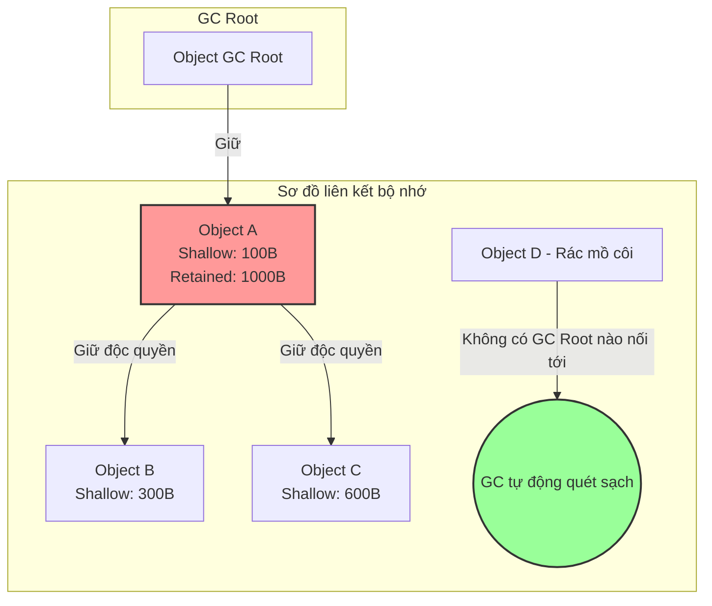

# Làm sao dùng heap dump để tìm memory leak?

## ⚡ Tóm tắt ngắn (30s)
* **Bản chất**: Heap Dump là ảnh chụp toàn bộ trạng thái bộ nhớ của JVM tại một thời điểm cụ thể (dưới dạng tệp `.hprof`). Để tìm rò rỉ bộ nhớ (Memory Leak), Senior Engineer sử dụng các công cụ phân tích chuyên dụng (như **Eclipse Memory Analyzer - MAT** hoặc **YourKit**) nhằm xác định chuỗi tham chiếu mạnh nối từ các đối tượng chiếm giữ lượng RAM lớn nhất trở ngược lại các đối tượng gốc bền vững (**GC Roots**), từ đó chỉ ra chính xác dòng code nghiệp vụ gây lỗi.
* **Các thảm họa thực chiến được giải quyết**:
    1. **Thảm họa phán đoán mò mẫm (Guesswork Disaster)**: Khi ứng dụng bị OOM, cả team tranh cãi nảy lửa và liên tục đưa ra các phán đoán không có cơ sở như "do DB chậm", "do framework Spring lỗi" và chỉnh sửa code lung tung. Việc phân tích Heap Dump giúp đưa ra **bằng chứng không thể chối cãi** bằng số liệu và vị trí dòng code chính xác gây lỗi chỉ sau vài phút.
    2. **Thảm họa treo đơ JVM trên Production (Freeze Disaster)**: Chạy lệnh chụp dump trực tiếp trên hệ thống đang chịu tải cao mà quên rằng JVM sẽ bị đóng băng hoàn toàn (`Stop-the-world`), dẫn đến sập toàn bộ các luồng realtime đang phục vụ người dùng.
* **Quyết định Senior**: Nắm vững 3 khái niệm cốt lõi và quy trình điều tra chuẩn chỉnh trong Eclipse MAT:
    1. **Shallow vs Retained Heap**: Tập trung vào **Retained Heap** (lượng RAM thực tế được giải phóng nếu đối tượng đó bị xóa bỏ) thay vì Shallow Heap (kích thước vật lý của bản thân đối tượng).
    2. **Dominator Tree & Histogram**: Sử dụng Dominator Tree để tìm các điểm nút (chốt chặn) giữ RAM lớn nhất, kết hợp Histogram để xem số lượng instance tăng đột biến.
    3. **Path to GC Roots**: Loại bỏ các tham chiếu yếu (exclude weak/soft/phantom refs) để chỉ giữ lại các tham chiếu mạnh thực sự trói tay Garbage Collector.

---

## 🔍 Chi tiết bản chất thực chiến: Quy trình phân tích Heap Dump bằng Eclipse MAT

Để săn tìm Memory Leak chuyên nghiệp bằng Eclipse MAT, Senior Engineer thực hiện tuần tự các bước hành động sau:

### Bước 1: Mở báo cáo tự động "Leak Suspects Report"
* Đây là tính năng cực kỳ thông minh của MAT. Ngay khi nạp file dump, công cụ sẽ tự động chạy các thuật toán heuristic để gom nhóm và phát hiện các cụm đối tượng chiếm dung lượng RAM bất thường.
* Lên tới 80% các trường hợp rò rỉ đơn giản (như một mảng static cache lớn) sẽ được MAT chỉ ra trực tiếp ngay tại trang tổng quan này kèm theo mô tả: *"Class X được giữ bởi ClassLoader Y đang chiếm giữ 45% bộ nhớ Heap"*.

### Bước 2: Khai thác "Dominator Tree" (Cây thống trị)
* Nếu bước 1 chưa chỉ rõ, ta truy cập **Dominator Tree**. Cấu trúc này mô tả quan hệ giữ quyền sinh sát giữa các đối tượng: Nếu đối tượng A thống trị đối tượng B, có nghĩa là nếu A bị xóa khỏi bộ nhớ, B chắc chắn sẽ bị GC thu hồi theo.
* **Hành động**: Sắp xếp cột **Retained Heap** theo thứ tự giảm dần. Bạn sẽ lập tức nhìn thấy 1 hoặc 2 đối tượng đứng đầu danh sách chiếm tới 70-80% tổng dung lượng RAM của ứng dụng.

### Bước 3: Tìm GC Roots (Path to GC Roots)
* Tìm được đối tượng chiếm RAM lớn mới chỉ là một nửa chặng đường. Ta phải trả lời câu hỏi: *Ai đang giữ chặt đối tượng này khiến nó không thể bị GC dọn dẹp?*
* **Thao tác**: Click chuột phải vào đối tượng đứng đầu Dominator Tree -> `Path To GC Roots` -> `exclude all phantom/weak/soft references`.
* **Kết quả**: MAT sẽ hiển thị một đường dẫn đi từ GC Root (ví dụ: một `Thread` hoặc một biến static thuộc ClassLoader) qua các thuộc tính trung gian và trỏ tới đối tượng rác của bạn. Chuỗi mắt xích tham chiếu mạnh này chính là **bằng chứng đắt giá nhất** chỉ ra dòng code lỗi.

### Bước 4: Truy vấn bằng ngôn ngữ OQL (Object Query Language)
* Giống như viết SQL truy vấn database, MAT hỗ trợ ngôn ngữ OQL để bạn lọc trực tiếp các đối tượng trong bộ nhớ:
  ```sql
  -- Truy vấn tìm toàn bộ các String có độ dài lớn hơn 1MB đang nằm lì trong bộ nhớ
  SELECT s.toString() FROM java.lang.String s WHERE s.count > 1048576
  ```

---

## 🎨 Sơ đồ trực quan (Shallow Heap vs Retained Heap trong JVM)


> [!NOTE]
> **Shallow Heap** là dung lượng RAM của riêng bản thân đối tượng đó trên Heap (thường rất nhỏ).
> **Retained Heap** của Object A là tổng Shallow Heap của chính nó cộng với Shallow Heap của Object B và C (vì A là đối tượng thống trị duy nhất giữ B và C. Nếu xóa A, cả B và C cũng biến mất). Trong điều tra Memory Leak, ta luôn ưu tiên tìm đối tượng có **Retained Heap lớn nhất**.

---

## 💻 Code thực chiến / Cấu hình thực tế: BAD vs GOOD

### ❌ BAD: Tự viết Code chụp Heap Dump cẩu thả trên Production
Tự ý chạy lệnh chụp dump trực tiếp vào giờ cao điểm trên máy chủ Product có RAM lớn mà không cô lập instance, gây đóng băng toàn bộ hệ thống API.

* **Lệnh chụp dump tồi**:
```bash
# ❌ Lệnh này sẽ chụp dump trực tiếp Pod đang live. 
# JVM sẽ chạy Stop-the-world để đóng băng RAM. 
# Nếu Heap của bạn là 16GB, API sẽ bị ngắt kết nối hoàn toàn trong vòng 30-60 giây, gây lỗi 504 Gateway Timeout hàng loạt.
jmap -dump:live,format=b,file=live_dump.hprof <pid>
```

---

### ✅ GOOD: Quy trình cô lập instance và chụp dump an toàn
Senior Engineer chỉ chụp dump sau khi đã ngắt kết nối Pod khỏi Load Balancer (cô lập an toàn), hoặc cấu hình hệ thống tự động chụp dump ngay khi xảy ra lỗi OOM mà không ảnh hưởng người dùng hiện tại.

* **Kịch bản xử lý chuẩn Senior (Kubernetes context)**:
```bash
# ✅ BƯỚC 1: Ngắt kết nối Pod nghi ngờ khỏi Service để Load Balancer không route traffic vào nữa
kubectl label pods my-app-pod-xyz routing=diagnostics --overwrite

# ✅ BƯỚC 2: Truy cập vào Pod đã được cách ly an toàn và kích hoạt chụp dump
# Liveness/Readiness Probe của K8s lúc này không ảnh hưởng vì Pod đã tách khỏi service live
jcmd <pid> GC.heap_dump /var/log/dumps/safe_live_dump.hprof

# ✅ BƯỚC 3: Nén và tải tệp tin dump về máy local để phân tích
gzip /var/log/dumps/safe_live_dump.hprof
# Chạy lệnh download file an toàn...
```

---

## 📊 Bảng so sánh các công cụ phân tích Heap Dump phổ biến

| Tiêu chí so sánh | Eclipse MAT | JProfiler / YourKit | JDK Mission Control (JMC) |
| :--- | :--- | :--- | :--- |
| **Giá bản quyền** | **Miễn phí** (Mã nguồn mở - Open Source). | Có phí (Rất đắt đỏ). | Miễn phí (Đi kèm Oracle JDK). |
| **Khả năng phân tích file dung lượng lớn** | **Cực tốt** (Có cơ chế phân tích dựa trên đĩa đệm, xử lý được file dump >100GB). | Trung bình (Yêu cầu RAM máy tính phân tích lớn hơn dung lượng file dump). | Tốt. |
| **Tính năng tự động** | Rất mạnh mẽ (Báo cáo tự động Leak Suspects chuẩn xác). | Trực quan hóa đồ họa đẹp mắt, dễ sử dụng cho người mới. | Chuyên dụng cho việc monitor luồng thời gian thực. |

---

## ⚠️ Common Gotchas & Questions follow-up

### 1. Cạm bẫy "File Heap Dump rỗng hoặc bị hỏng (Corrupted Dump)"
* **Vấn đề**: Sau khi ứng dụng bị OOM, kỹ sư lấy file dump `.hprof` được JVM tự động tạo ra nhưng khi nạp vào Eclipse MAT thì báo lỗi định dạng hoặc file chỉ có dung lượng vài KB (rỗng).
* **Thực tế**: Khi container bị OOM, hệ điều hành (hoặc Docker Daemon) sẽ lập tức gửi tín hiệu `SIGKILL` (Exit Code 137) để giết ngay tiến trình Java. Nếu JVM đang ghi tệp dump dở dang mà bị giết, tệp tin đó chắc chắn sẽ bị hỏng.
* **Giải pháp**: Phải tinh chỉnh cấu hình Kubernetes `terminationGracePeriodSeconds` lên giá trị lớn hơn (ví dụ: 60-120 giây) để cho phép JVM có đủ thời gian hoàn tất việc ghi file dump ra ổ đĩa trước khi container bị hủy hoàn toàn.

### 2. Câu hỏi đào sâu từ interviewer

* **Q1: Làm thế nào bạn phân biệt được một lỗi rò rỉ bộ nhớ thực sự (Memory Leak) với một trường hợp hệ thống bị quá tải tạm thời (Memory Exhaustion) khi chỉ nhìn vào một tệp Heap Dump duy nhất?**
  * *Trả lời*: Đây là một câu hỏi phân biệt Senior cực kỳ xuất sắc. Tôi dựa vào cấu trúc tham chiếu trong file dump:
    1. **Memory Leak**: Có một số lượng khổng lồ đối tượng rác nhưng chúng bị trói chặt vào một GC Root bền vững (như biến static, ClassLoader, Singleton Bean). Kể cả khi tôi gọi lệnh Garbage Collection thủ công trong MAT, các đối tượng này **vẫn không thể bị giải phóng**.
    2. **Memory Exhaustion (Quá tải)**: Các đối tượng chiếm RAM lớn thực chất là các đối tượng nghiệp vụ đang được xử lý dở dang (ví dụ: các mảng byte lớn của một luồng upload file, hoặc hàng ngàn DTO của một query lớn). Đường dẫn `Path to GC Roots` của chúng sẽ trỏ trực tiếp đến các **Active Threads đang sống** (vùng nhớ Stack của thread đang chạy). Ngay khi Thread này hoàn thành xử lý, toàn bộ RAM này sẽ biến mất.
    3. **Hành động**: Nếu là Memory Leak, tôi phải sửa code. Nếu là Memory Exhaustion, tôi phải giảm concurrency limit, giảm page size hoặc cấu hình hàng đợi giới hạn.

* **Q2: Trong Eclipse MAT, khái niệm "Unreachable Objects" là gì? Bạn có cần quan tâm đến chúng khi đi tìm Memory Leak không?**
  * *Trả lời*:
    1. **Khái niệm**: "Unreachable Objects" là những đối tượng nằm trên Heap nhưng **không có bất kỳ chuỗi tham chiếu nào nối từ GC Roots tới chúng**. Thực tế, đây là những đối tượng "đã chết" về mặt logic và sẽ bị bộ dọn rác (GC) thu hồi hoàn toàn trong chu kỳ quét tiếp theo.
    2. **Mặc định trong MAT**: MAT sẽ tự động lọc và loại bỏ toàn bộ các unreachable objects này khi parse file dump để giữ cho báo cáo sạch sẽ, chỉ tập trung vào các đối tượng "còn sống" (Reachable).
    3. **Khi nào cần quan tâm**: Nếu dung lượng file dump vật lý của tôi rất lớn (ví dụ: 10GB) nhưng khi nạp vào MAT chỉ còn thấy 2GB reachable objects, điều đó có nghĩa là 8GB RAM còn lại chứa đầy unreachable objects. Đây là bằng chứng rõ ràng cho thấy **GC đang chạy quá chậm hoặc bị trì hoãn** (GC lag), hoặc ứng dụng đang tạo ra quá nhiều đối tượng rác trong thời gian cực ngắn khiến GC không kịp dọn dẹp.
