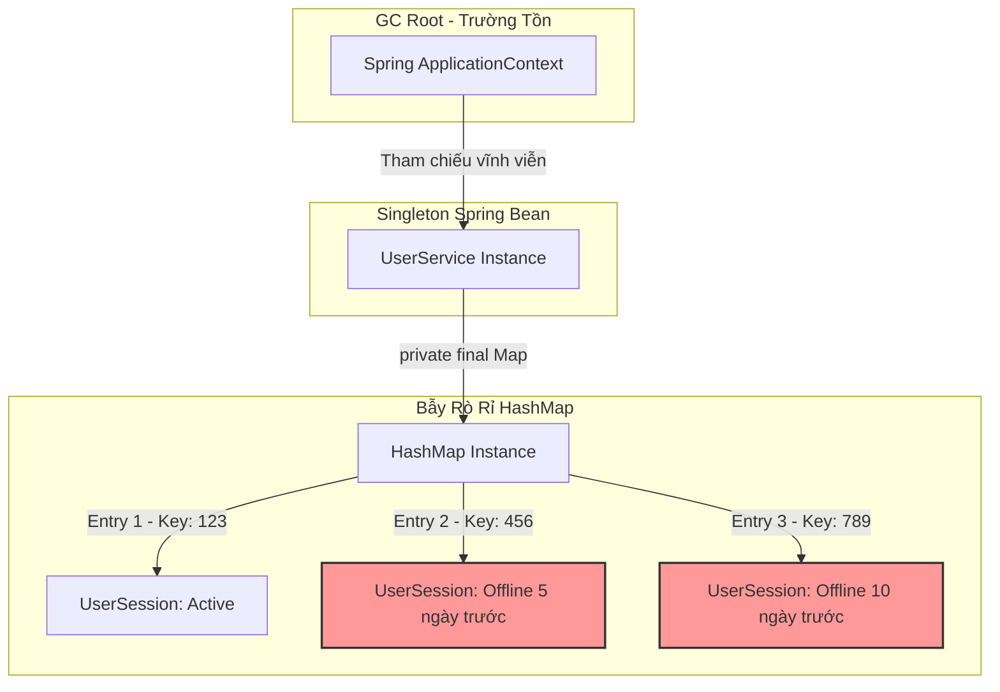

# Cache local gây memory leak như thế nào?

## ⚡ Tóm tắt ngắn (30s)
* **Bản chất**: Bản chất local cache tự chế bằng các Collection chuẩn (như `HashMap`, `ConcurrentHashMap`) giữ **tham chiếu mạnh (Strong References)** vĩnh viễn tới các đối tượng lưu trữ bên trong. Do các Map này thường được khai báo làm biến thành viên của các Singleton Bean (như `@Service` hoặc `@Component`), chúng được gắn chặt vào GC Roots (`ApplicationContext`). Nếu không có cơ chế giới hạn kích thước tối đa, hết hạn theo thời gian (TTL) hoặc giải phóng tự động, bộ nhớ đệm này sẽ phình to không giới hạn theo thời lượng chạy của ứng dụng, dẫn tới lỗi `OutOfMemoryError`.
* **Các thảm họa thực chiến được giải quyết**:
    1. **Thảm họa rò rỉ RAM do cache Token**: Hệ thống tự thiết kế một Map để lưu thông tin đăng nhập của User để tránh gọi DB liên tục. Do không có cơ chế tự dọn dẹp, sau 1 tuần chạy chịu tải thật, Map tích lũy 500,000 token của các user cũ đã offline từ lâu, ngốn sạch 90% Heap RAM và làm sập server.
    2. **Thảm họa dữ liệu cũ hỏng logic (Stale Data)**: Lập trình viên tự chế cache bằng Map và tự viết luồng background tự động dọn dẹp (cleanup thread). Tuy nhiên, do lỗi đồng bộ thread (ConcurrentModificationException hoặc chết luồng nền âm thầm), luồng dọn dẹp ngừng chạy, biến Map thành một chiếc "hố đen" hút RAM liên tục mà không có điểm dừng.
* **Quyết định Senior**: Tuyệt đối cấm tự chế cache bằng các Map thông thường. Bắt buộc sử dụng các thư viện quản lý cache chuyên nghiệp (**Caffeine Cache** hoặc **Guava Cache**) được cấu hình chặt chẽ 3 chốt chặn bảo vệ: Giới hạn dung lượng tối đa (`maximumSize`), thời gian hết hạn (`expireAfterWrite`/`expireAfterAccess`), và tùy chọn tham chiếu mềm (`softValues`/`weakKeys`).

---

## 🔍 Chi tiết bản chất thực chiến: Tại sao Map thông thường gây leak bộ nhớ?

Để hiểu tại sao local cache bằng Map thông thường là một lỗi thiết kế nghiêm trọng, Senior Engineer phân tích cấu trúc liên kết bộ nhớ của JVM:

### 1. Cơ chế của GC Root trói chặt Map
* Trong ứng dụng Java Spring Boot, các lớp được khai báo `@Service` hay `@Repository` mặc định là **Singleton Scope**.
* Khi khởi động, Spring Container khởi tạo một instance duy nhất cho service đó và lưu giữ nó trong `ApplicationContext`.
* Bản thân `ApplicationContext` là một **GC Root** trường tồn suốt vòng đời của JVM.
* Do đó, bất kỳ thuộc tính nào của service đó (ví dụ: một `private Map<String, User> cacheMap`) cũng trở thành một nhánh thuộc GC Root. Bộ dọn rác GC của Java tuyệt đối không bao giờ được phép dọn dẹp các đối tượng nằm trong Map này, ngay cả khi người dùng không còn hoạt động.

### 2. Sự khác biệt giữa HashMap thông thường và Thư viện Cache chuyên dụng
* **HashMap**: Không có khái niệm tự động dọn dẹp (eviction). Phương thức duy nhất để xóa phần tử là bạn phải gọi `.remove(key)` hoặc `.clear()` một cách chủ động trong code.
* **Thư viện Cache (Caffeine/Guava)**: Được thiết kế dưới dạng cấu trúc dữ liệu tự quản lý:
  * **Chính sách Eviction (Lấy cũ đổi mới)**: Khi cache đạt giới hạn kích thước (ví dụ: 10,000 phần tử), cache sẽ tự động loại bỏ phần tử cũ theo thuật toán tối ưu **TinyLFU** (hoặc LRU) để nhường chỗ cho phần tử mới. RAM tiêu thụ luôn là hằng số $O(1)$ an toàn.
  * **Chính sách Expiration (Hết hạn thời gian)**: Tự động đánh dấu và thu hồi các phần tử quá thời gian không được cập nhật (`expireAfterWrite`) hoặc không được đọc (`expireAfterAccess`).

---

## 🎨 Sơ đồ trực quan (JVM GC Roots và bẫy Local Cache Map)


> [!WARNING]
> Mặc dù `UserSession 456` và `789` đã offline từ lâu và không còn luồng nghiệp vụ nào sử dụng, GC vẫn buộc phải giữ lại chúng trong RAM vì chúng vẫn nằm trong chuỗi tham chiếu mạnh xuất phát từ `ApplicationContext`.

---

## 💻 Code thực chiến / Cấu hình thực tế: BAD vs GOOD

### ❌ BAD: Tự tạo Local Cache bằng ConcurrentHashMap
Đoạn code sử dụng ConcurrentHashMap để lưu thông tin cấu hình sản phẩm. Do không giới hạn số lượng phần tử và thời gian lưu giữ, cấu trúc này sẽ nhanh chóng nuốt sạch RAM khi danh mục sản phẩm của doanh nghiệp phình to.

* **Code Java tồi**:
```java
@Service
public class ProductService {
    
    // ❌ THẢM HỌA: Map giữ tham chiếu mạnh không giới hạn.
    // Khi số lượng sản phẩm truy cập tăng lên hàng triệu, RAM sẽ cạn kiệt.
    private final Map<Long, Product> productCache = new ConcurrentHashMap<>();

    public Product getProduct(Long id) {
        return productCache.computeIfAbsent(id, this::loadProductFromDatabase);
    }

    private Product loadProductFromDatabase(Long id) {
        // SQL query load product...
        return new Product(id, "Sản phẩm thử nghiệm");
    }
}
```

---

### ✅ GOOD: Sử dụng Caffeine Cache cấu hình chặt chẽ
Cấu hình Caffeine Cache làm lá chắn bảo vệ bộ nhớ. RAM tiêu thụ được giới hạn cứng, dữ liệu rác tự động bị loại bỏ bất đồng bộ để giải phóng RAM cho các tác vụ khác.

* **Code Java chuẩn Senior**:
```java
import com.github.benmanes.caffeine.cache.Cache;
import com.github.benmanes.caffeine.cache.Caffeine;
import java.util.concurrent.TimeUnit;

@Service
public class ProductService {

    // ✅ GIẢI PHÁP: Cấu hình Caffeine Cache với chốt chặn an toàn bộ nhớ
    private final Cache<Long, Product> productCache = Caffeine.newBuilder()
            .maximumSize(5000) // ✅ Chốt chặn 1: Giới hạn tối đa 5000 sản phẩm trong RAM
            .expireAfterAccess(1, TimeUnit.HOURS) // ✅ Chốt chặn 2: Tự động xóa nếu không được ai sờ đến trong 1 giờ
            .recordStats() // Để monitor Cache Hit Ratio phục vụ tuning hiệu năng
            .build();

    public Product getProduct(Long id) {
        // get(key, mappingFunction) tự động load từ DB nếu cache miss và bảo vệ ghi đồng thời an toàn
        return productCache.get(id, this::loadProductFromDatabase);
    }

    private Product loadProductFromDatabase(Long id) {
        // SQL query load product...
        return new Product(id, "Sản phẩm chất lượng cao");
    }
}
```

---

## 📊 Bảng so sánh các giải pháp lưu trữ Cache trong hệ thống

| Tiêu chí so sánh | HashMap / ConcurrentHashMap | Caffeine / Guava Cache | Distributed Cache (Redis) |
| :--- | :--- | :--- | :--- |
| **Giới hạn bộ nhớ (RAM Protection)** | Không có. | **Có** (Thông qua cấu hình `maximumSize`). | **Có** (Thông qua cấu hình eviction policy của Redis). |
| **Cơ chế tự dọn dẹp (Eviction/TTL)** | Không có. | **Có** (Được chạy bất đồng bộ hiệu năng cao). | **Có** (Được thiết lập TTL trên từng key). |
| **Độ trễ truy xuất (Latency)** | Cực nhanh (< 1 microsecond). | Cực nhanh (< 1 microsecond). | Trung bình (1-5 milliseconds do tốn chi phí gọi qua Network). |
| **Inconsistency giữa các Node** | Rất cao. | Rất cao. | **Không có** (Tất cả các Node ứng dụng cùng đọc một nguồn Redis tập trung). |

---

## ⚠️ Common Gotchas & Questions follow-up

### 1. Cạm bẫy "Bẫy tự dọn dẹp bằng Scheduled Task tự chế"
* **Vấn đề**: Kỹ sư biết dùng Map thông thường dễ gây leak bộ nhớ, liền viết thêm một `@Scheduled` task chạy định kỳ mỗi đêm để gọi `productCache.clear()` để giải phóng RAM.
* **Thực tế**:
  1. Đây là giải pháp chắp vá không triệt để. Nếu lượng request tăng vọt vào ban ngày, server vẫn có thể bị OOM trước khi kịp đợi đến nửa đêm để dọn dẹp.
  2. Việc gọi `.clear()` đột ngột trên bảng lớn sẽ làm trống rỗng bộ nhớ đệm hoàn toàn, gây ra hiện tượng **Cache Avalanche (Tuyết lở cache)**: Hàng loạt các request đến ngay sau đó sẽ bị tràn thẳng xuống Database chính, đẩy CPU của DB lên 100% chỉ trong vài giây.
* **Giải pháp**: Hãy để thư viện Caffeine tự động loại bỏ từng phần tử rác một cách liên tục, êm ái bất đồng bộ ở luồng nền.

### 2. Câu hỏi đào sâu từ interviewer

* **Q1: Nếu ứng dụng của bạn chạy trên 10 instance (multiple instances) và bạn sử dụng local cache bằng Caffeine ở từng máy, điều gì sẽ xảy ra khi quản trị viên cập nhật giá của một sản phẩm? Bạn xử lý vấn đề inconsistency này như thế nào?**
  * *Trả lời*: Đây là điểm yếu cốt lõi của **Local Cache (Bộ nhớ đệm phân tán không đồng bộ)**. Khi instance 1 nhận lệnh cập nhật, 9 instance còn lại vẫn lưu giữ giá cũ trong local RAM của chúng. Để xử lý, tôi áp dụng các mô hình kiến trúc sau:
    1. **Mô hình Lai (Hybrid Caching - Lớp phủ 2 tầng)**:
       * *Tầng 1 (Lớp L1)*: Caffeine Cache cục bộ trên từng Node để đạt latency cực hạn.
       * *Tầng 2 (Lớp L2)*: Redis làm cache tập trung.
    2. **Đồng bộ hóa qua Event Pub/Sub**: Khi có sự kiện thay đổi dữ liệu sản phẩm, instance thực hiện cập nhật sẽ phát một message ngắn vào **Redis Pub/Sub** hoặc **Kafka topic** thông báo: *"Xóa cache sản phẩm ID 123"*. 9 node còn lại khi nhận được message này sẽ ngay lập tức gọi lệnh `productCache.invalidate(123)` để dọn dẹp dữ liệu cũ.

* **Q2: Lệnh `.cleanUp()` của Caffeine hoạt động như thế nào? Tại sao đôi khi bạn thấy bộ nhớ không giảm ngay lập tức sau khi cấu hình expireAfterWrite hết hạn?**
  * *Trả lời*:
    1. **Cơ chế bất đồng bộ**: Caffeine thiết kế để ưu tiên tối đa cho luồng đọc/ghi của người dùng (Application Threads). Nó không chạy một luồng nền liên tục quét qua toàn bộ cache để dọn rác (vì chi phí khóa đồng bộ là quá đắt đỏ).
    2. **Kích hoạt dọn dẹp**: Việc dọn dẹp các phần tử hết hạn thực chất được thực hiện **bất đồng bộ** thông qua một Executor ngầm và được kích hoạt đi kèm khi ứng dụng của bạn phát sinh các thao tác đọc/ghi tiếp theo lên cache.
    3. **Cách ép dọn dẹp**: Nếu muốn bộ nhớ được thu hồi cưỡng bức ngay lập tức (thường chỉ dùng trong Unit Test), tôi sẽ gọi phương thức `cache.cleanUp()` một cách tường minh để ép luồng dọn dẹp hoạt động.
