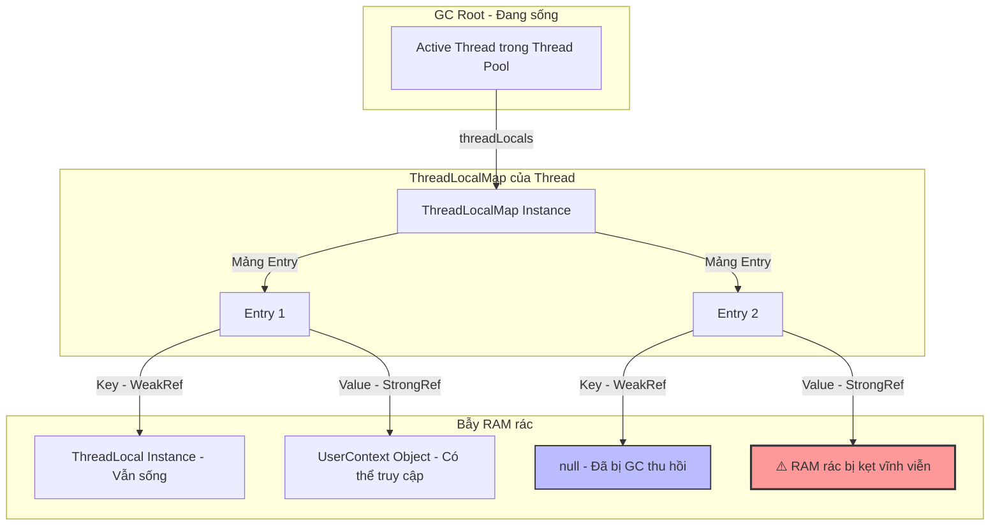

# ThreadLocal có thể gây memory leak trong thread pool ra sao?

## ⚡ Tóm tắt ngắn (30s)
* **Bản chất**: Bản chất `ThreadLocal` lưu trữ dữ liệu cục bộ cho luồng bằng cách giữ một Map nội bộ nằm ngay bên trong đối tượng luồng vật lý (`Thread.threadLocals`). Bản đồ này (`ThreadLocalMap`) sử dụng các tham chiếu yếu (**WeakReferences**) cho đối tượng Key (bản thân biến ThreadLocal), nhưng lại sử dụng các tham chiếu mạnh (**Strong References**) cho đối tượng **Value** (dữ liệu bạn lưu trữ). Trong cơ chế **Thread Pool** (như Tomcat worker pool hoặc ExecutorService), các luồng không bao giờ bị tiêu hủy mà được tái sử dụng liên tục cho các tác vụ/request mới. Nếu lập trình viên quên không gọi lệnh `.remove()` trước khi kết thúc tác vụ, đối tượng Value sẽ bị kẹt vĩnh viễn trong RAM của Thread đó, tích lũy dần qua các luồng và gây lỗi `OutOfMemoryError`.
* **Các thảm họa thực chiến được giải quyết**:
    1. **Thảm họa rò rỉ User Context (Silent Session Leak)**: Hệ thống sử dụng ThreadLocal để lưu trữ thông tin định danh `UserContext` ở tầng Filter của API. Khi gặp tải lớn, hàng ngàn Thread của Tomcat liên tục xử lý request nghiệp vụ nhưng thiếu lệnh dọn dẹp. Bộ nhớ RAM bị rò rỉ âm thầm lên tới hàng GB, kèm theo nguy cơ bảo mật nghiêm trọng: Một người dùng ngẫu nhiên đến sau có thể đọc được thông tin phiên đăng nhập của người dùng trước đó do nhận trùng Thread cũ.
    2. **Thảm họa rò rỉ MDC Logging**: Cấu hình logging chứa các thông tin định danh (Correlation ID) thông qua MDC (Mapped Diagnostic Context - bản chất bên dưới là ThreadLocal). Do thiếu chốt chặn dọn dẹp ở filter đầu ra, Log file bị rác thông tin và RAM bị nuốt trọn chỉ sau vài ngày vận hành.
* **Quyết định Senior**: Thiết lập chốt chặn phòng ngự tuyệt đối khi dùng ThreadLocal:
    1. **Bọc try-finally cưỡng bức**: Luôn luôn bao bọc mã nguồn xử lý ThreadLocal trong khối lệnh `try-finally` và thực hiện gọi lệnh `ThreadLocal.remove()` ngay trong khối `finally`.
    2. **Chốt chặn tự động ở Middleware (Filter/Interceptor)**: Đăng ký các bộ lọc tự động ở tầng Web Filter (hoặc Spring MVC Interceptor) để quét dọn toàn bộ ThreadLocal/MDC trước khi trả phản hồi (Response) về cho Client.

---

## 🔍 Chi tiết bản chất thực chiến: Cơ chế rò rỉ bộ nhớ của ThreadLocalMap

Để làm sáng tỏ tại sao WeakReference lại gây ra Strong Memory Leak, Senior Engineer phân tích cấu trúc hoạt động bên dưới của `ThreadLocalMap.Entry`:

### 1. Bẫy yếu ở Key và mạnh ở Value
* Cấu trúc một entry trong `ThreadLocalMap` được định nghĩa như sau:
  ```java
  static class Entry extends WeakReference<ThreadLocal<?>> {
      Object value; // ❌ Tham chiếu mạnh!
      Entry(ThreadLocal<?> k, Object v) {
          super(k); // Key được bọc trong WeakReference
          value = v; // Value được giữ bằng Strong Reference
      }
  }
  ```
* **Khi biến ThreadLocal bị hủy tham chiếu mạnh**: Trong chu kỳ Garbage Collection tiếp theo, GC sẽ thu hồi Key (vì Key chỉ có WeakReference trỏ tới). Key của Entry trong Map lúc này sẽ trở thành `null`.
* **Hậu quả**: Đối tượng Value vật lý (ví dụ: một User object nặng) vẫn được giữ bằng tham chiếu mạnh bởi biến `value` nằm trong lớp `Entry`. Vì `Thread` vật lý vẫn đang sống trong Thread Pool, nên chuỗi liên kết GC Root: `Active Thread` -> `threadLocals (ThreadLocalMap)` -> `Entry` -> `value` vẫn bền vững tuyệt đối. GC **không thể giải phóng Value này**.

### 2. Hiện tượng rác mồ côi (Stale Entries)
* Kết quả là ta có một tập hợp các "Entry mồ côi" trong bộ nhớ: Key thì bằng `null` (không thể truy cập được nữa từ code), nhưng Value thì vẫn ngốn RAM.
* Mặc dù Java có thiết kế cơ chế tự dọn dẹp các Entry mồ côi này khi bạn gọi tiếp các phương thức `.get()`, `.set()` hoặc `.remove()` trên biến ThreadLocal. Tuy nhiên, nếu luồng đó quay lại Pool và không bao giờ gọi các phương thức này nữa, hoặc biến ThreadLocal gốc đã bị hủy tham chiếu, đống RAM rác này sẽ nằm lì trong bộ nhớ vĩnh viễn.

---

## 🎨 Sơ đồ trực quan (JVM GC Roots và bẫy rò rỉ bộ nhớ ThreadLocal)



---

## 💻 Code thực chiến / Cấu hình thực tế: BAD vs GOOD

### ❌ BAD: Sử dụng ThreadLocal lưu thông tin Session mà không cleanup
Lập trình viên lưu trữ Session người dùng vào ThreadLocal ở tầng Interceptor của Spring Boot để sử dụng tiện lợi ở lớp Service. Do thiếu khối `finally` dọn dẹp, RAM bị leak liên tục.

* **Code Java tồi**:
```java
public class UserContextHolder {
    // Biến ThreadLocal lưu thông tin đăng nhập
    private static final ThreadLocal<UserSession> context = new ThreadLocal<>();

    public static void set(UserSession session) {
        context.set(session);
    }

    public static UserSession get() {
        return context.get();
    }

    public static void clear() {
        context.remove(); // ❌ Lập trình viên quên gọi phương thức này ở cuối request!
    }
}

// Bộ lọc chặn Request
@Component
public class SecurityInterceptor implements HandlerInterceptor {
    @Override
    public boolean preHandle(HttpServletRequest req, HttpServletResponse res, Object handler) {
        UserSession session = resolveSession(req);
        UserContextHolder.set(session); // ❌ Nạp dữ liệu vào luồng
        return true;
    }
    // ❌ Thiếu preHandle / afterCompletion để cleanup dọn dẹp RAM rác!
}
```

---

### ✅ GOOD: Bao bọc dọn dẹp cưỡng bức bằng interceptor afterCompletion
Sử dụng phương thức `afterCompletion` của HandlerInterceptor trong Spring Boot. Phương thức này được JVM bảo đảm sẽ chạy trong mọi tình huống (kể cả khi câu lệnh controller bị ném ra Exception), đảm bảo dọn sạch 100% RAM rác.

* **Code Java chuẩn Senior**:
```java
public class UserContextHolder {
    private static final ThreadLocal<UserSession> context = new ThreadLocal<>();

    public static void set(UserSession session) {
        context.set(session);
    }

    public static UserSession get() {
        return context.get();
    }

    public static void clear() {
        // ✅ Gọi remove để giải phóng Strong Reference của Value
        context.remove(); 
    }
}

@Component
public class SecurityInterceptor implements HandlerInterceptor {
    
    @Override
    public boolean preHandle(HttpServletRequest req, HttpServletResponse res, Object handler) {
        UserSession session = resolveSession(req);
        UserContextHolder.set(session); // Nạp dữ liệu an toàn
        return true;
    }

    @Override
    public void afterCompletion(HttpServletRequest req, HttpServletResponse res, Object handler, Exception ex) {
        // ✅ CHỐT CHẶN BẢO VỆ: afterCompletion luôn chạy kể cả khi controller bị Exception.
        // Giải phóng luồng 100%, bảo vệ RAM an toàn tuyệt đối và chống chéo phiên đăng nhập.
        UserContextHolder.clear(); 
    }
}
```

---

## 📊 Bảng so sánh các giải pháp chia sẻ dữ liệu trong luồng

| Tiêu chí so sánh | ThreadLocal thông thường | Spring Request Scope Beans | Method Parameter Passing (Truyền tham số) |
| :--- | :--- | :--- | :--- |
| **Độ trễ & Tiện lợi** | Rất cao, không cần sửa chữ ký của Method. | Cao, tự động quản lý bởi Spring Container. | Thấp (Phải thay đổi tham số của tất cả các hàm). |
| **Rủi ro Memory Leak** | **Cực cao** (Nếu thiếu lệnh dọn dẹp thủ công trong Thread Pool). | **Bằng 0** (Spring tự động hủy bean khi Request kết thúc). | **Bằng 0**. |
| **Hỗ trợ Async (Sử dụng `@Async`)** | Không tự động truyền sang luồng mới (Cần InheritableThreadLocal). | Không tự động truyền. | Tự động truyền (Vì tham số được chuyển giao tường minh). |

---

## ⚠️ Common Gotchas & Questions follow-up

### 1. Cạm bẫy "Bẫy bảo mật chéo phiên đăng nhập (Cross-Session Data Leak)"
* **Vấn đề**: Đây là thảm họa bảo mật tồi tệ nhất do ThreadLocal gây ra. RAM không tăng đến mức sập nguồn, nhưng User A đăng nhập lại nhìn thấy thông tin cá nhân của User B.
* **Thực tế**: Do User B vừa thực hiện request nghiệp vụ trên Thread 1 của Tomcat và ghi đè Session của mình vào ThreadLocal. Do thiếu lệnh `.remove()`, khi User A gửi request đến ngay sau đó, Tomcat phân phối trùng Thread 1 này để xử lý. Hệ thống đọc trực tiếp dữ liệu từ ThreadLocal cũ và trả thông tin của User B cho User A.
* **Giải pháp**: Phải viết Unit Test kiểm thử đa luồng (Concurrent Integration Testing) để kiểm chứng xem dữ liệu Context có được dọn sạch hoàn toàn sau mỗi chu kỳ xử lý request hay không.

### 2. Câu hỏi đào sâu từ interviewer

* **Q1: Sự khác biệt giữa `ThreadLocal` và `InheritableThreadLocal` là gì? Sử dụng `InheritableThreadLocal` trong môi trường Thread Pool chứa đựng rủi ro gì lớn hơn?**
  * *Trả lời*:
    1. **Khái niệm**: `InheritableThreadLocal` cho phép luồng con (Child Thread) tự động sao chép toàn bộ các giá trị ThreadLocal từ luồng cha (Parent Thread) tại thời điểm khởi tạo luồng con.
    2. **Rủi ro trong Thread Pool**: Nếu ứng dụng sử dụng các Thread Pool cho cả luồng con (ví dụ: `@Async` task executor), luồng con chỉ được **khởi tạo một lần duy nhất** lúc start hệ thống. Lần chạy tiếp theo, luồng con được tái sử dụng và không sao chép lại giá trị mới từ luồng cha nữa, dẫn đến việc luồng con xử lý dữ liệu của request cũ kẹt từ lâu, gây sai lệch tính toán nghiệp vụ nghiêm trọng.
    3. **Giải pháp**: Tránh dùng `InheritableThreadLocal` trong các Thread Pool. Thay vào đó, sử dụng thư viện **TransmittableThreadLocal (TTL)** của Alibaba được thiết kế chuyên biệt để truyền dữ liệu chéo luồng trong Thread Pool an toàn.

* **Q2: Tại sao Java thiết kế Key của `ThreadLocalMap` là một `WeakReference` thay vì một tham chiếu mạnh `Strong Reference`? Bản thiết kế này nhằm giải quyết bài toán gì?**
  * *Trả lời*: Đây là một quyết định thiết kế tối ưu của các kỹ sư JDK để tự động phòng chống rò rỉ bộ nhớ ở mức độ căn bản:
    1. **Tránh kẹt vĩnh viễn**: Nếu Key là tham chiếu mạnh, ngay cả khi ứng dụng đã chạy xong và gán biến ThreadLocal gốc về `null` (ví dụ: `myThreadLocal = null`), JVM vẫn không bao giờ thu hồi được đối tượng ThreadLocal này vì nó bị giữ chặt bởi Key của Map.
    2. **Tự động mồ côi hóa**: Bằng cách sử dụng `WeakReference` cho Key, JDK đảm bảo rằng ngay khi biến ThreadLocal ở code ứng dụng không còn được ai sử dụng nữa, bản thân cây Key sẽ tự động biến thành `null` trong chu kỳ GC tiếp theo, dọn đường cho JVM dọn dẹp các Entry mồ côi một cách thông minh mà không cần đợi luồng chết.
