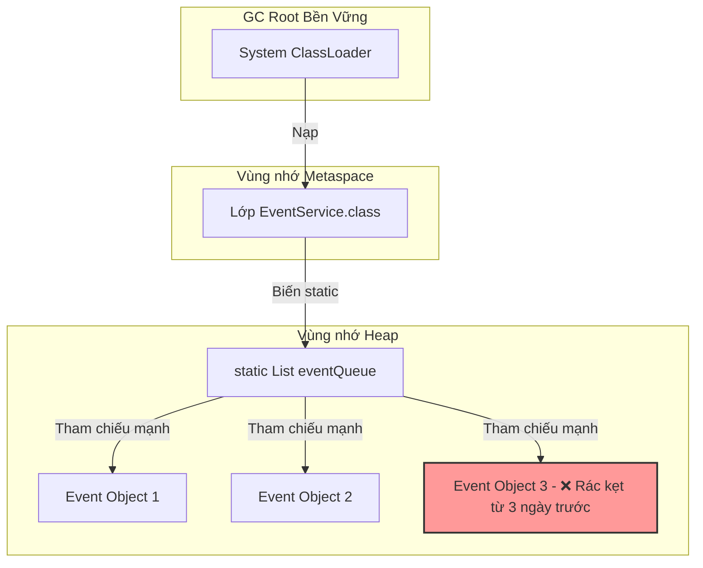

# List/Map static có thể gây leak như thế nào?

## ⚡ Tóm tắt ngắn (30s)
* **Bản chất**: Biến khai báo có từ khóa `static` thuộc về đối tượng Lớp (`Class`) nạp bởi **ClassLoader**. Trong suốt thời gian ứng dụng chạy, đối tượng Lớp và ClassLoader của nó được coi là những **GC Roots** bền vững nhất, không bao giờ bị Garbage Collector (GC) thu hồi. Do đó, bất kỳ cấu trúc dữ liệu nào được khai báo là static (ví dụ: `static List<Data>` hoặc `static Map<String, Object>`) sẽ giữ **tham chiếu mạnh (Strong References)** vĩnh viễn tới toàn bộ các phần tử được thêm vào đó. Nếu code ứng dụng liên tục `add` dữ liệu vào static collection mà thiếu logic xóa chủ động, vùng nhớ RAM sẽ bị rò rỉ tăng dần cho tới khi sập ứng dụng.
* **Các thảm họa thực chiến được giải quyết**:
    1. **Thảm họa rò rỉ từ tính năng "Lưu vết tạm thời" (Registry Leak)**: Lập trình viên thiết kế một bộ đăng ký sự kiện (Event Registry) sử dụng static List để lưu tạm dữ liệu trước khi đẩy xuống DB. Do thiếu chốt chặn giới hạn kích thước và không dọn dẹp sau khi xử lý xong, mảng static List tích lũy hàng triệu phần tử rác, gây sập server chỉ sau vài giờ cao điểm.
    2. **Thảm họa rò rỉ bộ nhớ ClassLoader trên Tomcat (Metaspace Leak)**: Khi deploy đi deploy lại (hot-reloading) một ứng dụng Web trên Tomcat mà không restart server. Các biến static của ứng dụng cũ vẫn bị trói chặt bởi ClassLoader cũ, khiến bộ nhớ Metaspace/Heap phình to liên tục sau mỗi lần deploy.
* **Quyết định Senior**: Hạn chế tối đa việc sử dụng từ khóa `static` cho các cấu trúc dữ liệu Collection:
    1. **Thay thế bằng Dependency Injection (Spring Beans)**: Thay vì dùng `static final Map`, hãy khai báo mảng Map bình thường bên trong một `@Component` hoặc `@Service` có phạm vi Singleton và để Spring quản lý vòng đời.
    2. **Cưỡng bức giới hạn kích thước**: Nếu bắt buộc phải dùng biến static vì lý do thiết kế đặc biệt, phải sử dụng các cấu trúc dữ liệu có giới hạn cứng (như `LinkedHashMap` đè ghi đè `removeEldestEntry` hoặc các hàng đợi giới hạn `ArrayBlockingQueue`).

---

## 🔍 Chi tiết bản chất thực chiến: Tại sao static Collection là "cỗ máy ngốn RAM"?

Để hiểu tại sao static collection lại nguy hiểm hơn biến thông thường, Senior Engineer phân tích cơ chế nạp lớp và thu hồi bộ nhớ:

### 1. Bản chất GC Root của biến Static
* Một đối tượng thông thường (không phải static) khai báo trong một phương thức sẽ bị mất tham chiếu ngay khi phương thức đó chạy xong và thoát scope. GC dễ dàng thu hồi nó.
* Một đối tượng static liên kết trực tiếp với metadata của lớp. Lớp (Class) chỉ bị gỡ nạp (unload) khi ClassLoader nạp nó bị thu hồi.
* Trong các ứng dụng Backend hiện đại, ClassLoader chính của hệ thống (System ClassLoader) tồn tại vĩnh viễn từ lúc khởi động cho đến lúc tắt ứng dụng. Do đó, **mọi biến static đều là GC Root**.
* **Hậu quả**: Lệnh `staticList.add(myObject)` đồng nghĩa với việc bạn vừa đóng một chiếc đinh tham chiếu mạnh đóng chặt `myObject` vào GC Root, tước đoạt hoàn toàn khả năng giải phóng bộ nhớ của Garbage Collector.

### 2. Sự nguy hiểm của việc tích lũy rác âm thầm (Silent Accumulation)
* Nhiều nhà phát triển sử dụng static collection làm "bộ đệm tạm thời" (in-memory buffer) để gom lô (batch) dữ liệu.
* Nếu luồng background xử lý lô bị lỗi (Exception) và dừng chạy đột ngột, dữ liệu mới vẫn tiếp tục được add vào static collection nhưng không bao giờ được rút ra xử lý. RAM sẽ cạn kiệt nhanh chóng dưới dạng rò rỉ âm thầm mà không có bất kỳ dòng log lỗi nghiệp vụ nào cảnh báo.

---

## 🎨 Sơ đồ trực quan (Cấu trúc tham chiếu của biến Static Collection)


> [!IMPORTANT]
> Biến `eventQueue` được khai báo `static` nên nó gắn chặt vào metadata của lớp `EventService` nằm trong Metaspace nạp bởi ClassLoader. Chừng nào ứng dụng còn chạy, `eventQueue` không bao giờ bị GC sờ tới.

---

## 💻 Code thực chiến / Cấu hình thực tế: BAD vs GOOD

### ❌ BAD: Sử dụng mảng static List làm hàng đợi tạm thời tự chế gây leak
Mã nguồn thiết kế bộ đăng ký sự kiện người dùng sử dụng mảng static List. Do luồng xử lý nghiệp vụ thiếu cơ chế dọn dẹp triệt để khi gặp lỗi, mảng liên tục phình to.

* **Code Java tồi**:
```java
@Component
public class EventRegistry {
    
    // ❌ THẢM HỌA: Mảng static List giữ tham chiếu vĩnh viễn đến tất cả các Event.
    // Nếu hệ thống chạy hàng triệu request, Heap RAM sẽ bị nuốt trọn.
    private static final List<UserEvent> eventQueue = new ArrayList<>();

    public void register(UserEvent event) {
        eventQueue.add(event); // ❌ Chỉ add thêm vào bộ đệm
    }

    // Luồng background chạy định kỳ xử lý dữ liệu
    @Scheduled(fixedDelay = 5000)
    public void processEvents() {
        for (UserEvent event : eventQueue) {
            sendToAnalytics(event);
            // ❌ THẢM HỌA 2: Xử lý xong nhưng không hề xóa khỏi eventQueue!
            // Dữ liệu rác kẹt lại trong mảng vĩnh viễn.
        }
    }
}
```

---

### ✅ GOOD: Sử dụng Spring Singleton Scope và Hàng đợi Giới hạn cứng (Bounded Queue)
Loại bỏ hoàn toàn từ khóa `static`. Chuyển giao quản lý vòng đời cho Spring Bean. Sử dụng cấu trúc hàng đợi có giới hạn dung lượng cứng (`LinkedBlockingQueue` với giới hạn 10,000) để bảo vệ bộ nhớ RAM an toàn tuyệt đối.

* **Code Java chuẩn Senior**:
```java
import java.util.ArrayList;
import java.util.List;
import java.util.concurrent.BlockingQueue;
import java.util.concurrent.LinkedBlockingQueue;

@Component
public class EventRegistry {

    // ✅ GIẢI PHÁP 1: Loại bỏ hoàn toàn 'static'. Vòng đời do Spring Bean Singleton quản lý.
    // ✅ GIẢI PHÁP 2: Sử dụng hàng đợi có giới hạn cứng (Capacity Bounded) để bảo vệ RAM
    private final BlockingQueue<UserEvent> eventQueue = new LinkedBlockingQueue<>(10000);

    public void register(UserEvent event) {
        // offer() trả về false nếu hàng đợi đã đầy, ngăn chặn tràn bộ nhớ RAM dưới tải cao
        boolean success = eventQueue.offer(event); 
        if (!success) {
            // Log cảnh báo hoặc đẩy vào hàng đợi ngoài (Kafka/RabbitMQ) để giảm tải
            log.warn("Event queue full, discarding event: {}", event.getId());
        }
    }

    @Scheduled(fixedDelay = 5000)
    public void processEvents() {
        List<UserEvent> batch = new ArrayList<>();
        // ✅ GIẢI PHÁP 3: Rút toàn bộ dữ liệu ra khỏi hàng đợi để xử lý (drainTo)
        // Dữ liệu được giải phóng hoàn toàn khỏi hàng đợi sau khi rút ra, GC thu hồi cực sạch.
        eventQueue.drainTo(batch); 

        for (UserEvent event : batch) {
            sendToAnalytics(event);
        }
    }
}
```

---

## 📊 Bảng so sánh phương pháp quản lý bộ đệm trong RAM

| Tiêu chí so sánh | Static List / Map | Spring Singleton Bean Map | Bounded Blocking Queue (drainTo) |
| :--- | :--- | :--- | :--- |
| **Bảo vệ chống OOM** | Không có (Bộ nhớ tăng vô hạn). | Không có (Nếu không cấu hình giới hạn tối đa). | **Tuyệt đối** (Hàng đợi đầy sẽ tự động từ chối nạp thêm). |
| **Độ an toàn đa luồng (Thread-Safety)** | Tệ (Phải tự đồng bộ hóa thủ công). | Tệ. | **Cực tốt** (Bản chất LinkedBlockingQueue là thread-safe). |
| **Dọn dẹp bộ nhớ (Memory Cleanup)** | Phải viết code xóa thủ công cẩn thận. | Phải viết code xóa thủ công. | **Tự động giải phóng** sau khi rút phần tử ra xử lý. |

---

## ⚠️ Common Gotchas & Questions follow-up

### 1. Cạm bẫy "Bẫy rò rỉ bộ nhớ ClassLoader khi Hot-Redeploy"
* **Vấn đề**: Bạn deploy app Java trên một Web Server dùng chung như Apache Tomcat. Bạn thực hiện reload ứng dụng web (bản chất là Tomcat hủy ClassLoader cũ và tạo ClassLoader mới để nạp bản code mới). RAM hệ thống vẫn tăng dốc đứng và sập Metaspace sau vài lần reload.
* **Thực tế**: Dù ứng dụng web cũ đã bị tắt, nhưng các luồng background hoặc các driver (như JDBC driver) được nạp bởi ClassLoader cũ vẫn giữ tham chiếu mạnh tới các biến `static` của ứng dụng cũ. ClassLoader cũ **không thể bị gỡ nạp** (ClassLoader Leak), làm rò rỉ toàn bộ metadata của hàng ngàn class cũ trong RAM.
* **Giải pháp**: Luôn cấu hình dọn dẹp tài nguyên triệt để trong sự kiện tắt ứng dụng (`ServletContextListener.contextDestroyed`), dừng toàn bộ các luồng background, hủy đăng ký JDBC driver.

### 2. Câu hỏi đào sâu từ interviewer

* **Q1: Nếu bắt buộc phải sử dụng một Map static để lưu trữ cấu hình hệ thống truy cập thường xuyên (Read-Heavy), làm thế nào để thiết kế để đảm bảo không bao giờ bị Memory Leak khi cấu hình thay đổi liên tục?**
  * *Trả lời*: Tôi áp dụng các chiến lược thiết kế sau:
    1. **Immutable Map kết hợp từ khóa `volatile`**: Khi có cấu hình mới, tôi không thực hiện hàm `.put()` vào Map cũ. Tôi tiến hành tạo một Map mới tinh và gán đè tham chiếu của biến static sang Map mới:
       ```java
       private static volatile Map<String, String> configMap = Map.of();
       ```
    2. **Tại sao an toàn**: Khi gán đè tham chiếu, Map cũ mất đi GC Root và sẽ được GC thu hồi sạch sẽ trong chu kỳ quét tiếp theo. Từ khóa `volatile` đảm bảo tính hiển thị (visibility) ngay lập tức cho các thread khác đang đọc cấu hình.

* **Q2: Lệnh `List.clear()` hoạt động như thế nào bên dưới mã nguồn JDK? Nó có thực sự giải phóng vùng nhớ RAM vật lý của mảng array lồng bên trong ngay lập tức không?**
  * *Trả lời*: Đây là một chi tiết nghiệp vụ sâu sắc của Java Collections:
    1. **Mã nguồn JDK `ArrayList.clear()`**:
       ```java
       public void clear() {
           for (int i = 0; i < size; i++)
               elementData[i] = null; // Gán null cho các phần tử để GC dọn dẹp
           size = 0;
       }
       ```
    2. **RAM thực tế**: Lệnh `.clear()` chỉ gán `null` cho các phần tử chứa trong mảng để GC thu hồi các đối tượng đó. Tuy nhiên, **bản thân mảng vật lý bên dưới (`elementData`) vẫn được giữ nguyên kích thước cũ** (capacity cũ).
    3. **Rủi ro**: Nếu trước đó static List của bạn chứa 10 triệu phần tử, mảng `elementData` sẽ có độ dài 10 triệu ô nhớ trong RAM. Kể cả sau khi gọi `.clear()`, mảng rỗng này vẫn chiếm một lượng RAM khổng lồ trên Heap.
    4. **Cách khắc phục**: Phải khởi tạo lại List mới (`list = new ArrayList<>()`) để hủy hoàn toàn mảng cũ.
