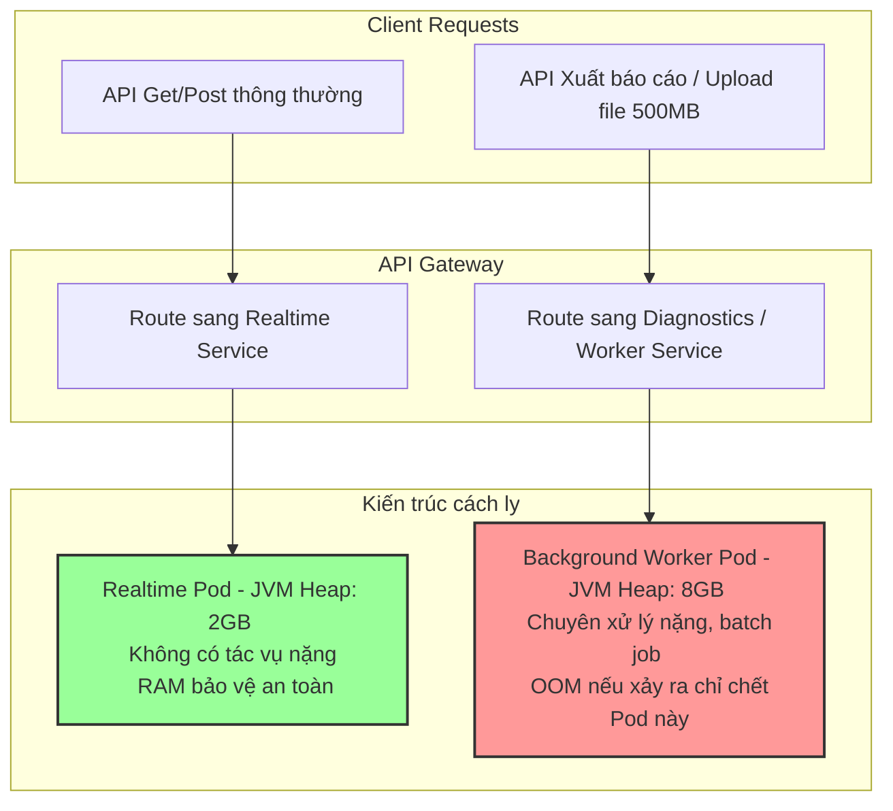

# Service bị OOM nhưng traffic không tăng. Nguyên nhân có thể là gì?

## ⚡ Tóm tắt ngắn (30s)
* **Bản chất**: Hiện tượng ứng dụng bị lỗi `OutOfMemoryError` (OOM) trong bối cảnh lưu lượng truy cập (Traffic/RPS) hoàn toàn ổn định chứng tỏ nguyên nhân **không nằm ở số lượng request**, mà nằm ở **kích thước dữ liệu (Data Payload)** của một vài request cá biệt hoặc sự tích lũy lỗi ngầm. Các thủ phạm hàng đầu bao gồm: Rò rỉ bộ nhớ dài hạn (Slow Memory Leak) vừa chạm ngưỡng giới hạn, các tác vụ nền định kỳ (Cron/Batch Jobs) xử lý khối lượng dữ liệu đột biến lớn, một request độc hại hoặc lỗi tải tệp tin dung lượng lớn (Excel/PDF) trực tiếp vào RAM, hoặc rò rỉ bộ nhớ ngoài Heap (Native Memory Leak).
* **Các thảm họa thực chiến được giải quyết**:
    1. **Thảm họa OOM lúc nửa đêm (Midnight Crash)**: Đúng 00:00 hàng ngày, khi lượng người dùng hoạt động thấp nhất, hệ thống tự động chạy batch job đồng bộ hoặc tổng hợp báo cáo ngày. Do dữ liệu tích lũy sau 1 năm quá lớn, tác vụ nền nạp toàn bộ dữ liệu vào RAM, vắt kiệt Heap và crash hệ thống âm thầm.
    2. **Thảm họa sập nguồn do tệp tin rác của khách hàng (Payload Bomb)**: Một đối tác doanh nghiệp tải lên một tệp XML/Excel có kích thước 500MB chứa hàng triệu dòng dữ liệu. Ứng dụng nạp toàn bộ vào RAM, đẩy Heap sử dụng tăng vọt từ 20% lên 100% chỉ trong 3 giây và crash ngay lập tức.
* **Quyết định Senior**: Áp dụng các chốt chặn kiến trúc cô lập rủi ro:
    1. **Tách biệt luồng xử lý nặng (Worker Offloading)**: Không bao giờ chạy các tác vụ nặng (nhập/xuất tệp, batch job) chung JVM với các API phục vụ luồng realtime của khách hàng. Tách chúng ra các **Background Workers** riêng biệt.
    2. **Chốt chặn kích thước dữ liệu đầu vào (Payload Guardrails)**: Ép giới hạn kích thước tối đa cho mọi API nhận tệp tải lên (MultipartFile) và các truy vấn dữ liệu từ DB (Hard pagination limits).
    3. **Giám sát chuyên sâu (Diagnostics)**: Theo dõi chặt chẽ vùng nhớ Tenured (Old Gen) và sử dụng Native Memory Tracking (NMT) để phát hiện leak ngoài Heap.

---

## 🔍 Chi tiết bản chất thực chiến: 4 Thủ phạm hàng đầu khiến OOM khi Traffic không tăng

Senior Engineer chẩn đoán sự cố dựa trên việc phân tích 4 nhóm nguyên nhân cơ bản sau:

### 1. Rò rỉ bộ nhớ tích lũy dài hạn (Slow-burn Memory Leak)
* *Hiện tượng*: Biểu đồ RAM tăng chậm, hình răng cưa hướng lên đều đặn trong suốt nhiều ngày liên tục.
* *Bản chất*: Mỗi ngày ứng dụng rò rỉ một lượng RAM rất nhỏ (ví dụ: 10MB rác kẹt lại trong mảng static hoặc local cache). Sau 15 ngày chạy liên tục, lượng RAM leak tích lũy đạt 1.5GB, nuốt trọn không gian trống của Heap. Lúc này, chỉ cần một request thông thường cũng đủ là "giọt nước tràn ly" kích hoạt OOM, dù lượng traffic lúc đó cực thấp.

### 2. Tác vụ định kỳ (Cron/Batch Job) xử lý lượng dữ liệu đột biến
* *Hiện tượng*: OOM xảy ra vào các khung giờ cố định (ví dụ: 0h sáng, 6h sáng) khi traffic từ người dùng ở mức đáy.
* *Bản chất*: Các tác vụ ngầm như tính toán đối soát, đồng bộ dữ liệu, hoặc gửi email hàng loạt được kích hoạt định kỳ. Do dữ liệu tích lũy theo thời gian phình to (data growth) vượt quá dự tính ban đầu của lập trình viên, các câu truy vấn nạp toàn bộ dữ liệu vào RAM để xử lý lô, gây tràn Heap đột ngột.

### 3. "Quả bom" dữ liệu đầu vào (Large Payload / Document Processing)
* *Hiện tượng*: OOM xảy ra bất ngờ tại một thời điểm ngẫu nhiên trong ngày.
* *Bản chất*: Một người dùng (hoặc một con bot) thực hiện các hành động nặng nề như:
  * Gọi API export báo cáo PDF/Excel với khoảng thời gian quá rộng (ví dụ: xuất lịch sử giao dịch của cả năm).
  * Tải lên tệp tin lớn để import dữ liệu. Các thư viện phân tích cú pháp (như DOM parser cho XML/JSON) sẽ dựng cấu trúc cây đối tượng trong RAM, chiếm dung lượng lớn gấp 10-30 lần kích thước vật lý của tệp tin.

### 4. Rò rỉ bộ nhớ ngoài Heap (Native / Off-Heap Memory Leak)
* *Hiện tượng*: JVM Heap hoàn toàn trống trải và sạch sẽ, nhưng RAM vật lý của Container Docker liên tục tăng kịch trần cho đến khi bị OS Kernel gửi tín hiệu `SIGKILL` (OOMKilled - Exit Code 137).
* *Bản chất*:
  * Leak trong các thư viện Native (như thư viện đồ họa OpenCV, thư viện nén dữ liệu).
  * Rò rỉ các ByteBuffer trực tiếp (Direct ByteBuffers) được sử dụng bởi các thư viện Network hiệu năng cao như Netty, Spring WebFlux mà quên không gọi giải phóng tài nguyên.

---

## 🎨 Sơ đồ trực quan (Cô lập luồng xử lý nặng để bảo vệ High-Traffic API)



---

## 💻 Code thực chiến / Cấu hình thực tế: BAD vs GOOD

### ❌ BAD: Cho phép API Export báo cáo nạp toàn bộ dữ liệu từ DB vào Heap RAM
Đoạn code viết API tìm kiếm và xuất lịch sử giao dịch. Code sử dụng JPA nạp toàn bộ danh sách kết quả (có thể lên tới hàng triệu dòng) vào RAM dưới dạng đối tượng Entity để sinh báo cáo, sập RAM tức thì.

* **Code Java tồi**:
```java
@RestController
@RequestMapping("/api/v1/transactions")
public class TransactionController {
    @Autowired
    private TransactionRepository transactionRepository;

    // ❌ THẢM HỌA: Nếu user lọc khoảng thời gian rộng, câu query trả về 1 triệu dòng.
    // JVM sẽ nạp 1 triệu Entity Object nặng nề vào Heap RAM, gây OOM ngay lập tức.
    @GetMapping("/export")
    public List<Transaction> exportTransactions(@RequestParam String fromDate, @RequestParam String toDate) {
        return transactionRepository.findAllByDateRange(fromDate, toDate); 
    }
}
```

---

### ✅ GOOD: Sử dụng Stream/Scrollable Results kết hợp giải phóng bộ nhớ liên tục
Sử dụng cơ chế **Stream/Scrollable** của JPA/Hibernate để kéo từng dòng dữ liệu từ DB về một cách tuần tự. Kết hợp giải phóng bộ nhớ đệm (Persistence Context) định kỳ để giữ lượng RAM tiêu thụ ở mức hằng số $O(1)$ cực nhỏ.

* **Code Java chuẩn Senior**:
```java
import jakarta.persistence.EntityManager;
import org.hibernate.ScrollMode;
import org.hibernate.ScrollableResults;
import org.hibernate.Session;
import java.util.stream.Stream;

@Service
public class TransactionExportService {
    @Autowired
    private EntityManager entityManager;

    // ✅ GIẢI PHÁP: Sử dụng ScrollableResults để đọc dữ liệu dạng luồng (Streaming) từ Database
    @Transactional(readOnly = true)
    public void streamExport(String fromDate, String toDate, Writer writer) {
        Session session = entityManager.unwrap(Session.class);
        
        // Sử dụng FORWARD_ONLY scroll để tối ưu tốc độ đọc luồng đi tới
        try (ScrollableResults<Transaction> results = session.createQuery(
                "SELECT t FROM Transaction t WHERE t.createdDate >= :fromDate AND t.createdDate <= :toDate", Transaction.class)
                .setParameter("fromDate", fromDate)
                .setParameter("toDate", toDate)
                .scroll(ScrollMode.FORWARD_ONLY)) {

            int count = 0;
            while (results.next()) {
                Transaction transaction = results.get();
                
                // Viết dữ liệu ra Stream (ví dụ: CSV/JSON stream) ngay lập tức
                writer.write(transaction.toCsvRow());
                
                // ✅ CHỐT CHẶN BẢO VỆ RAM: Giải phóng đối tượng khỏi Hibernate L1 Cache
                // Cứ sau 100 dòng, ta evict khỏi session để GC có thể thu hồi ngay lập tức, 
                // khống chế RAM tiêu thụ ở mức hằng số cực nhỏ.
                if (++count % 100 == 0) {
                    session.clear(); 
                }
            }
        } catch (Exception e) {
            log.error("Lỗi xuất file: ", e);
        }
    }
}
```

---

## 📊 Bảng phân tích các nguyên nhân gây OOM khi Traffic ổn định

| Nguyên nhân gốc rễ | Dấu hiệu trên APM Grafana | Tác động hệ thống | Biện pháp xử lý triệt để |
| :--- | :--- | :--- | :--- |
| **Slow Memory Leak** | Old Gen tăng tuyến tính rất chậm qua nhiều ngày. | Sập nguồn bất ngờ vào bất kỳ lúc nào. | Phân tích Heap Dump bằng MAT, tìm và xóa GC Roots gây leak. |
| **Large Data Payloads** | Old Gen tăng dựng đứng thành vách đá và sập ngay sau đó. | Treo luồng, API timeout hàng loạt trước khi sập. | Bắt buộc phân trang cứng; Chuyển sang cơ chế Streaming API. |
| **Cron/Batch Jobs** | RAM tăng dốc đứng vào các khung giờ đêm/sáng cố định. | Sập hệ thống lúc thấp điểm. | Tách các scheduled tasks sang chạy ở cụm Pod độc lập (Background Workers). |
| **Native Memory Leak** | System RAM tăng kịch trần, JVM Heap sử dụng báo cáo cực thấp. | Container bị Docker daemon bắn tín hiệu `OOMKilled` (Exit 137). | Bật Native Memory Tracking (NMT); Giải phóng Direct ByteBuffers; Đóng JNI resources. |

---

## ⚠️ Common Gotchas & Questions follow-up

### 1. Cạm bẫy "Bẫy lầm tưởng OOM là do lỗi của bộ dọn rác GC"
* **Vấn đề**: Thấy CPU liên tục tăng 100% kèm lỗi `GC Overhead Limit Exceeded`. Kỹ sư chuyển cấu hình GC từ G1GC sang ZGC hoặc Shenandoah và hy vọng lỗi biến mất.
* **Thực tế**: GC chỉ là nạn nhân gánh chịu hậu quả. Khi bộ nhớ Heap đã bị lấp đầy 99% bởi các đối tượng còn sống (Reachable Objects), GC buộc phải chạy liên tục không ngừng nghỉ để cố gắng tìm kiếm từng KB trống. Việc đổi thuật toán GC chỉ làm giảm thời gian dừng (`Stop-the-world`) chứ không thể tạo thêm RAM vật lý cho các đối tượng bị kẹt tham chiếu mạnh.
* **Giải pháp**: Phải đối mặt trực tiếp với việc giải phóng các tham chiếu mạnh, cấu hình lại giới hạn nạp dữ liệu.

### 2. Câu hỏi đào sâu từ interviewer

* **Q1: Nếu hệ thống của bạn bị OOMKilled bởi Kubernetes (Exit Code 137), làm thế nào bạn phân biệt được chính xác đó là lỗi Java Heap Space hay là lỗi do RAM vật lý của Container bị vượt quá giới hạn (Container Limits)?**
  * *Trả lời*: Đây là hai khái niệm OOM ở hai tầng khác nhau:
    1. **OOM do Java Heap Space**: Lỗi xảy ra bên trong JVM. Trong file log ứng dụng, ta chắc chắn sẽ tìm thấy dòng thông báo Exception kinh điển của Java: `java.lang.OutOfMemoryError: Java heap space`. Đồng thời, nếu cấu hình `-XX:+HeapDumpOnOutOfMemoryError`, tệp tin `.hprof` sẽ được tạo ra thành công.
    2. **OOMKilled do Kubernetes (Exit Code 137)**: Lỗi xảy ra ở tầng container/OS. JVM hoàn toàn bình thường, không hề sinh ra bất kỳ dòng log Exception nào trong ứng dụng và không có file heap dump nào được sinh ra. Khi chạy lệnh `kubectl describe pod <pod-name>`, tại trường State của container sẽ báo lỗi: `OOMKilled: true` kèm theo `Exit Code: 137`. Điều này có nghĩa là tổng RAM vật lý của container (bao gồm Heap + Metaspace + Off-Heap + OS Overhead) đã vượt qua giới hạn `limits.memory` cấu hình trong file YAML của K8s, khiến OS OOM-Killer ra tay diệt tiến trình Java.

* **Q2: Tại sao các truy vấn Hibernate `@OneToMany` có cấu hình `FetchType.EAGER` lại là một nguy cơ cực kỳ lớn gây OOM bất ngờ khi khối lượng dữ liệu trong Database tăng trưởng theo thời gian?**
  * *Trả lời*:
    1. **Cơ chế tải ngầm**: Cấu hình `FetchType.EAGER` bắt buộc Hibernate phải tự động nạp toàn bộ các đối tượng con liên quan lên RAM ngay khi đối tượng cha được truy vấn.
    2. **Thảm họa phình to (Data Growth)**: Lúc hệ thống mới vận hành, một đối tượng cha (ví dụ: `User`) chỉ có 5-10 đối tượng con (ví dụ: `Order`). Hệ thống chạy mượt mà. Sau 2 năm hoạt động, một user VIP tích lũy tới 100,000 order.
    3. **Hậu quả OOM**: Khi có một tác vụ nghiệp vụ gọi truy vấn thông tin User này, Hibernate sẽ ngầm thực hiện một câu SQL JOIN khổng lồ, kéo toàn bộ 100,000 đối tượng Order lên RAM cùng một lúc. Chỉ cần vài request đồng thời truy vấn thông tin các user VIP này, Heap RAM sẽ lập tức bị vắt kiệt gây OOM đột ngột mà traffic người dùng không hề tăng.
    4. **Khắc phục**: Luôn đặt mặc định `FetchType.LAZY` và chỉ sử dụng `JOIN FETCH` có kiểm soát cho từng câu query cụ thể.
