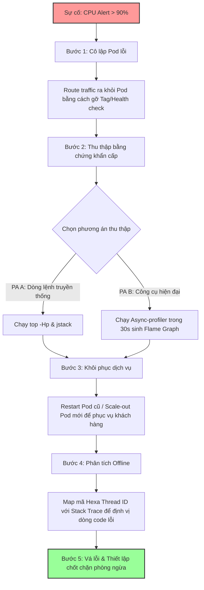

# Java service CPU tăng 100%, bạn debug thế nào?

## ⚡ Tóm tắt ngắn (30s)
* **Bản chất**: CPU tăng 100% xảy ra khi một hoặc nhiều luồng (thread) trong JVM tiêu thụ chu kỳ xử lý của CPU liên tục không ngừng nghỉ (Active Waiting/Infinite Loop/CPU-bound tasks), hoặc do máy ảo Java dành toàn lực cho hoạt động dọn rác (GC Thrashing) hoặc biên dịch mã tối ưu (JIT Compilation overhead).
* **Các thảm họa thực chiến được giải quyết**:
    1. **Thảm họa sập đổ dây chuyền (Cascading Failure)**: Một pod bị quá tải CPU phản hồi cực chậm, hàng đợi yêu cầu (request queue) tăng vọt làm cạn kiệt connection pool của Gateway và sập toàn bộ các dịch vụ downstream liên quan.
    2. **Thảm họa "Đốt tiền" do Auto-scaling**: Hệ thống kích hoạt scale-out liên tục trên Cloud (AWS/GCP) nhưng các pod mới tạo ra cũng nhanh chóng bị CPU 100% do cùng một bug nghiệp vụ, làm tăng chi phí hạ tầng cấp số nhân mà dịch vụ vẫn chết.
* **Quyết định Senior**: Triển khai quy trình phản ứng nhanh 5 bước: **Cô lập nóng** (Isolate Pod ra khỏi Load Balancer) -> **Thu thập bằng chứng** (Chụp Thread Dump kết hợp danh sách OS Thread tiêu thụ CPU cao nhất hoặc kích hoạt Async-profiler) -> **Khôi phục dịch vụ** (Restart/Scale pod sạch để cứu khách hàng) -> **Phân tích ngoại tuyến** (Offline Diagnostics bằng Flame Graph) -> **Bảo vệ mã nguồn** (Vá lỗi và áp dụng Circuit Breaker).

---

## 🔍 Chi tiết bản chất thực chiến: Quy trình xử lý của Senior

Khi CPU hệ thống chạm ngưỡng 100%, một Senior Engineer không bao giờ hoảng loạn restart service ngay lập tức mà luôn thực hiện cô lập và chụp lại dấu vết bộ nhớ/luồng trong vòng 1-2 phút trước khi khôi phục dịch vụ.

### 1. Phân loại 4 nguyên nhân gốc rễ gây CPU cao
* **Lỗi logic vòng lặp vô hạn (Infinite Loop) hoặc Polling bận (Active Waiting)**:
  * Thread chạy liên tục một vòng lặp `while(true)` mà không có cơ chế chặn (blocking) như `Thread.sleep()`, `Object.wait()` hoặc Blocking Queue.
* **Garbage Collection (GC) Thrashing**:
  * Bộ nhớ Heap bị cạn kiệt (hoặc rò rỉ), GC liên tục kích hoạt dọn rác (Stop-The-World) song song trên nhiều CPU core để cứu ứng dụng nhưng không hiệu quả, khiến tài nguyên CPU bị nuốt trọn bởi tiến trình GC.
* **Mã hóa, Giải mã & Serialization khổng lồ**:
  * Ép kiểu dữ liệu JSON siêu lớn (nhiều MB), liên tục mã hóa mật khẩu bằng thuật toán nặng (BCrypt với vòng lặp quá cao), hoặc nén/giải nén tệp tin zip dung lượng lớn ngay trong luồng xử lý API realtime.
* **Tranh chấp khóa dữ liệu cao (High Lock Contention / Spin Lock)**:
  * Nhiều luồng cùng tranh chấp các tài nguyên bị khóa và liên tục thực hiện cơ chế xoay vòng kiểm tra khóa (spinning) thay vì đi vào trạng thái chờ (waiting/sleeping), làm CPU hoạt động hết công suất.

---

## 🎨 Sơ đồ trực quan (Quy trình ứng phó khẩn cấp CPU 100%)



---

## 💻 Code thực chiến / Cấu hình thực tế: BAD vs GOOD

### ❌ BAD: Cơ chế Polling bận (Active Waiting) hủy diệt CPU
Code sử dụng luồng nền để kiểm tra trạng thái của một tác vụ khác nhưng thực hiện kiểm tra liên tục trong vòng lặp kín mà không cho luồng nghỉ ngơi, chiếm trọn 100% tài nguyên của một CPU Core.

```java
public class OrderProcessor implements Runnable {
    private volatile boolean orderReady = false;

    @Override
    public void run() {
        System.out.println("Bắt đầu giám sát đơn hàng...");
        // ❌ TỒI: Vòng lặp trống không có khoảng nghỉ, luồng sẽ liên tục chiếm dụng CPU core
        while (!orderReady) {
            // Không làm gì cả hoặc chỉ in log liên tục
            // CPU sẽ bị đẩy lên 100% cho core chạy luồng này
        }
        processOrder();
    }
}
```

---

### ✅ GOOD: Sử dụng Cơ chế Blocking Queue tối ưu tài nguyên
Thay vì chủ động chạy vòng lặp kiểm tra liên tục, luồng sẽ được đưa vào trạng thái **WAITING** (không tiêu thụ CPU) và chỉ được đánh thức dậy khi có dữ liệu mới được đẩy vào.

```java
import java.util.concurrent.BlockingQueue;
import java.util.concurrent.LinkedBlockingQueue;

public class OptimizedOrderProcessor implements Runnable {
    // ✅ Sử dụng Blocking Queue để luồng tự động ngủ khi rỗng
    private final BlockingQueue<Order> orderQueue = new LinkedBlockingQueue<>();

    public void enqueueOrder(Order order) {
        orderQueue.offer(order);
    }

    @Override
    public void run() {
        System.out.println("Bắt đầu giám sát đơn hàng với Blocking Queue...");
        try {
            while (!Thread.currentThread().isInterrupted()) {
                // ✅ TỐT: Hàm take() sẽ block luồng lại nếu queue rỗng. 
                // Lúc này luồng ở trạng thái WAITING, tiêu thụ 0% CPU.
                Order order = orderQueue.take(); 
                processOrder(order);
            }
        } catch (InterruptedException e) {
            Thread.currentThread().interrupt();
            System.out.println("Luồng xử lý bị ngắt kết nối.");
        }
    }

    private void processOrder(Order order) {
        // Xử lý logic đơn hàng
    }
}
```

---

## 📊 Bảng so sánh các nguyên nhân gây CPU cao và dấu hiệu nhận biết

| Đặc trưng | Vòng lặp vô hạn (Infinite Loop) | GC Thrashing | Serialization / Mã hóa | Lock Contention (Spin lock) |
| :--- | :--- | :--- | :--- | :--- |
| **Số lượng CPU Core bị ảnh hưởng** | Thường chỉ 1 hoặc một vài core bị khóa cứng 100% (tùy số luồng bị lặp). | Toàn bộ các core CPU chạy JVM đều tăng cao và bằng nhau. | Tăng đột biến theo hình răng cưa trùng khớp với các đợt traffic lớn. | CPU tăng đều trên nhiều core kèm theo số lượng thread bị BLOCK tăng vọt. |
| **Biểu đồ RAM đi kèm** | RAM đi ngang hoặc biến động bình thường. | RAM Heap đầy sát trần 100%, không hề giảm sau GC. | RAM tăng giảm liên tục theo hình răng cưa ngắn. | RAM bình thường hoặc tăng nhẹ do hàng đợi tích luỹ dữ liệu. |
| **Công cụ định vị tốt nhất** | OS Thread ID Map + `jstack` | `jstat -gcutil` / Prometheus JVM | Async-profiler (Flame Graph) | Thread Dump (`jstack` / VisualVM) |
| **Cách xử lý triệt để** | Fix lỗi logic vòng lặp, thêm điều kiện thoát. | Giải quyết rò rỉ bộ nhớ, nâng kích thước Heap `-Xmx`. | Dùng thư viện hiệu năng cao, cache kết quả mã hóa, tối ưu kích thước payload. | Giảm phạm vi khóa (synchronized block), chuyển sang dùng Lock-free DS. |

---

## ⚠️ Common Gotchas & Questions follow-up

### 1. Cạm bẫy "Scale-out tự động mù quáng"
* **Vấn đề**: Khi CPU của Service đạt 90%, hệ thống tự động scale thêm Pod mới.
* **Thực tế**: Nếu nguyên nhân CPU cao bắt nguồn từ **Database lock** (ví dụ: một câu query không có index làm khóa toàn bộ bảng dữ liệu) hoặc **Lock Contention** trong ứng dụng, việc thêm Pod mới sẽ tăng số lượng kết nối đồng thời và tăng tranh chấp khóa dữ liệu, khiến Database sập nhanh hơn hoặc toàn bộ hệ thống bị nghẽn nặng nề hơn.
* **Giải pháp**: Phải xác định nguyên nhân CPU cao trước khi nâng scale. Chỉ tự động scale khi CPU cao do lưu lượng yêu cầu (Request Rate) tăng trưởng tuyến tính và ứng dụng thuộc dạng stateless xử lý độc lập.

### 2. Câu hỏi đào sâu từ interviewer

* **Q1: Trên môi trường Kubernetes sản xuất, các Container thường sử dụng Distroless Image (không có sẵn bash, không có lệnh `top`, `htop`, cũng không cài JDK để chạy `jstack`). Làm sao bạn có thể điều tra được nguyên nhân CPU 100% của Pod lỗi?**
  * *Trả lời*: Đây là một thử thách rất thực tế khi vận hành microservices hiện đại. Tôi áp dụng các phương án sau:
    1. **Sử dụng Kubernetes Ephemeral Containers (kubectl debug)**: Tôi có thể đính kèm một container cứu hộ (debug container) chứa đầy đủ các công cụ chẩn đoán chuyên dụng như `top`, `perf`, `gdb` vào trực tiếp Pod đang bị lỗi thông qua lệnh `kubectl debug -it <pod-name> --image=nicolaka/netshoot --target=<container-name>`. Container này chia sẻ chung namespace mạng và tiến trình (PID namespace) với ứng dụng chính, cho phép tôi chạy các lệnh kiểm tra thoải mái mà không ảnh hưởng tới tính bảo mật của container gốc.
    2. **Tích hợp sẵn REST Endpoint nội bộ kích hoạt Profiler**: Tôi thường tích hợp thư viện **Async-profiler** vào ứng dụng và cấu hình một endpoint quản trị bảo mật (được bảo vệ chỉ cho phép truy cập nội bộ từ mạng VPN). Khi cần debug, tôi có thể gửi một request HTTP để kích hoạt profiler chạy trong 30 giây:
       `curl -X POST http://internal-service/actuator/profile?duration=30 -o profile.html`
       Sau đó tải file Flame Graph HTML này về máy cá nhân để phân tích cấu trúc tiêu thụ CPU.

* **Q2: Nếu bạn phát hiện CPU tăng cao do JIT Compiler hoạt động quá công suất (JIT Compilation Overhead), bạn sẽ xử lý thế nào?**
  * *Trả lời*: JIT Compiler (Just-In-Time) chiếm CPU cao thường xảy ra trong quá trình khởi động ứng dụng (warm-up phase) khi JVM đang nỗ lực biên dịch mã bytecode sang mã máy trực tiếp cho các phương thức được gọi nhiều (hot methods). Để xử lý:
    1. **Áp dụng chiến lược Khởi động ấm (Warm-up Script)**: Trước khi cho phép Pod nhận traffic thực tế từ người dùng, chúng tôi chạy các kịch bản script tự động gọi thử các API cốt lõi khoảng vài trăm lần để JVM hoàn tất việc biên dịch mã tối ưu JIT.
    2. **Điều chỉnh Tiered Compilation**: Tôi có thể cấu hình tham số `-XX:TieredStopAtLevel=1` để tắt bớt các cấp độ tối ưu hóa phức tạp của JIT Compiler trong môi trường kiểm thử hoặc môi trường máy chủ cấu hình yếu nhằm tiết kiệm CPU lúc khởi động, hoặc tăng luồng xử lý JIT bằng cách điều chỉnh `-XX:CICompilerCount`.
    3. **Sử dụng công nghệ GraalVM Native Image**: Dịch trước toàn bộ code thành mã máy trực tiếp (Ahead-Of-Time compilation) để triệt tiêu hoàn toàn hoạt động của JIT Compiler lúc chạy, giúp ứng dụng khởi động tức thì với 0% CPU overhead cho compiler.
