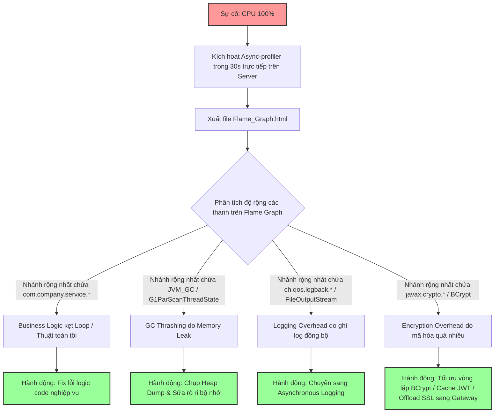

# Làm sao phân biệt CPU cao do business logic, GC, logging hay encryption?

## ⚡ Tóm tắt ngắn (30s)
* **Bản chất**: Hoạt động phân tích nguồn gốc tiêu thụ CPU thực chất là việc bóc tách tài nguyên CPU tiêu thụ bởi các nhóm luồng (threads) và phương thức (methods) khác nhau bên trong máy ảo Java. Để phân biệt chính xác tuyệt đối, Senior Engineer sử dụng các công cụ lấy mẫu hiệu năng (**Sampling Profiler**) như **Async-Profiler** để xây dựng **Flame Graph** (Biểu đồ ngọn lửa). Flame Graph trực quan hóa tỷ lệ phần trăm thời gian CPU dành cho từng dòng lệnh, giúp chỉ rõ "đống lửa" CPU 100% đang bùng cháy ở nhóm hàm nào.
* **Các thảm họa thực chiến được giải quyết**:
    1. **Thảm họa "Sửa sai lỗi" (Fixing the wrong thing)**: CPU server bị quá tải do ghi log đồng bộ quá đà (Logging overhead). Kỹ sư không biết, đè các thuật toán xử lý nghiệp vụ ra để tối ưu hóa code. Việc này vừa làm mất nhiều ngày công vô ích, vừa làm code phức tạp hơn mà CPU hệ thống vẫn bị nghẽn 100%.
* **Quyết định Senior**: Kích hoạt Async-Profiler trong 30 giây trực tiếp trên Production để xuất Flame Graph và phân loại nguồn gốc theo các dấu hiệu đặc trưng:
    1. **Business Logic**: Nhánh Flame Graph to và sâu ở các gói package của ứng dụng (`com.company.*`).
    2. **GC Thrashing**: Nhánh CPU bị chiếm đóng bởi các hàm C++ của JVM như `G1CollectedHeap`, `VM_Operation`, `JVM_GC`.
    3. **Logging Overhead**: Sự xuất hiện dày đặc của các class `ch.qos.logback.*` hoặc `org.apache.logging.log4j.*`.
    4. **Encryption**: Flame Graph chứa các hàm mã hóa thuộc JDK như `javax.crypto.*` hoặc `sun.security.provider.*`.

---

## 🔍 Chi tiết bản chất thực chiến: Đọc vị Flame Graph của Senior

Senior Engineer không chẩn đoán CPU cao bằng cảm tính. Họ sử dụng công cụ **Async-Profiler** để có cái nhìn X-quang vào sâu trong JVM.

Flame Graph hiển thị các phương thức dưới dạng các thanh chữ nhật xếp chồng lên nhau. 
* **Chiều rộng của thanh**: Đại diện cho tỷ lệ phần trăm thời gian CPU tiêu thụ bởi phương thức đó và các phương thức con của nó. Thanh càng rộng nghĩa là phương thức đó tiêu tốn càng nhiều CPU (Hotspot).
* **Chiều sâu (chiều cao của cột)**: Đại diện cho độ sâu của Stack Trace.

---

### 1. Dấu hiệu CPU cao do Business Logic (Logic nghiệp vụ)
Khi CPU bị ngốn bởi các thuật toán nghiệp vụ tự viết (như vòng lặp tính toán chiết khấu, đối soát dữ liệu, xử lý ảnh):
* **Đặc trưng trên Flame Graph**: Bạn sẽ nhìn thấy các thanh màu cam rộng nằm ở đỉnh của cột stack trace thuộc về package của chính dự án (ví dụ: `com.yourcompany.service.ReportService.generate()`).
* **Đặc trưng APM (Grafana)**: Chỉ số CPU tăng cao đồng thời với lượng CPU thời gian chạy của luồng ứng dụng (`jvm_threads_cpu_time_seconds_total`) tăng vọt.

---

### 2. Dấu hiệu CPU cao do Garbage Collection (GC Thrashing)
Khi GC hoạt động quá công suất do cạn kiệt bộ nhớ Heap:
* **Đặc trưng trên Flame Graph**: Cột stack trace hiển thị các hàm hệ thống C++ của máy ảo HotSpot JVM chứ không hiển thị code Java.
  * Các hàm đặc trưng: `G1ParScanThreadState::do_oop` (nếu dùng G1GC), `VM_Operation::evaluate`, `GarbageCollectorImpl::...`.
* **Đặc trưng APM (Grafana)**: Biểu đồ bộ nhớ Heap đạt sát trần 98%, tần suất chạy GC (`jvm_gc_pause_seconds_count`) và tổng thời gian dừng GC (`jvm_gc_pause_seconds_sum`) tăng vọt lên hàng chục giây.

---

### 3. Dấu hiệu CPU cao do Ghi Log quá đà (Logging Overhead)
Khi ứng dụng in quá nhiều log đồng bộ (Synchronous Logging) ở mức độ `DEBUG` hoặc `INFO` dưới áp lực traffic cao:
* **Đặc trưng trên Flame Graph**: Bạn sẽ thấy một nhánh ngọn lửa cực kỳ rộng xuất hiện các class của thư viện ghi log và tầng Network/Disk I/O.
  * Các hàm đặc trưng: `ch.qos.logback.classic.Logger.buildLoggingEventAndAppend`, `org.apache.logging.log4j.core.config.LoggerConfig.log`, `java.io.FileOutputStream.write`.
* **Đặc trưng APM (Grafana)**: CPU hệ thống tăng cao nhưng CPU của JVM thực tế lại thấp, chỉ số Disk Write I/O (Tốc độ ghi đĩa) của máy chủ tăng đột biến.

---

### 4. Dấu hiệu CPU cao do Mã hóa & Giải mã (Encryption Overhead)
Khi ứng dụng liên tục thực hiện các tác vụ HTTPS/TLS handshake, mã hóa mật khẩu (`BCrypt`), hoặc giải mã Token bảo mật JWT liên tục ở mỗi request:
* **Đặc trưng trên Flame Graph**: Xuất hiện nhánh lửa rất rộng chứa các thư viện mật mã của Java JDK hoặc thư viện ngoài.
  * Các hàm đặc trưng: `javax.crypto.Cipher.doFinal`, `org.mindrot.jbcrypt.BCrypt.hashpw`, `sun.security.ssl.SSLEngineImpl`.

---

## 🎨 Sơ đồ trực quan (Quy trình phân tích nguồn gốc CPU cao bằng Flame Graph)



---

## 💻 Code thực chiến / Cấu hình thực tế: BAD vs GOOD

### ❌ BAD: Ghi log đồng bộ vô tội vạ làm nghẽn CPU hệ thống
Đoạn code in log đồng bộ trực tiếp ra file/console bên trong một vòng lặp xử lý danh sách lớn. Dưới tải cao, luồng ứng dụng sẽ bị block liên tục chờ Disk I/O, đẩy CPU lên cao do Context Switching.

```java
import lombok.extern.slf4j.Slf4j;
import java.util.List;

@Slf4j
public class BadLoggingProcessor {

    public void processItems(List<String> items) {
        for (String item : items) {
            // ❌ TỒI: Gọi log đồng bộ liên tục trong vòng lặp lớn
            // Hệ thống sẽ bị nghẽn CPU do Disk I/O blocked và tranh chấp khóa của Appender
            log.info("Bắt đầu xử lý mặt hàng: {} tại thời điểm: {}", item, System.currentTimeMillis());
            doWork(item);
        }
    }
    private void doWork(String item) {}
}
```

---

### ✅ GOOD: Cấu hình Ghi Log bất đồng bộ (Asynchronous Logging) tối ưu
Senior Engineer chuyển toàn bộ hoạt động I/O ghi log sang một luồng chạy nền bất đồng bộ (Background Thread) thông qua việc cấu hình **LMAX Disruptor Ring Buffer** của Log4j2 hoặc `AsyncAppender` của Logback, giúp giải phóng hoàn toàn luồng chính.

* **Cấu hình `logback-spring.xml` tối ưu**:
```xml
<configuration>
    <!-- Định nghĩa Appender ghi file thông thường -->
    <appender name="FILE" class="ch.qos.logback.core.rolling.RollingFileAppender">
        <file>logs/app.log</file>
        <encoder>
            <pattern>%d{yyyy-MM-dd HH:mm:ss.SSS} [%thread] %-5level %logger{36} - %msg%n</pattern>
        </encoder>
    </appender>

    <!-- ✅ TỐT: Bọc Appender ghi file bằng AsyncAppender bất đồng bộ -->
    <appender name="ASYNC_FILE" class="ch.qos.logback.classic.AsyncAppender">
        <appender-ref ref="FILE" />
        <queueSize>10000</queueSize>     <!-- Kích thước hàng đợi chứa log event -->
        <discardingThreshold>0</discardingThreshold> <!-- Giữ lại toàn bộ log kể cả TRACE/DEBUG khi hàng đợi đầy -->
        <neverBlock>true</neverBlock>     <!-- Không block luồng chính nếu hàng đợi đầy, chấp nhận drop log để bảo vệ CPU -->
    </appender>

    <root level="INFO">
        <!-- Đăng ký sử dụng Async Appender -->
        <appender-ref ref="ASYNC_FILE" />
    </root>
</configuration>
```

---

## 📊 Bảng so sánh các dấu hiệu đặc trưng của 4 nhóm nguyên nhân

| Đặc trưng chẩn đoán | Business Logic | GC Thrashing | Logging Overhead | Encryption |
| :--- | :--- | :--- | :--- | :--- |
| **Hotspot trên Flame Graph** | `com.company.service.*` | `G1ParScanThreadState`, `do_oop` | `ch.qos.logback.*`, `FileOutputStream` | `javax.crypto.*`, `BCrypt.hashpw` |
| **Biểu đồ RAM tương ứng** | Bình thường hoặc biến động nhẹ theo traffic. | Heap đầy trần 98% không đổi sau Full GC. | Răng cưa ngắn bình thường. | Răng cưa ngắn bình thường. |
| **Mức độ Context Switches (`cs`)**| Thấp - Trung bình. | Trung bình. | Tăng vọt cực cao (do I/O Blocked và nhả luồng). | Thấp. |
| **Chỉ số I/O Đĩa/Mạng** | Bình thường. | Bình thường. | Disk Write I/O tăng đột biến. | Network I/O tăng (do HTTPS handshake liên tục). |
| **Cách xử lý triệt để** | Vá logic loop, tối ưu hóa giải thuật $O(N^2) \to O(N)$. | Sửa rò rỉ bộ nhớ Heap, nâng `-Xmx`, đổi sang ZGC. | Cấu hình Async Logging, hạ log level từ DEBUG xuống INFO/WARN. | Offload mã hóa SSL sang API Gateway/Load Balancer; cache kết quả mã hóa. |

---

## ⚠️ Common Gotchas & Questions follow-up

### 1. Cạm bẫy "Sử dụng Profiler truyền thống dựa trên cơ chế Instrumenting trên Production"
* **Sai lầm**: Kỹ sư cài đặt các công cụ Profiler truyền thống (như JProfiler, VisualVM phiên bản cũ) và kích hoạt chế độ **Instrumentation** trực tiếp trên môi trường Production để tìm hàm ngốn CPU.
* **Hậu quả**: Phương pháp Instrumentation tự động chèn thêm mã theo dõi vào từng phương thức của ứng dụng. Việc này làm thay đổi cấu trúc mã chạy thực tế, làm giảm hiệu năng hệ thống gấp 2 - 10 lần, gây ra áp lực CPU khổng lồ và làm sập ứng dụng ngay lập tức dưới tải thực tế.
* **Giải pháp**: Luôn sử dụng **Sampling Profiler** (như Async-Profiler) trên Production. Công cụ này hoạt động bằng cách lấy mẫu ngẫu nhiên (chỉ chụp stack trace 100 lần mỗi giây), mang lại độ chính xác cực cao với overhead dưới 2%.

### 2. Câu hỏi đào sâu từ interviewer

* **Q1: Tại sao Async-Profiler lại tránh được lỗi sai lệch điểm kiểm tra an toàn (Safepoint Bias) vốn là điểm yếu chết người của các công cụ Profiler mặc định trong JVM?**
  * *Trả lời*: Đây là một câu hỏi chuyên sâu về kiến trúc JVM.
    * *Safepoint Bias là gì*: Các profiler mặc định (như `GetAllStackTraces()`) yêu cầu JVM phải đưa tất cả các luồng ứng dụng về điểm kiểm tra an toàn (**Safepoint**) trước khi có thể chụp Stack Trace. Vấn đề là JVM chỉ đặt Safepoint ở một số vị trí cố định trong code (ví dụ: khi kết thúc vòng lặp lớn, khi phân bổ bộ nhớ). Do đó, profiler truyền thống sẽ chỉ thu thập được stack trace tại các điểm này, dẫn đến biểu đồ Flame Graph bị sai lệch hoàn toàn so với thực tế tiêu thụ CPU (những hàm chạy cực nhanh ngoài safepoint sẽ bị bỏ sót, những hàm bị giữ ở safepoint sẽ bị đánh giá quá cao).
    * *Tại sao Async-Profiler giải quyết được*: Async-Profiler không sử dụng API tiêu chuẩn của JVM để lấy stack trace. Nó sử dụng cơ chế kết hợp:
      1. Tận dụng tính năng giám sát phần cứng của nhân hệ điều hành Linux (`perf_events`) để lấy mẫu tín hiệu CPU bất kể luồng đang ở đâu.
      2. Sử dụng API nội bộ không công khai của JVM là **`AsyncGetCallTrace`** để giải mã stack trace mà **không cần ép JVM đi vào Safepoint**.
      * *Kết quả*: Flame Graph thu được từ Async-Profiler phản ánh chính xác 100% phân bổ CPU thực tế mà không hề bị sai lệch.

* **Q2: Nếu Flame Graph chỉ ra CPU cao do hoạt động giải mã Token bảo mật JWT (`sun.security.*`), bạn sẽ đề xuất phương án tối ưu hóa kiến trúc nào để giải cứu CPU cho Java service?**
  * *Trả lời*: Khi Java service bị quá tải CPU do liên tục giải mã và xác thực chữ ký JWT trên mỗi request, tôi đề xuất các giải pháp tối ưu hóa sau:
    1. **Offload Authentication sang API Gateway**: Đây là thiết kế chuẩn microservices. Tôi sẽ chuyển nhiệm vụ xác thực và giải mã chữ ký JWT từ các Java service con về trực tiếp **API Gateway** (ví dụ: Kong, Apisix, AWS API Gateway). API Gateway chịu trách nhiệm xác thực chữ ký JWT một lần duy nhất ở rìa hệ thống (Edge). Sau khi xác thực thành công, Gateway sẽ chuyển hóa JWT thành một HTTP Header chứa thông tin User dạng chuỗi JSON thô (Plaintext) đã được ký tin cậy và chuyển tiếp cho các Java service bên trong. Java service chỉ việc đọc Header thô này mà không cần tốn CPU giải mã chữ ký cryptographic nữa.
    2. **Caching kết quả xác thực JWT**: Nếu bắt buộc phải xử lý ở Java service, tôi triển khai một Local Cache (Caffeine Cache) lưu giữ trạng thái xác thực của Token: Key là mã băm `SHA-256` của JWT Token, Value là thông tin `UserClaims` đã giải mã, với thời gian sống (TTL) ngắn (ví dụ: 1 - 2 phút). Khi có request tiếp theo chứa cùng Token, ứng dụng chỉ việc đọc trực tiếp từ cache trong vòng vài nano-giây, triệt tiêu hoàn toàn CPU cho hoạt động giải mã mật mã học.
