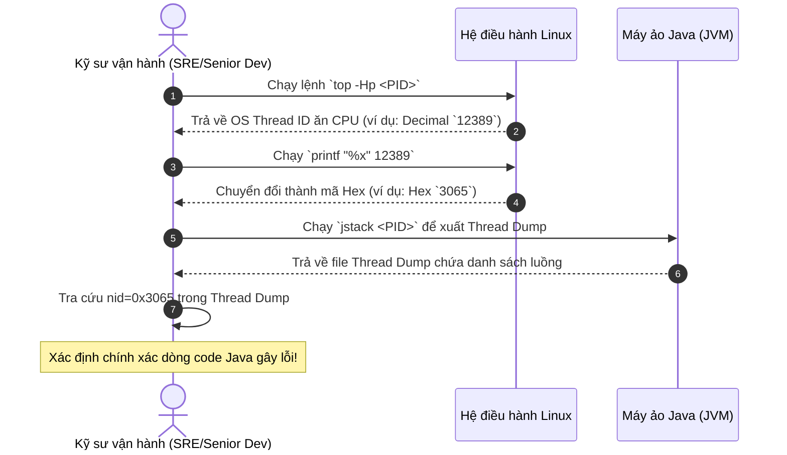

# Thread nào đang ăn CPU nhiều nhất thì tìm bằng cách nào?

## ⚡ Tóm tắt ngắn (30s)
* **Bản chất**: Trong Java hiện đại, mỗi luồng (Java Thread) được ánh xạ 1:1 với một luồng của hệ điều hành (OS Native Thread / Lightweight Process - LWP). Hệ điều hành giám sát tài nguyên thông qua OS Thread ID (dưới dạng số thập phân - Decimal), trong khi JVM ghi nhận luồng đó trong Thread Dump dưới dạng mã thập lục phân (Hexadecimal) ở trường `nid` (Native ID). Để tìm ra dòng code Java gây CPU cao, ta bắt buộc phải chuyển đổi OS Thread ID sang mã Hexa rồi tra cứu trong Thread Dump.
* **Các thảm họa thực chiến được giải quyết**:
    1. **Thảm họa "Mò kim đáy bể"**: Một JVM server chạy đồng thời 2,000 threads (luồng xử lý request, luồng Kafka, luồng kết nối DB, luồng GC). Khi CPU tăng vọt, nếu chỉ chụp Thread Dump chung chung mà không biết map ID luồng từ hệ điều hành, ta hoàn toàn bất lực trong việc chỉ mặt đặt tên dòng code tội đồ.
* **Quyết định Senior**: Triển khai quy trình ánh xạ dòng lệnh 4 bước thần tốc trực tiếp trên Linux server:
    1. Xác định PID của ứng dụng Java (`jps` hoặc `ps -ef | grep java`).
    2. Liệt kê các luồng ngốn CPU nhất của tiến trình đó bằng `top -Hp <PID>`.
    3. Chuyển đổi OS Thread ID (TID) của luồng đó từ hệ thập phân sang mã Hexa (`printf "%x\n" <TID>`).
    4. Chụp Thread Dump bằng `jstack <PID>` và tìm kiếm chuỗi mã Hexa vừa convert ở định dạng `nid=0x<Hex_ID>` để bắt sống dòng code gây lỗi.

---

## 🔍 Chi tiết bản chất thực chiến: Quy trình 4 bước chẩn đoán thủ công trên Linux

Để bắt được chính xác luồng Java đang tiêu thụ tài nguyên, Senior Engineer sử dụng các công cụ nhân OS kết hợp với JVM Diagnostics.

### Bước 1: Tìm PID của tiến trình Java đang chạy
Sử dụng lệnh `jps` (Java Virtual Machine Process Status Tool) tích hợp sẵn trong JDK để tìm PID nhanh nhất:
```bash
jps -v
# Hoặc lệnh OS truyền thống
ps -ef | grep java
```
*Giả sử tìm được tiến trình Java có PID là **12345**.*

### Bước 2: Liệt kê các luồng ngốn CPU nhất bên trong tiến trình
Lệnh `top` mặc định chỉ hiển thị tổng quan tiến trình. Ta cần thêm tham số `-H` để hiển thị tất cả các luồng con (Lightweight Processes) của tiến trình đó và `-p` để khoanh vùng đúng PID:
```bash
top -Hp 12345
```
Hệ thống sẽ hiển thị danh sách các luồng con sắp xếp theo lượng tiêu thụ CPU từ cao xuống thấp:
```text
  PID USER      PR  NI    VIRT    RES    SHR S %CPU %MEM     TIME+ COMMAND
12389 appuser   20   0 4567m  1.2g  34m R 98.5  8.2   5:12.33 java
12390 appuser   20   0 4567m  1.2g  34m S  1.2  8.2   0:03.45 java
```
*Nhìn vào cột **PID** (ở chế độ này thực chất là Thread ID - TID của hệ điều hành), ta phát hiện luồng số **12389** đang ăn **98.5% CPU**.*

### Bước 3: Chuyển đổi Thread ID sang mã Hexadecimal
JVM định nghĩa ID luồng hệ thống ở dạng mã Hexa chữ thường. Ta sử dụng lệnh `printf` của Linux để chuyển đổi số thập phân `12389` sang thập lục phân:
```bash
printf "%x\n" 12389
```
*Kết quả trả về là: **3065**.*

### Bước 4: Chụp Thread Dump và truy vết mã Hexa
Chụp toàn bộ trạng thái các luồng trong JVM và lưu ra file tạm, sau đó tìm kiếm chuỗi `0x3065` (`3065` thêm tiền tố `0x` của mã Hexa):
```bash
jstack 12345 > /tmp/thread_dump.txt
grep -A 30 "0x3065" /tmp/thread_dump.txt
```
*Hệ thống sẽ lập tức in ra stack trace chi tiết của luồng lỗi:*
```text
"Order-Processing-Thread-1" #42 prio=5 os_prio=0 cpu=31234.33ms elapsed=450s tid=0x00007f9c7c01a800 nid=0x3065 runnable [0x00007f9c5d1e2000]
   java.lang.Thread.State: RUNNABLE
        at com.company.service.OrderService.calculateTotal(OrderService.java:128)
        at com.company.service.OrderService.processPending(OrderService.java:85)
        at com.company.service.OrderProcessor.run(OrderProcessor.java:44)
        at java.lang.Thread.run(Thread.java:833)
```
> [!TIP]
> Nhìn vào Stack trace, ta chỉ thẳng mặt được thủ phạm: class `OrderService.java` dòng `128` trong phương thức `calculateTotal()` đang làm luồng bị kẹt chạy runnable liên tục gây CPU cao.

---

## 🎨 Sơ đồ trực quan (Quy trình ánh xạ Thread ID từ OS vào JVM)



---

## 💻 Code thực chiến: Công cụ tự động chẩn đoán (Hotspot CPU Script)

### ❌ BAD: Debug thủ công gõ từng lệnh chậm chạp khi Production đang cháy
Khi hệ thống đang bị sập, việc gõ tay từng lệnh tính toán, convert hex và so khớp rất tốn thời gian và dễ nhầm lẫn chữ hoa/thường, số PID.

---

### ✅ GOOD: Script tự động hóa bắt Thread CPU cao chỉ trong 1 giây
Senior Engineer luôn chuẩn bị sẵn các script chẩn đoán tự động trong thư mục tiện ích của hệ thống để kích hoạt tức thì.

* **Script `find-cpu-hotspot.sh` chuẩn Senior**:
```bash
#!/bin/bash
# Sử dụng: ./find-cpu-hotspot.sh <Java_PID>

if [ -z "$1" ]; then
    echo "Lỗi: Vui lòng cung cấp PID của Java Process."
    echo "Sử dụng: $0 <PID>"
    exit 1
fi

JAVA_PID=$1
echo "=========================================================="
echo " Đang phân tích tiến trình Java PID: $JAVA_PID"
echo "=========================================================="

# 1. Tìm OS Thread ID ngốn CPU nhất
TOP_TID_DEC=$(top -b -n 1 -Hp $JAVA_PID | grep java | head -n 1 | awk '{print $1}')

if [ -z "$TOP_TID_DEC" ]; then
    echo "Không tìm thấy luồng con nào tiêu thụ CPU đáng kể."
    exit 0
fi

CPU_USAGE=$(top -b -n 1 -Hp $JAVA_PID | grep java | head -n 1 | awk '{print $9}')
echo "-> OS Thread ID tiêu thụ CPU cao nhất: $TOP_TID_DEC ($CPU_USAGE% CPU)"

# 2. Chuyển đổi sang mã Hexa
TID_HEX=$(printf "%x" $TOP_TID_DEC)
echo "-> Mã Hex tương ứng (nid): 0x$TID_HEX"

# 3. Xuất Thread Dump và filter stack trace của Thread đó
echo "-> Đang bắt Stack Trace..."
echo "----------------------------------------------------------"
jstack $JAVA_PID | grep -A 25 "nid=0x$TID_HEX"
echo "----------------------------------------------------------"
```

---

## 📊 Bảng so sánh các phương pháp tìm Thread ngốn CPU

| Tiêu chí | Dòng lệnh truyền thống (`top` + `jstack`) | Async-profiler (Flame Graph) | Công cụ APM (Grafana/Datadog) |
| :--- | :--- | :--- | :--- |
| **Độ phức tạp cài đặt** | Cực thấp (Có sẵn trong mọi OS/JDK cài đặt đầy đủ). | Thấp (Tải file binary chạy trực tiếp không cần cài đặt phức tạp). | Cao (Cần cài Agent vào mã nguồn và cấu hình Server thu thập). |
| **Độ chính xác** | Cao tức thời (Chỉ ra chính xác trạng thái tại tích tắc chụp). | Cực cao (Lấy mẫu liên tục trong một khoảng thời gian, loại bỏ sai số). | Trung bình (Dữ liệu thu thập theo chu kỳ 10s-15s, có độ trễ). |
| **Mức độ ảnh hưởng hệ thống** | Nhẹ (Chụp dump nhanh nhưng có thể gây khựng nhẹ JVM nếu Heap quá lớn). | Cực nhẹ (Sử dụng cơ chế lấy mẫu tín hiệu của hệ điều hành, an toàn cho Production). | Trung bình (Tăng nhẹ CPU/Memory overhead do liên tục gửi metric). |
| **Phù hợp nhất khi** | Debug khẩn cấp, ứng cứu sự cố trực tiếp trên terminal của server. | Phân tích sâu, tối ưu hiệu năng code, tìm lỗi CPU cao bất thường không liên tục. | Giám sát dài hạn, phát hiện xu hướng tăng CPU sớm. |

---

## ⚠️ Common Gotchas & Questions follow-up

### 1. Cạm bẫy "Tìm nhầm luồng Garbage Collector và đè code Java ra sửa"
* **Vấn đề**: Khi chạy `top -Hp`, phát hiện luồng ngốn CPU cao nhất. Sau khi convert hex và tra cứu thread dump, tiêu đề luồng có dạng `"VM Thread"` hoặc `"GC Thread#0"`. Lập trình viên lập tức bối rối vì không thấy bất kỳ dòng code Java nghiệp vụ nào của mình trong stack trace.
* **Bản chất**: Đây là các luồng hệ thống của JVM chịu trách nhiệm thu gom rác. CPU cao ở các luồng này nghĩa là hệ thống đang bị **GC Thrashing** (quá tải dọn rác do cạn kiệt bộ nhớ Heap). Thủ phạm thực sự không phải là một luồng tính toán nặng, mà là do tổng lượng đối tượng rác sinh ra quá nhiều hoặc bị rò rỉ bộ nhớ (Memory Leak).
* **Giải pháp**: Ngưng tìm kiếm code CPU-bound. Chuyển hướng sang phân tích bộ nhớ Heap Dump (`jmap` / MAT) để tìm lý do vì sao bộ nhớ đầy làm GC phải cày ải liên tục.

### 2. Câu hỏi đào sâu từ interviewer

* **Q1: Trong Java 21, dự án của chúng tôi chuyển sang sử dụng Virtual Threads (luồng ảo). Khi gặp sự cố một số luồng ảo chạy các vòng lặp vô hạn làm CPU tăng cao, phương pháp map ID bằng `top -Hp` như trên có còn hoạt động hiệu quả không? Tại sao?**
  * *Trả lời*: Đây là một điểm thay đổi cốt lõi trong Java 21. Phương pháp `top -Hp` truyền thống sẽ **không còn hiệu quả trực tiếp** đối với Virtual Threads.
    * *Lý do*: Luồng ảo (Virtual Threads) không được ánh xạ 1:1 với OS Thread. Hàng ngàn luồng ảo được quản lý bất đồng bộ bởi JVM và chạy luân phiên trên một số lượng nhỏ các luồng thật (gọi là Carrier Threads - mặc định là các luồng ForkJoinPool). Khi chạy `top -Hp`, hệ điều hành chỉ nhìn thấy Carrier Thread ăn CPU cao chứ không hề biết luồng ảo nào đang chạy trên đó.
    * *Giải pháp*: Để debug Virtual Threads ngốn CPU:
      1. Tôi không dùng `jstack` thông thường vì nó không hiển thị luồng ảo. Thay vào đó, tôi sử dụng công cụ `jcmd <PID> Thread.dump_to_file <filename>` để xuất ra định dạng Thread Dump thế hệ mới (hỗ trợ hiển thị toàn bộ luồng ảo đang hoạt động và Carrier Thread của chúng).
      2. Sử dụng **Async-profiler** phiên bản mới nhất hỗ trợ Virtual Threads. Profiler này có thể theo dõi việc chuyển đổi ngữ cảnh luồng ảo trong JVM và vẽ chính xác Flame Graph chỉ ra luồng ảo nào đang giữ CPU lâu nhất.

* **Q2: Nếu thread ăn CPU cao là một luồng chạy mã Native (mã C/C++ thông qua JNI hoặc thư viện ngoài), `jstack` có giúp chúng ta tìm được nguyên nhân không? Bạn sẽ xử lý thế nào?**
  * *Trả lời*: `jstack` chỉ có thể hiển thị Java Stack Trace. Nếu luồng đó đi vào vùng mã Native (ví dụ: luồng đang chạy thư viện mã hóa bảo mật viết bằng C++, thư viện xử lý ảnh OpenCV native), stack trace của `jstack` chỉ hiển thị dòng cuối cùng là phương thức Java gọi native (`native method`) và dừng lại, không thể chỉ ra dòng code C++ cụ thể nào đang chạy vô hạn.
    * *Giải pháp*: Để giải quyết lỗi CPU từ native code, tôi phải sử dụng các công cụ chẩn đoán cấp hệ thống của Linux:
      1. **Sử dụng lệnh `perf` của Linux**: Tôi dùng `perf record -g -p <PID> -- sleep 30` để ghi lại dữ liệu cuộc gọi hệ thống ở mức kernel, sau đó dùng `perf report` để xem biểu đồ các hàm C++ tiêu tốn CPU.
      2. **Sử dụng Async-profiler với tham số native**: Tôi chạy async-profiler với cờ `-e cpu` (hoặc cấu hình để lấy mẫu cả java và native symbols). Công cụ này sẽ kết hợp (stitch) cả Java Stack và Native Stack lại với nhau trong Flame Graph, giúp tôi nhìn thấy toàn bộ đường đi từ code Java gọi sang hàm C++ nào bên dưới làm sập CPU.
