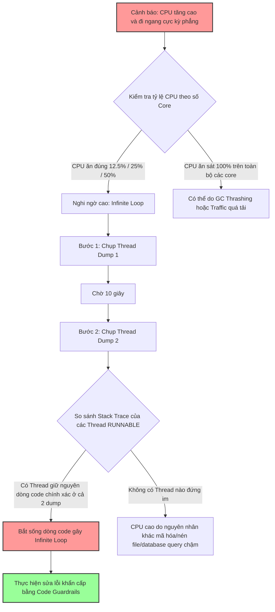

# Infinite loop lọt production thì dấu hiệu là gì?

## ⚡ Tóm tắt ngắn (30s)
* **Bản chất**: Lỗi vòng lặp vô hạn (Infinite Loop) xảy ra khi điều kiện thoát vòng lặp (`while`, `for`, hoặc đệ quy) không bao giờ đạt được do sai sót logic mã nguồn hoặc do dữ liệu đầu vào đặc biệt ngoài dự tính của lập trình viên. 
* **Các thảm họa thực chiến được giải quyết**:
    1. **Thảm họa treo luồng âm thầm (Silent Thread Exhaustion)**: Luồng chạy vô hạn không hề sinh ra bất kỳ Exception nào, không tự crash, nhưng nó âm thầm nuốt trọn CPU core, làm cạn kiệt Thread Pool và làm dịch vụ ngừng phản hồi mà không để lại bất kỳ dấu vết lỗi nào trong file log.
* **Quyết định Senior**: Nhận diện tức thì thông qua 3 dấu hiệu thép đặc trưng:
    1. **Đồ thị CPU khóa cứng ở mức toán học chuẩn xác**: Tỷ lệ CPU tăng vọt và đi ngang ổn định ở mức tỷ lệ thuận với số core bị kẹt (Ví dụ: Server 8 cores bị khóa cứng chính xác ở mức **12.5%** CPU cho 1 luồng bị kẹt, hoặc **25%** cho 2 luồng).
    2. **Hai đợt Thread Dump trùng khớp tuyệt đối**: Khi chụp hai Thread Dump cách nhau 5-10 giây, cùng một Thread ID vẫn giữ nguyên trạng thái `RUNNABLE` và trỏ đúng vào một dòng code duy nhất trong vòng lặp nghiệp vụ.
    3. **Log hệ thống phân cực cực đoan**: Hoặc là log bị dừng in đột ngột (do luồng kẹt trong loop không có lệnh log), hoặc file log tăng kích thước chóng mặt (do loop liên tục gọi lệnh log).

---

## 🔍 Chi tiết bản chất thực chiến: Các dấu hiệu nhận biết của Senior

Khi một Infinite Loop xảy ra trên Production, nó sẽ phát đi những tín hiệu đặc trưng ở cả cấp độ Hệ điều hành (OS), Máy ảo (JVM) và Ứng dụng (Application Log).

### 1. Dấu hiệu cấp độ Hệ điều hành (OS CPU Metrics)
Hệ điều hành chia đều tài nguyên CPU cho các core vật lý/ảo. Khi một luồng Java bị kẹt trong vòng lặp vô hạn, nó sẽ liên tục chiếm đoạt 100% thời gian xử lý của một CPU core duy nhất.
* **Công thức tỷ lệ CPU khóa trần**: 
  $$\text{CPU \%} = \frac{\text{Số luồng bị kẹt}}{\text{Tổng số CPU Cores}} \times 100$$
* **Ví dụ thực tế**:
  * Trên server có **4 cores**: CPU đồ thị sẽ tăng vọt lên đúng **25%** và đi ngang như kẻ chỉ.
  * Trên server có **8 cores**: Đồ thị CPU sẽ khóa cứng ở mức **12.5%** hoặc **25%** (nếu có 2 luồng cùng bị kẹt).
  * Đồ thị này hoàn toàn phẳng, không hề có sự dao động răng cưa (fluctuation) giống như traffic thông thường.

---

### 2. Dấu hiệu cấp độ JVM (Thread Dump Snapshot)
Khi nghi ngờ có luồng bị kẹt, ta chụp 2 bản Thread Dump cách nhau 10 giây.
* **Trạng thái luồng**: Luồng lỗi luôn ở trạng thái `RUNNABLE`.
* **Sự trùng khớp Stack Trace**:
```text
# Dump lần 1 (12:00:00)
"payment-processor-1" nid=0x4012 runnable
    at com.company.payment.HashService.compute(HashService.java:45)
    at com.company.payment.PaymentService.process(PaymentService.java:112)

# Dump lần 2 (12:00:10)
"payment-processor-1" nid=0x4012 runnable
    at com.company.payment.HashService.compute(HashService.java:45)
    at com.company.payment.PaymentService.process(PaymentService.java:112)
```
> [!IMPORTANT]
> Điểm mấu chốt: Luồng chạy bình thường sẽ thay đổi stack trace liên tục sau vài mili-giây. Chỉ có luồng bị infinite loop mới đứng im tại cùng một dòng code (dòng `45` của `HashService.java`) qua cả hai bản dump cách nhau nhiều giây.

---

### 3. Dấu hiệu cấp độ Ứng dụng (Application Logs)
* **Trường hợp loop không in log**: Luồng xử lý request của user đó đột ngột biến mất khỏi hệ thống log. Không có log kết thúc request, không có log báo lỗi, hoàn toàn im lặng.
* **Trường hợp loop có in log**: Ổ đĩa của server tăng dung lượng cực nhanh. Log file tràn ngập các dòng thông điệp giống hệt nhau được in ra hàng triệu lần mỗi phút (Log Flooding).

---

## 🎨 Sơ đồ trực quan (Quy trình phát hiện và cô lập luồng Infinite Loop)



---

## 💻 Code thực chiến / Cấu hình thực tế: BAD vs GOOD

### ❌ BAD: Vòng lặp phân trang thiếu kiểm soát biên dữ liệu
Đoạn code đọc dữ liệu phân trang từ một API bên thứ ba. Nếu API đó bị lỗi và trả về danh sách rỗng (`empty list`) hoặc tham số trang không tăng lên đúng cách, vòng lặp sẽ chạy vô hạn và khóa cứng CPU.

```java
public void syncUsers() {
    int page = 1;
    boolean hasMore = true;
    
    // ❌ TỒI: Không có chốt chặn số vòng lặp tối đa, dễ rơi vào lặp vô hạn
    while (hasMore) {
        List<User> users = externalUserClient.getUsers(page, 100);
        
        if (users == null || users.isEmpty()) {
            // Cạm bẫy: Nếu hệ thống bên ngoài lỗi trả về danh sách rỗng 
            // nhưng không thay đổi cờ hasMore hoặc không tăng page, loop sẽ chạy mãi mãi
            continue; 
        }
        
        saveToDatabase(users);
        page++; // Tăng trang
        
        if (users.size() < 100) {
            hasMore = false;
        }
    }
}
```

---

### ✅ GOOD: Triển khai Chốt chặn an toàn (Max Iteration Guardrail)
Luôn đặt giới hạn cứng (Hard Limit) cho số lần lặp tối đa của bất kỳ vòng lặp nghiệp vụ nào. Dù logic dữ liệu có bị sai lệch, hệ thống vẫn an toàn thoát ra và ném lỗi thay vì treo cứng CPU.

```java
public void syncUsersOptimized() {
    int page = 1;
    boolean hasMore = true;
    
    // ✅ THIẾT KẾ CHUẨN SENIOR: Đặt giới hạn an toàn tối đa 10,000 trang
    int maxIterations = 10000; 
    int iterationCount = 0;

    while (hasMore) {
        // ✅ Chốt chặn 1: Tránh lặp vô hạn
        if (++iterationCount > maxIterations) {
            log.error("CẢNH BÁO AN TOÀN: Vượt quá số vòng lặp tối đa cho phép. Hủy bỏ tác vụ để bảo vệ CPU.");
            throw new IllegalStateException("Max loop iterations exceeded in syncUsers");
        }

        List<User> users = externalUserClient.getUsers(page, 100);
        
        // ✅ Chốt chặn 2: Kiểm tra dữ liệu an toàn
        if (users == null || users.isEmpty()) {
            log.info("Kết thúc đồng bộ do danh sách rỗng ở trang: {}", page);
            break; 
        }
        
        saveToDatabase(users);
        page++;
        
        if (users.size() < 100) {
            hasMore = false;
        }
    }
}
```

---

## 📊 Bảng so sánh giữa Infinite Loop, Deadlock và Memory Leak

| Đặc tính | Infinite Loop (Vòng lặp vô hạn) | Deadlock (Khóa chết luồng) | Memory Leak (Rò rỉ bộ nhớ) |
| :--- | :--- | :--- | :--- |
| **Biểu hiện CPU** | Tăng vọt tức thì và khóa cứng ở mức phần trăm cố định (phẳng). | CPU thường giảm sâu hoặc biến động cực thấp do các luồng bị đóng băng. | CPU tăng dần đều theo thời gian do GC hoạt động ngày càng nhiều. |
| **Trạng thái Thread** | `RUNNABLE` liên tục. | `BLOCKED` hoặc `WAITING` trên các Monitor Lock. | Bình thường ở giai đoạn đầu, chuyển sang kẹt ở luồng GC về sau. |
| **Hành vi Log** | Hoặc im lặng hoàn toàn, hoặc in log tràn ngập ổ đĩa cực nhanh. | Im lặng hoàn toàn, không có log mới từ các luồng bị kẹt. | Có thể xuất hiện log `OutOfMemoryError` ở giai đoạn cuối. |
| **Khả năng tự hồi phục** | Không thể. Bắt buộc phải restart tiến trình hoặc ngắt luồng. | Không thể. Bắt buộc phải restart. | Không thể. Tiến trình sẽ sập hoàn toàn do OOM. |

---

## ⚠️ Common Gotchas & Questions follow-up

### 1. Cạm bẫy "Sử dụng ConcurrentHashMap sai cách dẫn đến Infinite Loop ngầm"
* **Vấn đề**: Trong các phiên bản JDK cũ (đặc biệt là JDK 8), hàm `ConcurrentHashMap.computeIfAbsent()` chứa một bug thiết kế cực kỳ nghiêm trọng. Nếu ta gọi đệ quy lồng nhau để ghi đè dữ liệu vào cùng một bucket của Map, hàm này sẽ rơi vào một vòng lặp vô hạn bên trong mã nguồn thư viện JDK nhằm cố gắng giải quyết tranh chấp khóa.
* **Bài học**: Không bao giờ thực hiện các thao tác ghi đè dữ liệu đệ quy (recursive computation) bên trong các hàm tính toán của `ConcurrentHashMap`. Hãy nâng cấp lên các phiên bản JDK mới (JDK 11/17) nơi lỗi này đã được khắc phục hoàn toàn ở mức mã nguồn máy ảo.

### 2. Câu hỏi đào sâu từ interviewer

* **Q1: Làm sao chúng ta có thể viết được Unit Test để tự động phát hiện và chặn đứng lỗi Infinite Loop trước khi code được merge và deploy lên Production?**
  * *Trả lời*: Để phát hiện sớm lỗi này thông qua Unit Test, tôi áp dụng 2 kỹ thuật cốt lõi:
    1. **Thiết lập Timeout ở mức JUnit Test**: Tôi sử dụng tính năng kiểm soát thời gian chạy tối đa của JUnit. Dù là JUnit 4 hay JUnit 5, tôi đều cấu hình thời gian giới hạn nghiêm ngặt cho các test case xử lý logic phức tạp.
       * *Ví dụ trong JUnit 5*:
         ```java
         @Test
         void testSyncUsersLoopSafety() {
             // ✅ Nếu chạy quá 2 giây, test case sẽ tự động bị fail và ngắt luồng ngay lập tức
             Assertions.assertTimeoutPreemptively(Duration.ofSeconds(2), () -> {
                 orderService.syncUsers();
             });
         }
         ```
    2. **Kiểm thử biên (Boundary Value Testing)**: Viết các ca kiểm thử giả lập dữ liệu đầu vào cực đoan thông qua Mockito (ví dụ: API trả về kết quả rỗng liên tục, API trả về kích thước dữ liệu bằng đúng kích thước trang phân trang nhưng không có ID tăng lên) để kiểm chứng xem chốt chặn bảo vệ `maxIterations` hoạt động chính xác hay không.

* **Q2: Nếu một luồng chạy nền (Background Thread) bị kẹt infinite loop làm CPU cao, làm thế nào để ngắt (kill) duy nhất luồng đó mà không cần khởi động lại toàn bộ ứng dụng Java để tránh gián đoạn dịch vụ?**
  * *Trả lời*: Trong Java, việc gọi phương thức `Thread.stop()` đã bị gắn nhãn deprecated và cực kỳ nguy hiểm vì nó làm giải phóng tất cả các khóa màn hình (locks) hiện có, dẫn đến dữ liệu hệ thống bị rơi vào trạng thái không nhất quán (inconsistent state). Tuy nhiên, trên Production, tôi có thể áp dụng các giải pháp cứu hộ sau:
    1. **Sử dụng cơ chế Thread Interruption (Giải pháp an toàn từ thiết kế)**: Trong các vòng lặp nghiệp vụ lớn, tôi luôn đưa điều kiện `!Thread.currentThread().isInterrupted()` vào vòng lặp. Khi phát hiện luồng bị kẹt, tôi có thể kích hoạt một JMX Bean hoặc viết một API quản trị để gọi phương thức `.interrupt()` lên Thread tương ứng. Luồng sẽ nhận tín hiệu, tự động dọn dẹp tài nguyên và thoát ra an toàn.
    2. **Sử dụng công cụ JVM Diagnostic (Dòng lệnh cưỡng bức)**: Nếu luồng bị kẹt cứng không thể nhận tín hiệu interrupt (ví dụ kẹt ở tầng native code), tôi có thể sử dụng công cụ **JVisualVM** hoặc các agent quản trị nâng cao (như **Arthas** của Alibaba) kết hợp với quyền root để can thiệp sâu vào tiến trình, ép buộc huỷ bỏ luồng lỗi đó trực tiếp từ bảng điều khiển JMX mà không cần khởi động lại Server.
