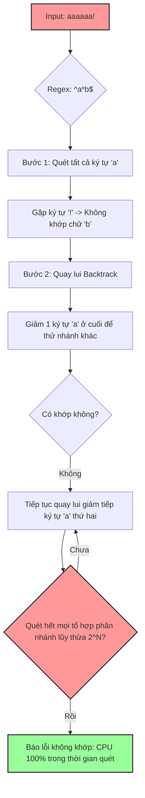

# Regex có thể gây CPU spike như thế nào?

## ⚡ Tóm tắt ngắn (30s)
* **Bản chất**: Thảm họa CPU do Regex xảy ra do cơ chế quay lui thảm khốc (**Catastrophic Backtracking**) của các bộ máy phân tích Regular Expression dạng **NFA** (Nondeterministic Finite Automaton) - bao gồm cả thư viện mặc định `java.util.regex` của Java. Khi gặp một Regex Pattern lỏng lẻo có chứa các lượng từ lồng nhau (như `(a+)+`) kết hợp với dữ liệu đầu vào không khớp (non-matching) ở phần cuối chuỗi, bộ máy sẽ phải thử nghiệm tất cả các tổ hợp phân nhánh khả thi với độ phức tạp thời gian lũy thừa $O(2^N)$, khóa cứng CPU Core.
* **Các thảm họa thực chiến được giải quyết**:
    1. **Thảm họa tấn công ReDoS (Regular Expression Denial of Service)**: Kẻ tấn công gửi một chuỗi đầu vào độc hại (ví dụ: chuỗi chứa 50 ký tự `a` và kết thúc bằng `!`) thông qua các form đăng ký hoặc API nhận email/số điện thoại để cố tình kích hoạt Catastrophic Backtracking, làm treo cứng toàn bộ các luồng xử lý của hệ thống backend.
* **Quyết định Senior**: Triển khai chiến lược phòng thủ 3 lớp bảo vệ máy chủ:
    1. **Chốt chặn thiết kế (DFA Engine)**: Sử dụng thư viện **RE2J** của Google (cơ chế Deterministic Finite Automaton) có độ phức tạp thời gian tuyến tính $O(N)$ cho các input nhạy cảm từ người dùng.
    2. **Chốt chặn mã nguồn**: Cấu hình cơ chế ngắt luồng chủ động (Timeout/Interruptible CharSequence) cho bộ máy NFA của Java.
    3. **Chốt chặn hạ tầng**: Giới hạn độ dài tối đa của mọi dữ liệu đầu vào (Input Length Limit) trước khi chạy Regex.

---

## 🔍 Chi tiết bản chất thực chiến: Cơ chế Catastrophic Backtracking

Để hiểu tại sao Regex có thể nuốt trọn CPU, ta cần phân tích cách bộ máy NFA hoạt động khi khớp chuỗi.

### 1. Phân biệt NFA và DFA Engine
* **DFA (Deterministic Finite Automaton)**: Mỗi ký tự trong chuỗi đầu vào chỉ được duyệt qua đúng một lần. Thời gian chạy luôn là tuyến tính $O(N)$ so với độ dài chuỗi $N$. Không bao giờ bị quay lui (No Backtracking).
* **NFA (Nondeterministic Finite Automaton)**: Cho phép chuyển trạng thái linh hoạt và thử nghiệm nhiều nhánh khớp khác nhau. Nếu một nhánh thất bại, NFA sẽ **quay lui (backtrack)** về trạng thái trước đó để thử nhánh tiếp theo. Đây là cơ chế của `java.util.regex`.

### 2. Giải phẫu một Pattern độc hại: `^([a-zA-Z0-9]+)*$`
Pattern này dùng để validate chuỗi chỉ chứa ký tự chữ và số.
* Cấu trúc nguy hiểm: Lượng từ `+` (khớp 1 hoặc nhiều lần) nằm bên trong lượng từ `*` (khớp 0 hoặc nhiều lần). Đây gọi là cấu trúc **Lượng từ lồng nhau (Nested Quantifiers)**.
* **Trường hợp Khớp**: Chuỗi `aaaaaaaaaaaaaaaaaaaa` (20 ký tự). NFA khớp cực nhanh vì chuỗi hợp lệ.
* **Trường hợp KHÔNG Khớp (Thảm họa ReDoS)**: Chuỗi `aaaaaaaaaaaaaaaaaaaa!` (kết thúc bằng dấu chấm than không hợp lệ).
  * Bộ máy NFA sẽ quét qua toàn bộ các ký tự `a` hợp lệ. Đến ký tự cuối cùng `!`, nó nhận thấy không khớp.
  * Thay vì dừng lại báo lỗi ngay, NFA bắt đầu thực hiện **quay lui** để tìm các cách gom nhóm `a` khác nhau xem có khớp được không.
  * Các tổ hợp thử nghiệm bao gồm:
    * `(aaaaaaaaaaaaaaaaaaaa)` (1 nhóm 20)
    * `(aaaaaaaaaaaaaaaaaaa)(a)` (1 nhóm 19, 1 nhóm 1)
    * `(aaaaaaaaaaaaaaaaaa)(aa)` (1 nhóm 18, 1 nhóm 2)
    * `(aaaaaaaaaaaaaaaaaa)(a)(a)` (1 nhóm 18, 2 nhóm 1)
    * ... và hàng triệu tổ hợp phân tách khác.
  * Với chuỗi chỉ vỏn vẹn **30 ký tự**, số bước kiểm tra có thể lên tới **$2^{30} \approx 1,073,741,824$ bước**. Bộ máy NFA sẽ chạy liên tục không ngừng nghỉ, khóa cứng CPU Core chạy luồng đó trong nhiều giờ.

---

## 🎨 Sơ đồ trực quan (Cơ chế Backtracking gây CPU Spike)



---

## 💻 Code thực chiến / Cấu hình thực tế: BAD vs GOOD

### ❌ BAD: Dùng java.util.regex mặc định không giới hạn, mở cửa cho ReDoS
Đoạn code validate dữ liệu đầu vào bằng API mặc định của Java. Nếu kẻ tấn công gửi một email độc hại siêu dài, toàn bộ server sẽ bị treo cứng luồng xử lý.

```java
import java.util.regex.Pattern;

public class UserValidator {
    // ❌ TỒI: Pattern chứa lượng từ lồng nhau nguy hiểm + dùng NFA Engine mặc định
    private static final Pattern EMAIL_PATTERN = 
        Pattern.compile("^([a-zA-Z0-9_\\-\\.]+)@((\\[[0-9]{1,3}\\.[0-9]{1,3}\\.[0-9]{1,3}\\.)|(([a-zA-Z0-9\\-]+\\.)+))([a-zA-Z]{2,4}|[0-9]{1,3})(\\]?)$");

    public boolean validateEmail(String email) {
        if (email == null) return false;
        // Gặp chuỗi email độc hại dài (ví dụ: aaaaaaaaaaaaaaaaaaaaaaaaaa@aaaaaaaaaaaaaaa.aaaaaaa!), CPU sẽ spike 100%
        return EMAIL_PATTERN.matcher(email).matches();
    }
}
```

---

### ✅ GOOD: Sử dụng RE2J (DFA Engine) an toàn tuyệt đối trước ReDoS
Thư viện **RE2J** của Google sử dụng cơ chế DFA đảm bảo thời gian chạy tuyến tính $O(N)$. Dù chuỗi đầu vào có phức tạp hay độc hại thế nào, tốc độ xử lý vẫn cực nhanh và an toàn tuyệt đối.

* **Cấu hình Maven Dependency**:
```xml
<dependency>
    <groupId>com.google.re2j</groupId>
    <artifactId>re2j</artifactId>
    <version>1.7</version>
</dependency>
```

* **Code Java chuẩn Senior**:
```java
// ✅ TỐT: Sử dụng thư viện RE2J của Google thay thế hoàn toàn java.util.regex
import com.google.re2j.Pattern;
import com.google.re2j.Matcher;

public class OptimizedUserValidator {
    // Sử dụng RE2J Pattern
    private static final Pattern SAFE_EMAIL_PATTERN = 
        Pattern.compile("^([a-zA-Z0-9_\\-\\.]+)@((\\[[0-9]{1,3}\\.[0-9]{1,3}\\.[0-9]{1,3}\\.)|(([a-zA-Z0-9\\-]+\\.)+))([a-zA-Z]{2,4}|[0-9]{1,3})(\\]?)$");

    public boolean validateEmail(String email) {
        if (email == null) return false;
        
        // ✅ Chốt chặn 1: Giới hạn độ dài chuỗi đầu vào tối đa 100 ký tự trước khi validate
        if (email.length() > 100) {
            return false;
        }

        // ✅ Chốt chặn 2: RE2J chạy trên cơ chế DFA, độ phức tạp luôn là O(N), triệt tiêu hoàn toàn backtracking
        Matcher matcher = SAFE_EMAIL_PATTERN.matcher(email);
        return matcher.matches();
    }
}
```

---

## 📊 Bảng so sánh giữa NFA Engine (Java default) và DFA Engine (RE2J)

| Tiêu chí so sánh | NFA Engine (`java.util.regex`) | DFA Engine (`com.google.re2j`) |
| :--- | :--- | :--- |
| **Cơ chế hoạt động** | Thử nghiệm các nhánh và Quay lui (Backtracking). | Duyệt ký tự song song, chuyển đổi trạng thái một chiều. |
| **Độ phức tạp thời gian lớn nhất** | Lũy thừa $O(2^N)$ (Có nguy cơ ReDoS sập CPU). | Tuyến tính $O(N)$ (An toàn tuyệt đối trước ReDoS). |
| **Hỗ trợ Backreferences (ví dụ: `\1`)** | **Có** (Cho phép tham chiếu lại nhóm đã khớp trước đó). | **Không** (Không thể biểu diễn bằng DFA toán học). |
| **Hỗ trợ Lookaround (`(?=...)`, `(?<=...)`)** | **Có** (Lookahead và Lookbehind mạnh mẽ). | **Không**. |
| **Hiệu năng với Pattern tối ưu** | Nhanh hơn DFA một chút đối với các chuỗi khớp đơn giản. | Ổn định tuyệt đối, không bị trồi sụt theo dữ liệu đầu vào. |
| **Use Case khuyên dùng** | Dùng nội bộ cho các chuỗi dữ liệu đã được tin tưởng (Trusted data) cần regex phức tạp. | Validate tất cả dữ liệu nhận từ người dùng ngoài Internet (Untrusted input). |

---

## ⚠️ Common Gotchas & Questions follow-up

### 1. Cạm bẫy "Nghĩ rằng chỉ cần giới hạn độ dài đầu vào (Input Length) là đủ"
* **Sai lầm**: Nhiều kỹ sư nghĩ rằng chỉ cần chặn độ dài chuỗi đầu vào không quá 50 ký tự là hệ thống sẽ an toàn trước ReDoS.
* **Thực tế**: Với một Regex lồng nhau tệ hại (ví dụ: `^(([a-z]+)+)+$`), chỉ cần một chuỗi **25 ký tự** không khớp (ví dụ: `aaaaaaaaaaaaaaaaaaaaaaaa!`) đã đủ để kích hoạt hàng chục triệu bước tính toán, khóa chặt CPU của luồng xử lý trong vòng **15 - 30 phút**. Giới hạn độ dài chuỗi chỉ làm giảm mức độ nghiêm trọng chứ không giải quyết được tận gốc thảm họa Backtracking.

### 2. Câu hỏi đào sâu từ interviewer

* **Q1: Do yêu cầu nghiệp vụ phức tạp, tôi bắt buộc phải sử dụng tính năng Lookaround (Lookahead/Lookbehind) vốn chỉ có trên `java.util.regex` (NFA) mà RE2J (DFA) không hỗ trợ. Làm sao tôi có thể sử dụng `java.util.regex` một cách an toàn mà không sợ bị sập CPU do ReDoS?**
  * *Trả lời*: Đây là một tình huống rất kinh điển. Để sử dụng NFA một cách an toàn, tôi triển khai cơ chế **Regex Timeout** thông qua kỹ thuật **Interruptible CharSequence**.
    * *Giải pháp*: `java.util.regex` liên tục gọi hàm `charAt()` của đối tượng `CharSequence` truyền vào để khớp ký tự. Tôi sẽ bọc chuỗi đầu vào bằng một `CharSequence` tùy chỉnh có khả năng giám sát thời gian chạy hoặc kiểm tra tín hiệu ngắt luồng.
    * *Mẫu triển khai thực tế*:
      ```java
      public class InterruptibleCharSequence implements CharSequence {
          private final CharSequence inner;
          private final long timeoutTime;

          public InterruptibleCharSequence(CharSequence inner, long timeoutMillis) {
              this.inner = inner;
              this.timeoutTime = System.currentTimeMillis() + timeoutMillis;
          }

          @Override
          public char charAt(int index) {
              // ✅ Kiểm tra cờ ngắt luồng hoặc hết thời gian (timeout) trong mỗi ký tự duyệt qua
              if (Thread.currentThread().isInterrupted()) {
                  throw new RuntimeException("Regex matching interrupted");
              }
              if (System.currentTimeMillis() > timeoutTime) {
                  throw new RuntimeException("Regex matching timeout exceeded!");
              }
              return inner.charAt(index);
          }

          @Override
          public int length() { return inner.length(); }
          @Override
          public CharSequence subSequence(int start, int end) {
              return new InterruptibleCharSequence(inner.subSequence(start, end), timeoutTime - System.currentTimeMillis());
          }
          @Override
          public String toString() { return inner.toString(); }
      }
      ```
      Khi gọi thực thi:
      ```java
      Pattern pattern = Pattern.compile("your-complex-lookaround-pattern");
      // Bọc chuỗi đầu vào với timeout tối đa 500ms
      Matcher matcher = pattern.matcher(new InterruptibleCharSequence(userInput, 500));
      if (matcher.matches()) { ... }
      ```
      Nếu xảy ra Catastrophic Backtracking quá 500ms, hàm `charAt()` sẽ ném ra Exception, lập tức giải phóng luồng và cứu nguy cho CPU.

* **Q2: Ngoài việc sửa code, chúng ta có thể cấu hình chốt chặn nào ở tầng hạ tầng (Kubernetes/API Gateway) để giảm thiểu rủi ro tấn công ReDoS?**
  * *Trả lời*: Ở tầng hạ tầng, tôi áp dụng các lớp phòng thủ chiều sâu sau:
    1. **Cấu hình WAF (Web Application Firewall)**: Các WAF hiện đại (như Cloudflare, AWS WAF) có sẵn các tập luật (Ruleset) để phát hiện và ngăn chặn các payload đầu vào có dấu hiệu tấn công ReDoS hoặc chứa các chuỗi lặp đi lặp lại bất thường trước khi chúng chạm tới ứng dụng.
    2. **API Gateway Request Size & Timeout**: Thiết lập giới hạn kích thước tối đa của request body (ví dụ: max 1MB) và cấu hình thời gian phản hồi tối đa (Read Timeout) nghiêm ngặt ở mức Gateway (ví dụ: 10 giây). Nếu ứng dụng bị kẹt Regex quá 10s, Gateway sẽ chủ động ngắt kết nối với client để giải phóng tài nguyên.
    3. **Thiết lập CPU Limits ở Kubernetes**: Cấu hình `resources.limits.cpu` cho Container (ví dụ: max 2 Cores). Khi một pod bị kẹt Regex 100% CPU, Kubernetes sẽ giới hạn pod đó chỉ được ăn tối đa dung lượng CPU đã cấp phát, ngăn chặn việc pod lỗi ngốn trọn tài nguyên của toàn bộ Node vật lý và làm ảnh hưởng tới các Pod dịch vụ khác chạy chung Node.
