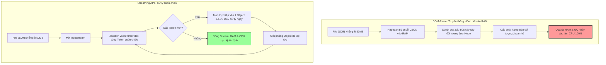

# JSON serialization/deserialization có thể gây CPU cao không?

## ⚡ Tóm tắt ngắn (30s)
* **Bản chất**: JSON serialization/deserialization (chuyển đổi Object Java sang chuỗi JSON và ngược lại) bản chất là tác vụ xử lý chuỗi và ký tự (String/Char processing) chuyên sâu. Hoạt động này ngốn CPU vì 3 lý do cốt lõi: sử dụng cơ chế **Phản chiếu (Reflection)** để duyệt qua các thuộc tính của đối tượng, liên tục **cấp phát hàng triệu đối tượng nhỏ tạm thời** làm tăng tải cho GC, và thực hiện các phép **toán kiểm tra cú pháp phức tạp** khi parse chuỗi JSON.
* **Các thảm họa thực chiến được giải quyết**:
    1. **Thảm họa treo sập do Khởi tạo sai ObjectMapper**: Dự án khởi tạo mới đối tượng `new ObjectMapper()` bên trong mỗi phương thức xử lý request. Việc này vô hiệu hóa hoàn toàn bộ nhớ đệm (cache) nội bộ của Jackson, ép JVM phải quét lại toàn bộ Class Metadata qua Reflection ở mỗi API call, đẩy CPU hệ thống lên 100% chỉ với lượng traffic rất nhỏ.
* **Quyết định Senior**: Triển khai thiết kế tối ưu hóa JSON đa tầng:
    1. **Singleton Pattern**: Đảm bảo `ObjectMapper` luôn là Singleton và tái sử dụng an toàn đa luồng.
    2. **Xử lý luồng (Streaming API)**: Thay thế việc nạp toàn bộ tệp JSON khổng lồ (vài chục MB) vào RAM bằng cơ chế cuốn chiếu **Jackson Streaming API** (`JsonParser`/`JsonGenerator`).
    3. **Tối ưu hóa phản chiếu**: Tích hợp module sinh bytecode động như **Afterburner / Blackbird** để triệt tiêu chi phí Reflection.

---

## 🔍 Chi tiết bản chất thực chiến: Tại sao JSON làm nghẽn CPU?

Senior Engineer hiểu rõ rằng các thư viện JSON như Jackson hoạt động cực kỳ phức tạp bên dưới nắp ca-pô.

### 1. Chi phí cực lớn từ cơ chế Phản chiếu (Reflection)
Khi ta chuyển một đối tượng Java sang JSON, thư viện phải tự động tìm hiểu đối tượng đó có những trường (fields) nào, kiểu dữ liệu gì, và các hàm getter/setter tương ứng. 
* Hoạt động tra cứu metadata này (`Class.getDeclaredFields()`) tiêu tốn rất nhiều chu kỳ CPU.
* Mặc dù Jackson có cơ chế cache lại Metadata sau lần quét đầu tiên, nhưng cache này chỉ hoạt động nếu ta tái sử dụng cùng một instance `ObjectMapper`. Nếu tạo mới `new ObjectMapper()` liên tục, cache bị hủy bỏ, JVM sẽ bị quá tải vì liên tục tra cứu Reflection.

### 2. Thảm họa Cấp phát rác (Garbage Allocation)
Trong quá trình parse một chuỗi JSON lớn, hàng nghìn đối tượng trung gian như `String`, `Map$Node`, `JsonNode` được tạo ra chỉ để phục vụ việc phân tích cú pháp, sau đó lập tức trở thành rác.
* Điều này tạo ra áp lực cực lớn lên vùng nhớ Young Generation của Heap.
* Hậu quả gián tiếp là GC phải chạy liên tục (Minor GC), tranh chấp tài nguyên CPU với các luồng nghiệp vụ và đẩy CPU lên 100%.

### 3. Parse chuỗi JSON khổng lồ (Payload lớn)
Khi nhận một API Request chứa mảng JSON lớn (ví dụ: danh sách 50,000 sản phẩm từ đối tác bên ngoài):
* Việc sử dụng mô hình DOM-parser (đọc cả file vào RAM rồi chuyển thành đối tượng Java) yêu cầu JVM phải cấp phát một vùng nhớ liên tục khổng lồ, làm CPU tăng vọt do sao chép mảng ký tự và GC dọn rác mệt mỏi.

---

## 🎨 Sơ đồ trực quan (So sánh DOM-parser vs Streaming API)



---

## 💻 Code thực chiến / Cấu hình thực tế: BAD vs GOOD

### ❌ BAD: Khởi tạo ObjectMapper liên tục và xử lý mảng JSON lớn sai cách
Đoạn code phạm phải hai lỗi sơ đẳng: Khởi tạo mới `ObjectMapper` ở mỗi request làm mất cache reflection, và nạp toàn bộ danh sách khổng lồ vào RAM gây quá tải bộ nhớ.

```java
import com.fasterxml.jackson.databind.ObjectMapper;
import java.util.List;

public class LegacyOrderController {

    // ❌ TỒI: Khởi tạo mới ObjectMapper trong hàm xử lý làm CPU sập khi có tải
    public void importOrders(String jsonPayload) {
        try {
            ObjectMapper objectMapper = new ObjectMapper(); 
            
            // ❌ TỒI: Nạp toàn bộ mảng JSON khổng lồ vào RAM thành List
            List<OrderDto> orders = objectMapper.readValue(jsonPayload, 
                objectMapper.getTypeFactory().constructCollectionType(List.class, OrderDto.class));
                
            for (OrderDto order : orders) {
                saveToDb(order);
            }
        } catch (Exception e) {
            throw new RuntimeException("Import thất bại", e);
        }
    }
}
```

---

### ✅ GOOD: Sử dụng Singleton ObjectMapper kết hợp Streaming API
Senior Engineer cấu hình `ObjectMapper` làm Spring Singleton Bean, tích hợp module tối ưu hóa phản chiếu và sử dụng cơ chế đọc luồng (Streaming) để xử lý từng đối tượng một cách tiết kiệm RAM/CPU.

```java
import com.fasterxml.jackson.core.JsonFactory;
import com.fasterxml.jackson.core.JsonParser;
import com.fasterxml.jackson.core.JsonToken;
import com.fasterxml.jackson.databind.ObjectMapper;
import com.fasterxml.jackson.module.blackbird.BlackbirdModule;
import org.springframework.context.annotation.Bean;
import org.springframework.context.annotation.Configuration;
import java.io.InputStream;

@Configuration
public class JacksonConfig {
    
    @Bean
    public ObjectMapper objectMapper() {
        ObjectMapper mapper = new ObjectMapper();
        // ✅ TỐT: Tích hợp Blackbird Module để sinh bytecode động thay thế Reflection truyền thống, tăng 20-30% tốc độ parse
        mapper.registerModule(new BlackbirdModule()); 
        return mapper;
    }
}

class OptimizedOrderService {
    private final ObjectMapper objectMapper;
    private final JsonFactory jsonFactory;

    public OptimizedOrderService(ObjectMapper objectMapper) {
        this.objectMapper = objectMapper;
        this.jsonFactory = objectMapper.getFactory();
    }

    // ✅ TỐT: Nhận vào InputStream từ Network/File, xử lý cuốn chiếu (Streaming) tiết kiệm CPU & RAM
    public void importOrdersOptimized(InputStream inputStream) {
        try (JsonParser parser = jsonFactory.createParser(inputStream)) {
            // Kiểm tra cấu trúc bắt đầu bằng mảng [
            if (parser.nextToken() == JsonToken.START_ARRAY) {
                while (parser.nextToken() != JsonToken.END_ARRAY) {
                    // ✅ Đọc và map duy nhất MỘT đối tượng OrderDto tại một thời điểm
                    OrderDto order = objectMapper.readValue(parser, OrderDto.class);
                    
                    // Xử lý và lưu DB lập tức, đối tượng sẽ được GC thu hồi nhanh chóng
                    saveToDb(order); 
                }
            }
        } catch (Exception e) {
            throw new RuntimeException("Import Streaming thất bại", e);
        }
    }
    
    private void saveToDb(OrderDto order) { /* ... */ }
}
```

---

## 📊 Bảng so sánh các thư viện JSON và định dạng dữ liệu

| Định dạng / Thư viện | Tốc độ parse (CPU Efficiency) | Tiêu thụ bộ nhớ (RAM Allocation) | Cơ chế hoạt động chính | Phù hợp nhất cho Use Case |
| :--- | :--- | :--- | :--- | :--- |
| **Jackson (Standard)** | Trung bình - Khá | Trung bình | Cache Reflection + Bytecode (sau khi tối ưu). | Tiêu chuẩn cho hầu hết các API RESTful của Java/Spring. |
| **Jackson + Blackbird** | Khá - Tốt | Thấp | Sinh dynamic bytecode lúc runtime, triệt tiêu reflection. | API realtime tải cao yêu cầu p99 latency cực thấp. |
| **DSL-JSON** | Cực nhanh (Top 1 Java) | Cực thấp | Sinh code biên dịch tĩnh trước (Compile-time Annotation Processor). | Các hot-path API, microservices xử lý payload JSON cực lớn. |
| **Protocol Buffers (gRPC)**| Vượt trội (Nhanh gấp 5-10 lần JSON) | Siêu thấp | Định dạng nhị phân (Binary), không cần parse chuỗi văn bản. | Giao tiếp nội bộ giữa các Microservices (East-West traffic). |

---

## ⚠️ Common Gotchas & Questions follow-up

### 1. Cạm bẫy "Tự viết Custom Serializer bằng phép cộng chuỗi (`+` Operator)"
* **Vấn đề**: Để tối ưu hiệu năng, lập trình viên quyết định tự viết bộ chuyển đổi JSON thủ công bằng cách cộng các chuỗi ký tự lại với nhau: `"{\"id\":" + id + ",\"name\":\"" + name + "\"}"`.
* **Thực tế**: Phép cộng chuỗi trong Java tạo ra vô số đối tượng `StringBuilder` tạm thời ở vùng nhớ Heap, làm sập hiệu năng hệ thống và gây tăng CPU do GC quá tải gấp nhiều lần so với việc để Jackson xử lý chuẩn.
* **Giải pháp**: Nếu bắt buộc phải viết Custom Serializer, hãy luôn sử dụng đối tượng `JsonGenerator` của Jackson được tối ưu hóa ghi đệm ghi trực tiếp vào Stream/Buffer đầu ra.

### 2. Câu hỏi đào sâu từ interviewer

* **Q1: Ngoài việc tối ưu hóa Reflection, làm sao để tránh việc JIT Compiler phải liên tục tối ưu hóa (recompile) mã nguồn parse JSON của Jackson trên môi trường Production?**
  * *Trả lời*: Để tránh JIT Compiler bị quá tải do re-compilation:
    1. **Tái sử dụng các đối tượng Reader/Writer chuyên dụng**: Jackson cho phép chúng ta tạo ra các đối tượng `ObjectReader` và `ObjectWriter` luồng an toàn (thread-safe) từ `ObjectMapper` và cache chúng lại. Các đối tượng này đã được cấu hình sẵn cấu trúc lớp cụ thể, giúp JVM dễ dàng biên dịch mã máy tối ưu hóa JIT một lần duy nhất tại warm-up phase.
       * *Ví dụ*:
         ```java
         // Cache lại Reader này để dùng chung cho mọi request
         private final ObjectReader orderReader = objectMapper.readerFor(OrderDto.class);
         
         public OrderDto parse(String json) throws IOException {
             return orderReader.readValue(json); // Nhanh hơn gọi trực tiếp từ objectMapper
         }
         ```

* **Q2: Hệ thống Microservices của chúng tôi bị nghẽn CPU nặng nề ở tầng Network I/O và JSON Parsing do giao tiếp giữa các service (East-West traffic) quá lớn. Bạn đề xuất giải pháp thay thế nào mang tính đột phá?**
  * *Trả lời*: Khi giao tiếp nội bộ giữa các microservices bị thắt nút cổ chai ở JSON Serialization, giải pháp kiến trúc tối ưu nhất là chuyển dịch từ mô hình REST/JSON sang **gRPC sử dụng Protocol Buffers**.
    * *Lý do*:
      1. **Định dạng Nhị phân (Binary Format)**: Protocol Buffers mã hóa dữ liệu thành các byte nhị phân siêu nhỏ gọn, loại bỏ hoàn toàn các ký tự dư thừa của JSON như dấu ngoặc nhọn, ngoặc kép, dấu phẩy. Kích thước dữ liệu truyền tải trên mạng giảm từ 3 - 5 lần.
      2. **Không sử dụng Reflection**: gRPC tự động sinh ra mã nguồn Java (Generated Code) biên dịch tĩnh trước khi chạy. Hoạt động serialize/deserialize thực chất là đọc ghi các mảng byte tuần tự theo index cố định, tốc độ xử lý nhanh hơn 5 - 10 lần và giảm tới 70% CPU overhead so với Jackson JSON.
      3. **Tái sử dụng HTTP/2**: gRPC tận dụng HTTP/2 Multiplexing trên một kết nối TCP duy nhất, triệt tiêu chi phí bắt tay kết nối và tiết kiệm CPU cho tầng Network I/O.
