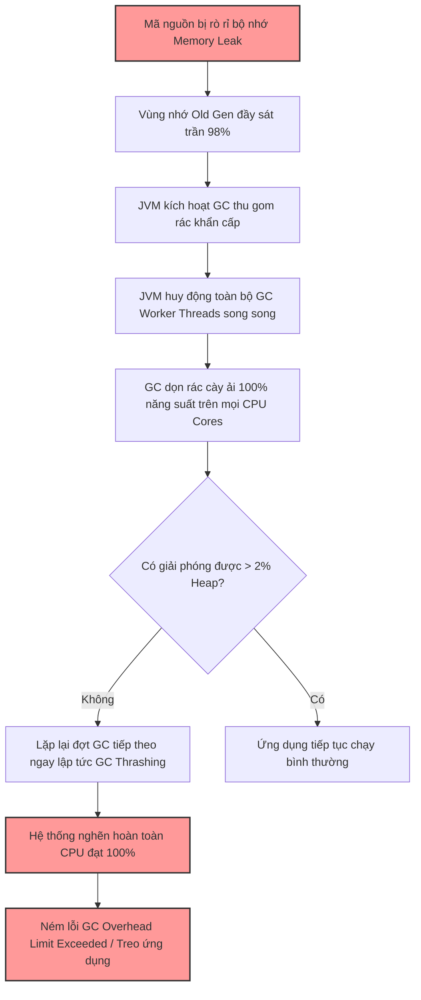

# GC có thể làm CPU cao như thế nào?

## ⚡ Tóm tắt ngắn (30s)
* **Bản chất**: Hoạt động dọn rác của JVM (Garbage Collection - GC) tiêu thụ CPU rất lớn khi hệ thống rơi vào trạng thái nghẽn rác (**GC Thrashing**). Các bộ dọn rác hiện đại (Parallel GC, G1GC) sử dụng nhiều luồng song song (**GC Worker Threads**) chạy hết công suất trên toàn bộ các CPU cores khả dụng để tìm kiếm và quét rác. Khi bộ nhớ Heap cạn kiệt (hoặc bị rò rỉ), GC phải chạy liên tục không ngừng nghỉ, chiếm đoạt hoàn toàn tài nguyên CPU của các luồng xử lý nghiệp vụ, gây lỗi `GC Overhead Limit Exceeded`.
* **Các thảm họa thực chiến được giải quyết**:
    1. **Thảm họa treo sập "độ trễ vô cực" (STW Freeze)**: GC liên tục kích hoạt các đợt Full GC làm treo cứng toàn bộ ứng dụng (Stop-the-world) kéo dài hàng chục giây. Khách hàng gặp lỗi Timeout, Pod bị Kubernetes gán nhãn Unhealthy và bị ép hủy bỏ do Liveness Probe không được phản hồi.
* **Quyết định Senior**: Áp dụng quy trình chẩn đoán và cấu hình chuẩn Senior:
    1. **Chẩn đoán tức thời**: Chạy lệnh `jstat -gcutil <PID> 1000` để kiểm tra tỷ lệ thời gian chạy GC (`FGC` và `GCT` tăng chóng mặt, vùng `O` - Old Gen đầy 99%).
    2. **Phân lập tài nguyên Container**: Giới hạn cứng số luồng GC bằng cách chỉ định rõ `-XX:ParallelGCThreads` và `-XX:ConcGCThreads` tương thích với CPU Limit của Container trên K8s để tránh tranh chấp CPU vật lý của Node làm chậm hệ thống.
    3. **Chốt chặn bộ nhớ**: Chụp Heap Dump để xử lý triệt để Memory Leak hoặc nâng cấp sang bộ dọn rác thế hệ mới **ZGC** để chuyển dịch gánh nặng CPU ra chạy nền bất đồng bộ.

---

## 🔍 Chi tiết bản chất thực chiến: Cơ chế GC Thrashing gây CPU 100%

Senior Engineer hiểu rõ mối quan hệ mật thiết giữa Bộ nhớ (Memory) và Bộ vi xử lý (CPU) trong kiến trúc máy ảo Java.

### 1. Bản chất song song của GC Worker Threads
Các bộ dọn rác như G1GC hay Parallel GC không chạy đơn luồng. Để dọn rác nhanh nhất và giảm thiểu thời gian treo ứng dụng (Stop-The-World), JVM sẽ khởi tạo số lượng luồng dọn rác dựa trên số CPU core mà nó nhận diện được:
* Số luồng GC song song mặc định:
  $$\text{ParallelGCThreads} = \begin{cases} N & \text{nếu } N \le 8 \\ 8 + (N - 8) \times \frac{5}{8} & \text{nếu } N > 8 \end{cases}$$
  *(Với $N$ là số CPU Cores JVM nhận diện).*
* Khi GC kích hoạt (đặc biệt là Full GC), toàn bộ các luồng song song này đồng loạt thức dậy và chạy ở mức **100% năng suất** trên tất cả các core CPU để quét toàn bộ vùng nhớ Heap khổng lồ.

### 2. Hiện tượng GC Thrashing (Nghẽn rác liên tục)
Khi ứng dụng bị rò rỉ bộ nhớ (Memory Leak), vùng nhớ thế hệ già (Old Generation/Tenured Gen) bị lấp đầy bởi các đối tượng rác nhưng vẫn bị giữ tham chiếu mạnh từ GC Roots.
* Khi Heap đầy sát trần (98%), JVM phát hiện không đủ chỗ cho đối tượng mới, lập tức kích hoạt GC dọn rác.
* Đợt GC chạy cày ải hết công suất CPU nhưng chỉ giải phóng được **dưới 2% bộ nhớ Heap** vì đa số đối tượng vẫn đang bị kẹt tham chiếu.
* Vừa chạy xong, luồng nghiệp vụ lại xin cấp phát đối tượng mới, Heap tiếp tục đầy, JVM lại phải chạy GC tiếp.
* Vòng lặp thảm họa này diễn ra liên tục (GC Thrashing), nuốt trọn 100% CPU của máy chủ, dẫn đến lỗi kinh điển:
  `java.lang.OutOfMemoryError: GC Overhead limit exceeded`

---

## 🎨 Sơ đồ trực quan (Mối quan hệ sập đổ dây chuyền từ Memory Leak đến CPU 100%)



---

## 💻 Code thực chiến / Cấu hình thực tế: BAD vs GOOD

### ❌ BAD: Cấu hình JVM thiếu chốt chặn giới hạn luồng trên môi trường Kubernetes
Khi chạy ứng dụng Java trong Container trên K8s mà không cấu hình giới hạn luồng GC, JVM mặc định sẽ đếm số CPU core vật lý của máy chủ Host (Node vật lý - ví dụ máy chủ 64 Cores) thay vì CPU limit của Pod (ví dụ Pod chỉ được cấp limit 2 Cores). 

* **Cấu hình khởi chạy tồi gây thảm họa CPU Throttling**:
```bash
# ❌ JVM sẽ khởi tạo 43 luồng GC (theo công thức 64 cores của Node Host)
# 43 luồng này sẽ tranh chấp khốc liệt để chạy trên 2 cores thực tế được cấp cho Container.
# Gây ra hiện tượng Thread Scheduling Latency cực lớn, CPU bị bóp nghẹt (Throttling) sập hệ thống.
java -Xms2g -Xmx2g -jar application.jar
```

---

### ✅ GOOD: Cấu hình JVM tối ưu hóa tài nguyên cho Container
Senior Engineer cấu hình JVM nhận diện chính xác giới hạn của Container, chỉ định bộ dọn rác hiện đại G1GC/ZGC và giới hạn chặt chẽ số lượng luồng GC tương thích với CPU Limit của Container để triệt tiêu tranh chấp.

* **Cấu hình khởi chạy chuẩn Senior trên K8s**:
```bash
# ✅ Kích hoạt ZGC (luồng dọn rác bất đồng bộ bất biến độ trễ) hoặc G1GC
# ✅ Chỉ định rõ số luồng song song (Parallel) và luồng chạy ngầm (Conc)
# ✅ Sử dụng cờ tự động nhận biết tài nguyên container (bật mặc định từ Java 10+)
java -Xms2g -Xmx2g \
  -XX:+UseG1GC \
  -XX:ParallelGCThreads=2 \
  -XX:ConcGCThreads=1 \
  -XX:+UnlockDiagnosticVMOptions \
  -XX:G1ReservePercent=15 \
  -jar application.jar
```
> [!IMPORTANT]
> Việc cấu hình `ParallelGCThreads=2` (bằng đúng CPU limit của Pod) và `ConcGCThreads=1` (luồng chạy ngầm lúc ứng dụng đang chạy) đảm bảo hoạt động GC không bao giờ có thể tranh đoạt tài nguyên CPU vượt quá định mức của Pod, bảo vệ an toàn cho cả Node vật lý chung.

---

## 📊 Bảng so sánh đặc tính tiêu thụ CPU của các thế hệ GC

| Bộ dọn rác (GC) | Cơ chế dọn rác chính | Ảnh hưởng CPU lúc chạy thường | CPU Spike khi Full GC | Ưu tiên tối thượng |
| :--- | :--- | :--- | :--- | :--- |
| **Parallel GC** | Stop-The-World (Dừng luồng ứng dụng và dọn rác toàn lực). | Siêu thấp (Hầu như không tiêu thụ CPU khi không dọn rác). | Cực cao (Khóa cứng toàn bộ CPU core để dọn rác nhanh nhất). | **Throughput (Năng suất)**: Phù hợp cho batch jobs, tính toán offline không cần tương tác realtime. |
| **G1GC** | Chia nhỏ Heap thành các vùng và dọn dẹp cuốn chiếu. | Thấp (Có một vài luồng chạy ngầm quét rác bất đồng bộ). | Trung bình - Cao (Đã giảm thiểu đáng kể số lần Full GC, chỉ spike nhẹ). | **Cân bằng**: p99 Latency khá và Throughput ổn định cho hầu hết ứng dụng web Spring Boot. |
| **ZGC (Java 15+)** | Concurrent (Dọn rác song song đồng thời khi ứng dụng đang chạy, STW < 1ms). | Cao đều đặn (Các luồng GC liên tục chạy nền bất đồng bộ để quét rác). | Cực thấp (Hầu như không có CPU spike đột biến, tải được trải đều). | **Độ trễ siêu thấp (Low Latency)**: Phù hợp hệ thống tài chính, API yêu cầu p99 < 10ms. |

---

## ⚠️ Common Gotchas & Questions follow-up

### 1. Cạm bẫy "Nâng Max Heap (`-Xmx`) mù quáng để trốn lỗi GC CPU cao"
* **Vấn đề**: Khi thấy GC chạy nhiều làm CPU cao, kỹ sư lập tức nâng Heap từ 4GB lên 16GB.
* **Thực tế**: Nếu ứng dụng thực sự bị **Memory Leak**, việc nâng Heap lớn hơn chỉ giúp kéo dài thời gian sống của Pod lâu hơn một chút. Tuy nhiên, khi vùng Old Gen 16GB bị đầy rác, đợt Full GC càn quét qua 16GB Heap sẽ tiêu tốn tài nguyên CPU khổng lồ và kéo dài thời gian treo ứng dụng (`Stop-the-world`) lên tới hàng chục giây (thay vì vài trăm mili-giây như Heap nhỏ), gây thảm họa sập kết nối diện rộng.

### 2. Câu hỏi đào sâu từ interviewer

* **Q1: Làm sao bạn phân biệt được ứng dụng đang bị CPU cao do logic nghiệp vụ (vòng lặp vô hạn, tính toán nặng) hay do hoạt động của GC Thrashing chỉ bằng các dòng log hệ thống?**
  * *Trả lời*: Để nhận biết nhanh mà không cần gõ lệnh CLI sâu:
    1. **Bật GC Logging**: Trong cấu hình khởi chạy JVM, tôi luôn kích hoạt cờ `-Xlog:gc*` để JVM tự động in chi tiết các đợt dọn rác ra file log hoặc stdout.
    2. **Phân tích dấu hiệu log**:
       * *Nếu do GC Thrashing*: File log ứng dụng sẽ tràn ngập các dòng thông báo dọn rác liên tục từng giây:
         `[GC (Allocation Failure) [PSYoungGen: ...] ... 0.12345 secs]`
         `[Full GC (Ergonomics) [PSYoungGen: ...] [ParOldGen: ...] ... 3.45678 secs]`
         Thời gian dọn rác kéo dài (nhiều giây) và tần suất in cực kỳ dày đặc.
       * *Nếu do Logic nghiệp vụ*: Log GC in rất thưa thớt (hoặc chỉ in định kỳ vài phút một lần), trong khi log nghiệp vụ dừng in đột ngột (luồng bị kẹt) hoặc in lặp vô tận một thông điệp nghiệp vụ cụ thể.

* **Q2: ZGC (Z Garbage Collector) được giới thiệu là có độ trễ siêu thấp dưới 1ms nhờ dọn rác Concurrent. Vậy ZGC có giúp giảm tổng lượng tài nguyên CPU tiêu thụ cho hoạt động dọn rác của hệ thống hay không?**
  * *Trả lời*: Đây là một điểm cực kỳ quan trọng cần hiểu rõ về mặt thiết kế hệ thống. **ZGC không giúp tiết kiệm tổng tài nguyên CPU, thậm chí nó còn tiêu thụ nhiều CPU hơn.**
    * *Giải thích*: Để đạt được độ trễ Stop-The-World siêu thấp dưới 1ms, ZGC phải thực hiện hầu hết hoạt động dọn rác (quét tham chiếu, di dời đối tượng, cập nhật địa chỉ) song song đồng thời khi các luồng ứng dụng vẫn đang chạy. Quá trình này yêu cầu các luồng chạy ngầm của ZGC (Concurrent GC Threads) phải liên tục cày ải CPU ở nền.
    * *Trade-off*:
      1. **Tổn hao CPU nền**: Tiêu thụ CPU trung bình của ứng dụng khi dùng ZGC sẽ cao hơn so với G1GC hoặc Parallel GC.
      2. **Giảm Throughput**: Tổng năng suất xử lý (Throughput) của ứng dụng sẽ bị **giảm từ 5% - 15%** do tài nguyên CPU bị phân bổ một phần cho các luồng dọn rác chạy nền liên tục.
      * *Kết luận*: Tôi chỉ đề xuất chuyển sang ZGC khi hệ thống có dư thừa tài nguyên CPU và p99 Latency dưới 10ms là ưu tiên sống còn của doanh nghiệp.
