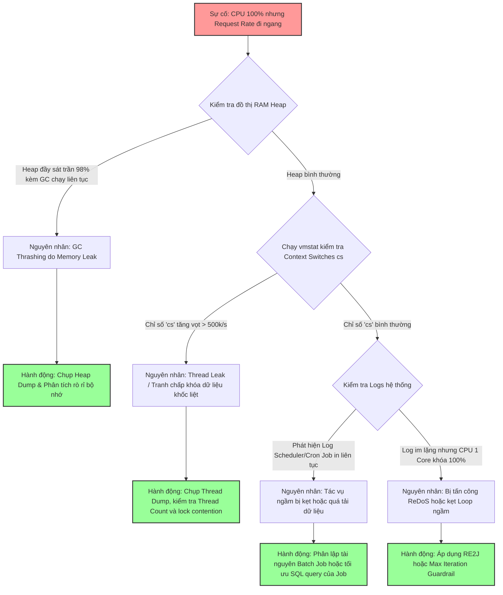

# Traffic không tăng nhưng CPU tăng, bạn kiểm tra gì?

## ⚡ Tóm tắt ngắn (30s)
* **Bản chất**: Hiện tượng CPU tăng vọt trong khi lưu lượng truy cập (Traffic / Request Rate) đi ngang là dấu hiệu cảnh báo hệ thống đang gặp lỗi nghẽn tài nguyên phi tuyến tính. Nguyên nhân gốc rễ không đến từ bên ngoài, mà do các tiến trình chạy ngầm mất kiểm soát (Background Threads / Scheduled Tasks kẹt loop), rò rỉ luồng (**Thread Leak**) gây quá tải chi phí chuyển đổi ngữ cảnh (**Context Switching Overhead**), hoặc bộ nhớ bị nghẽn rác (**GC Thrashing** do Memory Leak lâu ngày).
* **Các thảm họa thực chiến được giải quyết**:
    1. **Thảm họa tự hủy lúc nửa đêm (Self-induced DoS)**: Một tác vụ nền (Scheduled Cron Job) chạy ngầm lúc 2h sáng đột ngột gặp dữ liệu lỗi, rơi vào vòng lặp vô hạn hoặc truy vấn hàng triệu dòng DB nạp vào RAM. CPU của hệ thống lập tức tăng vọt lên 100%, làm sập toàn bộ dịch vụ khi không hề có một khách hàng nào truy cập.
* **Quyết định Senior**: Áp dụng quy trình loại trừ nhanh theo mô hình 4 tầng:
    1. **Tầng bộ nhớ**: Kiểm tra đồ thị RAM và GC pause (xem ứng dụng có bị kẹt GC Thrashing do rò rỉ RAM tích tụ lâu ngày hay không).
    2. **Tầng đa luồng**: Kiểm tra số lượng luồng đang chạy (`Thread Count`), kiểm tra số lượng chuyển đổi ngữ cảnh hệ thống (`Context Switches` qua `vmstat`).
    3. **Tầng tác vụ ngầm**: Định vị xem có tác vụ Batch Job / Scheduled Task nào đang chạy trùng giờ hay không.
    4. **Tầng bảo mật**: Kiểm tra xem hệ thống có đang bị tấn công phức tạp hóa dữ liệu (ReDoS, Hash Collision Attack) hay không.

---

## 🔍 Chi tiết bản chất thực chiến: Quy trình điều tra của Senior

Khi gặp sự cố nghịch lý này, Senior Engineer sẽ tiến hành chẩn đoán theo các bước loại trừ từ dễ đến khó.

### 1. Kiểm tra hiện tượng Rò rỉ luồng (Thread Leak) & Context Switching Overhead
Một trong những lỗi kinh điển là lập trình viên tự ý tạo Thread mới thủ công (`new Thread().start()`) hoặc cấu hình Thread Pool sai lầm làm số lượng luồng tăng vô hạn.
* Khi số lượng Thread tăng lên quá lớn (ví dụ: từ 200 tăng lên 5,000 luồng), CPU sẽ dành phần lớn thời gian để làm một nhiệm vụ vô ích: **Context Switching** (lưu trạng thái luồng này, nạp trạng thái luồng kia vào thanh ghi CPU) thay vì chạy code thực tế.
* **Công cụ chẩn đoán OS**: Chạy lệnh `vmstat 1` trên Linux. 
  * Nhìn vào cột **cs** (Context Switches). Nếu chỉ số này tăng vọt lên hàng trăm nghìn hoặc hàng triệu đợt mỗi giây, hệ thống đang bị quá tải do tranh chấp luồng khốc liệt.

---

### 2. Kiểm tra hiện tượng GC Thrashing (Lỗi bộ nhớ phản ứng lên CPU)
Đây là nguyên nhân phổ biến nhất. Ứng dụng bị rò rỉ bộ nhớ từ trước đó nhiều ngày. Tại thời điểm xảy ra sự cố, lượng RAM Heap trống chỉ còn dưới 2%.
* Dù traffic không tăng, chỉ cần một vài request nhỏ vào hệ thống cũng đủ làm Heap đầy, ép JVM phải liên tục chạy Full GC dọn rác bất đồng bộ để cứu Pod.
* Hoạt động GC liên tục này nuốt trọn CPU. CPU tăng 100% nhưng ngọn nguồn thực chất là do rò rỉ bộ nhớ Heap từ nhiều ngày trước.

---

### 3. Kiểm tra các Tác vụ ngầm (Cron Jobs / Background Processes)
Các tác vụ chạy ngầm được lập lịch (Spring `@Scheduled` hoặc Quartz Scheduler) thường được lập trình để xử lý dữ liệu định kỳ (ví dụ: quét đơn hàng chưa thanh toán mỗi 10 phút).
* Nếu số lượng đơn hàng tích lũy qua thời gian tăng đột biến, hoặc một câu query SQL trong Scheduled Job bị mất index do DB cập nhật, câu query này sẽ bị nghẽn làm luồng Scheduled Job chạy kéo dài vượt quá chu kỳ kích hoạt tiếp theo.
* Các đợt Job tiếp theo đè lên Job cũ, tạo ra hiện tượng chồng chéo luồng (Thread Contention) và nghẽn CPU.

---

## 🎨 Sơ đồ trực quan (Quy trình khoanh vùng nguyên nhân CPU tăng không do traffic)



---

## 💻 Code thực chiến: BAD vs GOOD trong thiết kế Scheduled Task

### ❌ BAD: Tự sinh Thread thủ công trong Scheduled Job gây Thread Leak
Đoạn code chạy ngầm định kỳ quét dữ liệu. Mỗi lần có dữ liệu mới, lập trình viên tự tạo mới luồng thủ công mà không giới hạn số lượng luồng, dẫn đến Thread Leak khi database có lượng bản ghi tăng đột biến.

```java
import org.springframework.scheduling.annotation.Scheduled;

public class InventoryScheduler {

    // ❌ TỒI: Tạo thread thủ công vô tội vạ trong Scheduled Task gây sập CPU do Context Switching
    @Scheduled(fixedDelay = 5000)
    public void processInventory() {
        List<InventoryItem> items = getPendingItems();
        
        for (InventoryItem item : items) {
            // Tự sinh Thread mới cho mỗi item, không có Thread Pool quản lý
            new Thread(() -> {
                updateStock(item);
            }).start();
        }
    }
}
```

---

### ✅ GOOD: Sử dụng Thread Pool giới hạn cứng và kiểm soát tiến độ
Sử dụng ThreadPoolExecutor được cấu hình giới hạn kích thước nghiêm ngặt kết hợp với Bounded Queue để bảo vệ CPU khỏi thảm họa Context Switching.

```java
import org.springframework.scheduling.annotation.Scheduled;
import java.util.concurrent.ExecutorService;
import java.util.concurrent.ThreadPoolExecutor;
import java.util.concurrent.LinkedBlockingQueue;
import java.util.concurrent.TimeUnit;
import lombok.extern.slf4j.Slf4j;

@Slf4j
public class OptimizedInventoryScheduler {
    
    // ✅ THIẾT KẾ CHUẨN SENIOR: Định nghĩa Thread Pool giới hạn cứng (Bounded Thread Pool)
    private final ExecutorService executor = new ThreadPoolExecutor(
        4,                                // Core Pool Size
        8,                                // Max Pool Size (Giới hạn tối đa 8 luồng để bảo vệ CPU)
        60L, TimeUnit.SECONDS,
        new LinkedBlockingQueue<>(1000), // Bounded Queue tránh tràn bộ nhớ
        new ThreadPoolExecutor.CallerRunsPolicy() // Đẩy ngược tác vụ cho luồng chính xử lý nếu quá tải (Backpressure)
    );

    @Scheduled(fixedDelay = 10000) // Tăng thời gian giãn cách lên 10 giây
    public void processInventoryOptimized() {
        try {
            List<InventoryItem> items = getPendingItems();
            log.info("Bắt đầu xử lý {} mặt hàng tồn kho ngầm", items.size());
            
            for (InventoryItem item : items) {
                // ✅ TỐT: Đẩy tác vụ vào Thread Pool được kiểm soát nghiêm ngặt
                executor.submit(() -> {
                    try {
                        updateStock(item);
                    } catch (Exception e) {
                        log.error("Lỗi cập nhật kho cho mặt hàng: {}", item.getId(), e);
                    }
                });
            }
        } catch (Exception e) {
            log.error("Lỗi hệ thống trong Scheduled Job", e);
        }
    }
}
```

---

## 📊 Bảng so sánh các nguyên nhân CPU tăng không do traffic

| Đặc trưng | Rò rỉ luồng (Thread Leak) | GC Thrashing | Kẹt Scheduled Job | Tấn công ReDoS / Hash Collision |
| :--- | :--- | :--- | :--- | :--- |
| **Chỉ số `cs` (Context Switches)** | Tăng vọt gấp hàng chục lần (hàng triệu switches/s). | Bình thường hoặc tăng nhẹ. | Bình thường. | Bình thường. |
| **Thread Count** | Tăng liên tục theo đường dốc đứng, không bao giờ giảm. | Biến động bình thường theo cấu hình Thread Pool. | Ổn định ở mức tối đa của Thread Pool. | 1 luồng bị khóa cứng, các luồng khác bình thường. |
| **Đồ thị RAM Heap** | RAM tăng dần do mỗi Thread chiếm dụng ~1MB Stack memory. | RAM Heap đầy 100% không giảm sau Full GC. | RAM tăng răng cưa to do nạp nhiều dữ liệu từ DB vào RAM. | RAM bình thường. |
| **Dấu hiệu File Log** | Log in bình thường hoặc xuất hiện lỗi `OutOfMemoryError: unable to create new native thread`. | Log ngập tràn thông tin dọn rác GC cứu hộ liên tục. | Xuất hiện log của Job lặp đi lặp lại không có khoảng dừng. | Log im lặng bất thường ở luồng xử lý API bị tấn công. |

---

## ⚠️ Common Gotchas & Questions follow-up

### 1. Cạm bẫy "Mất index database bất thình lình làm sập CPU ứng dụng"
* **Vấn đề**: Ứng dụng đang chạy cực kỳ ổn định, bỗng dưng CPU của Java service tăng vọt lên 100% dù traffic thấp. Lập trình viên tập trung tìm lỗi leak trong code Java nhưng không ra.
* **Nguyên nhân**: Do DBA hoặc hệ thống tự động cập nhật thống kê index (Analyze table), hoặc lượng dữ liệu trong bảng tăng vượt ngưỡng làm Database quyết định từ bỏ Index cũ và chuyển sang quét toàn bộ bảng dữ liệu (**Full Table Scan**) cho câu query của Scheduled Task. Việc quét bảng lớn làm DB bị nghẽn CPU, kéo theo kết nối Connection Pool của Java service bị giữ quá lâu và cạn kiệt, luồng Java bị kẹt cứng chờ phản hồi làm CPU app tăng vọt do retry liên tục.
* **Giải pháp**: Phải kiểm tra cả biểu đồ Slow Query của Database khi ứng dụng Java báo CPU cao không rõ nguyên nhân.

### 2. Câu hỏi đào sâu từ interviewer

* **Q1: Bạn đã bao giờ nghe nói về cuộc tấn công Xung đột bảng băm (Hash Collision Attack) chưa? Kẻ tấn công có thể làm CPU của Java service tăng vọt lên 100% chỉ bằng duy nhất 1 Request như thế nào khi request rate của hệ thống rất thấp?**
  * *Trả lời*: Đây là một kỹ thuật tấn công lỗ hổng thuật toán cực kỳ nguy hiểm nhằm vào cấu trúc dữ liệu của các ngôn ngữ lập trình, bao gồm cả Java.
    * *Cơ chế tấn công*: Lớp `HashMap` của Java sử dụng bảng băm để lưu trữ cặp Key-Value với độ phức tạp truy xuất trung bình là $O(1)$. Khi có hai key khác nhau trùng giá trị băm (`hashCode()`), chúng sẽ bị đẩy vào cùng một bucket (xung đột băm).
    * Kẻ tấn công thiết kế tỉ mỉ một payload JSON hoặc Form-url-encoded chứa khoảng 20,000 keys đặc biệt được tính toán trước sao cho **toàn bộ 20,000 keys này đều có chung một giá trị hashCode()**.
    * Khi Java tiếp nhận request này và thực hiện parse dữ liệu thành Map, toàn bộ 20,000 keys sẽ bị nhồi nhét vào đúng một bucket duy nhất của HashMap. HashMap lúc này bị suy biến hoàn toàn thành một danh sách liên kết (Linked List) hoặc cây đỏ đen (Red-Black Tree).
    * Hoạt động chèn phần tử mới vào HashMap lúc này phải duyệt qua toàn bộ các phần tử cũ để kiểm tra trùng lặp (`equals()`). Với $N = 20,000$, số phép so sánh String lũy tiến là $O(N^2) \approx 400,000,000$ phép tính so sánh chuỗi phức tạp. Một request độc hại này sẽ khóa cứng CPU core của luồng xử lý đó trong vài phút đến vài giờ.
    * *Biện pháp phòng ngừa*:
      1. Spring Boot và các Gateway hiện đại đều cấu hình giới hạn số lượng tham số tối đa trong một request (ví dụ Tomcat mặc định giới hạn `maxParameterCount=10000`).
      2. Từ Java 8, HashMap đã tự động chuyển đổi bucket chứa hơn 8 phần tử xung đột từ Linked List sang Cây đỏ đen, giúp giảm độ phức tạp truy xuất từ $O(N)$ xuống $O(\log N)$, vô hiệu hóa phần lớn sức mạnh của Hash Collision Attack.

* **Q2: Làm sao để chúng ta cấu hình cảnh báo (Alert) thông minh trên Prometheus/Grafana để phát hiện sớm hiện tượng CPU cao không do traffic trước khi khách hàng nhận ra hệ thống bị chậm?**
  * *Trả lời*: Để thiết lập cảnh báo thông minh chống dương tính giả (false positive):
    1. Tôi không tạo alert đơn giản theo quy tắc: `CPU > 90% thì bắn alert`. Quy tắc này dễ gây loãng alert khi CPU tăng đột biến ngắn hạn do khởi động hoặc nén file.
    2. Tôi tạo công thức alert kết hợp (Correlation Alert):
       * `Alert CPU_High_No_Traffic`: Kích hoạt khi `CPU Usage > 80%` kéo dài liên tục quá 3 phút **ĐỒNG THỜI** `Request Rate (Throughput) < 10%` so với mức trung bình cùng khung giờ của tuần trước.
       * `Alert Thread_Leak_Warning`: Kích hoạt khi chỉ số `jvm_threads_states_threads` (số lượng Thread trạng thái Runnable/Blocked) tăng liên tục dốc đứng trong vòng 15 phút mà không hề suy giảm.
       * `Alert GC_Overhead_Warning`: Kích hoạt khi tỷ lệ thời gian dừng GC (`jvm_gc_pause_seconds`) chiếm hơn 20% tổng thời gian chạy ứng dụng trong vòng 2 phút liên tiếp.
