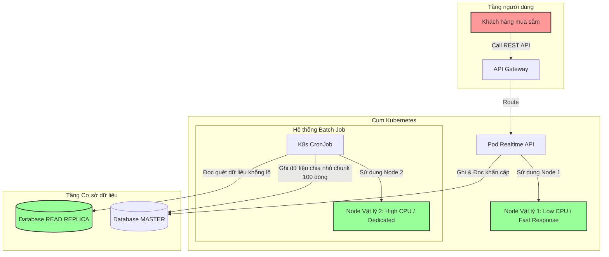

# Một batch job làm ảnh hưởng API realtime. Bạn xử lý thế nào?

## ⚡ Tóm tắt ngắn (30s)
* **Bản chất**: Sự cố này xảy ra do sự tranh chấp tài nguyên nghiêm trọng (**Resource Contention**) ở tầng CPU, Memory, Network, Connection Pool hoặc Khóa dữ liệu (Database Lock) giữa hai tác vụ có đặc tính đối nghịch: **Batch Job** (tính toán nặng, throughput-oriented, CPU-bound) và **Realtime API** (độ trễ thấp, latency-sensitive). Khi chạy chung trên cùng một tài nguyên vật lý, tác vụ Batch Job sẽ chiếm đoạt tài nguyên xử lý và làm nghẽn p99 latency của Realtime API.
* **Các thảm họa thực chiến được giải quyết**:
    1. **Thảm họa treo sập luồng Checkout/Thanh toán**: Một tác vụ đối soát hóa đơn định kỳ chạy đè lên khung giờ cao điểm mua sắm. Batch job chiếm trọn database connection pool và khóa các dòng dữ liệu (Row Lock) trên bảng giao dịch, làm treo cứng luồng thanh toán của khách hàng, gây tổn thất doanh thu trực tiếp.
* **Quyết định Senior**: Áp dụng chiến lược **Phân lập tài nguyên triệt để (Resource Isolation)** theo mô hình 3 lớp:
    1. **Lớp hạ tầng (Pod Isolation)**: Tách Batch job ra một Kubernetes Pod độc lập chạy trên Node vật lý riêng biệt (sử dụng `CronJob` kết hợp `nodeSelector`/`tolerations`).
    2. **Lớp dữ liệu (Database Replication)**: Điều hướng toàn bộ các query đọc dữ liệu khổng lồ của Batch job sang Database **Read Replica** để tránh lock dữ liệu trên Master.
    3. **Lớp ứng dụng (Rate Limiting & Chunking)**: Thiết kế Batch theo cơ chế phân trang nhỏ (Chunk-based), giới hạn tốc độ xử lý (Rate limiting) và cấu hình Connection Pool riêng biệt.

---

## 🔍 Chi tiết bản chất thực chiến: Các phương án phân lập của Senior

Để giải quyết triệt để sự tranh chấp tài nguyên, Senior Engineer triển khai các giải pháp cô lập ở 3 tầng kiến trúc.

### 1. Phân lập tầng Hạ tầng (Infrastructure Layer)
Chạy chung Batch Job và Realtime API trên cùng một JVM hoặc cùng một máy chủ là một sai lầm nghiêm trọng. Tác vụ Batch sẽ chiếm dụng CPU cores và tranh giành RAM băng thông.
* **Giải pháp chuẩn Senior trên Kubernetes**:
  * Chuyển đổi mã nguồn Batch Job thành một đối tượng **Kubernetes CronJob** thay vì chạy ngầm bằng `@Scheduled` trong Deployment chính.
  * Cấu hình Pod chạy CronJob này tự động khởi tạo trên một Node vật lý riêng biệt chuyên phục vụ tác vụ tính toán nặng thông qua tính năng **Taints & Tolerations**:
    ```yaml
    # Cấu hình Pod CronJob chỉ được deploy lên Node có nhãn "type=batch"
    spec:
      template:
        spec:
          nodeSelector:
            type: batch
    ```
  * Sau khi hoàn tất tác vụ, Pod này tự động được tắt (`scale to 0`), giải phóng 100% tài nguyên CPU/RAM để tiết kiệm chi phí hạ tầng.

---

### 2. Phân lập tầng Dữ liệu (Database Layer)
Batch Job thường thực hiện các câu lệnh `SELECT` quy mô lớn quét hàng triệu dòng dữ liệu để thống kê hoặc đối soát. 
* **Tác hại**: Các câu query này chiếm dụng CPU của database, làm cạn kiệt Connection Pool và dễ gây ra hiện tượng **Shared Lock** khóa cứng các bảng dữ liệu, khiến API Realtime ghi dữ liệu (Write operations) bị chặn (Blocked).
* **Giải pháp**:
  * **Cấu hình Đọc từ Read Replica**: Ép buộc Batch Job chỉ được đọc dữ liệu từ instance DB Replica (ReadOnly). Tuyệt đối không được quét bảng lớn trên DB Master.
  * **Xử lý ghi chia nhỏ (Chunk-based Write)**: Nếu Batch Job cần ghi ngược dữ liệu lại DB Master, tôi cấm tuyệt đối việc thực hiện một transaction khổng lồ chứa 100,000 dòng. Thay vào đó, tôi chia nhỏ dữ liệu thành các khối (Chunks) khoảng 100 - 500 dòng, thực hiện ghi và commit nhanh chóng để nhường khóa cho API realtime.

---

### 3. Phân lập tầng Ứng dụng (Application Layer)
Nếu bắt buộc phải chạy Batch Job chung trong cùng ứng dụng Java do hạn chế về hạ tầng:
* **Tách biệt Thread Pool**: Không dùng chung Thread Pool mặc định. Cấu hình một ExecutorService riêng cho Batch với số lượng thread giới hạn thấp (ví dụ: tối đa 2 threads).
* **Áp dụng cơ chế Throttling (Rate Limiting)**: Sử dụng các thuật toán Token Bucket hoặc thư viện `Bucket4j` / Guava `RateLimiter` để giới hạn tốc độ xử lý của luồng Batch, đảm bảo nó luôn có những khoảng nghỉ (sleep) ngắn để nhường nhịp CPU cho luồng Realtime.

---

## 🎨 Sơ đồ trực quan (Kiến trúc phân lập tài nguyên Batch Job và Realtime API)



---

## 💻 Code thực chiến: BAD vs GOOD trong thiết kế xử lý Batch

### ❌ BAD: Batch Job quét database trực tiếp trên Master, chạy luồng vô hạn không nghỉ
Đoạn code thực hiện transaction khổng lồ trên DB Master, dễ gây cạn kiệt connection pool và khóa dữ liệu (Row-level lock) bảng giao dịch trong thời gian dài.

```java
import org.springframework.transaction.annotation.Transactional;
import java.util.List;

public class LegacyBatchJob {
    private final TransactionRepository repository;

    public LegacyBatchJob(TransactionRepository repository) {
        this.repository = repository;
    }

    // ❌ TỒI: Chạy transaction khổng lồ quét sạch bảng, khóa cứng DB Master
    @Transactional
    public void processAllTransactions() {
        // Đọc toàn bộ hàng triệu dòng dữ liệu vào RAM
        List<Transaction> txList = repository.findAllByStatus("PENDING"); 
        
        for (Transaction tx : txList) {
            tx.setStatus("PROCESSED");
            tx.setAmount(tx.getAmount() * 1.1);
            repository.save(tx); // Ghi đè liên tục giữ lock lâu
        }
    }
}
```

---

### ✅ GOOD: Thiết kế Batch phân trang (Chunk-based), đọc Replica, ghi chia nhỏ kèm Throttle
Đoạn code chuẩn Senior sử dụng Datasource riêng trỏ đến Read Replica để quét dữ liệu, chia nhỏ lượng ghi thành từng chunk nhỏ độc lập, và thêm khoảng nghỉ ngắn (Throttle Delay) để bảo vệ tài nguyên.

```java
import org.springframework.transaction.PlatformTransactionManager;
import org.springframework.transaction.TransactionStatus;
import org.springframework.transaction.support.DefaultTransactionDefinition;
import org.springframework.data.domain.PageRequest;
import java.util.List;
import lombok.extern.slf4j.Slf4j;

@Slf4j
public class OptimizedBatchJob {
    private final TransactionRepository readReplicaRepository; // Datasource trỏ đến Read Replica
    private final TransactionRepository masterRepository;      // Datasource trỏ đến Master
    private final PlatformTransactionManager masterTxManager;   // Transaction Manager của Master

    public OptimizedBatchJob(TransactionRepository readReplicaRepository,
                               TransactionRepository masterRepository,
                               PlatformTransactionManager masterTxManager) {
        this.readReplicaRepository = readReplicaRepository;
        this.masterRepository = masterRepository;
        this.masterTxManager = masterTxManager;
    }

    public void processTransactionsOptimized() {
        int page = 0;
        int chunkSize = 200; // ✅ TỐT: Giới hạn kích thước mỗi khối xử lý nhỏ
        boolean hasMore = true;

        while (hasMore) {
            // ✅ Chốt chặn 1: Đọc dữ liệu khổng lồ từ READ REPLICA để tránh lock Master
            List<Transaction> pendingTx = readReplicaRepository.findAllByStatus(
                "PENDING", PageRequest.of(page, chunkSize));

            if (pendingTx.isEmpty()) {
                hasMore = false;
                break;
            }

            // ✅ Chốt chặn 2: Mở Transaction Master riêng biệt cho từng CHUNK nhỏ
            TransactionStatus status = masterTxManager.getTransaction(new DefaultTransactionDefinition());
            try {
                for (Transaction tx : pendingTx) {
                    tx.setStatus("PROCESSED");
                    masterRepository.save(tx); // Ghi đè nhanh trên Master
                }
                masterTxManager.commit(status); // Commit cực nhanh để giải phóng Row Lock ngay
                log.info("Đã xử lý thành công chunk phân trang: {}", page);
            } catch (Exception e) {
                masterTxManager.rollback(status);
                log.error("Lỗi xử lý ở chunk: {}, tiến hành rollback chunk này.", page, e);
            }

            // ✅ Chốt chặn 3: Throttle Delay (Nghỉ 100ms giữa các chunk để nhường nhịp CPU/DB cho API realtime)
            try {
                Thread.sleep(100); 
            } catch (InterruptedException e) {
                Thread.currentThread().interrupt();
                break;
            }

            page++;
        }
    }
}
```

---

## 📊 Bảng so sánh các phương án phân lập tài nguyên cho Batch Job

| Phương án giải quyết | Khả năng bảo vệ CPU/RAM | Khả năng bảo vệ Database | Chi phí triển khai | p99 Latency của API Realtime |
| :--- | :--- | :--- | :--- | :--- |
| **Không phân lập (Chạy chung)** | ❌ Cực kém (Tranh chấp CPU kịch liệt). | ❌ Cực kém (Nguy cơ sập Connection Pool, Table Lock). | 0$ (Không cần cấu hình). | Tăng vọt (Thường gặp lỗi 504 Gateway Timeout). |
| **Tách biệt Thread Pool trong App** | ⚠️ Trung bình (Vẫn chung RAM, chung Network I/O và OS Node). | ❌ Cém (Vẫn chung Connection Pool đến cùng một DB Master). | Thấp (Chỉ sửa code cấu hình). | Vẫn bị ảnh hưởng đáng kể lúc Batch quét DB. |
| **Đọc Replica + Ghi Chia nhỏ Chunk**| ⚠️ Trung bình (Vẫn chung tài nguyên CPU của Application Server). | ✅ Cực tốt (Triệt tiêu hoàn toàn lock bảng và nghẽn Connection). | Trung bình (Cần cấu hình Dual Datasource). | Ổn định tốt ở mức chấp nhận được. |
| **Kubernetes CronJob trên Dedicated Node + Read Replica** | ✅ Tuyệt đối (Phân lập tài nguyên vật lý 100%). | ✅ Cực tốt (Triệt tiêu hoàn toàn áp lực DB Master). | Cao (Cần chuyên môn DevOps thiết kế K8s/Cloud). | **Hoàn hảo**: API Realtime không hề cảm nhận thấy có Batch Job đang chạy. |

---

## ⚠️ Common Gotchas & Questions follow-up

### 1. Cạm bẫy "Chỉ cấu hình `Thread.setPriority(Thread.MIN_PRIORITY)` để nhường CPU"
* **Vấn đề**: Nhiều kỹ sư nghĩ đơn giản chỉ cần đặt độ ưu tiên luồng xử lý Batch về mức thấp nhất (`Thread.MIN_PRIORITY = 1`) thì hệ điều hành sẽ tự động ưu tiên CPU cho luồng Realtime (`Thread.MAX_PRIORITY = 10`).
* **Thực tế**: 
  1. Hầu hết các hệ điều hành hiện đại (Linux/Windows) sử dụng bộ lập lịch luồng phức tạp (Completely Fair Scheduler - CFS) và **thường bỏ qua hoặc không đảm bảo tuân thủ nghiêm ngặt chỉ số ưu tiên luồng của Java JVM**.
  2. Mức độ ưu tiên luồng hoàn toàn vô hiệu đối với nghẽn Database Connection Pool và Database Lock. Dù luồng Java có độ ưu tiên thấp, nó vẫn giữ Connection và Lock bảng y hệt luồng có độ ưu tiên cao.

### 2. Câu hỏi đào sâu từ interviewer

* **Q1: Trên Kubernetes, nếu cấu hình limit CPU của Pod quá nhỏ (ví dụ `limits.cpu: 500m`), hiện tượng CPU Throttling có thể làm ảnh hưởng tới API Realtime khi chạy ngầm Scheduled Task như thế nào?**
  * *Trả lời*: Đây là một cạm bẫy cực lớn khi cấu hình tài nguyên (Resources) trên K8s.
    * *Cơ chế CPU Throttling*: K8s sử dụng cơ chế CFS Cfs-quota để giới hạn thời gian sử dụng CPU của Container trong mỗi chu kỳ (mặc định là 100ms). Với limit `500m` (nửa core), Container chỉ được chạy tối đa 50ms trong mỗi chu kỳ 100ms.
    * Khi Scheduled Task kích hoạt và tiêu thụ hết 50ms quota này ngay ở đầu chu kỳ, **hệ điều hành sẽ đóng băng (suspend) toàn bộ Container** trong 50ms còn lại. Dịch vụ Java bị treo cứng tạm thời.
    * Kết quả: API Realtime nhận request trong khoảng thời gian đóng băng này sẽ bị treo và tăng p99 latency lên hàng trăm mili-giây một cách bí ẩn, dù tổng biểu đồ sử dụng CPU trung bình hiển thị vẫn ở mức thấp.
    * *Giải pháp*: 
      1. Tách biệt hoàn toàn Scheduled Task ra Pod riêng như kiến trúc CronJob ở trên để không dùng chung quota với Pod Realtime.
      2. Nâng cao thông số CPU limits cho Pod Realtime hoặc tắt tính năng CPU CFS quota nếu ứng dụng có đặc tính nhạy cảm với độ trễ (Latency-sensitive).

* **Q2: Nếu Batch job bắt buộc phải cập nhật (Update/Insert) hàng triệu dòng dữ liệu trên DB Master và không thể tách trỏ sang Read Replica để ghi, bạn sẽ tối ưu hóa như thế nào để API Realtime không bị chậm?**
  * *Trả lời*: Đây là bài toán khó nhất trong kỹ thuật xử lý dữ liệu lớn. Để giải quyết, tôi áp dụng chuỗi giải pháp phối hợp:
    1. **Bảng tạm trung gian (Staging Table)**: Thay vì cập nhật trực tiếp lên bảng giao dịch chính, Batch job sẽ ghi toàn bộ dữ liệu mới vào một bảng tạm (Staging Table) không có tranh chấp khóa với API Realtime.
    2. **Đổi tên bảng nhanh (Atomic Table Swap/Rename)**: Sau khi nạp xong dữ liệu vào bảng tạm, tôi thực hiện một lệnh đổi tên bảng ở mức cơ sở dữ liệu (ví dụ: `RENAME TABLE transactions TO transactions_old, transactions_new TO transactions`). Lệnh này diễn ra ở mức metadata của database, hoàn tất trong chưa đầy 1 mili-giây, triệt tiêu hoàn toàn thời gian lock bảng dài hạn.
    3. **Gom cụm bất đồng bộ qua Message Queue (Async Write Buffet)**: Điều hướng luồng ghi của Batch job đẩy vào một Kafka Topic. Service sẽ consume từ Kafka với tốc độ vừa phải được kiểm soát nghiêm ngặt (Consumer Rate Limiting), ghi dữ liệu từ từ vào Master để không bao giờ làm cạn kiệt Connection Pool của Database.
