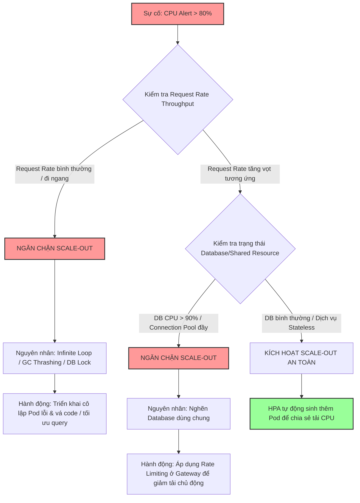

# Có nên scale out ngay khi CPU cao không?

## ⚡ Tóm tắt ngắn (30s)
* **Bản chất**: Scale-out (mở rộng hàng ngang - sinh thêm Pod/Server mới) là phản xạ tự nhiên của nhiều kỹ sư, nhưng nó chỉ thực sự hiệu quả khi CPU tăng cao do **tải xử lý độc lập (Stateless CPU-bound tasks) tăng trưởng tuyến tính** phù hợp với lưu lượng yêu cầu (Request Rate). Nếu CPU cao bắt nguồn từ các lỗi nghẽn tài nguyên dùng chung hoặc lỗi logic (Infinite Loop, Lock Contention, Database Bottleneck), việc scale-out không những không giải cứu được hệ thống mà còn **lập tức thiêu rụi toàn bộ hạ tầng** nhanh hơn và tốn kém hơn.
* **Các thảm họa thực chiến được giải quyết**:
    1. **Thảm họa sập đổ dây chuyền tự động (Auto-scaling Cascading Crash)**: Hệ thống bị nghẽn ở Database Master do một câu query lock bảng. Kube-controller thấy CPU của App Pods tăng cao, lập tức kích hoạt HPA sinh thêm 30 Pods mới. 30 Pods này khởi động lên, đồng loạt mở kết nối dồn dập vào Database Master, nuốt trọn Connection Pool vật lý của DB, khiến DB sập hoàn toàn và không thể khôi phục nhanh.
* **Quyết định Senior**: Chỉ thực hiện Scale-out khi xác định rõ 3 điều kiện thép:
    1. CPU cao đi kèm với **Throughput (Request Rate) tăng trưởng tương xứng**.
    2. Ứng dụng thuộc dạng **Stateless** (không phụ thuộc vào lock dùng chung).
    3. Không bị tắc nghẽn ở các tài nguyên chia sẻ hạ tầng dùng chung (**Database, Cache, Message Broker**).
    * *Nếu không thỏa mãn các điều kiện trên, giải pháp ưu tiên là **Load Shedding** (cắt giảm tải chủ động) và **Circuit Breaker**.*

---

## 🔍 Chi tiết bản chất thực chiến: Phân tích các kịch bản của Senior

Khi CPU tăng vọt, một Senior Engineer luôn phân tích mối quan hệ nhân quả trước khi quyết định tăng quy mô hệ thống.

### 1. Kịch bản Scale-out thành công (Tải tăng tuyến tính)
* **Đặc điểm**: Hệ thống nhận lượng người dùng tăng đột biến (ví dụ: giờ vàng mở bán vé, sự kiện Flash Sale quy mô lớn). Dịch vụ xử lý các tác vụ độc lập như: Mã hóa mật khẩu khi login, sinh chữ ký số, render file PDF, nén ảnh, xử lý tính toán logic đơn hàng độc lập.
* **Tại sao nên scale**: Vì mỗi Pod hoạt động hoàn toàn độc lập, không bị giới hạn bởi Database (ví dụ dữ liệu đã được cache hoặc sử dụng NoSQL phân tán). Thêm Pod mới giúp chia đều lưu lượng CPU xử lý, đưa CPU tổng thể về mức an toàn.

---

### 2. Kịch bản Scale-out phản tác dụng (Thảm họa sập nhanh hơn)

#### A. Nghẽn ở Cơ sở dữ liệu (Database Bottleneck)
* **Thực tế**: CPU cao do hàng trăm luồng Java đang bị block chờ Connection Pool hoặc chờ giải phóng khóa hàng dữ liệu (Row Lock/Table Lock) trên Database Master.
* **Hậu quả khi scale**: Thêm Pod mới nghĩa là thêm hàng trăm kết nối mới dồn vào Database. Database đã nghẽn nay càng nghẽn nặng nề hơn, CPU Database chạm 100%, sập toàn bộ hệ thống lưu trữ dữ liệu.

#### B. Tranh chấp khóa phân tán (Distributed Lock Contention)
* **Thực tế**: Các Pod cùng tranh giành một khóa dùng chung trên Redis (`Redlock`) hoặc Database để cập nhật số lượng tồn kho của một sản phẩm cực hot.
* **Hậu quả khi scale**: Thêm Pod chỉ làm tăng số lượng "đối thủ" tham gia tranh chấp khóa, tăng chi phí quay vòng kiểm tra khóa (spinning CPU overhead), làm CPU tăng cao hơn mà tốc độ xử lý đơn hàng không hề tăng.

#### C. Lỗi logic vòng lặp vô hạn (Infinite Loop Bug)
* **Thực tế**: Một lỗi code lọt lên production khiến luồng xử lý bị kẹt chạy loop khi gặp một điều kiện dữ liệu đặc biệt.
* **Hậu quả khi scale**: Pod mới tạo ra, tiếp nhận request chứa dữ liệu lỗi đó từ hàng đợi, ngay lập tức bị kẹt loop và CPU nhảy lên 100%. Pod mới rơi vào trạng thái `CrashLoopBackOff` liên tục, gây cháy túi chi phí Cloud vô ích.

---

## 🎨 Sơ đồ trực quan (Quy trình ra quyết định Scale-Out an toàn)



---

## 💻 Code thực chiến / Cấu hình thực tế: BAD vs GOOD

### ❌ BAD: Cấu hình Kubernetes HPA chỉ dựa trên metric CPU đơn giản
Cấu hình tự động scale chỉ dựa vào mức sử dụng CPU. Khi gặp sự cố nghẽn DB hoặc bug loop, HPA sẽ sinh thêm hàng chục Pod vô tội vạ làm sập hệ thống.

```yaml
apiVersion: autoscaling/v1
kind: HorizontalPodAutoscaler
metadata:
  name: order-service-hpa
spec:
  scaleTargetRef:
    apiVersion: apps/v1
    kind: Deployment
    name: order-service
  minReplicas: 2
  maxReplicas: 30 # ❌ Cực kỳ nguy hiểm: Sẽ sinh thêm 28 Pods nuốt trọn DB connection khi có sự cố nghẽn DB
  targetCPUUtilizationPercentage: 80
```

---

### ✅ GOOD: Cấu hình HPA thông minh kết hợp giới hạn an toàn & Rate Limiting
Senior Engineer kết hợp giới hạn an toàn của `maxReplicas` ở mức vừa phải tương thích với giới hạn kết nối của Database, đồng thời thiết lập cảnh báo và cấu hình Rate Limiting ở tầng API Gateway để giảm tải chủ động (Backpressure).

* **Cấu hình HPA chuẩn chỉ kèm giới hạn an toàn**:
```yaml
apiVersion: autoscaling/v2
kind: HorizontalPodAutoscaler
metadata:
  name: order-service-hpa-optimized
spec:
  scaleTargetRef:
    apiVersion: apps/v1
    kind: Deployment
    name: order-service
  minReplicas: 2
  maxReplicas: 8 # ✅ TỐT: Giới hạn tối đa 8 pods để bảo vệ connection pool của DB Master (Max DB Connections = 8 pods * 10 conns = 80 conns, DB chịu được 100 conns)
  metrics:
  - type: Resource
    resource:
      name: cpu
      target:
        type: Utilization
        averageUtilization: 80
  behavior:
    scaleUp:
      stabilizationWindowSeconds: 0
      policies:
      - type: Percent
        value: 100
        periodSeconds: 15 # Cho phép scale up nhanh khi thực sự quá tải
    scaleDown:
      stabilizationWindowSeconds: 300 # Chờ 5 phút nguội lạnh mới scale down để tránh chập chờn (Flapping)
```

---

## 📊 Bảng so sánh hiệu quả của Scale-out theo từng nhóm lỗi

| Nhóm lỗi gây CPU cao | Hiệu quả của việc Scale-out | Tác động tới hệ thống dùng chung | Giải pháp Senior thay thế bắt buộc |
| :--- | :--- | :--- | :--- |
| **Lượng truy cập tăng tuyến tính** | ✅ **Tuyệt vời** (Chia đều tải CPU, p99 latency giảm về bình thường). | An toàn (Database vẫn trong ngưỡng chịu tải). | Tự động kích hoạt HPA nhanh. |
| **Database Lock / Nghẽn DB** | ❌ **Phản tác dụng** (Hệ thống sập nhanh hơn). | Cực kỳ tồi tệ (Cướp đoạt nốt các connection pool còn lại). | **Load Shedding** (Chặn bớt request ở Gateway) + Tối ưu hóa Index. |
| **Tranh chấp khóa phân tán** | ❌ **Vô dụng** (Tốc độ xử lý không tăng, CPU app vẫn cao). | Tăng tải kiểm tra khóa lên Redis/Database. | Chuyển đổi sang kiến trúc phi tập trung (Decentralized) hoặc Queueing. |
| **Rò rỉ luồng (Thread Leak)** | ⚠️ **Chỉ kéo dài thời gian sống tạm thời** (Pod mới sẽ sập sau vài giờ). | Bình thường. | Sửa code sử dụng Bounded Thread Pool và đóng luồng giải phóng tài nguyên. |
| **Bug kẹt vòng lặp vô hạn** | ❌ **Phản tác dụng** (Đốt tiền Cloud vô ích). | Bình thường. | **Cô lập Pod lỗi** + Vá lỗi code với chốt chặn vòng lặp (`maxIterations`). |

---

## ⚠️ Common Gotchas & Questions follow-up

### 1. Cạm bẫy "Hiện tượng Flapping (Scale-up/Scale-down liên tục)"
* **Vấn đề**: HPA cấu hình nhạy cảm. CPU chạm 80% lập tức scale up. Thêm Pod mới -> CPU trung bình giảm xuống 40% -> HPA lập tức scale down -> CPU lại tăng lên 80% -> Lại scale up. Quá trình chập chờn này (Flapping) làm JVM liên tục khởi động (warm-up) gây tốn tài nguyên và tăng latency do compile JIT.
* **Giải pháp**: Luôn cấu hình thuộc tính `stabilizationWindowSeconds` trong file cấu hình HPA (như file GOOD ở trên) để ép hệ thống chờ một khoảng thời gian "nguội lạnh" (ví dụ 5 phút) trước khi thực hiện hành động scale down.

### 2. Câu hỏi đào sâu từ interviewer

* **Q1: Nếu không được phép Scale-out ứng dụng khi CPU đang tăng cao kịch trần trên Production, bạn sẽ áp dụng những biện pháp kỹ thuật khẩn cấp nào khác để cứu sống hệ thống (Stabilize)?**
  * *Trả lời*: Khi không thể scale-out hoặc scale-out vô hiệu, tôi lập tức triển khai các chiến lược phòng thủ chủ động để giảm tải cho CPU:
    1. **Triển khai Load Shedding (Cắt giảm tải chủ động)**: Ở tầng API Gateway (Kong/AWS APG), tôi thiết lập cấu hình chặn bớt một tỷ lệ request ngẫu nhiên từ người dùng (ví dụ: trả về lỗi HTTP `429 Too Many Requests` cho 30% lượng request phụ) để hạ nhiệt CPU ngay lập tức cho server xử lý nốt các request cốt lõi hiện có.
    2. **Kích hoạt Circuit Breaker (Ngắt mạch tính năng phụ)**: Sử dụng các công cụ như Resilience4j hoặc Sentinel để ngắt mạch toàn bộ các tính năng không thiết yếu. Ví dụ: Tắt tính năng gợi ý sản phẩm liên quan, tắt tính năng chấm điểm xếp hạng, chỉ giữ luồng mua sắm chính. Việc này giúp cắt giảm 40-50% CPU xử lý.
    3. **Cô lập nóng Pod lỗi (Graceful Degradation)**: Rút bớt các Pod lỗi ra khỏi Load Balancer bằng cách thay đổi nhãn (Label selector) để không cho nhận traffic mới, giữ nguyên trạng thái để kỹ sư vào debug chụp Thread Dump, sau đó khởi động lại (restart) Pod sạch để cứu hệ thống.

* **Q2: Làm sao để cấu hình Kubernetes HPA thông minh hơn bằng cách kết hợp cả Prometheus Metrics thực tế của Database Connection Pool thay vì chỉ dựa vào CPU của Pod?**
  * *Trả lời*: Đây là kỹ thuật cấu hình Autoscaling nâng cao chuẩn SRE.
    1. Chúng tôi cài đặt **Prometheus Adapter** vào cụm Kubernetes để chuyển hóa các Custom Metrics từ Prometheus thành API Kubernetes Metrics mà HPA có thể hiểu được.
    2. Tôi xuất metric từ Database (ví dụ số lượng connection đang Active của Postgres) và metric Request Rate (`http_requests_per_second`) của API Gateway.
    3. Tôi thiết lập cấu hình HPA sử dụng **Custom Metrics**: Chỉ cho phép scale-up nếu `http_requests_per_second` tăng **ĐỒNG THỜI** số lượng `active_database_connections` vẫn nằm dưới ngưỡng an toàn (ví dụ < 70% max connections). Nếu database connection đã đầy, HPA sẽ bị cấm kích hoạt scale-up để tránh làm sập database, thay vào đó hệ thống cảnh báo sẽ kích hoạt quy trình ngắt mạch tự động ở Gateway.
