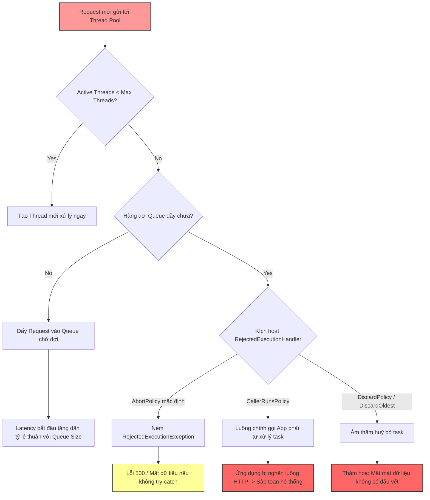

# Thread pool bị exhausted, triệu chứng là gì?

## ⚡ Tóm tắt ngắn (30s)
* **Bản chất**: Thread Pool bị cạn kiệt (Exhausted) xảy ra khi số lượng tác vụ (tasks) gửi đến vượt quá khả năng xử lý của nhóm luồng làm việc. Tại thời điểm này, số lượng luồng đang hoạt động đạt tới giới hạn tối đa (`maximumPoolSize`), hàng đợi công việc (`workQueue`) đã bị lấp đầy hoàn toàn, và pool bắt đầu từ chối tiếp nhận thêm tác vụ mới hoặc làm nghẽn toàn bộ luồng gọi.
* **Các thảm họa thực chiến được giải quyết**:
    1. **Thảm họa sập nghẽn dây chuyền (Cascading Failure)**: Thread Pool xử lý HTTP request của Spring Boot (Tomcat/Undertow) bị cạn kiệt do downstream database bị chậm. Hệ thống lập tức ngưng phản hồi, dẫn đến việc Gateway (NGINX/Kong) trả về hàng loạt lỗi `504 Gateway Timeout` và toàn bộ các ứng dụng frontend/mobile kết nối vào đều bị treo cứng.
    2. **Thảm họa mất mát dữ liệu âm thầm (Silent Data Loss)**: Sử dụng Thread Pool bất đồng bộ (`@Async` hoặc ExecutorService) với chính sách từ chối mặc định (`AbortPolicy`) hoặc bỏ qua lỗi, khiến các tác vụ xử lý hóa đơn, gửi OTP, hoặc ghi log nghiệp vụ bị vứt bỏ không thương tiếc mà không hề có cảnh báo trên hệ thống giám sát.
* **Quyết định Senior**: Chủ động giám sát và cấu hình các chỉ số vàng:
    1. Cấu hình **ThreadPoolExecutor** với kích thước hàng đợi hữu hạn (Bounded Queue) kết hợp với chính sách xử lý từ chối thông minh (`CallerRunsPolicy` hoặc custom appender).
    2. Thiết lập hệ thống giám sát Prometheus/Grafana cảnh báo ngay khi `active_threads` đạt ngưỡng $90\%$ của `max_threads` hoặc hàng đợi vượt quá $80\%$ sức chứa.

---

## 🔍 Chi tiết bản chất thực chiến: Đọc vị triệu chứng Thread Pool Exhaustion

Khi Thread Pool bị nghẽn và cạn kiệt, Senior Engineer chẩn đoán thông qua các tầng triệu chứng từ mức Hệ điều hành, Ứng dụng JVM cho tới các chỉ số giám sát APM.

### 1. Triệu chứng ở tầng ứng dụng (Application Level)
* **Ném ra ngoại lệ `RejectedExecutionException`**:
  * Đây là dấu hiệu rõ ràng và đanh thép nhất. Khi hàng đợi đầy và số luồng đạt cực đại, JVM sẽ kích hoạt `RejectedExecutionHandler`. Chính sách mặc định `AbortPolicy` sẽ ném thẳng lỗi:
    `java.util.concurrent.RejectedExecutionException: Task ... rejected from java.util.concurrent.ThreadPoolExecutor...`
* **Thời gian phản hồi (Latency) tăng vọt theo chiều thẳng đứng**:
  * Nếu hàng đợi của Thread Pool quá lớn (ví dụ: dùng `LinkedBlockingQueue` không giới hạn dung lượng), các tác vụ mới sẽ không bị từ chối ngay mà phải xếp hàng chờ đợi cực lâu. Điều này khiến Latency tăng từ vài chục mili-giây lên hàng chục giây, gây ra hiện tượng treo request.
* **Trầm trọng hơn - Treo luồng gọi (Client Thread Blocked)**:
  * Nếu cấu hình Thread Pool sử dụng chính sách `CallerRunsPolicy` làm giải pháp chống quá tải, luồng gọi (ví dụ: luồng HTTP của Tomcat) sẽ đứng ra trực tiếp xử lý tác vụ bị tràn. Việc này bảo vệ không cho tác vụ bị mất, nhưng trực tiếp làm nghẽn luôn luồng xử lý HTTP, khiến throughput toàn service giảm mạnh.

### 2. Triệu chứng ở tầng Giám sát Metrics (APM/Prometheus)
Senior Engineer theo dõi các metrics JVM Micrometer để phát hiện sớm cạn kiệt nguồn lực luồng:
* `executor_active_threads == executor_max_threads`: Số lượng luồng làm việc thực tế chạm trần giới hạn cấu hình.
* `executor_queue_size_tasks` tăng liên tục và duy trì ở mức cực đại (bằng kích thước hàng đợi tối đa).
* `executor_completed_tasks_total` có độ dốc đi ngang (flatline), chứng tỏ hệ thống đang bị nghẽn xử lý, các luồng đang bị block bởi một tài nguyên bên ngoài (I/O, DB, External API) nên không thể hoàn thành tác vụ để giải phóng luồng.

### 3. Triệu chứng ở tầng Hệ điều hành (OS Level)
* **CPU sử dụng cực thấp nhưng ứng dụng treo**:
  * Đây là một triệu chứng đánh lừa rất nhiều kỹ sư non kinh nghiệm. Khi thread pool bị exhausted do các tác vụ bị block ở tầng I/O (chờ database query chậm, gọi API đối tác không cấu hình timeout), CPU của máy chủ sẽ giảm xuống gần như 0% vì các thread đều ở trạng thái ngủ (`WAITING`/`BLOCKED`) chờ phản hồi mạng, trong khi dịch vụ hoàn toàn tê liệt.
* **Số lượng luồng của tiến trình Java đạt trần**:
  * Lệnh `ps -elf | grep java | wc -l` hoặc giám sát OS cho thấy số lượng OS thread tăng đột biến chạm ngưỡng `ulimit -u` của hệ điều hành.

---

## 🎨 Sơ đồ trực quan (Nhận diện & Phản ứng Thread Pool Exhaustion)



---

## 💻 Code thực chiến / Cấu hình thực tế: BAD vs GOOD

### ❌ BAD: Cấu hình Thread Pool mù quáng gây OOM hoặc mất dữ liệu âm thầm
Sử dụng hàng đợi không giới hạn (`LinkedBlockingQueue` mặc định) dẫn đến cạn kiệt bộ nhớ Heap gây sập ứng dụng (OOM), hoặc cấu hình hàng đợi giới hạn nhưng không xử lý chính sách từ chối hợp lý làm mất tác vụ.

```java
import java.util.concurrent.*;

public class BadThreadPoolConfig {

    public static ExecutorService createBadPool() {
        // ❌ TỒI: Sử dụng LinkedBlockingQueue không giới hạn dung lượng (Integer.MAX_VALUE)
        // Dưới tải cao, hàng đợi tích luỹ hàng triệu task gây OutOfMemoryError (OOM)
        return new ThreadPoolExecutor(
                5, 
                10, 
                60L, TimeUnit.SECONDS,
                new LinkedBlockingQueue<Runnable>() 
        );
    }

    public static ExecutorService createSilentLossPool() {
        // ❌ TỒI: Dùng DiscardPolicy khiến các task bị từ chối bị JVM nuốt lặng lẽ
        // Lập trình viên không biết dữ liệu bị mất ở đâu để xử lý debug
        return new ThreadPoolExecutor(
                2, 
                5, 
                10L, TimeUnit.SECONDS,
                new ArrayBlockingQueue<>(100),
                new ThreadPoolExecutor.DiscardPolicy() 
        );
    }
}
```

---

### ✅ GOOD: Cấu hình Thread Pool an toàn, có chốt chặn chống quá tải và giám sát
Cấu hình hàng đợi có giới hạn rõ ràng (Bounded Queue), thiết lập chính sách từ chối thông minh (`CallerRunsPolicy` kết hợp cơ chế Logging/Alert), và đặt tên luồng tường minh (Named Thread Factory) để dễ dàng debug khi phân tích Thread Dump.

```java
import java.util.concurrent.*;
import java.util.concurrent.atomic.AtomicInteger;
import lombok.extern.slf4j.Slf4j;

@Slf4j
public class OptimizedThreadPoolConfig {

    public static ExecutorService createOptimizedPool() {
        int cores = Runtime.getRuntime().availableProcessors();
        
        // ✅ TỐT: Bounded Queue giới hạn dung lượng để bảo vệ Memory Heap
        BlockingQueue<Runnable> queue = new ArrayBlockingQueue<>(5000);
        
        // ✅ TỐT: Named Thread Factory giúp nhận diện chính xác luồng khi đọc Thread Dump
        ThreadFactory threadFactory = new CustomThreadFactory("order-processor");

        // ✅ TỐT: Sử dụng Custom RejectedExecutionHandler để ghi nhận log cảnh báo và xử lý
        RejectedExecutionHandler rejectedHandler = (runnable, executor) -> {
            log.error("CẢNH BÁO KHẨN CẤP: Thread Pool 'order-processor' đã bị cạn kiệt! " +
                    "Queue size: {}, Active Threads: {}, Completed Tasks: {}", 
                    executor.getQueue().size(), executor.getActiveCount(), executor.getCompletedTaskCount());
            
            // Lựa chọn 1: Ném Exception có kiểm soát để downstream catch & retry
            // throw new RejectedExecutionException("System saturated");
            
            // Lựa chọn 2: Chạy trực tiếp trên luồng của Caller để làm chậm tốc độ đẩy task (Backpressure)
            if (!executor.isShutdown()) {
                runnable.run();
            }
        };

        return new ThreadPoolExecutor(
                cores * 2,                // corePoolSize
                cores * 4,                // maximumPoolSize
                60L, TimeUnit.SECONDS,    // keepAliveTime
                queue,
                threadFactory,
                rejectedHandler
        );
    }
}

// Factory giúp đặt tên luồng trực quan
class CustomThreadFactory implements ThreadFactory {
    private final String namePrefix;
    private final AtomicInteger threadNumber = new AtomicInteger(1);

    public CustomThreadFactory(String namePrefix) {
        this.namePrefix = namePrefix;
    }

    @Override
    public Thread newThread(Runnable r) {
        Thread t = new Thread(r, namePrefix + "-thread-" + threadNumber.getAndIncrement());
        t.setDaemon(false);
        t.setPriority(Thread.NORM_PRIORITY);
        return t;
    }
}
```

---

## 📊 Bảng so sánh các triệu chứng và tác hại của chính sách xử lý từ chối (Rejection Policies)

| Đặc trưng | AbortPolicy (Mặc định) | CallerRunsPolicy | DiscardPolicy | DiscardOldestPolicy |
| :--- | :--- | :--- | :--- | :--- |
| **Triệu chứng chính** | Ném ra lỗi `RejectedExecutionException` ngay lập tức. | Luồng đẩy task (ví dụ: HTTP thread) bị chậm đi do phải tự xử lý task. | Ứng dụng chạy mượt mà, nhưng task bị mất không dấu vết. | Task cũ nhất trong hàng đợi bị xoá bỏ, task mới được nạp vào. |
| **Tác hại hệ thống** | Làm sập/gián đoạn luồng nghiệp vụ hiện tại nếu không bắt Exception. | Có thể gây nghẽn toàn bộ luồng nhận request, làm tăng p99 latency của toàn API. | Mất mát dữ liệu nghiêm trọng, cực kỳ khó tìm ra nguyên nhân trên Production. | Mất mát dữ liệu của các request cũ nhất đang nằm đợi trong hàng đợi. |
| **Use case phù hợp** | Các nghiệp vụ bắt buộc phải thành công hoặc báo lỗi ngay (giao dịch tiền tệ). | Các tác vụ nền phi-thời gian thực, cần cơ chế Backpressure tự nhiên để hãm tốc độ. | Các tác vụ không quan trọng, chấp nhận mất mát (ví dụ: gửi log thống kê không chính xác). | Các tác vụ hiển thị cập nhật trạng thái liên tục (chỉ quan tâm trạng thái mới nhất). |

---

## ⚠️ Common Gotchas & Questions follow-up

### 1. Cạm bẫy "Sử dụng hàng đợi không giới hạn LinkedBlockingQueue trong Spring Boot `@Async`"
* **Sai lầm phổ biến**: Nhiều kỹ sư chỉ thêm annotation `@Async` vào method mà không định nghĩa rõ cấu hình Thread Pool tùy biến. Mặc định, Spring sẽ sử dụng `SimpleAsyncTaskExecutor` (tạo thread mới vô tội vạ) hoặc một `ThreadPoolTaskExecutor` cấu hình hàng đợi không giới hạn `LinkedBlockingQueue` dung lượng `Integer.MAX_VALUE`.
* **Hậu quả**: Khi hệ thống bị quá tải đột biến hoặc downstream service bị nghẽn, số lượng task đẩy vào hàng đợi tăng lên hàng triệu. Điều này không làm nghẽn ngay lập tức mà tích tụ âm thầm nuốt sạch bộ nhớ Heap, dẫn đến lỗi **OutOfMemoryError (OOM): GC overhead limit exceeded**, đánh sập hoàn toàn tiến trình Java của microservice.
* **Khắc phục**: Luôn tạo Bean cấu hình `ThreadPoolTaskExecutor` tường minh với kích thước hàng đợi hữu hạn (Bounded Queue size, ví dụ: 1000 - 5000) cho mọi tác vụ `@Async`.

### 2. Câu hỏi đào sâu từ interviewer

* **Q1: Nếu hệ thống đang bị Thread Pool Exhaustion, làm sao bạn phân biệt được nguyên nhân là do "Tác vụ chạy quá chậm" (Task Latency) hay do "Lượng yêu cầu quá cao" (Request Rate Spike)?**
  * *Trả lời*: Tôi sẽ dựa vào số liệu APM và kết quả phân tích Thread Dump:
    1. **Kiểm tra APM Metrics**:
       * Nếu `Request Rate` (số lượng request gọi đến mỗi giây) tăng đột biến gấp 5 - 10 lần so với bình thường, trong khi thời gian thực thi trung bình của mỗi tác vụ (`executor_completed_tasks_total` chia cho thời gian hoạt động) vẫn giữ nguyên ổn định $\implies$ Nguyên nhân do **Request Rate Spike**. Giải pháp tốt nhất là Scale-out ứng dụng hoặc áp dụng Rate Limiting.
       * Nếu `Request Rate` không đổi hoặc tăng nhẹ, nhưng biểu đồ Latency của luồng tăng vọt $\implies$ Nguyên nhân do **Task Latency** (tác vụ bị block chậm).
    2. **Phân tích Thread Dump (`jstack`)**:
       * Tôi kiểm tra trạng thái của các luồng thuộc pool đó: Nếu hầu hết luồng đều ở trạng thái `WAITING` hoặc `TIMED_WAITING` tại các hàm như `socketRead0`, `jdbc.Connection.prepareStatement` hoặc `http.client` $\implies$ Tác vụ đang bị nghẽn I/O do gọi DB/API ngoài quá chậm mà không cấu hình Timeout hợp lý.

* **Q2: Tại sao việc đặt tên luồng (Thread Naming) lại được coi là tiêu chuẩn bắt buộc của một Senior khi tạo Thread Pool?**
  * *Trả lời*: Mặc định, nếu ta không truyền ThreadFactory tùy chỉnh, Java sẽ tự đặt tên luồng là `pool-1-thread-1`, `pool-2-thread-2`...
    * Trên môi trường Production chạy hàng chục thư viện khác nhau (Spring, Hibernate, Redis, Kafka, Elasticsearch), khi xảy ra sự cố Thread Pool Exhaustion hoặc Deadlock, ta tiến hành chụp **Thread Dump**.
    * Nếu nhìn vào file log Thread Dump chứa hàng trăm luồng mang tên `pool-X-thread-Y`, ta hoàn toàn không biết luồng nào thuộc về tính năng xử lý Đơn hàng, luồng nào gửi Mail, luồng nào ghi Log. Việc này biến quá trình khắc phục sự cố thành một cơn ác mộng mò mẫm vô vọng.
    * Khi đặt tên luồng rõ ràng như `order-proc-thread-1`, `email-sender-thread-2`, Senior có thể ngay lập tức lọc (`grep`) và định vị chính xác vị trí dòng code lỗi đang làm nghẽn nhóm luồng nghiệp vụ tương ứng chỉ trong 5 giây.
