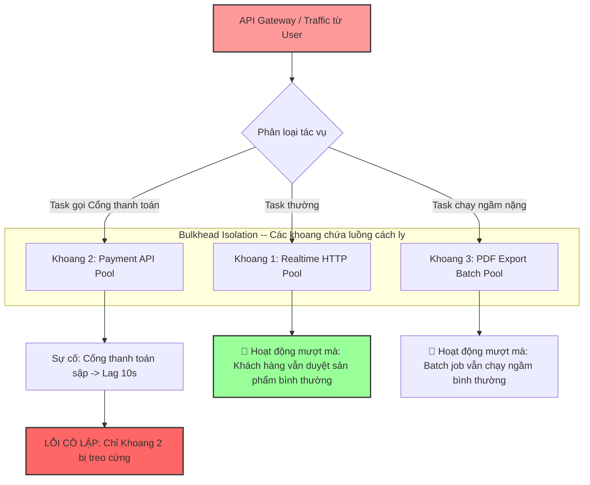

# Khi nào nên tách thread pool cho các loại workload khác nhau?

## ⚡ Tóm tắt ngắn (30s)
* **Bản chất**: Hoạt động phân tách Thread Pool thực chất là việc áp dụng mẫu thiết kế **Chốt chặn cách ly (Bulkhead Pattern)** trong kiến trúc hệ thống đa luồng. Bằng cách chia tách các loại công việc có đặc tính tiêu thụ tài nguyên khác nhau (CPU-bound vs I/O-bound, API Realtime vs Batch Job) vào các Thread Pool độc lập, ta ngăn chặn hoàn toàn việc một lỗi nghẽn ở tác vụ phụ làm cạn kiệt luồng và kéo sập toàn bộ các luồng dịch vụ chính.
* **Các thảm họa thực chiến được giải quyết**:
    1. **Thảm họa "Sập đổ dây chuyền" (Blast Radius Spillover)**: Sử dụng chung 1 Thread Pool duy nhất cho toàn bộ hệ thống. Khi API gửi SMS/Email của đối tác thứ ba bị lag 10 giây, toàn bộ luồng trong pool bị chiếm dụng để chờ SMS. Hệ thống lập tức cạn kiệt luồng, khiến các tính năng sống còn khác như Đăng nhập, Thanh toán, Xem giỏ hàng bị treo cứng theo dù cơ sở dữ liệu và app hoàn toàn khỏe mạnh.
* **Quyết định Senior**: Quy hoạch tách biệt 3 loại Thread Pool chuyên dụng:
    1. **I/O-Bound Pool**: Số lượng thread lớn, hàng đợi ngắn để gọi DB, HTTP API, ghi đĩa.
    2. **CPU-Bound Pool**: Số lượng thread cực nhỏ (gần bằng số nhân CPU) để thực hiện tính toán mật mã, mã hóa JWT, parse file XML lớn.
    3. **Bulkhead Pools riêng biệt**: Tạo pool riêng cho từng đối tác API ngoài nguy hiểm (như cổng thanh toán) để khoanh vùng thiệt hại khi đối tác gặp sự cố.

---

## 🔍 Chi tiết bản chất thực chiến: Tại sao và Khi nào phải chia tách Thread Pool?

Senior Engineer thiết kế hệ thống có tính chịu lỗi cao (Resilience) bằng cách phân loại workload và cô lập luồng chặt chẽ.

### 1. Phân loại 2 nhóm Workload cơ bản (CPU-bound vs I/O-bound)
* **CPU-Bound (Nghẽn tính toán)**:
  * *Đặc trưng*: Luồng liên tục sử dụng CPU core để thực thi phép tính (mã hóa password BCrypt, nén zip, parse JSON siêu lớn, xử lý ảnh).
  * *Quy hoạch*: Số lượng luồng tối ưu là $\text{Số CPU Cores} + 1$. Việc tạo quá nhiều thread ở đây là vô nghĩa và gây phản tác dụng do OS phải chuyển đổi ngữ cảnh luồng liên tục làm hao phí tài nguyên.
* **I/O-Bound (Nghẽn thiết bị)**:
  * *Đặc trưng*: Luồng dành $95\%$ thời gian để chờ đợi thiết bị phần cứng phản hồi (chờ kết quả SQL từ DB, chờ HTTP response từ mạng, chờ đọc đĩa). Luồng không dùng CPU trong lúc ngủ.
  * *Quy hoạch*: Số lượng luồng có thể cấu hình rất lớn (ví dụ: $50$, $100$ hoặc $200$ threads) để tăng throughput xử lý song song.

### 2. Thiết lập vách ngăn Bulkhead cách ly rủi ro
* **Nguyên lý Bulkhead (Vách ngăn khoang tàu)**: Trên các tàu thủy lớn, thân tàu được chia thành nhiều khoang độc lập. Nếu khoang số 3 bị thủng và ngập nước, nước sẽ bị cô lập hoàn toàn ở khoang đó, tàu vẫn nổi bình thường.
* **Áp dụng vào luồng**: Tạo một Thread Pool riêng có tên `payment-gateway-pool` (kích thước giới hạn, ví dụ: 10 threads) chỉ để gọi API thanh toán. Nếu cổng thanh toán sập làm nghẽn 10 threads này, thì $190$ threads còn lại trong pool chính `tomcat-http-pool` vẫn xử lý các request khác của khách hàng bình thường.

### 3. Ngăn ngừa Starvation do Batch Jobs
* Các tác vụ chạy nền (như quét cron job xuất hóa đơn PDF lúc nửa đêm) tốn hàng phút để thực hiện. Nếu chạy chung pool với API Realtime, các batch job này sẽ nuốt trọn các luồng rảnh rỗi, đẩy các request thanh toán tức thời của user vào hàng đợi nằm chờ vĩnh viễn (Thread Starvation).

---

## 🎨 Sơ đồ trực quan (Mẫu Bulkhead Pattern cách ly Thread Pool an toàn)



---

## 💻 Code thực chiến / Cấu hình thực tế: BAD vs GOOD

### ❌ BAD: Dùng chung 1 Thread Pool duy nhất cho mọi loại tác vụ bất đồng bộ
Sử dụng chung một executor cho cả tác vụ gọi API thanh toán ngoài (chậm, rủi ro) lẫn tác vụ tính toán thông số nội bộ (nhanh, quan trọng). Một sự cố nghẽn ở API ngoài sẽ lập tức làm sập toàn bộ ứng dụng.

```java
import java.util.concurrent.*;
import org.springframework.stereotype.Service;

@Service
public class BadSharedExecutorService {

    // ❌ TỒI: Một Thread Pool dùng chung cho toàn bộ ứng dụng
    private final ExecutorService sharedPool = Executors.newFixedThreadPool(50);

    public void processUserRequest(String userId) {
        // Tác vụ 1: Tính toán báo cáo cho User (CPU-bound nhanh)
        sharedPool.submit(() -> calculateUserReport(userId));

        // Tác vụ 2: Gọi API cổng thanh toán bên thứ ba (I/O-bound chậm, rủi ro)
        // ❌ HẬU QUẢ: Nếu đối tác sập, 50 luồng trong pool chung sẽ bị chiếm đóng sạch để chờ.
        // Tác vụ tính toán báo cáo 1 dù chạy rất nhanh cũng bị treo xếp hàng vĩnh viễn ở queue.
        sharedPool.submit(() -> callExternalPaymentGateway(userId));
    }

    private void calculateUserReport(String userId) {}
    private void callExternalPaymentGateway(String userId) {}
}
```

---

### ✅ GOOD: Triển khai nhiều Thread Pool cách ly độc lập theo đặc tính tác vụ
Senior Engineer phân chia rạch ròi các Executor Service chuyên dụng, gán tên luồng tường minh và cấu hình thông số tối ưu cho từng loại workload.

```java
import java.util.concurrent.*;
import org.springframework.context.annotation.Bean;
import org.springframework.context.annotation.Configuration;
import org.springframework.scheduling.concurrent.ThreadPoolTaskExecutor;

@Configuration
public class ThreadPoolBulkheadConfig {

    // ✅ TỐT 1: Pool chuyên dụng xử lý CPU-bound (Mã hóa, tính toán dữ liệu)
    // Cực kỳ ít thread để tránh chuyển ngữ cảnh luồng, hàng đợi trung bình
    @Bean(name = "cpuBoundExecutor")
    public Executor cpuBoundExecutor() {
        int cores = Runtime.getRuntime().availableProcessors();
        ThreadPoolTaskExecutor executor = new ThreadPoolTaskExecutor();
        executor.setCorePoolSize(cores);             // Kích thước tối ưu bằng số nhân CPU
        executor.setMaxPoolSize(cores + 1);
        executor.setQueueCapacity(500);
        executor.setThreadNamePrefix("cpu-task-");
        executor.setRejectedExecutionHandler(new ThreadPoolExecutor.CallerRunsPolicy());
        executor.initialize();
        return executor;
    }

    // ✅ TỐT 2: Pool chuyên dụng xử lý I/O-bound (Gọi DB, Ghi log, Task ngầm thường)
    // Số luồng lớn để tăng khả năng xử lý song song khi chờ đợi
    @Bean(name = "ioBoundExecutor")
    public Executor ioBoundExecutor() {
        ThreadPoolTaskExecutor executor = new ThreadPoolTaskExecutor();
        executor.setCorePoolSize(30);
        executor.setMaxPoolSize(100);
        executor.setQueueCapacity(2000);
        executor.setThreadNamePrefix("io-task-");
        executor.setRejectedExecutionHandler(new ThreadPoolExecutor.CallerRunsPolicy());
        executor.initialize();
        return executor;
    }

    // ✅ TỐT 3: Khoang cách ly Bulkhead chuyên biệt gọi API Cổng thanh toán đối tác
    // Giới hạn tối đa 10 thread để khoanh vùng thiệt hại khi đối tác sập
    @Bean(name = "paymentBulkheadExecutor")
    public Executor paymentBulkheadExecutor() {
        ThreadPoolTaskExecutor executor = new ThreadPoolTaskExecutor();
        executor.setCorePoolSize(5);
        executor.setMaxPoolSize(10); // Không cho vượt quá 10 luồng bị block
        executor.setQueueCapacity(100);
        executor.setThreadNamePrefix("payment-bulkhead-");
        // Khi đầy, ném lỗi ngay để báo lỗi nhanh (Fail-fast), không block luồng gọi Tomcat
        executor.setRejectedExecutionHandler(new ThreadPoolExecutor.AbortPolicy());
        executor.initialize();
        return executor;
    }
}
```

* **Sử dụng trong Service**:
```java
import org.springframework.beans.factory.annotation.Autowired;
import org.springframework.beans.factory.annotation.Qualifier;
import org.springframework.scheduling.annotation.Async;
import org.springframework.stereotype.Service;
import java.util.concurrent.Executor;

@Service
public class SafeOrderService {

    @Async("cpuBoundExecutor") // ✅ Chạy trên khoang tính toán CPU
    public void generateReportAsync(String userId) {
        // Logic tính toán toán học
    }

    @Async("paymentBulkheadExecutor") // ✅ Cô lập hoàn toàn trên khoang thanh toán
    public void processPaymentWithPartner(String userId) {
        // Logic gọi API thanh toán đối tác bị chậm
    }
}
```

---

## 📊 Bảng so sánh 3 cấu hình Thread Pool chuyên dụng trong hệ thống

| Đặc tính cấu hình | CPU-Bound Pool | I/O-Bound Pool | Bulkhead Partner Pool |
| :--- | :--- | :--- | :--- |
| **Kích thước luồng tối ưu** | Cực nhỏ ($\approx \text{Số nhân CPU}$). | Rất lớn (từ $30$ đến hàng trăm luồng). | Giới hạn nhỏ nghiêm ngặt (ví dụ: $5 - 15$ luồng). |
| **Dung lượng hàng đợi** | Trung bình ($100 - 500$). | Lớn ($1000 - 5000$). | Rất ngắn ($50 - 100$). |
| **Chính sách từ chối phù hợp**| `CallerRunsPolicy` (để tự hãm tốc độ). | `CallerRunsPolicy` / Dynamic tuning. | `AbortPolicy` (để báo lỗi nhanh Fail-fast cho khách hàng). |
| **Tránh rủi ro** | Tránh lãng phí bộ nhớ và chi phí context switch vô ích. | Tránh cạn kiệt luồng khi DB bị khóa hoặc I/O chậm. | Tránh việc đối tác sập làm tê liệt sập đổ dây chuyền hệ thống chính. |

---

## ⚠️ Common Gotchas & Questions follow-up

### 1. Cạm bẫy "Bỏ quên Database Connection Pool khi nâng kích thước I/O Thread Pool"
* **Vấn đề nguy hiểm**: Khi cấu hình I/O Thread Pool tăng từ 50 lên 200 để xử lý gọi nhiều tác vụ DB song song. Nhiều kỹ sư quên mất rằng Database Connection Pool (HikariCP) mặc định chỉ có kích thước **10 connections**.
* **Hậu quả**: 200 luồng I/O đồng loạt thức dậy và tranh chấp 10 kết nối DB. 190 luồng sẽ lập tức rơi vào trạng thái `WAITING` đứng xếp hàng chờ connection vĩnh viễn, làm nghẽn toàn bộ luồng I/O mà throughput hệ thống không hề tăng lên.
* **Khắc phục**: Khi tăng kích thước Thread Pool phục vụ tác vụ DB, bắt buộc phải nâng kích thước Connection Pool tương xứng hoặc cấu hình tối ưu hóa hàng đợi chờ kết nối.

### 2. Câu hỏi đào sâu từ interviewer

* **Q1: Làm sao bạn triển khai mẫu thiết kế Bulkhead cách ly Thread Pool bằng thư viện Resilience4j trong dự án Spring Boot?**
  * *Trả lời*: 
    * Thư viện **Resilience4j** cung cấp sẵn tính năng **Bulkhead** với 2 cơ chế cấu hình:
      1. **Semaphore Bulkhead**: Giới hạn số lượng luồng đồng thời (Concurrent Executions) chạy vào một phương thức mà không tạo thêm Thread Pool mới. Rất thích hợp cho các tác vụ non-blocking.
      2. **ThreadPool Bulkhead**: Sử dụng một hàng đợi có giới hạn kích thước và một Thread Pool chuyên biệt tách rời để thực thi tác vụ.
    * Tôi cấu hình trong file `application.yml` của Spring Boot:
      ```yaml
      resilience4j.threadpoolbulkhead:
        instances:
          paymentService:
            max-thread-pool-size: 10
            core-thread-pool-size: 5
            queue-capacity: 50
      ```
    * Sau đó, chỉ cần đánh dấu annotation `@Bulkhead(name = "paymentService", type = Bulkhead.Type.THREADPOOL)` trên phương thức cần bảo vệ.

* **Q2: Khi chuyển đổi công việc qua lại giữa các Thread Pool độc lập khác nhau, làm sao bạn đảm bảo tính liên tục của dữ liệu bảo mật (như JWT Token, Tenant ID, Correlation ID) đang lưu trữ trong ThreadLocal không bị biến mất?**
  * *Trả lời*: 
    * Đây là một thử thách lớn vì `ThreadLocal` mặc định được gắn chặt với luồng hiện tại. Khi ta chuyển tiếp task sang một Thread Pool khác (ví dụ: gọi Async), luồng mới sẽ không thể đọc được dữ liệu `ThreadLocal` của luồng cũ.
    * **Giải pháp**:
      1. Sử dụng **`InheritableThreadLocal`**: Cho phép luồng con tự động sao chép toàn bộ dữ liệu ThreadLocal từ luồng cha tại thời điểm tạo luồng con.
      2. **Giải pháp tối ưu cho Thread Pool (TaskDecorator)**: Khi dùng Spring `ThreadPoolTaskExecutor`, tôi đăng ký một **`TaskDecorator`** tùy biến. Lớp decorator này chịu trách nhiệm sao chép (copy) các giá trị context (như `SecurityContextHolder` của Spring Security hoặc `MDC` của Logback) từ luồng chính, nạp vào luồng phụ trước khi task thực thi, và bắt buộc phải dọn dẹp (`clear`) ở khối `finally` sau khi chạy xong để tránh rò rỉ dữ liệu.
