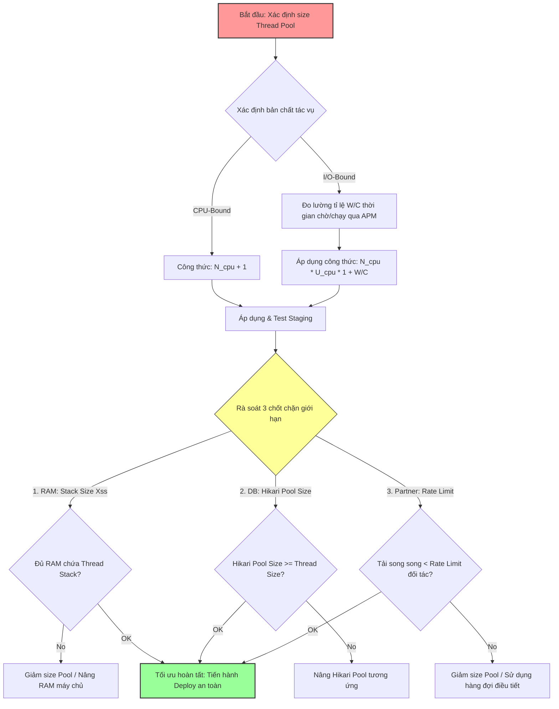

# Làm sao chọn size thread pool phù hợp?

## ⚡ Tóm tắt ngắn (30s)
* **Bản chất**: Hoạt động cấu hình kích thước nhóm luồng (Thread Pool Sizing) thực chất là bài toán **Tối ưu hóa tài nguyên phần cứng có giới hạn**. Không có một con số cấu hình "vạn năng" cho mọi hệ thống. Một Thread Pool quá nhỏ sẽ gây ứ đọng tác vụ ở hàng đợi (tăng Latency); trong khi một Thread Pool quá lớn sẽ băm nát CPU hệ thống do chi phí chuyển ngữ cảnh luồng (Context Switching) và nuốt trọn bộ nhớ RAM dành cho vùng nhớ Stack của luồng.
* **Các thảm họa thực chiến được giải quyết**:
    1. **Thảm họa sập RAM vật lý (OutOfMemoryError)**: Cấu hình bừa bãi một Thread Pool có `maxPoolSize = 2000` trên một máy chủ cấu hình yếu (2GB RAM). Mặc định, JVM cấp phát khoảng **1MB RAM** cho mỗi luồng làm Stack Memory (`-Xss1m`). Khi pool đạt ngưỡng cực đại, hệ thống lập tức sập nguồn do nuốt trọn 2GB RAM chỉ để duy trì bộ nhớ luồng rỗng mà chưa kịp chạy code.
* **Quyết định Senior**: Áp dụng công thức khoa học kết hợp kiểm thử tải thực tế:
    1. **Với CPU-bound**: Cấu hình $\text{Số Threads} = \text{Số nhân CPU} + 1$.
    2. **Với I/O-bound**: Áp dụng công thức kinh điển của Brian Goetz:
       $$\text{Số Threads} = \text{Số nhân CPU} \times \text{Hiệu suất CPU mong muốn} \times \left(1 + \frac{\text{Thời gian chờ I/O}}{\text{Thời gian xử lý CPU}}\right)$$
    3. **Kiểm thử thực tế**: Chạy Stress Test (k6/JMeter) ở Staging để tìm "điểm bão hòa" (Sweet Spot) thông qua việc giám sát p99 Latency và CPU máy chủ.

---

## 🔍 Chi tiết bản chất thực chiến: Công thức & Giới hạn vật lý khi cấu hình Thread Pool

Senior Engineer tính toán Thread Pool bằng tư duy khoa học máy tính, bám sát các giới hạn tài nguyên vật lý của máy chủ.

### 1. Công thức Toán học Định hình Kích thước Luồng
* **Kịch bản CPU-Bound (Nghẽn tính toán)**:
  * Do luồng chạy liên tục không nghỉ, việc tạo nhiều luồng hơn số nhân CPU vật lý chỉ làm CPU mất thời gian chuyển đổi luồng. Ta chỉ cộng thêm $1$ luồng dự phòng (để xử lý khi có 1 luồng bị lỗi trang - Page Fault):
    $$N_{threads} = N_{cpu} + 1$$
* **Kịch bản I/O-Bound (Nghẽn thiết bị - DB/API ngoài)**:
  * Áp dụng công thức thực chiến:
    $$N_{threads} = N_{cpu} \times U_{cpu} \times \left(1 + \frac{W}{C}\right)$$
  * *Trong đó*:
    * $N_{cpu}$: Số lượng nhân CPU được cấp phát cho Container (ví dụ: Kubernetes limits).
    * $U_{cpu}$: Hiệu suất CPU mong muốn ($0 \le U_{cpu} \le 1$, thông thường chọn $0.8$ để dự phòng $20\%$ cho tác vụ hệ điều hành).
    * $W$ (Wait Time): Thời gian luồng phải ngủ chờ I/O (ví dụ: gọi DB mất 190ms).
    * $C$ (Compute Time): Thời gian luồng thực sự tính toán bằng CPU (ví dụ: xử lý JSON mất 10ms).
  * *Tính toán ví dụ*: Hệ thống chạy trên Container 4 nhân CPU. Tác vụ có $W = 190ms$ và $C = 10ms \implies \frac{W}{C} = 19$. 
    $$N_{threads} = 4 \times 0.8 \times (1 + 19) = 64 \text{ threads}$$

---

### 2. Các chốt chặn giới hạn vật lý bắt buộc phải rà soát
Senior không bao giờ tăng kích thước pool vô hạn mà luôn kiểm tra 3 chốt chặn:
1. **Giới hạn bộ nhớ Stack (`-Xss`)**:
   * Mỗi luồng Java được cấp phát 1 bộ nhớ Stack riêng (mặc định 1MB). Nếu ta tạo 1000 luồng, hệ thống lập tức tiêu tốn **1GB RAM** cứng chỉ để giữ chân các luồng, đe dọa trực tiếp đến dung lượng Heap còn lại của JVM.
2. **Giới hạn Database Connection Pool (HikariCP)**:
   * Nếu ta cấu hình Thread Pool có 200 luồng gọi DB song song, nhưng database pool chỉ có 10 kết nối, thì 190 luồng còn lại sẽ bị nghẽn `BLOCKED` vô ích để xếp hàng chờ lấy connection DB.
3. **Giới hạn Rate Limit của Đối tác**:
   * Tách thread pool gọi sang đối tác quá lớn (ví dụ: 500 threads) có thể khiến hệ thống của đối tác bị quá tải, đối tác lập tức trả về lỗi `429 Too Many Requests` hoặc chặn (block) IP của ta.

---

## 🎨 Sơ đồ trực quan (Quy trình xác định kích thước Thread Pool thực chiến)



---

## 💻 Code thực chiến / Cấu hình thực tế: BAD vs GOOD

### ❌ BAD: Khởi tạo Thread Pool với kích thước tĩnh khổng lồ không căn cứ
Khởi tạo cứng 500 hoặc 1000 luồng cho các tác vụ tính toán mà không quan tâm tới số nhân CPU thực tế của máy chủ và sử dụng hàng đợi không giới hạn.

```java
import java.util.concurrent.*;

public class BadPoolSizing {

    public static ExecutorService createArbitraryPool() {
        // ❌ TỒI: Con số 500 được chọn bừa bãi không dựa trên cơ sở phần cứng.
        // Trên server production 2 cores, việc tạo 500 luồng chạy tính toán
        // sẽ hủy diệt CPU hệ thống do chi phí Context Switching cực lớn.
        // Dùng LinkedBlockingQueue rỗng đe dọa OOM.
        return new ThreadPoolExecutor(
                500, 
                500, 
                0L, TimeUnit.MILLISECONDS,
                new LinkedBlockingQueue<Runnable>() 
        );
    }
}
```

---

### ✅ GOOD: Cấu hình Thread Pool động theo số nhân CPU và có chốt chặn an toàn
Senior Engineer viết code lấy trực tiếp số lượng nhân CPU runtime thực tế của môi trường (K8s pod / server vật lý) để tính toán tự động kích thước luồng tối ưu.

```java
import java.util.concurrent.*;
import lombok.extern.slf4j.Slf4j;

@Slf4j
public class OptimizedPoolSizing {

    public static ExecutorService createDynamicIoPool() {
        // ✅ TỐT: Lấy trực tiếp số nhân CPU được cấp phát thực tế lúc runtime
        int cpuCores = Runtime.getRuntime().availableProcessors();
        log.info("Khởi động hệ thống với số nhân CPU phát hiện: {}", cpuCores);

        // ✅ TỐT: Giả định qua APM đo được:
        // Thời gian gọi API/DB (Wait Time W) = 150ms
        // Thời gian xử lý logic (Compute Time C) = 10ms
        // Tỉ lệ W/C = 15. Mong muốn hiệu suất CPU đạt 80% (0.8)
        double targetCpuUtilization = 0.8;
        double waitToComputeRatio = 15.0;

        int optimalThreads = (int) (cpuCores * targetCpuUtilization * (1 + waitToComputeRatio));
        
        // Đặt ngưỡng tối thiểu để đảm bảo luôn hoạt động tốt trên các máy chủ phát triển local yếu
        int corePoolSize = Math.max(10, optimalThreads); 
        int maxPoolSize = corePoolSize * 2;

        log.info("Cấu hình tối ưu Thread Pool: Core Size = {}, Max Size = {}", corePoolSize, maxPoolSize);

        // Bounded Queue giới hạn dung lượng bảo vệ RAM
        BlockingQueue<Runnable> queue = new ArrayBlockingQueue<>(1000);

        return new ThreadPoolExecutor(
                corePoolSize,
                maxPoolSize,
                60L, TimeUnit.SECONDS,
                queue,
                new ThreadPoolExecutor.CallerRunsPolicy() // Backpressure bảo vệ hệ thống
        );
    }
}
```

---

## 📊 Bảng so sánh Đặc trưng cấu hình Thread Pool theo Workload

| Đặc trưng | CPU-Bound Pool | I/O-Bound Pool | Virtual Threads (Java 21) |
| :--- | :--- | :--- | :--- |
| **Số lượng luồng tối ưu** | Rất nhỏ ($\approx \text{Số nhân CPU}$). | Lớn (theo công thức Goetz). | **Không giới hạn** (Có thể tạo hàng triệu luồng ảo thoải mái). |
| **Chi phí luồng Stack (RAM)** | Thấp (Do số luồng ít). | Trung bình - Cao (1MB cho mỗi luồng OS). | **Cực thấp** (Chỉ tốn vài trăm byte cho mỗi luồng ảo). |
| **Context Switching Cost** | Thấp (Được tối ưu hóa tối đa). | Cao (Hệ điều hành liên tục hoán đổi luồng do I/O). | Cực thấp (Việc chuyển đổi luồng ảo do JVM quản lý ở User Space). |
| **Mức tiêu thụ CPU tối đa** | $100\%$ công suất hiệu năng thực tế. | Thấp đến Trung bình (CPU rảnh rỗi nhiều). | Cực cao và tối ưu hóa cực hạn. |

---

## ⚠️ Common Gotchas & Questions follow-up

### 1. Cạm bẫy "Lỗi ảo hóa CPU nhân trên môi trường Docker/Kubernetes"
* **Vấn đề chí mạng**: Hàm `Runtime.getRuntime().availableProcessors()` trong các phiên bản Java cũ (trước Java 8u191 hoặc Java 10) **không thể nhận biết được giới hạn CPU của Docker/Kubernetes container** (CPU limits). Nó luôn trả về số lượng CPU của máy chủ vật lý (Host Machine, ví dụ: 64 cores), trong khi container của ta thực tế chỉ được giới hạn `limit: 2 cores`.
* **Hậu quả**: Java khởi tạo Thread Pool dựa trên con số 64 cores vật lý, tạo ra hàng trăm luồng song song trên một container chỉ có 2 cores thực tế, làm nát CPU hệ thống do Context Switching và gây sập pod liên tục do vượt quá ngưỡng tài nguyên.
* **Khắc phục**: Luôn sử dụng phiên bản Java hiện đại (Java 11 hoặc Java 17/21 trở lên) đã được tích hợp sẵn tính năng tương thích container (Container Awareness), giúp JVM đọc chính xác cấu hình CPU limit từ `cgroups` của Linux.

### 2. Câu hỏi đào sâu từ interviewer

* **Q1: Sự ra đời của Virtual Threads (Luồng ảo) trong Java 21 thay đổi hoàn toàn tư duy thiết kế cấu hình Thread Pool như thế nào?**
  * *Trả lời*: Đây là cuộc cách mạng lớn nhất của Java:
    1. **Tư duy truyền thống (Platform Threads)**: Luồng Java tỉ lệ $1:1$ với luồng OS. Tạo luồng cực kỳ đắt đỏ, bắt buộc phải dùng **Thread Pool** để tái sử dụng luồng nhằm tiết kiệm tài nguyên.
    2. **Tư duy Java 21 (Virtual Threads)**: Luồng ảo chạy ở User Space do JVM quản lý. Tạo luồng ảo siêu nhẹ (chỉ mất vài trăm byte và mất vài nano-giây).
    * *Thay đổi cốt lõi*: **Tuyệt đối không bao giờ được tạo Thread Pool cho Virtual Threads**. Việc pool hóa luồng ảo là một phản thiết kế (Anti-pattern). Thay vì dùng pool để giới hạn, ta tạo mới một luồng ảo hoàn toàn mới cho mỗi tác vụ bất đồng bộ (`Executors.newVirtualThreadPerTaskExecutor()`). Nếu muốn giới hạn số lượng truy cập đồng thời vào một tài nguyên (như DB), ta dùng **`Semaphore`** để chặn luồng ảo, thay vì bóp nghẹt số lượng luồng.

* **Q2: Làm sao bạn đo lường được chỉ số tỉ lệ thời gian chờ và thời gian chạy ($W/C$ ratio) của ứng dụng một cách chính xác trên Production để đưa vào công cụ tính toán size Thread Pool?**
  * *Trả lời*: Tôi dựa vào số liệu thu thập được từ các hệ thống giám sát hiệu năng ứng dụng **APM (như NewRelic, Dynatrace hoặc Datadog)**:
    1. Tôi chọn các transaction nghiệp vụ cốt lõi cần tối ưu hóa Thread Pool.
    2. APM cung cấp biểu đồ phân rã thời gian phản hồi (Response Time Breakdown):
       * Ví dụ: Tổng thời gian giao dịch trung bình là 200ms.
       * Trong đó, APM báo thời gian gọi Database (JDBC) + External API là 190ms $\implies$ Đây chính là thời gian chờ đợi I/O ($W = 190ms$).
       * Thời gian chạy code Java (Application CPU) là 10ms $\implies$ Đây chính là thời gian xử lý CPU thực tế ($C = 10ms$).
    3. Từ đó, tôi có được tỉ lệ chính xác $\frac{W}{C} = \frac{190}{10} = 15$ để áp dụng trực tiếp vào công thức tính toán.
