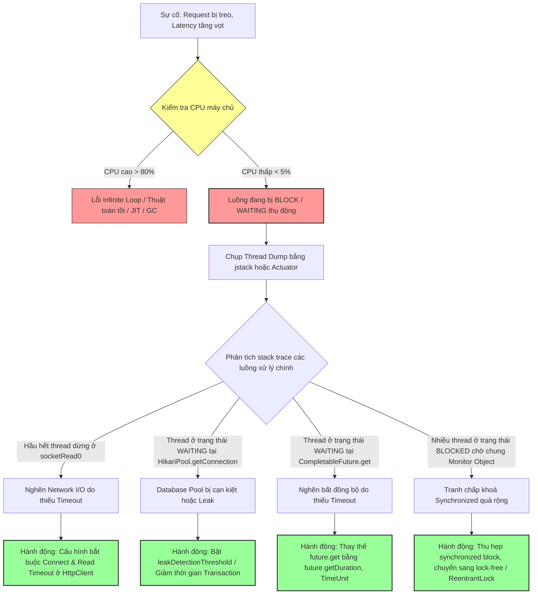

# Request bị treo nhưng CPU thấp. Bạn nghi ngờ gì?

## ⚡ Tóm tắt ngắn (30s)
* **Bản chất**: Hiện tượng request bị treo cứng (Hung/Frozen Request) nhưng CPU sử dụng cực thấp ($< 5\%$) chứng tỏ các luồng xử lý ứng dụng không thực hiện bất kỳ tính toán toán học hay logic nặng nào. Thay vào đó, chúng đang bị chuyển sang trạng thái **chờ đợi thụ động (Passive Waiting)**, bị hệ điều hành tước quyền sử dụng CPU core để đưa vào hàng đợi ngủ đông do đang đợi tài nguyên ngoài (I/O, Khóa, Connection) hoặc bị block vĩnh viễn.
* **Các thảm họa thực chiến được giải quyết**:
    1. **Thảm họa treo cứng hàng loạt (System Freeze)**: Gọi sang API của bên thứ ba (như đối tác thanh toán) mà không cấu hình Timeout. Khi đối tác gặp sự cố nghẽn mạng, luồng ứng dụng của ta sẽ đứng đợi vĩnh viễn, làm nghẽn toàn bộ Thread Pool của Web Server (Tomcat) khiến hệ thống không nhận thêm bất kỳ request nào nữa từ người dùng.
    2. **Thảm họa cạn kiệt Connection Pool**: Code bị rò rỉ kết nối cơ sở dữ liệu (Database Connection Leak) khiến connection pool (như HikariCP) trống rỗng. Các request mới đến phải xếp hàng đợi lấy kết nối vô thời hạn, làm treo toàn bộ ứng dụng trong khi CPU nhàn rỗi.
* **Quyết định Senior**: Ngay lập tức chụp **Thread Dump** trực tiếp trên server lỗi để phân tích trạng thái các luồng:
    1. Tìm các luồng ở trạng thái `WAITING` tại `Future.get()` hoặc `Object.wait()` $\implies$ Thiếu cơ chế Timeout khi xử lý bất đồng bộ.
    2. Tìm các luồng ở trạng thái `RUNNABLE` nhưng bị treo sâu ở `socketRead0` $\implies$ Nghẽn I/O mạng do thiếu HTTP Read Timeout.
    3. Tìm các luồng ở trạng thái `BLOCKED` chờ khóa màn hình $\implies$ Tranh chấp khóa dữ liệu (`synchronized`) nghiêm trọng.

---

## 🔍 Chi tiết bản chất thực chiến: Quy trình chẩn đoán 4 thủ phạm chính gây Treo luồng & CPU thấp

Khi CPU thấp và request treo, Senior Engineer loại bỏ ngay giả thuyết lỗi thuật toán nghiệp vụ (vì loop thuật toán sẽ đẩy CPU lên 100%) và tập trung điều tra 4 nhóm nguyên nhân cốt lõi sau:

### 1. Nghẽn I/O mạng (Network I/O Blocked) - Thiếu Timeout
* **Nguyên nhân**: Ứng dụng thực hiện gọi HTTP API, RPC, hoặc kết nối tới Mail Server, SFTP Server mà không đặt giới hạn thời gian kết nối (**Connect Timeout**) và thời gian đọc dữ liệu (**Read Timeout**).
* **Dấu vết trên Thread Dump**: Các thread của Tomcat/Undertow nằm ở trạng thái `RUNNABLE` hoặc `TIMED_WAITING` nhưng stack trace chỉ vào sâu trong tầng socket socket hệ điều hành:
  `at java.net.SocketInputStream.socketRead0(Native Method)`
  `at java.net.SocketInputStream.read(SocketInputStream.java:210)`
  `at sun.security.ssl.InputRecord.readFully(InputRecord.java:465)`

### 2. Cạn kiệt Database Connection Pool (HikariCP Starvation)
* **Nguyên nhân**: Ứng dụng bị rò rỉ connection (ví dụ: mở transaction nhưng không đóng do xử lý exception tồi, hoặc chạy tác vụ I/O quá lâu bên trong một transaction `@Transactional`). Khi pool sạch bóng kết nối, luồng tiếp theo gọi tới DB bắt buộc phải xếp hàng chờ đợi vô thời hạn.
* **Dấu vết trên Thread Dump**: Các luồng ứng dụng ở trạng thái `WAITING` hoặc `TIMED_WAITING` tại vị trí lấy connection của thư viện pool:
  `at com.zaxxer.hikari.pool.HikariPool.getConnection(HikariPool.java:169)`
  `at com.zaxxer.hikari.pool.HikariPool.getConnection(HikariPool.java:148)`

### 3. Treo luồng do Future.get() không có Timeout
* **Nguyên nhân**: Sử dụng lập trình bất đồng bộ (`CompletableFuture`, `ExecutorService`) nhưng khi gom dữ liệu lại gọi hàm chặn luồng `.get()` không có tham số thời gian chờ.
* **Dấu vết trên Thread Dump**: 
  `at java.util.concurrent.CompletableFuture.reportGet(CompletableFuture.java:357)`
  `at java.util.concurrent.CompletableFuture.get(CompletableFuture.java:1895)`

### 4. Tranh chấp khóa màn hình (High Lock Contention / Deadlock)
* **Nguyên nhân**: Sử dụng khối `synchronized` hoặc `ReentrantLock` quá rộng bọc quanh các tác vụ I/O, khiến một luồng giữ khóa cực lâu và block hàng trăm luồng xếp hàng phía sau.
* **Dấu vết trên Thread Dump**: Rất nhiều thread ở trạng thái `BLOCKED` cùng chờ một khóa:
  `- waiting to lock <0x000000078b543ab8> (a java.lang.Object)`

---

## 🎨 Sơ đồ trực quan (Quy trình chẩn đoán Request treo - CPU thấp)



---

## 💻 Code thực chiến / Cấu hình thực tế: BAD vs GOOD

### ❌ BAD: Gọi HTTP API bên ngoài và gọi Task bất đồng bộ thiếu Timeout
HttpClient mặc định của Java (`HttpURLConnection`) hoặc một số thư viện HttpClient cũ có cấu hình timeout mặc định là vô hạn (`infinite`). Gọi `.get()` vô hạn trên Future khiến luồng chính bị treo cứng vĩnh viễn nếu task con gặp lỗi nghẽn.

```java
import java.io.InputStream;
import java.net.HttpURLConnection;
import java.net.URL;
import java.util.concurrent.*;

public class BadHttpClientAndFuture {

    public void callPartnerAPI() throws Exception {
        URL url = new URL("https://api.partner.com/checkout");
        HttpURLConnection connection = (HttpURLConnection) url.openConnection();
        
        // ❌ TỒI: Không cấu hình ConnectTimeout và ReadTimeout. 
        // Nếu đối tác bị lag mạng, luồng hiện tại sẽ bị block vĩnh viễn ở InputStream.read()
        InputStream responseStream = connection.getInputStream();
        // Xử lý stream...
    }

    public void processAsyncTasks() throws Exception {
        ExecutorService executor = Executors.newFixedThreadPool(2);
        Future<String> future = executor.submit(() -> {
            Thread.sleep(100000); // Tác vụ nặng
            return "DONE";
        });

        // ❌ TỒI: Gọi get() không truyền thời gian chờ. 
        // Luồng chính sẽ bị treo vĩnh viễn nếu task con bị deadlock hoặc chạy vô tận
        String result = future.get(); 
    }
}
```

---

### ✅ GOOD: Cấu hình HttpClient, HikariCP và Future chặt chẽ với cơ chế Timeout
Luôn quy định thời hạn rõ ràng (Fast-fail principle) cho mọi điểm giao tiếp I/O và bất đồng bộ để giải phóng tài nguyên luồng ngay lập tức khi xảy ra sự cố.

```java
import java.net.URI;
import java.net.http.HttpClient;
import java.net.http.HttpRequest;
import java.net.http.HttpResponse;
import java.time.Duration;
import java.util.concurrent.*;
import lombok.extern.slf4j.Slf4j;

@Slf4j
public class OptimizedTimeoutConfig {

    // ✅ TỐT: Khởi tạo HttpClient với Connect Timeout chặt chẽ
    private static final HttpClient httpClient = HttpClient.newBuilder()
            .connectTimeout(Duration.ofSeconds(3)) // Giới hạn 3 giây để thiết lập kết nối socket
            .build();

    public void callPartnerAPISafely() {
        try {
            HttpRequest request = HttpRequest.newBuilder()
                    .uri(URI.create("https://api.partner.com/checkout"))
                    .timeout(Duration.ofSeconds(5)) // ✅ TỐT: Read Timeout giới hạn 5 giây nhận data
                    .POST(HttpRequest.BodyPublishers.noBody())
                    .build();

            HttpResponse<String> response = httpClient.send(request, HttpResponse.BodyHandlers.ofString());
            log.info("Kết quả: {}", response.body());
        } catch (HttpConnectTimeoutException e) {
            log.error("Kết nối thất bại (Connect Timeout) tới đối tác!");
        } catch (HttpTimeoutException e) {
            log.error("Đối tác không phản hồi dữ liệu kịp thời (Read Timeout)!");
        } catch (Exception e) {
            log.error("Lỗi hệ thống: ", e);
        }
    }

    public void processAsyncTasksSafely() {
        ExecutorService executor = Executors.newFixedThreadPool(2);
        Future<String> future = executor.submit(() -> {
            // Thực thi tác vụ bất đồng bộ
            Thread.sleep(10000);
            return "SUCCESS";
        });

        try {
            // ✅ TỐT: Luôn gọi get() với timeout tối đa chấp nhận được
            String result = future.get(3, TimeUnit.SECONDS);
            log.info("Kết quả task bất đồng bộ: {}", result);
        } catch (TimeoutException e) {
            log.error("Tác vụ bất đồng bộ bị quá thời gian chờ (TimeoutException)!");
            future.cancel(true); // Hủy bỏ task con để tiết kiệm tài nguyên
        } catch (Exception e) {
            log.error("Lỗi xử lý: ", e);
        }
    }
}
```

* **Cấu hình `application.yml` tối ưu cho HikariCP chống rò rỉ kết nối**:
```yaml
spring:
  datasource:
    hikari:
      maximum-pool-size: 50             # Số kết nối tối đa phù hợp tải
      connection-timeout: 3000          # ✅ 3 giây: Tối đa xếp hàng chờ kết nối trước khi ném lỗi (tránh treo vô tận)
      idle-timeout: 600000              # 10 phút: Thu hồi kết nối rảnh
      max-lifetime: 1800000             # 30 phút: Vòng đời tối đa một kết nối
      leak-detection-threshold: 2000    # ✅ CỰC TỐT: In log cảnh báo ngay lập tức nếu kết nối bị giữ quá 2 giây (phát hiện leak)
```

---

## 📊 Bảng so sánh đặc trưng 4 trạng thái luồng bị treo

| Đặc trưng | Treo do Network I/O | Treo do Cạn Database Pool | Treo do Future.get() | Treo do Tranh chấp Lock |
| :--- | :--- | :--- | :--- | :--- |
| **Trạng thái Thread trên OS** | Sleeping (Đợi phần cứng mạng). | Sleeping (Đợi Semaphore). | Sleeping (Đợi tín hiệu Task hoàn thành). | Waiting (Đợi CPU cấp phát để kiểm tra khóa). |
| **Trạng thái JVM Thread (`jstack`)**| `RUNNABLE` (nhưng treo ở socketRead0). | `WAITING` hoặc `TIMED_WAITING`. | `WAITING` hoặc `TIMED_WAITING`. | `BLOCKED` (chờ nhận monitor). |
| **Ảnh hưởng tài nguyên CPU** | Cực thấp ($< 1\%$). | Cực thấp ($< 1\%$). | Cực thấp ($< 1\%$). | Thấp đến Trung bình. |
| **Dấu hiệu nhận biết nhanh nhất** | Stack trace dừng tại các hàm `java.net.SocketInputStream`. | Stack trace dừng tại `HikariPool.getConnection`. | Stack trace dừng tại `CompletableFuture.get`. | Stack trace ghi rõ `waiting to lock <0x...>` |
| **Biện pháp xử lý tức thời** | Force restart pod, tăng cấu hình timeout ở API Gateway. | Force restart pod, tăng kích thước `maximum-pool-size` tạm thời. | Force restart pod. | Thực hiện Thread Dump tìm Thread đang nắm giữ khóa để vá code. |

---

## ⚠️ Common Gotchas & Questions follow-up

### 1. Cạm bẫy "RestTemplate của Spring Boot cấu hình mặc định không có Timeout"
* **Vấn đề nguy hiểm**: Khi ta khởi tạo một `RestTemplate` bằng dòng lệnh `new RestTemplate()` đơn giản, Spring sẽ sử dụng HTTP client mặc định của JDK. Cấu hình mặc định của JDK Connect Timeout và Read Timeout là **`-1` (tương đương với vô hạn - Infinite)**.
* **Hậu quả**: Chỉ cần một trong số các API bên thứ ba được gọi bởi hệ thống bị chậm, ứng dụng Spring Boot sẽ bị cạn kiệt luồng Tomcat chỉ sau vài phút do luồng bị block vĩnh viễn, làm treo cứng toàn bộ dịch vụ.
* **Giải pháp**: Luôn xây dựng một `RestTemplateBuilder` hoặc định nghĩa Bean `RestTemplate` với các thông số timeout tường minh:
  ```java
  @Bean
  public RestTemplate restTemplate(RestTemplateBuilder builder) {
      return builder
              .setConnectTimeout(Duration.ofSeconds(3))
              .setReadTimeout(Duration.ofSeconds(5))
              .build();
  }
  ```

### 2. Câu hỏi đào sâu từ interviewer

* **Q1: Sự khác nhau bản chất giữa hai trạng thái luồng `WAITING` và `BLOCKED` trên Thread Dump khi phân tích sự cố CPU thấp là gì?**
  * *Trả lời*: Đây là điểm cốt lõi để phân loại nguyên nhân:
    1. **Trạng thái `BLOCKED`**: Luồng đang đợi để đi vào một khối đồng bộ `synchronized` hoặc phương thức đồng bộ. Luồng này đã sẵn sàng chạy, nhưng JVM chặn lại vì một luồng khác đang nắm giữ khóa màn hình (Monitor Lock) của đối tượng đó.
    2. **Trạng thái `WAITING`**: Luồng chủ động đi vào trạng thái ngủ đông do gọi các hàm như `Object.wait()`, `Thread.join()` hoặc `LockSupport.park()`. Luồng WAITING sẽ nằm ngủ mãi mãi cho đến khi một luồng khác thực hiện hành động đánh thức nó một cách chủ động (gọi `Object.notify()` hoặc `LockSupport.unpark()`).
    * *Ý nghĩa chẩn đoán*: Số lượng luồng `BLOCKED` cao chứng tỏ tranh chấp code đồng bộ quá mức; số lượng luồng `WAITING` cao chứng tỏ luồng đang đợi phản hồi bất đồng bộ, đợi kết nối DB hoặc đợi tài nguyên mạng không có timeout đánh thức.

* **Q2: Làm sao bạn phát hiện và điều tra được Database Connection Leak (rò rỉ kết nối) đang âm thầm làm treo luồng trên Production bằng HikariCP?**
  * *Trả lời*: Khi gặp hiện tượng treo luồng tại `HikariPool.getConnection`, tôi thực hiện các bước sau:
    1. **Bật Leak Detection của HikariCP**: Tôi cấu hình thuộc tính `leak-detection-threshold` lên 2000 ms (2 giây). Đây là vũ khí mạnh nhất của Hikari. Nếu bất kỳ phương thức nào mượn kết nối từ pool mà không trả lại sau 2 giây, HikariCP sẽ tự động chụp lại Stack Trace tại thời điểm mượn kết nối đó và in ra log cảnh báo lỗi `Connection leak detection triggered`. Nhờ vậy, tôi định vị được chính xác dòng code nào đã quên đóng connection.
    2. **Phân tích Transaction bọc ngoài các tác vụ I/O**: Tôi rà soát các phương thức có `@Transactional`. Nếu bên trong phương thức đó có gọi API ngoài (Http call) mất 10 giây, thì kết nối DB sẽ bị chiếm giữ liên tục trong 10 giây đó mà không được giải phóng. Tôi đề xuất tách tác vụ gọi HTTP ra ngoài phạm vi `@Transactional` để giải phóng kết nối DB về pool ngay lập tức.
