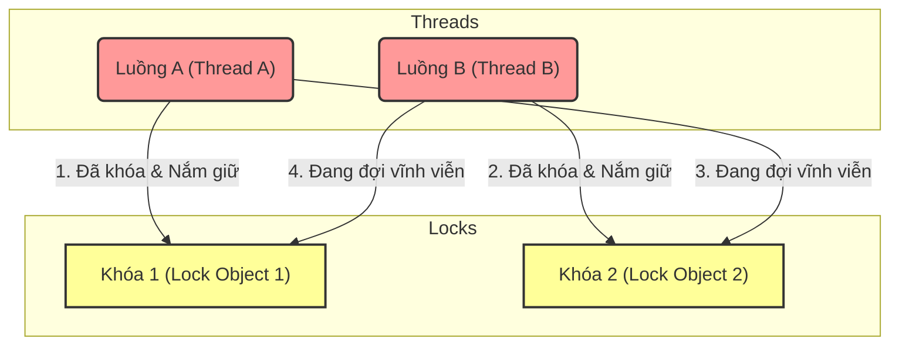

# Deadlock trong Java service phát hiện thế nào?

## ⚡ Tóm tắt ngắn (30s)
* **Bản chất**: Sự cố nghẽn khóa chéo (Deadlock) xảy ra khi hai hoặc nhiều luồng (threads) bị treo vĩnh viễn vì tranh chấp vòng tròn: Luồng A nắm giữ Khóa 1 và đợi Khóa 2, trong khi Luồng B nắm giữ Khóa 2 và đợi Khóa 1. Cả hai luồng không bao giờ tự nhả khóa hiện tại, làm hệ thống bị đóng băng một phần mà không tạo ra bất kỳ tải CPU nào.
* **Các thảm họa thực chiến được giải quyết**:
    1. **Thảm họa treo ứng dụng âm thầm (Silent Lockup)**: Hệ thống chuyển tiền giữa các tài khoản bị treo cứng khi hai giao dịch đồng thời chuyển tiền qua lại giữa Tài khoản X và Tài khoản Y. Không có bất kỳ lỗi hay Exception nào ném ra ở log mặc định, tài nguyên bộ nhớ bị khóa chặt, và khách hàng phải đợi vô hạn cho tới khi hệ thống sập timeout.
* **Quyết định Senior**: Kích hoạt bộ phát hiện tự động của JVM:
    1. Sử dụng công cụ **`jstack`** để chụp Thread Dump. Cuối file dump, JVM HotSpot luôn tự động phân tích đồ thị luồng và in ra khối thông tin chẩn đoán trực tiếp chỉ rõ chính xác luồng nào, giữ khóa nào, dòng code nào đang gây ra deadlock.
    2. Trong code, tuyệt đối thay thế khối `synchronized` truyền thống bằng **`ReentrantLock.tryLock(timeout)`** để tự động hủy yêu cầu khóa sau một khoảng thời gian chờ cố định, ngăn chặn hoàn toàn khả năng xảy ra deadlock vĩnh viễn.

---

## 🔍 Chi tiết bản chất thực chiến: Các phương pháp phát hiện Deadlock của Senior

Deadlock là một loại lỗi logic đa luồng cực kỳ nguy hiểm vì nó không làm tăng CPU, không tiêu hao RAM một cách đột biến, mà chỉ làm treo ứng dụng. Senior Engineer sử dụng 3 vũ khí chính để vạch trần Deadlock trên môi trường Production:

### 1. Phân tích Thread Dump bằng `jstack` (Vũ khí phổ biến nhất)
Khi nghi ngờ hệ thống bị deadlock, Senior chạy lệnh chụp Thread Dump trực tiếp trên máy chủ Linux:
`jstack -l <PID> > thread_dump.txt`

JVM có một bộ quét đồ thị vòng (Cycle Detection) chạy tự động khi thực hiện thread dump. Ở phần cuối cùng của file `thread_dump.txt`, ta sẽ nhìn thấy khối thông báo đặc trưng:

```text
Found one Java-level deadlock:
=============================
"Thread-A":
  waiting to lock monitor 0x000000001f37e408 (object 0x000000078b5a1200, a java.lang.Object),
  which is held by "Thread-B"
"Thread-B":
  waiting to lock monitor 0x000000001f37e5c8 (object 0x000000078b5a1210, a java.lang.Object),
  which is held by "Thread-A"

Java stack information for the threads listed above:
===================================================
"Thread-A":
    at com.company.DeadlockDemo.lambda$run$0(DeadlockDemo.java:18)
    - waiting to lock <0x000000078b5a1200> (a java.lang.Object)
    - locked <0x000000078b5a1210> (a java.lang.Object)
"Thread-B":
    at com.company.DeadlockDemo.lambda$run$1(DeadlockDemo.java:28)
    - waiting to lock <0x000000078b5a1210> (a java.lang.Object)
    - locked <0x000000078b5a1200> (a java.lang.Object)

Found 1 deadlock.
```

### 2. Phát hiện tự động bằng Lập trình (Programmatic Detection)
Senior có thể tích hợp sẵn mã nguồn tự động phát hiện deadlock chạy ngầm (Background Checker) hoặc expose qua REST Endpoint sử dụng **`ThreadMXBean`** của Java:
* Lệnh `ThreadMXBean.findDeadlockedThreads()` sử dụng thuật toán nội bộ của JVM để trả về danh sách ID của tất cả các luồng đang bị deadlock vĩnh viễn do tranh chấp Monitor Locks (`synchronized`) hoặc Synchronizers (`ReentrantLock`).

### 3. Công cụ trực quan hóa (Visual Tools)
* Trong quá trình test tải ở Staging: Sử dụng **VisualVM** hoặc **JConsole**. Các công cụ này sẽ hiển thị một tab "Threads" kèm theo một nút màu đỏ nổi bật ghi: `Deadlock Detected!` khi ứng dụng xảy ra sự cố.

---

## 🎨 Sơ đồ trực quan (Đồ thị Tranh chấp vòng tròn gây ra Deadlock)



---

## 💻 Code thực chiến / Cấu hình thực tế: BAD vs GOOD

### ❌ BAD: Viết code tranh chấp khóa chéo gây Deadlock vĩnh viễn
Dưới áp lực xử lý concurrent, việc gọi khóa lồng nhau mà không quy định thứ tự ưu tiên hoặc không cấu hình giới hạn thời gian chờ đợi sẽ tạo ra thảm họa khóa chéo khi có hai luồng gọi ngược thứ tự của nhau.

```java
public class BadTransferService {
    private final Object lockAccountA = new Object();
    private final Object lockAccountB = new Object();

    // Luồng 1 gọi hàm này để chuyển tiền từ A -> B
    public void transferFromAToB() {
        synchronized (lockAccountA) { // Nắm giữ khóa A
            System.out.println("Luồng 1: Đã khóa Account A");
            try { Thread.sleep(50); } catch (InterruptedException e) {} 
            
            synchronized (lockAccountB) { // Đợi khóa B
                System.out.println("Luồng 1: Đã khóa Account B");
            }
        }
    }

    // Luồng 2 gọi hàm này để chuyển tiền từ B -> A
    public void transferFromBToA() {
        synchronized (lockAccountB) { // Nắm giữ khóa B
            System.out.println("Luồng 2: Đã khóa Account B");
            try { Thread.sleep(50); } catch (InterruptedException e) {} 
            
            synchronized (lockAccountA) { // Đợi khóa A
                System.out.println("Luồng 2: Đã khóa Account A");
            }
        }
    }
}
```

---

### ✅ GOOD: Sử dụng ReentrantLock với cơ chế tryLock() an toàn tuyệt đối
Sử dụng `ReentrantLock` thay thế cho `synchronized`. Nhờ tính năng `tryLock(timeout)`, nếu luồng không thể lấy được khóa thứ hai trong vòng 1 giây, nó sẽ tự động giải phóng khóa thứ nhất đã lấy được trước đó để phá vỡ vòng lặp deadlock, sau đó thực hiện lại (retry).

```java
import java.util.concurrent.TimeUnit;
import java.util.concurrent.locks.ReentrantLock;
import lombok.extern.slf4j.Slf4j;

@Slf4j
public class OptimizedTransferService {
    private final ReentrantLock lockAccountA = new ReentrantLock();
    private final ReentrantLock lockAccountB = new ReentrantLock();

    public void transferFunds(ReentrantLock firstLock, ReentrantLock secondLock) {
        while (true) {
            boolean gotFirstLock = false;
            boolean gotSecondLock = false;
            try {
                // ✅ TỐT: Lấy khóa thứ nhất với timeout
                gotFirstLock = firstLock.tryLock(1000, TimeUnit.MILLISECONDS);
                if (gotFirstLock) {
                    log.info("Lấy thành công khóa thứ nhất");
                    
                    // Tránh nghẽn nhịp luồng
                    Thread.sleep(50); 
                    
                    // ✅ TỐT: Cố gắng lấy khóa thứ hai với timeout
                    gotSecondLock = secondLock.tryLock(1000, TimeUnit.MILLISECONDS);
                    if (gotSecondLock) {
                        log.info("Lấy thành công cả hai khóa! Tiến hành giao dịch...");
                        // Thực hiện logic xử lý an toàn
                        break; // Giao dịch hoàn tất, thoát vòng lặp
                    }
                }
            } catch (InterruptedException e) {
                Thread.currentThread().interrupt();
                log.error("Giao dịch bị gián đoạn");
                break;
            } finally {
                // ✅ CỰC KỲ QUAN TRỌNG: Luôn giải phóng khóa trong khối finally
                if (gotSecondLock) {
                    secondLock.unlock();
                }
                if (gotFirstLock) {
                    // Nếu không lấy được khóa 2, nhả khóa 1 để giải phóng hệ thống
                    firstLock.unlock(); 
                }
            }
            
            // Nếu thất bại trong việc lấy khóa, ngủ ngẫu nhiên một chút trước khi thử lại (Backoff)
            try {
                Thread.sleep((long) (Math.random() * 50 + 10));
            } catch (InterruptedException e) {
                Thread.currentThread().interrupt();
                break;
            }
        }
    }
}
```

---

## 📊 Bảng so sánh các giải pháp phòng tránh Deadlock trong Java

| Giải pháp | Cơ chế hoạt động | Ưu điểm | Nhược điểm |
| :--- | :--- | :--- | :--- |
| **tryLock() với Timeout** | Giới hạn thời gian đợi khóa. Nếu quá giờ tự động từ bỏ và nhả khóa cũ. | An toàn tuyệt đối, dễ dàng tích hợp xử lý lỗi hoặc cơ chế Retry. | Tăng độ phức tạp của code, bắt buộc phải giải phóng khóa cẩn thận trong `finally`. |
| **Sắp xếp thứ tự khóa cố định (Lock Ordering)** | Quy định tất cả các luồng phải lấy khóa theo một thứ tự duy nhất (ví dụ: luôn lấy khóa có ID nhỏ hơn trước). | Hiệu năng cực cao, không làm tăng overhead, giữ nguyên được khối `synchronized`. | Cực kỳ khó quản lý khi hệ thống phình to hoặc có nhiều nguồn khóa động sinh ra lúc runtime. |
| **Tránh giữ nhiều khóa đồng thời (Single Lock Rule)** | Thiết kế hệ thống sao cho một luồng tại một thời điểm chỉ được phép nắm giữ tối đa 1 khóa duy nhất. | Đơn giản về mặt kiến trúc, loại bỏ hoàn toàn khả năng xảy ra deadlock. | Không thể áp dụng cho các nghiệp vụ phức tạp đòi hỏi tính nguyên tử (atomic) trên nhiều đối tượng. |

---

## ⚠️ Common Gotchas & Questions follow-up

### 1. Cạm bẫy "Quên giải phóng khóa trong khối `finally` khi dùng ReentrantLock"
* **Vấn đề**: Đối với khối `synchronized` truyền thống, JVM sẽ tự động giải phóng khóa Monitor khi luồng đi ra khỏi block (kể cả khi ném ra Exception). Tuy nhiên, đối với `ReentrantLock`, lập trình viên phải gọi hàm `.unlock()` một cách chủ động.
* **Hậu quả**: Nếu ta gọi `lock.lock()` nhưng trong đoạn code logic xử lý phía sau bị bắn ra một `RuntimeException` (như NullPointerException) trước khi kịp gọi `lock.unlock()`, khóa đó sẽ bị giữ vĩnh viễn. Hệ thống lập tức bị treo các luồng tiếp theo mà không thể cứu vãn.
* **Khắc phục**: Luôn đặt lệnh `.unlock()` trong khối `finally` ngay lập tức sau khi lock thành công:
  ```java
  lock.lock();
  try {
      // business logic here
  } finally {
      lock.unlock();
  }
  ```

### 2. Câu hỏi đào sâu từ interviewer

* **Q1: Jstack có thể tự động phát hiện được Database Deadlock (ví dụ: hai transaction trong MySQL/PostgreSQL tự khóa chéo lẫn nhau) không? Tại sao?**
  * *Trả lời*: 
    * **Không**. `jstack` là công cụ thuộc cấp độ máy ảo JVM. Nó chỉ có thể quét và phát hiện các deadlock xảy ra giữa các luồng Java do tranh chấp tài nguyên bộ nhớ bên trong JVM (như Monitor locks, ReentrantLocks).
    * Khi xảy ra deadlock dưới Database (ví dụ: Thread A giữ lock row 1 trong MySQL và đợi lock row 2; Thread B giữ lock row 2 và đợi lock row 1), ở tầng Java, cả hai thread chỉ đơn thuần là đang bị treo chờ đợi phản hồi mạng (`socketRead0`) từ JDBC driver.
    * Để phát hiện và xử lý Database Deadlock, ta phải sử dụng công cụ giám sát của chính Database Engine (ví dụ: chạy lệnh `SHOW ENGINE INNODB STATUS` trong MySQL) hoặc cấu hình Database để tự động rollback transaction bị deadlock sau một khoảng thời gian chờ (`innodb_lock_wait_timeout`).

* **Q2: Livelock khác gì so với Deadlock? Làm sao bạn giải quyết sự cố Livelock trong ứng dụng?**
  * *Trả lời*:
    * **Sự khác biệt**: 
      * Trong **Deadlock**, các luồng bị treo cứng hoàn toàn ở trạng thái ngủ (`WAITING`/`BLOCKED`), tiêu thụ $0\%$ CPU. Chúng không thực hiện bất kỳ hành động nào nữa.
      * Trong **Livelock**, các luồng không bị treo. Chúng vẫn hoạt động, liên tục thay đổi trạng thái và cố gắng nhường nhịn nhau, nhưng không bao giờ tiến triển được công việc. Ví dụ điển hình là hai người đi đối diện nhau ở hành lang, cùng lịch sự tránh sang bên trái, rồi cùng tránh sang bên phải vĩnh viễn. Livelock có thể đẩy CPU lên cao vì các luồng vẫn đang chạy vòng lặp active.
    * **Cách giải quyết**: Để giải quyết Livelock (ví dụ khi thiết kế thuật toán tự động retry giải phóng khóa tranh chấp), ta phải đưa vào **yếu tố ngẫu nhiên (Randomized Backoff)**. Khi hai luồng tranh chấp thất bại, thay vì cùng đợi đúng 100ms rồi thử lại cùng lúc, ta bắt mỗi luồng ngủ một khoảng thời gian ngẫu nhiên (ví dụ: luồng A ngủ 92ms, luồng B ngủ 115ms). Sự lệch pha thời gian này giúp một luồng nhanh chóng lấy được tài nguyên trước và kết thúc tranh chấp.
