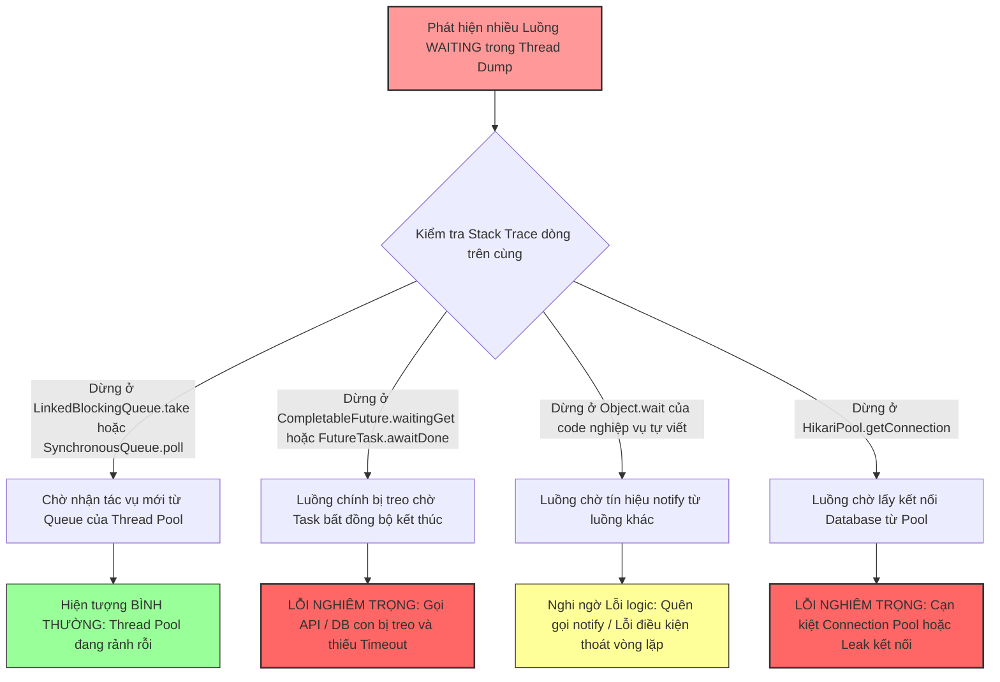

# Thread dump cho thấy nhiều thread ở trạng thái WAITING. Bạn phân tích ra sao?

## ⚡ Tóm tắt ngắn (30s)
* **Bản chất**: Trạng thái **`WAITING`** (hoặc `TIMED_WAITING`) trong Thread Dump báo hiệu luồng đang ở trạng thái ngủ động chủ động (Parked). Hệ điều hành đã rút luồng ra khỏi CPU core và không cấp phát bất kỳ tài nguyên xử lý nào cho nó. Tuy nhiên, việc có *nhiều* luồng ở trạng thái này có thể là hoàn toàn bình thường (nhóm luồng rảnh rỗi chờ việc) hoặc là một dấu hiệu sự cố nghiêm trọng (luồng bị treo vĩnh viễn chờ tín hiệu không bao giờ đến).
* **Các thảm họa thực chiến được giải quyết**:
    1. **Thảm họa "Chuẩn đoán sai" (False Alarm)**: Kỹ sư nhìn thấy hàng trăm luồng ở trạng thái `WAITING` trên APM, lập tức kết luận hệ thống bị treo lỗi nặng và tiến hành restart pod liên tục, gây gián đoạn dịch vụ vô ích, trong khi thực tế đó chỉ là hoạt động nghỉ ngơi bình thường của luồng nền Tomcat/Spring rảnh rỗi.
* **Quyết định Senior**: Phân tích sâu Stack Trace của các luồng `WAITING` để phân loại nhanh:
    1. **Bình thường (Idle Pool Threads)**: Stack trace dừng ở `ThreadPoolExecutor.getTask` và `LockSupport.park` $\implies$ Nhóm luồng rảnh rỗi của các Thread Pool (`@Async`, Tomcat, ExecutorService) đang chờ có task mới để làm. Không cần xử lý.
    2. **Bất thường (Blocked/Leaked WAITING Threads)**: Stack trace dừng ở `CompletableFuture.waitingGet`, `CountDownLatch.await`, hoặc `Object.wait()` thuộc code nghiệp vụ $\implies$ Luồng đang bị nghẽn vô hạn do gọi tác vụ bất đồng bộ thiếu Timeout, hoặc cơ chế đồng bộ luồng bị lỗi logic (quên notify). Cần vá code ngay lập tức.

---

## 🔍 Chi tiết bản chất thực chiến: Đọc vị Stack Trace của luồng ở trạng thái WAITING

Senior Engineer không đánh giá hệ thống bằng số lượng luồng `WAITING` thô sơ. Họ đọc chi tiết stack trace để hiểu luồng đang "ngủ" ở đâu và tại sao.

### 1. Kịch bản bình thường: Luồng ngủ chờ việc (Idle Thread Pool)
Đây là trạng thái tự nhiên của các Thread Pool được cấu hình sẵn để duy trì hiệu năng cao (Warm-up). Khi không có request hoặc task chạy qua, các luồng làm việc (worker threads) sẽ tự động gọi hàm `take()` trên hàng đợi công việc (`BlockingQueue`) để đi ngủ nhằm tiết kiệm CPU tối đa.

* **Dấu hiệu đặc trưng trên Thread Dump**:
```text
"order-processor-thread-3" #32 prio=5 os_prio=0 cpu=12.45ms elapsed=420s tid=0x00007f8b90123a00 nid=0x4b34 waiting on condition  [0x000070000cb45000]
   java.lang.Thread.State: WAITING (parking)
    at sun.misc.Unsafe.park(Native Method)
    - parking to wait for  <0x000000078b678220> (a java.util.concurrent.locks.AbstractQueuedSynchronizer$ConditionObject)
    at java.util.concurrent.locks.LockSupport.park(LockSupport.java:175)
    at java.util.concurrent.locks.AbstractQueuedSynchronizer$ConditionObject.await(AbstractQueuedSynchronizer.java:2039)
    at java.util.concurrent.LinkedBlockingQueue.take(LinkedBlockingQueue.java:442) // ✅ ĐANG ĐỢI TASK MỚI TỪ QUEUE
    at java.util.concurrent.ThreadPoolExecutor.getTask(ThreadPoolExecutor.java:1074)
    at java.util.concurrent.ThreadPoolExecutor.runWorker(ThreadPoolExecutor.java:1134)
    at java.util.concurrent.ThreadPoolExecutor$Worker.run(ThreadPoolExecutor.java:624)
    at java.lang.Thread.run(Thread.java:748)
```
* **Kết luận**: Đây là hiện tượng **HÀN TOÀN BÌNH THƯỜNG**. Pool hoạt động đúng thiết kế.

---

### 2. Kịch bản bất thường: Luồng bị block do bất đồng bộ thiếu Timeout (CompletableFuture.get)
Tác vụ con đẩy vào luồng phụ bị treo vĩnh viễn (do DB lock, hoặc API ngoài bị block), khiến luồng chính gọi lệnh `.get()` hoặc `.join()` bất đồng bộ bị treo cứng theo.

* **Dấu hiệu đặc trưng trên Thread Dump**:
```text
"http-nio-8080-exec-1" #45 daemon prio=5 os_prio=0 cpu=452.12ms elapsed=120s tid=0x00007f8b90554a00 nid=0x5c12 waiting on condition  [0x000070000cc56000]
   java.lang.Thread.State: WAITING (parking)
    at sun.misc.Unsafe.park(Native Method)
    - parking to wait for  <0x000000078cf982a0> (a java.util.concurrent.CompletableFuture$Signaller) // ❌ TREO CHỜ TÍN HIỆU HOÀN THÀNH
    at java.util.concurrent.locks.LockSupport.park(LockSupport.java:175)
    at java.util.concurrent.CompletableFuture$Signaller.block(CompletableFuture.java:1707)
    at java.util.concurrent.ForkJoinPool.managedBlock(ForkJoinPool.java:3824)
    at java.util.concurrent.CompletableFuture.waitingGet(CompletableFuture.java:1742)
    at java.util.concurrent.CompletableFuture.join(CompletableFuture.java:1948)
    at com.company.service.OrderService.getPaymentStatus(OrderService.java:34) // ❌ CODE NGHIỆP VỤ BỊ TREO Ở ĐÂY
```
* **Kết luận**: Đây là sự cố **NGUY HIỂM**. Hệ thống đang bị rò rỉ luồng và cạn kiệt pool do thiếu cơ chế Timeout.

---

## 🎨 Sơ đồ trực quan (Cây quyết định phân loại luồng WAITING khi phân tích Thread Dump)



---

## 💻 Code thực chiến / Cấu hình thực tế: BAD vs GOOD

### ❌ BAD: Chờ đợi tác vụ bất đồng bộ vô hạn gây rò rỉ luồng WAITING
Luồng chính gọi hàm chặn `.join()` hoặc `.get()` trên `CompletableFuture` mà không đặt thời gian chờ tối đa. Dưới áp lực tải cao hoặc khi luồng phụ bị nghẽn, số lượng luồng WAITING tăng vô hạn.

```java
import java.util.concurrent.CompletableFuture;
import lombok.extern.slf4j.Slf4j;

@Slf4j
public class BadAsyncJoin {

    public String getOrderDetails(String orderId) {
        CompletableFuture<String> fetchUserData = CompletableFuture.supplyAsync(() -> {
            // Giả lập gọi API bên thứ ba bị lag/treo vô hạn không có timeout
            try { Thread.sleep(Integer.MAX_VALUE); } catch (Exception e) {}
            return "UserData";
        });

        // ❌ TỒI: join() sẽ block luồng chính vĩnh viễn cho tới khi luồng con chạy xong.
        // Luồng chính sẽ chuyển sang trạng thái WAITING vĩnh viễn, ăn mòn Thread Pool chính.
        return fetchUserData.join();
    }
}
```

---

### ✅ GOOD: Cấu hình Timeout chủ động cho các tác vụ bất đồng bộ
Senior luôn bảo vệ các luồng gọi chính bằng cơ chế tự hủy và trả về kết quả dự phòng (Fallback) khi các tác vụ con không thể hoàn thành đúng hạn.

```java
import java.util.concurrent.CompletableFuture;
import java.util.concurrent.TimeUnit;
import lombok.extern.slf4j.Slf4j;

@Slf4j
public class OptimizedAsyncJoin {

    public String getOrderDetailsSafely(String orderId) {
        CompletableFuture<String> fetchUserData = CompletableFuture.supplyAsync(() -> {
            // Tác vụ gọi mạng
            try { Thread.sleep(10000); } catch (Exception e) {}
            return "UserData";
        });

        // ✅ TỐT: Sử dụng orTimeout (Từ Java 9) để giới hạn thời gian chờ tối đa
        // Nếu quá 2 giây không có kết quả, Future tự động ném ra TimeoutException và giải phóng luồng
        return fetchUserData
                .orTimeout(2, TimeUnit.SECONDS)
                .exceptionally(ex -> {
                    log.error("Tác vụ lấy dữ liệu User bị quá thời gian chờ! Sử dụng dữ liệu dự phòng...");
                    return "FallbackUserData"; // Trả về kết quả dự phòng an toàn
                })
                .join();
    }
}
```

---

## 📊 Bảng so sánh Sự khác biệt giữa WAITING Bình thường và WAITING Lỗi

| Tiêu chí phân biệt | WAITING Bình thường (Healthy Idle) | WAITING Bất thường (Leaked/Blocked) |
| :--- | :--- | :--- |
| **Bản chất thực tế** | Luồng làm việc đang "chờ việc" mới từ hàng đợi chung. | Luồng nghiệp vụ đang "chờ kết quả" từ một tác vụ bị lỗi. |
| **Vị trí cuối cùng trên Stack trace** | `java.util.concurrent.LinkedBlockingQueue.take` hoặc `java.util.concurrent.SynchronousQueue.poll` | `java.util.concurrent.CompletableFuture.waitingGet` hoặc `java.util.concurrent.FutureTask.awaitDone` |
| **Độ ổn định số lượng** | Dao động ổn định trong khoảng cấu hình `corePoolSize` đến `maxPoolSize`. | Tăng dần tuyến tính theo thời gian hoặc đột biến và không bao giờ giảm lại. |
| **Hành động cần xử lý** | **Không làm gì cả**. Đây là thiết kế tối ưu tài nguyên của JVM. | **Vá code khẩn cấp**: Thêm cấu hình Timeout hoặc kiểm tra cơ chế đồng bộ luồng. |

---

## ⚠️ Common Gotchas & Questions follow-up

### 1. Cạm bẫy "Rò rỉ ThreadLocal khi luồng WAITING nằm ngủ dài hạn"
* **Vấn đề**: Khi một luồng nghiệp vụ bị đưa vào trạng thái `WAITING` vĩnh viễn (như treo ở future.get) hoặc bị thu hồi về pool rảnh rỗi, nếu lập trình viên trước đó đã nạp dữ liệu nhạy cảm hoặc đối tượng có dung lượng lớn vào **`ThreadLocal`** mà quên gọi hàm `ThreadLocal.remove()`.
* **Hậu quả**: Do luồng vẫn còn sống (ở trạng thái WAITING) và nằm trong pool, JVM garbage collector sẽ không bao giờ giải phóng được các đối tượng được tham chiếu bởi `ThreadLocal` này. Việc này dẫn đến sự cố rò rỉ bộ nhớ ngầm cực kỳ nguy hiểm (**Memory Leak**).
* **Giải pháp**: Luôn bọc việc sử dụng ThreadLocal trong khối `try-finally` và gọi `.remove()` ở khối `finally`.

### 2. Câu hỏi đào sâu từ interviewer

* **Q1: Sự khác nhau bản chất giữa hai trạng thái `WAITING` và `TIMED_WAITING` trong JVM Thread State là gì?**
  * *Trả lời*: Đây là hai mức độ ngủ của luồng:
    1. **`WAITING`**: Luồng ngủ vô thời hạn. Nó chỉ thức dậy khi và chỉ khi có một luồng khác gọi lệnh thông báo hoặc đánh thức tường minh (ví dụ: `Object.notify()`, `LockSupport.unpark()`). Lỗi treo luồng vĩnh viễn thường nằm ở trạng thái này.
    2. **`TIMED_WAITING`**: Luồng ngủ có giới hạn thời gian (ví dụ gọi `Thread.sleep(5000)`, `future.get(5, TimeUnit.SECONDS)`). Luồng này sẽ tự động thức dậy khi hết thời gian chờ cấu hình, hoặc khi nhận được tín hiệu đánh thức sớm hơn.
    * *Ý nghĩa thực chiến*: Khi debug sự cố treo ứng dụng, Senior luôn tập trung rà soát các luồng ở trạng thái `WAITING` vô hạn trước, vì chúng chính là tác nhân gây rò rỉ tài nguyên luồng vĩnh viễn.

* **Q2: Bạn sử dụng công cụ tự động nào để phân tích Thread Dump nhanh chóng thay vì đọc thủ công hàng chục nghìn dòng log stack trace bằng mắt thường trên Production?**
  * *Trả lời*: Trong thực tế sự cố Production, thời gian là vàng bạc. Tôi sử dụng các phương án sau để phân tích tự động:
    1. **FastThread.io (Web Analyser)**: Tôi upload file Thread Dump lên FastThread. Công cụ này sử dụng AI để tự động vẽ biểu đồ phân bổ trạng thái luồng, nhóm các luồng có cùng stack trace, và ngay lập tức đánh dấu đỏ khoanh vùng chính xác các nhóm luồng bị treo ở `waitingGet` hoặc deadlock, giúp tiết kiệm 95% thời gian chẩn đoán.
    2. **IntelliJ IDEA Thread Dump Analyzer**: Tôi import trực tiếp file dump vào IntelliJ để tận dụng tính năng định vị dòng code lỗi cực nhanh thông qua các link click trực tiếp từ stack trace.
