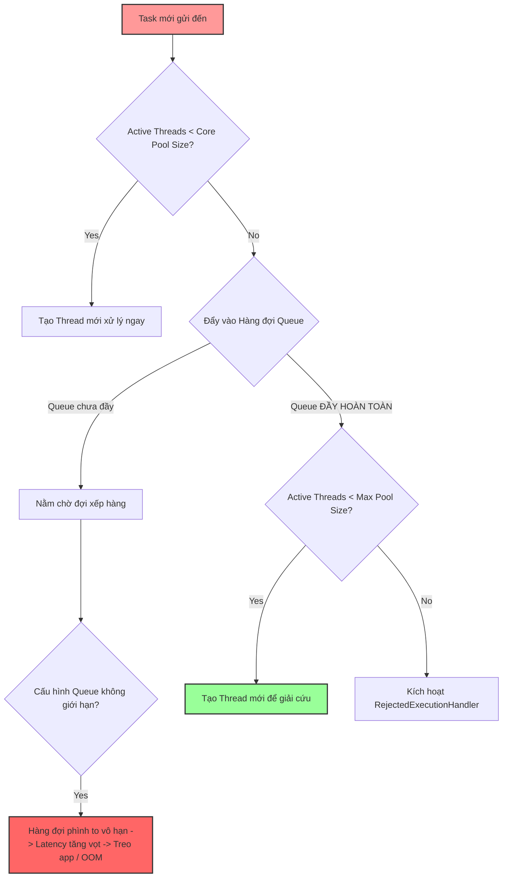

# Thread pool queue tăng liên tục. Nguyên nhân có thể là gì?

## ⚡ Tóm tắt ngắn (30s)
* **Bản chất**: Sự gia tăng liên tục của hàng đợi công việc (Thread Pool Queue) là triệu chứng của hiện tượng **Mất cân bằng Tốc độ (Throughput Imbalance)**. Tốc độ đẩy tác vụ mới vào của bên sản xuất (Producers/Requests) vượt xa khả năng tiêu thụ và xử lý tác vụ của bên tiêu thụ (Consumer/Worker Threads). Việc hàng đợi phình to liên tục sẽ trực tiếp làm tăng độ trễ (Latency) của tác vụ nghiệp vụ và đe dọa làm sập bộ nhớ Heap (OOM).
* **Các thảm họa thực chiến được giải quyết**:
    1. **Thảm họa sụp đổ do cạn kiệt bộ nhớ Heap (OOM Collapse)**: Sử dụng hàng đợi không giới hạn (`LinkedBlockingQueue` mặc định) để nhận danh sách hóa đơn cần đối soát lớn. Dưới tải cao, hàng đợi tích lũy hàng triệu task làm cạn kiệt bộ nhớ RAM JVM, gây sập tiến trình Java mà không hề báo lỗi từ chối task.
* **Quyết định Senior**: Khắc phục triệt để bằng 3 giải pháp kiến trúc phối hợp:
    1. **Vá lỗi cấu hình JVM**: Hiểu sâu cơ chế của `ThreadPoolExecutor` Java (chỉ tạo thêm luồng vượt quá `corePoolSize` khi hàng đợi đã **đầy hoàn toàn**). Bắt buộc chuyển sang sử dụng hàng đợi có giới hạn kích thước (Bounded Queue).
    2. **Áp dụng cơ chế hãm ngược (Backpressure)**: Cấu hình chính sách từ chối `CallerRunsPolicy` để cưỡng ép luồng đẩy task phải tự xử lý task khi pool quá tải, qua đó tự động giảm tốc độ nạp task của bên sản xuất.
    3. **Tối ưu hóa năng lực Worker**: Rà soát các tác vụ chậm trong worker (I/O, database) để tối ưu hóa thuật toán hoặc thêm caching/indexes.

---

## 🔍 Chi tiết bản chất thực chiến: 4 Nguyên nhân khiến Hàng đợi tăng vô hạn

Senior Engineer phân tích sự gia tăng hàng đợi bằng cách bóc tách các cơ chế nội bộ của JVM Thread Pool và hệ thống phân tán:

### 1. Cạm bẫy cấu hình ThreadPoolExecutor của Java (The Java Pool Gotcha)
Đây là sai lầm kinh điển của rất nhiều kỹ sư. Trong Java, hoạt động phân bổ luồng và hàng đợi của `ThreadPoolExecutor` tuân theo quy tắc:
1. Khi có task mới: Nếu số luồng hiện tại $< `corePoolSize` \implies$ Tạo thread mới để xử lý ngay.
2. Nếu số luồng đã đạt `corePoolSize` $\implies$ **Luôn đẩy task vào Hàng đợi (Queue)** chứ chưa tạo thêm thread mới.
3. Thread mới vượt quá `corePoolSize` (lên tới `maximumPoolSize`) **chỉ được tạo ra khi hàng đợi đã bị đầy hoàn toàn (Full)**.

* **Hậu quả**: Nếu cấu hình hàng đợi không giới hạn (như `LinkedBlockingQueue` mặc định) với `corePoolSize = 5` và `maximumPoolSize = 100`, thì số luồng làm việc thực tế **không bao giờ vượt quá 5**. Toàn bộ các luồng phụ dư thừa sẽ bị bỏ quên, hàng đợi phình to vô hạn làm hệ thống bị nghẽn trầm trọng.

### 2. Các Worker Thread bị nghẽn I/O chậm (Slow Workers)
* **Nguyên nhân**: Dù cấu hình pool rất lớn, nhưng bên trong logic của mỗi task lại thực hiện các hoạt động I/O đồng bộ cực kỳ chậm chạp như: gọi database thiếu index (slow query), gọi API đối tác không có timeout. 
* **Hậu quả**: Thời gian hoàn thành tác vụ tăng lên hàng chục lần, khiến throughput (khả năng xử lý mỗi giây) của mỗi luồng giảm mạnh. Tốc độ giải phóng luồng chậm hơn tốc độ nạp task mới, làm hàng đợi dồn ứ liên tục.

### 3. Starvation do Chia sẻ chung Pool (Shared Pool Starvation)
* **Nguyên nhân**: Sử dụng một Thread Pool duy nhất cho nhiều mục đích khác nhau (vừa xử lý API realtime, vừa chạy batch job nặng, vừa ghi log). Các task nặng chạy lâu chiếm giữ toàn bộ các luồng làm việc chính, đẩy các task nhẹ, nhanh vào hàng đợi nằm chờ vô hạn.

---

## 🎨 Sơ đồ trực quan (Luồng hoạt động & Điểm nghẽn gây phình Queue của ThreadPoolExecutor)



---

## 💻 Code thực chiến / Cấu hình thực tế: BAD vs GOOD

### ❌ BAD: Cấu hình hàng đợi không giới hạn khiến luồng cứu hộ bị bỏ quên
Sử dụng hàng đợi `LinkedBlockingQueue` mặc định khiến tham số `maximumPoolSize` trở nên vô dụng. Số lượng luồng cứu hộ không bao giờ được tạo ra khi tải tăng cao, dẫn đến hàng đợi tích lũy vô tận gây OOM.

```java
import java.util.concurrent.*;

public class BadQueueConfig {

    public static ExecutorService createFlawedPool() {
        // ❌ TỒI: Dùng LinkedBlockingQueue không giới hạn dung lượng
        // Khi tải cao, số lượng luồng thực tế chỉ giữ ở mức corePoolSize (5 threads). 
        // 100 luồng maximumPoolSize sẽ không bao giờ được khởi tạo! 
        // Hàng đợi phình to vô tận làm sập bộ nhớ Heap.
        return new ThreadPoolExecutor(
                5, 
                100, 
                60L, TimeUnit.SECONDS,
                new LinkedBlockingQueue<Runnable>() 
        );
    }
}
```

---

### ✅ GOOD: Cấu hình Bounded Queue kết hợp chính sách hãm ngược (Backpressure)
Quy định rõ dung lượng tối đa của hàng đợi (Bounded Queue), thiết lập chính sách xử lý khi hàng đợi đầy để kích hoạt Backpressure tự động ép luồng đẩy task phải tự xử lý để giảm tải.

```java
import java.util.concurrent.*;
import lombok.extern.slf4j.Slf4j;

@Slf4j
public class OptimizedQueueConfig {

    public static ExecutorService createSecurePool() {
        int cores = Runtime.getRuntime().availableProcessors();
        
        // ✅ TỐT: Sử dụng Bounded Queue giới hạn dung lượng để bảo vệ RAM
        BlockingQueue<Runnable> queue = new LinkedBlockingQueue<>(2000);

        // ✅ TỐT: Sử dụng CallerRunsPolicy để kích hoạt cơ chế hãm ngược (Backpressure)
        // Khi hàng đợi đạt ngưỡng 2000 và active threads đạt tối đa (cores * 4),
        // luồng đẩy task sẽ tự mình chạy task đó. Việc này làm chậm tốc độ nạp task mới
        // một cách tự nhiên mà không làm mất mát dữ liệu.
        RejectedExecutionHandler overflowHandler = new ThreadPoolExecutor.CallerRunsPolicy();

        return new ThreadPoolExecutor(
                cores * 2,                // corePoolSize: Luôn sẵn sàng xử lý tải bình thường
                cores * 4,                // maximumPoolSize: Luồng cứu hộ khi hàng đợi đầy
                30L, TimeUnit.SECONDS,    // keepAliveTime: Thu hồi luồng cứu hộ rảnh rỗi nhanh chóng
                queue,
                new ThreadPoolExecutor.CallerRunsPolicy()
        );
    }
}
```

---

## 📊 Bảng so sánh các giải pháp giải quyết nghẽn Hàng đợi (Queue Starvation)

| Phương pháp xử lý | Cơ chế hoạt động | Ưu điểm | Nhược điểm |
| :--- | :--- | :--- | :--- |
| **CallerRunsPolicy (Backpressure)** | Ép luồng sản xuất tự xử lý task bị từ chối. | Bảo vệ bộ nhớ tuyệt đối, tự động giảm tải (throttling) đầu vào không cần code phức tạp. | Làm chậm luồng gọi chính (như luồng nhận HTTP request), tăng latency đột biến ở client. |
| **Dynamic Queue Size Tuning** | Sử dụng hàng đợi động có thể tự động thay đổi kích thước lúc chạy thông qua API quản trị. | Linh hoạt điều chỉnh dung lượng hàng đợi theo trạng thái thực tế của hệ thống. | Phức tạp trong việc code, đòi hỏi tự viết custom class hàng đợi hoặc dùng thư viện ngoài. |
| **Scale-out Pods** | Tự động nhân bản instance thông qua Kubernetes HPA khi phát hiện hàng đợi nghẽn. | Xử lý triệt để bài toán tải thực tế tăng trưởng quá nhanh. | Chi phí hạ tầng cao, vô dụng nếu nghẽn do lock dữ liệu ở database phía dưới. |

---

## ⚠️ Common Gotchas & Questions follow-up

### 1. Cạm bẫy "Hàng đợi quá ngắn (Tiny Queue) gây nghẽn CPU do tạo luồng liên tục"
* **Vấn đề**: Để tránh hàng đợi phình to, một số kỹ sư cấu hình dung lượng hàng đợi cực kỳ nhỏ (ví dụ: `new ArrayBlockingQueue<>(10)`).
* **Hậu quả**: Khi có một đợt traffic tăng nhẹ, hàng đợi lập tức bị lấp đầy. JVM liên tục phải thực hiện các thao tác tạo mới luồng (lên tới `maximumPoolSize`) và hủy luồng khi hết hạn (`keepAliveTime`). Việc tạo và hủy Thread ở cấp độ hệ điều hành (OS Thread creation overhead) cực kỳ tốn tài nguyên, có thể trực tiếp làm tăng CPU sử dụng của máy chủ mà throughput của ứng dụng vẫn thấp.
* **Quy tắc vàng**: Đặt kích thước hàng đợi sao cho thời gian một task nằm chờ trong hàng đợi không vượt quá Connect Timeout của client.
  $$\text{Queue Size} \le \text{Max throughput của Thread Pool (tasks/second)} \times \text{Max Client Timeout (seconds)}$$

### 2. Câu hỏi đào sâu từ interviewer

* **Q1: Làm sao bạn có thể thay đổi kích thước của Thread Pool (như `corePoolSize` hay `maxPoolSize`) một cách động trực tiếp lúc chạy (Runtime) trên Production mà không cần phải restart ứng dụng?**
  * *Trả lời*: Đây là một tính năng cực kỳ mạnh mẽ của `ThreadPoolExecutor` trong Java mà ít kỹ sư để ý:
    * `ThreadPoolExecutor` cung cấp sẵn các hàm setter công khai: `setCorePoolSize(int)`, `setMaximumPoolSize(int)`, và `setKeepAliveTime(long, TimeUnit)`.
    * Tôi có thể thiết kế một REST Endpoint quản trị được bảo mật, hoặc tích hợp với hệ thống quản lý cấu hình động (Dynamic Config Server như Spring Cloud Config, Apollo, Consul).
    * Khi cấu hình trên hệ thống thay đổi, ứng dụng sẽ lắng nghe sự kiện và gọi trực tiếp các hàm setter của Bean ThreadPool tương ứng. JVM sẽ tự động điều chỉnh số lượng luồng đang chạy ngay tức thì mà không cần tắt ứng dụng.

* **Q2: Tại sao việc sử dụng `SynchronousQueue` thay thế cho `LinkedBlockingQueue` lại là lựa chọn tối ưu khi xây dựng các Thread Pool xử lý tác vụ yêu cầu độ trễ cực thấp (Low Latency)?**
  * *Trả lời*: 
    * `SynchronousQueue` là một loại hàng đợi đặc biệt có **dung lượng bằng 0**. Nó không lưu giữ bất kỳ phần tử nào bên trong.
    * Cơ chế hoạt động: Khi luồng đẩy task gọi lệnh nạp, nó bắt buộc phải đợi cho tới khi có một worker thread khác rảnh rỗi nhảy vào lấy task ra trực tiếp từ tay nó (hand-off).
    * *Ưu điểm thực chiến*: Loại bỏ hoàn toàn thời gian task bị nằm xếp hàng thụ động trong queue, triệt tiêu độ trễ xếp hàng (Queueing Latency). Nếu tất cả các thread đều bận, pool lập tức kích hoạt luồng cứu hộ mới (hoặc từ chối ngay lập tức để thực hiện fallback nhanh). Đây là cơ chế cốt lõi được sử dụng trong Thread Pool xử lý HTTP của máy chủ Tomcat/Jetty tốc độ cao.
