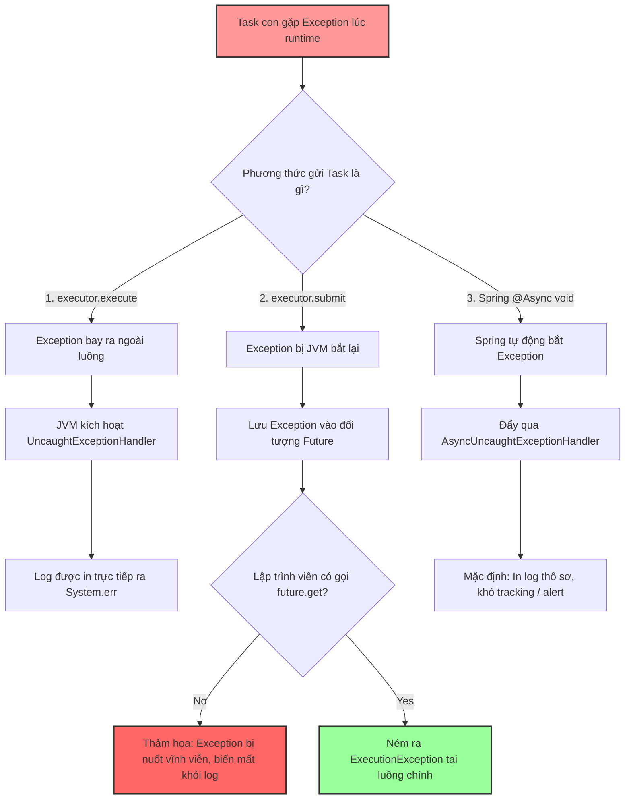

# Task async bị mất exception. Bạn xử lý thế nào?

## ⚡ Tóm tắt ngắn (30s)
* **Bản chất**: Hiện tượng mất ngoại lệ (Swallowed Exception) trong tác vụ bất đồng bộ xảy ra do cơ chế thiết kế của Java JVM: Khi một luồng phụ chạy ngầm gặp lỗi, nó không thể ném ngoại lệ ngược về luồng chính (luồng chính đang chạy việc khác). Nếu tác vụ được gửi qua phương thức `submit()`, JVM sẽ âm thầm đóng gói ngoại lệ đó vào đối tượng `Future` và giữ ở đó. Nếu lập trình viên không gọi `.get()` hoặc `.join()` trên Future đó, ngoại lệ sẽ bị nuốt hoàn toàn và biến mất không dấu vết khỏi file log.
* **Các thảm họa thực chiến được giải quyết**:
    1. **Thảm họa "Lỗi ngầm" (Silent Failure)**: Một luồng bất đồng bộ gửi email báo cáo doanh thu bị lỗi kết nối SMTP (ném ra Exception). Do luồng phụ bị mất exception, hệ thống báo "Thành công" trên màn hình của quản trị viên, nhưng thực tế đối tác không nhận được mail và nhiều tuần sau mới phát hiện ra lỗi, gây thiệt hại lớn cho uy tín doanh nghiệp.
* **Quyết định Senior**: Triển khai 3 phòng tuyến bảo vệ:
    1. **Với Spring `@Async`**: Bắt buộc cấu hình triển khai giao diện **`AsyncConfigurer`** để override phương thức `getAsyncUncaughtExceptionHandler()`, giúp tự động bắt và ghi log mọi exception của các tác vụ bất đồng bộ kiểu `void`.
    2. **Với ExecutorService**: Bọc toàn bộ code trong task bằng khối `try-catch` chặt chẽ, hoặc override phương thức **`afterExecute(Runnable, Throwable)`** khi khởi tạo `ThreadPoolExecutor` để tự động in log khi bất kỳ task con nào gặp lỗi.
    3. **Với CompletableFuture**: Luôn xích thêm mắt xích **`.exceptionally()`** hoặc `.handle()` ở cuối pipeline xử lý.

---

## 🔍 Chi tiết bản chất thực chiến: Quy trình chẩn đoán & Vá lỗi nuốt Exception bất đồng bộ

Senior Engineer hiểu rõ đường đi của một ngoại lệ trong môi trường đa luồng và thiết lập hệ thống bẫy lỗi ở mọi ngóc ngách.

### 1. Tại sao `execute()` in log còn `submit()` lại nuốt lỗi?
Đây là kiến thức JVM đa luồng cốt lõi:
* **`ExecutorService.execute(Runnable)`**:
  * Tác vụ được đẩy vào luồng chạy độc lập. Nếu xảy ra exception, luồng đó sẽ tự động crash, JVM sẽ gọi bộ xử lý Uncaught Exception mặc định để in stack trace ra màn hình Console (`System.err`).
* **`ExecutorService.submit(Callable/Runnable)`**:
  * JVM giả định rằng bạn muốn lấy kết quả từ tác vụ này sau đó. Do đó, nó bọc tác vụ trong một `FutureTask`.
  * Khi `FutureTask` ném ra exception, nó âm thầm bắt lấy (`catch`) và lưu vào một trường biến nội bộ.
  * Chỉ khi bạn gọi **`future.get()`**, exception này mới được gói lại thành `ExecutionException` và ném ra cho luồng chính.
  * **Hậu quả**: Nếu bạn bỏ qua đối tượng `Future` trả về (gọi là "Fire-and-Forget"), exception đó sẽ nằm ngủ yên vĩnh viễn trong bộ nhớ và bị giải phóng khi GC dọn dẹp.

---

### 2. Sự cố nghẽn log của Spring `@Async void`
Trong Spring Boot, khi ta đánh dấu một phương thức là `@Async` và trả về kiểu `void`:
* Vì kiểu trả về là `void`, luồng chính gọi hàm hoàn toàn không nhận lại bất kỳ `Future` nào để kiểm tra lỗi.
* Mặc định, Spring sử dụng `SimpleAsyncUncaughtExceptionHandler` chỉ in ra một dòng log thô sơ và không ghi nhận thông số ngữ cảnh, cực kỳ khó cấu hình giám sát (như gửi alert về Slack/Sentry).

---

## 🎨 Sơ đồ trực quan (Đường đi của Exception: execute vs submit vs Spring @Async)



---

## 💻 Code thực chiến / Cấu hình thực tế: BAD vs GOOD

### ❌ BAD: Sử dụng `.submit()` và `@Async void` mù quáng gây mất lỗi
Code bỏ qua đối tượng Future trả về, hoặc khai báo `@Async void` mà không cấu hình bẫy lỗi tập trung, khiến các lỗi nghiêm trọng bị che giấu âm thầm.

```java
import java.util.concurrent.*;
import org.springframework.scheduling.annotation.Async;
import org.springframework.stereotype.Service;

@Service
public class BadAsyncProcessor {

    private final ExecutorService executor = Executors.newFixedThreadPool(2);

    // ❌ TỒI 1: Bỏ qua Future trả về từ submit(), lỗi DB bị nuốt hoàn toàn
    public void runSilentError() {
        executor.submit(() -> {
            throw new RuntimeException("LỖI NGUY HIỂM: Không thể cập nhật số dư ví tài khoản!");
        });
    }

    // ❌ TỒI 2: Dùng @Async void không có handler bẫy lỗi tập trung
    @Async
    public void sendEmailNotification() {
        // Nếu hàm này crash (ví dụ: SMTP timeout), lỗi sẽ bị trôi qua âm thầm
        throw new NullPointerException("Lỗi rò rỉ dữ liệu!");
    }
}
```

---

### ✅ GOOD: Cấu hình Bẫy lỗi tập trung và xử lý Exception bất đồng bộ an toàn
Senior Engineer cấu hình xử lý ngoại lệ tập trung thông qua `AsyncConfigurer` của Spring Boot và bọc thép cho Thread Pool bằng cách override `afterExecute`.

* **1. Cấu hình Bẫy lỗi tập trung cho Spring Boot `@Async`**:
```java
import org.springframework.aop.interceptor.AsyncUncaughtExceptionHandler;
import org.springframework.context.annotation.Configuration;
import org.springframework.scheduling.annotation.AsyncConfigurer;
import org.springframework.scheduling.annotation.EnableAsync;
import lombok.extern.slf4j.Slf4j;
import java.lang.reflect.Method;

@Configuration
@EnableAsync
@Slf4j
public class AsyncGlobalConfig implements AsyncConfigurer {

    @Override
    public AsyncUncaughtExceptionHandler getAsyncUncaughtExceptionHandler() {
        // ✅ TỐT: Định nghĩa bộ bắt lỗi tùy biến cho mọi method @Async trả về void
        return new CustomAsyncExceptionHandler();
    }
}

@Slf4j
class CustomAsyncExceptionHandler implements AsyncUncaughtExceptionHandler {
    @Override
    public void handleUncaughtException(Throwable throwable, Method method, Object... params) {
        // ✅ Ghi nhận log chi tiết: Tên class, tên method, các tham số đầu vào và chi tiết Exception
        log.error("CẢNH BÁO: Phát hiện Exception chưa được bắt ở tác vụ @Async! " +
                "Method: {}, Params: {}", method.getName(), params, throwable);
        
        // Gửi alert về Slack, Sentry hoặc Telegram để cảnh báo khẩn cấp cho team
        sendAlertToSentry(throwable);
    }

    private void sendAlertToSentry(Throwable ex) { /* Logic gửi alert */ }
}
```

---

* **2. Cấu hình an toàn cho ThreadPoolExecutor thủ công**:
```java
import java.util.concurrent.*;
import lombok.extern.slf4j.Slf4j;

@Slf4j
public class SafeThreadPoolExecutor extends ThreadPoolExecutor {

    public SafeThreadPoolExecutor(int corePoolSize, int maximumPoolSize, long keepAliveTime, 
                                  TimeUnit unit, BlockingQueue<Runnable> workQueue) {
        super(corePoolSize, maximumPoolSize, keepAliveTime, unit, workQueue);
    }

    // ✅ TỐT: Override afterExecute để tự động bắt lỗi cho cả execute() lẫn submit()
    @Override
    protected void afterExecute(Runnable r, Throwable t) {
        super.afterExecute(r, t);
        
        // Trường hợp 1: Task được gửi bằng execute()
        if (t != null) {
            log.error("Tác vụ con chạy bằng execute() bị crash!", t);
        }
        
        // Trường hợp 2: Task được gửi bằng submit() (Bị bọc trong FutureTask)
        if (r instanceof Future<?>) {
            try {
                Future<?> future = (Future<?>) r;
                if (future.isDone()) {
                    future.get(); // Lệnh này sẽ ném ra exception nếu task con bị crash
                }
            } catch (ExecutionException ee) {
                log.error("Tác vụ con chạy bằng submit() bị crash ngầm!", ee.getCause());
                sendAlertToSlack(ee.getCause());
            } catch (InterruptedException ie) {
                Thread.currentThread().interrupt(); 
            } catch (CancellationException ce) {
                log.warn("Tác vụ bất đồng bộ đã bị huỷ chủ động.");
            }
        }
    }
    
    private void sendAlertToSlack(Throwable t) {}
}
```

---

## 📊 Bảng so sánh các giải pháp thu thập Exception bất đồng bộ

| Phương pháp xử lý | Áp dụng cho | Ưu điểm | Nhược điểm |
| :--- | :--- | :--- | :--- |
| **Bọc try-catch trực tiếp trong Task** | Mọi Thread Pool | Đơn giản nhất, trực quan, cho phép xử lý phục hồi dữ liệu (fallback) ngay tại dòng code lỗi. | Code bị rườm rà (boilerplate code) nếu hệ thống có quá nhiều tác vụ bất đồng bộ. |
| **Override `afterExecute`** | ThreadPoolExecutor thủ công | Tự động, bao phủ $100\%$ các task chạy trong pool bất kể lập trình viên gửi bằng `execute` hay `submit`. | Chỉ áp dụng được cho Thread Pool tự tạo, không can thiệp sâu được vào Spring Internal Pool nếu không customize. |
| **`AsyncConfigurer` (Spring)** | Spring Boot `@Async` | Xử lý tập trung (Global Handler) cực kỳ gọn gàng cho toàn bộ dự án Spring Boot. | Chỉ có tác dụng với các phương thức `@Async` có kiểu trả về là `void`. |
| **`CompletableFuture.exceptionally()`**| CompletableFuture pipeline | Cú pháp mượt mà (Fluent API), cho phép định nghĩa fallback kết quả trả về vô cùng linh hoạt. | Lập trình viên phải tự nhớ để xích thêm hàm này ở cuối mỗi chuỗi xử lý. |

---

## ⚠️ Common Gotchas & Questions follow-up

### 1. Cạm bẫy "Gọi method `@Async` nội bộ trong cùng một Class"
* **Vấn đề**: Nhiều kỹ sư viết method `@Async void sendMail()` ở cùng một Class với method chính gọi nó.
* **Hậu quả**: Do cơ chế hoạt động của Spring AOP dựa trên kiến trúc Proxy, khi một phương thức gọi một phương thức khác nằm trong **cùng một thực thể (instance)**, cuộc gọi sẽ đi trực tiếp vào code gốc mà không đi qua lớp Proxy bảo vệ. Phương thức đó sẽ chạy **đồng bộ** trên luồng chính của HTTP Request thay vì bất đồng bộ. Lúc này, nếu xảy ra exception, nó sẽ làm lỗi luôn luồng chính và ném lỗi 500 ra client, làm sai lệch hoàn toàn thiết kế ban đầu.
* **Khắc phục**: Luôn tách các phương thức bất đồng bộ `@Async` sang một Class Service riêng biệt (như `NotificationService`) để Spring tạo Proxy bọc ngoài chính xác.

### 2. Câu hỏi đào sâu từ interviewer

* **Q1: UncaughtExceptionHandler hoạt động như thế nào trong cơ chế của Thread?**
  * *Trả lời*: 
    * Khi một luồng (Thread) bị kết thúc đột ngột do gặp một Ngoại lệ chưa được bắt (`RuntimeException`), JVM sẽ tự động tìm kiếm bộ xử lý lỗi của luồng thông qua phương thức `Thread.getUncaughtExceptionHandler()`.
    * Bộ xử lý này được tìm kiếm theo thứ tự ưu tiên:
      1. Handler cụ thể được gán riêng cho Thread đó (`thread.setUncaughtExceptionHandler`).
      2. Handler gán cho Nhóm luồng (ThreadGroup).
      3. Handler mặc định của toàn hệ thống JVM (`Thread.setDefaultUncaughtExceptionHandler`).
    * Nếu không tìm thấy bất kỳ handler nào, JVM sẽ tự động in toàn bộ Stack Trace ra luồng xuất lỗi mặc định `System.err`.

* **Q2: Nếu một tác vụ CompletableFuture được gửi vào và ném ra Exception, làm sao bạn sử dụng phương thức `.handle()` thay vì `.exceptionally()` để xử lý kết quả? Sự khác biệt giữa chúng là gì?**
  * *Trả lời*:
    * **`exceptionally(Function<Throwable, T>)`**: Chỉ được kích hoạt khi tác vụ bất đồng bộ xảy ra lỗi (ném Exception). Đầu vào của nó chỉ là đối tượng `Throwable`, nó đóng vai trò giống như khối `catch` để trả về một giá trị fallback.
    * **`handle(BiFunction<T, Throwable, R>)`**: Luôn luôn được kích hoạt ở cuối pipeline bất kể tác vụ con thành công hay thất bại. Đầu vào của nó nhận hai tham số: kết quả thành công `result` và đối tượng ngoại lệ `throwable`.
    * *Sử dụng thực chiến*: Tôi dùng `.handle()` khi muốn thực hiện xử lý lưỡng tính: Nếu thành công, tôi tiến hành biến đổi dữ liệu; nếu thất bại (tham số `throwable != null`), tôi ghi log lỗi và trả về dữ liệu rỗng hoặc mã lỗi nghiệp vụ thống nhất.
